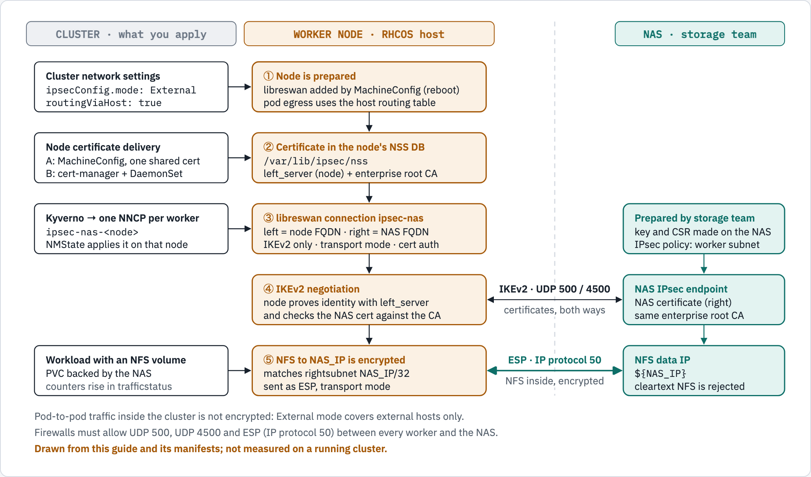

# OpenShift → NAS IPsec (NMState + Kyverno)

Encrypts NFS traffic between OpenShift worker nodes and an external NAS with IPsec
(libreswan, IKEv2, transport mode), configured through the **NMState Operator** and
automated per node with **Kyverno**.

📖 **Start here:** [`docs/README.md`](docs/README.md): the setup options, which doc to read, the prerequisites and the examples. **Option B, one certificate per node, is our enterprise north star.**

| Doc | What it is for |
|---|---|
| [`docs/00-prepare-the-cluster.md`](docs/00-prepare-the-cluster.md) | Every option starts here: cluster preparation, Kyverno, the NAS side, verification, troubleshooting |
| [`docs/20-option-b-per-node-certificates.md`](docs/20-option-b-per-node-certificates.md) | **Option B, our standard:** one certificate per node, step by step, and its run on CRC |
| [`docs/30-option-b-automated-helm-argocd.md`](docs/30-option-b-automated-helm-argocd.md) | Option B as a Helm chart, installed with Helm or from Git with Argo CD; Kyverno's CEL or legacy policies |
| [`docs/10-option-a-shared-certificate.md`](docs/10-option-a-shared-certificate.md) | Option A, the shared certificate Red Hat documents: documented, measured and costed, not used |
| [`docs/50-option-c-wildcard-certificate.md`](docs/50-option-c-wildcard-certificate.md) | Option C, a wildcard certificate in a MachineConfig: evaluated and measured, with what the NAS team must configure |
| [`docs/51-option-c-summary.md`](docs/51-option-c-summary.md) | Option C summary: what works, and the NAS settings for the three setups that work (`uniqueids=no`) |
| [`docs/52-option-c-nas-team.md`](docs/52-option-c-nas-team.md) | Option C: the NAS team's handout, what they must do in one table |
| [`docs/53-option-c-cert-manager-kyverno.md`](docs/53-option-c-cert-manager-kyverno.md) | Option C with cert-manager and Kyverno: the shared wildcard certificate and the per-node tunnels from the Option C chart, measured on CRC |
| [`docs/60-monitoring-per-node.md`](docs/60-monitoring-per-node.md) | Monitoring: each node reports its own IPsec state, the metrics and alerts, and what was measured on kind (3 nodes) and CRC |
| [`docs/61-perses-dashboard-review.md`](docs/61-perses-dashboard-review.md) | **The dashboard in the OpenShift console (Perses, on by default):** what it shows, how it works, how to turn it on and open it, who can see it, how to change it, troubleshooting |
| [`docs/62-dynatrace-operator-on-openshift.md`](docs/62-dynatrace-operator-on-openshift.md) | Dynatrace on OpenShift: how the Dynatrace Operator was installed (Dynatrace's OpenShift manifest, full stack), what did not work and why |
| [`docs/40-lab-crc-and-nas.md`](docs/40-lab-crc-and-nas.md) | The lab: OpenShift Local (CRC) and a NAS VM on one Mac, testing with an application, gotchas |
| [`docs/lab/`](docs/lab/) | A test NAS on RHEL 10, the Lima lab, and an application that uses the NAS |
| [`charts/ipsec-nas/README.md`](charts/ipsec-nas/README.md) | The Helm chart: every value, the prerequisites it checks, cleanup on node deletion and uninstall |

## How it works



*Cluster settings put libreswan, a certificate and one tunnel definition on each worker. The node and the NAS then authenticate each other with certificates over IKEv2, and NFS traffic to the NAS IP travels as ESP in transport mode. Pod-to-pod traffic is not encrypted. The docs have the same figure with a text version, plus one figure for each certificate option.*

## Certificate delivery: one certificate per node

Our standard for a production cluster, and the enterprise north star, is **one certificate per node** (Option B): cert-manager issues it from the cluster's enterprise CA and a DaemonSet imports it. The shared-certificate method Red Hat documents (Option A) is kept for reference and is not used. Option C, one wildcard certificate in a MachineConfig, was evaluated and measured; it works only where the NAS allows several peers with the same identity ([doc 50](docs/50-option-c-wildcard-certificate.md)).

| | Per-node certificates (Option B, our standard) | Wildcard certificate (Option C, evaluated) | Shared certificate (Option A, not used) |
|---|---|---|---|
| Cert delivery | cert-manager per node + import DaemonSet | One wildcard `.p12` (`*.<domain>`, valid 2 years) in a MachineConfig | One `.p12` in a MachineConfig |
| Red Hat documented | NMState/IPsec part yes; cert delivery is custom | Option A's mechanism with a wildcard certificate and our own import script; C1 uses only Red Hat components (MachineConfig, NMState) | Yes |
| Adding a worker | Automatic, no reboot | Automatic: it gets the MachineConfig and the NNCP (by design; not measured, CRC has one node) | Manual re-issue + full worker reboot |
| Renewal | Automatic | By hand every 2 years; every node reboots once | Manual, disruptive |
| Revoke one node | Yes | No | No |
| NAS must allow duplicate peer IDs | No | Yes (measured, every variant) | Yes |
| Monitoring | Per-node metrics, alerts, and a dashboard (Perses in the console; Grafana optional) | **Optional:** the same metrics, alerts and dashboard from the separate [`ipsec-nas-option-c-metrics`](charts/ipsec-nas-option-c-metrics/README.md) chart, our own privileged DaemonSet (measured on CRC, C1). Without it, none | None |

> ⚠️ Never run two options on the same cluster: all of them import a certificate into each node's NSS database under the nickname `left_server`.

## Layout

```
docs/README.md                       start page: the options, reading order, prerequisites, examples
docs/00-prepare-the-cluster.md       cluster preparation, Kyverno, the NAS side, verification, troubleshooting
docs/10-option-a-shared-certificate.md  Option A (documented, not used), measured on CRC
docs/50-option-c-wildcard-certificate.md  Option C (wildcard certificate in a MachineConfig), measured on CRC and in the lab
docs/51-option-c-summary.md          Option C summary: what works
docs/52-option-c-nas-team.md         Option C: the NAS team's handout
docs/53-option-c-cert-manager-kyverno.md  Option C with cert-manager and Kyverno, from the chart
docs/60-monitoring-per-node.md       monitoring: per-node metrics, alerts, dashboard; measured on kind and CRC
docs/61-perses-dashboard-review.md   the dashboard in the console (Perses): use it, change it, troubleshoot it
docs/62-dynatrace-operator-on-openshift.md  the Dynatrace Operator on OpenShift, as installed
docs/20-option-b-per-node-certificates.md  Option B, our standard, measured on CRC
docs/30-option-b-automated-helm-argocd.md  Option B with Helm and Argo CD; CEL or legacy Kyverno policies
docs/40-lab-crc-and-nas.md           the CRC lab, testing with an application, gotchas
docs/lab/                            a test NAS on RHEL 10, the Lima lab, an application that uses the NAS
docs/diagrams/                       the figures (source.html + rendered PNGs) and their Mermaid text versions
docs/evidence/crc/                   saved command output behind the captures
docs/evidence/kind/                  saved output of the three-node kind run (doc 60)
docs/images/crc/                     those captures as images (render-terminal.py makes them)
docs/images/kind/                    the dashboard on the three-node kind cluster (doc 60)
manifests/common/                    NMState Operator, NMState instance, Kyverno RBAC
manifests/option-a-shared-cert/      Option A: Butane MachineConfig + NNCP generate policy
manifests/option-c-wildcard-cert/    Option C: Butane MachineConfig, one NNCP for the pool (C1), per-node policy (C2)
scripts/option-c-certificate.sh      Option C: key and CSR, then the checked bundle and MachineConfig (install and renewal)
manifests/option-b-per-node-certs/   Option B: namespace, Kyverno CEL policies, cert-sync DaemonSet, metrics,
                                     ServiceMonitor, alert rules, Grafana dashboard, orphaned-Secret cleanup
manifests/option-b-per-node-certs/kyverno-legacy/  the same Kyverno policies as legacy ClusterPolicy/CleanupPolicy
manifests/demo-app/                  demo application: namespace, NFS PV and PVC, Deployment, Service, Route
manifests/demo-app-csi/              the demo application on a dynamic claim: StorageClass ipsec-nas-csi, PVC, Deployment, Route
manifests/csi-driver-nfs/            values for the csi-driver-nfs chart (controller on workers)
manifests/dynatrace/                 the DynaKube used in docs/62 (no token)
render.sh                            fills in the *.tmpl variables → rendered/
charts/ipsec-nas/                    Helm chart of Option B (the same objects as the manifests)
charts/ipsec-nas-option-c-metrics/   Helm chart of Option C: metrics, alerts, dashboard; optionally the certificate (cert-manager) and the tunnel (C1, or C2 by Kyverno)
shared/collector/                    the collector, metrics server and alert rules; copied into both charts' files/
scripts/sync-shared-collector.sh     copies shared/collector/ to both charts and manifest 25
lab/                                 the Lima lab, CRC's libreswan extension, test PKI, NAS scripts, NAS container
tests/                               chart equals manifests, metrics parser, alert rules, doc links
```

Files ending in `.tmpl` contain `${NODE_DOMAIN}`, `${NAS_FQDN}`, `${NAS_IP}`, `${NAS_EXPORT}`, `${CLUSTER_ISSUER}` or `${OCP_VERSION}`.

## Quick start

```bash
export NODE_DOMAIN="ocp.example.com" NAS_FQDN="nas01.example.com" NAS_IP="10.10.10.50"
export CLUSTER_ISSUER="company-issuer-rnd"   # placeholder: the enterprise CA ClusterIssuer your cluster already has
./render.sh
```

Then follow [`docs/00-prepare-the-cluster.md`](docs/00-prepare-the-cluster.md). The cluster-level patches
(`routingViaHost`, `ipsecConfig.mode: External`), the Kyverno Helm install and the cert/CA steps are commands
in the docs, not manifests here. Apply the files **only in the order the docs give**: for example
`24-kyverno-cert-sync-mount.yaml` must be Ready before `26-cert-sync-daemonset.yaml`.

## Requirements (summary)

- OpenShift 4.19 (design target), RHCOS workers, bare metal / vSphere / RHOSP / GCP
- Kyverno 1.19 or later for the CEL policies (1.13 or later with the legacy ones; community software, not Red Hat supported)
- cert-manager Operator and the cluster's **existing** enterprise CA `ClusterIssuer`, Ready. Nothing here creates an issuer; `company-issuer-rnd` in the docs is a placeholder for its name (`CLUSTER_ISSUER`).
- NAS supporting IKEv2 transport mode with PKI auth, chaining to the same enterprise root CA

## Security

Never commit private keys, CSRs, `.p12` bundles or CA files — `.gitignore` blocks the common extensions.
