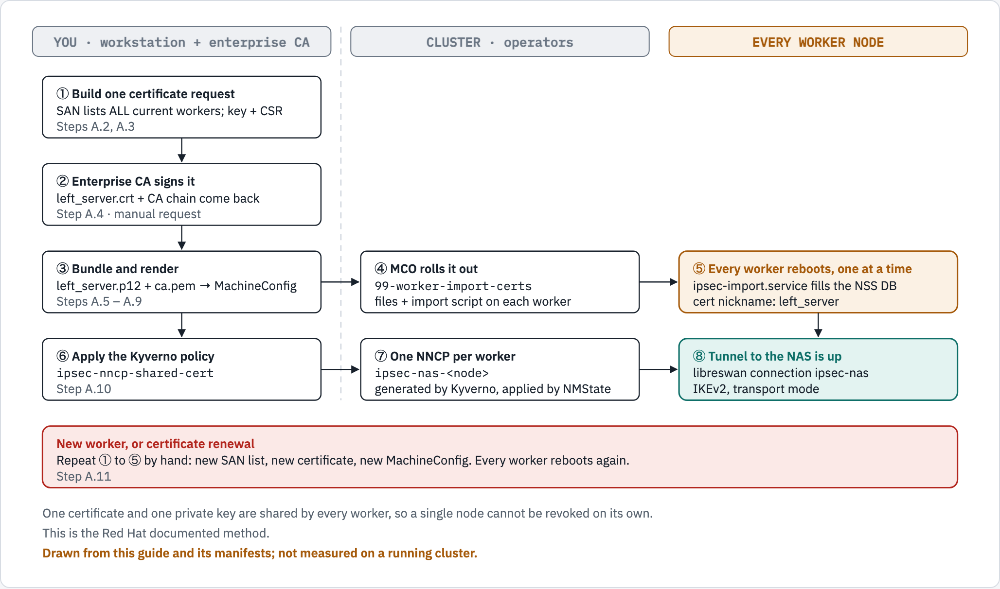
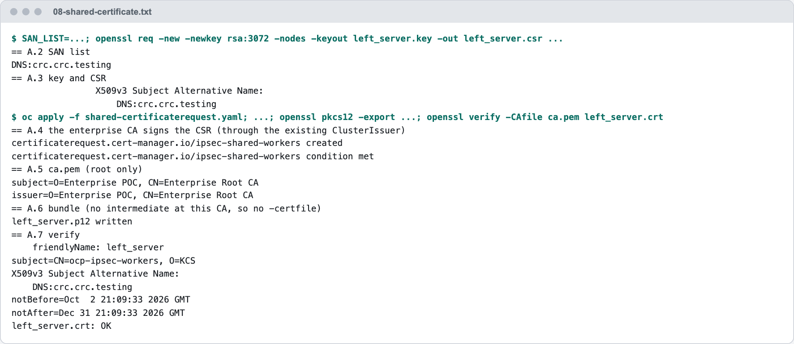
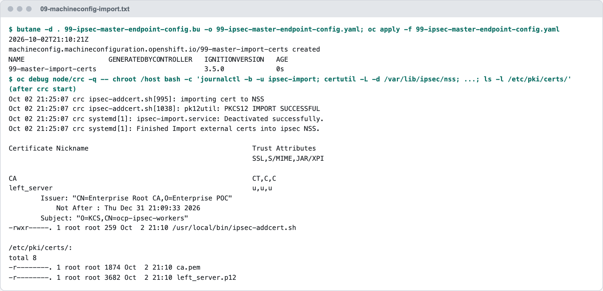
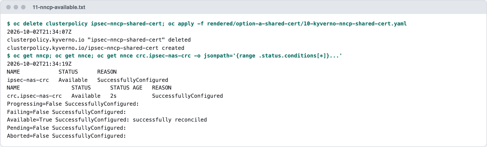
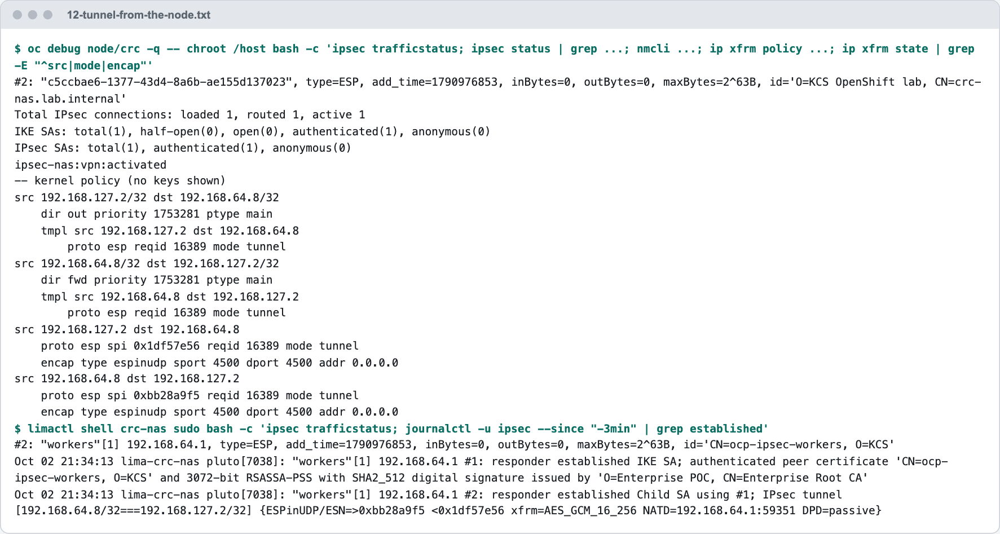
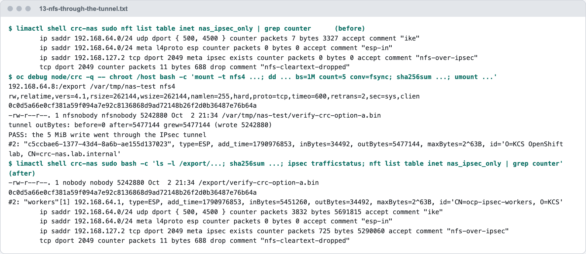

# Option A — One Shared Certificate (documented, not our standard)

**Audience:** platform engineers. **Status: documented, not used.** Our standard is Option B, [20-option-b-per-node-certificates.md](20-option-b-per-node-certificates.md).

This is the procedure Red Hat documents: **one** certificate and private key for every node, delivered by a MachineConfig. It is kept for two reasons: it is the documented reference, and its measured costs are why we chose per-node certificates. It was installed once on OpenShift Local (CRC), measured, costed and removed again; that run is the second half of this doc.

**Before this:** [00-prepare-the-cluster.md](00-prepare-the-cluster.md), Parts 0 and 1, and the NAS side (3.1).

> [!NOTE]
> The NNCP policy of this option (Step A.10) is a Kyverno `ClusterPolicy`, the kind Kyverno 1.19 deprecates; it was measured in that form. Option B's policies use the CEL kinds that replace it, and its policy 3 shows the same NNCP written as a `GeneratingPolicy`.

**Contents:** [How it works](#a0-how-it-works) · Steps [A.1](#step-a1--install-butane) to [A.12](#step-a12--remove-option-a) · [Measured on OpenShift Local (CRC)](#measured-on-openshift-local-crc) · [What Option A costs](#f8--what-option-a-costs-and-why-it-is-not-our-standard)

> [!WARNING]
> **We do not deploy this.** It is kept because it is the procedure Red Hat documents and because it explains why we chose per-node certificates. Use [Option B](20-option-b-per-node-certificates.md) for every real cluster.
>
> Measured in the lab ([`lab/lima-lab.md`](lab/lima-lab.md#8-what-the-lab-showed)): with one shared certificate and a NAS on its defaults, the NAS never held two workers' tunnels at the same time. It only worked after the NAS was told to allow duplicate peer IDs.

## A.0 How it works

This is the **Red Hat documented** method. One certificate and private key are copied to **every worker** through a MachineConfig. You create the certificate by hand, so **every worker reboots** each time it changes.



*Figure 3. Option A (not our standard): you create one certificate that names every worker, a MachineConfig copies it to all workers and reboots them one at a time, then Kyverno generates one NNCP per worker. Adding a worker or renewing the certificate repeats steps 1 to 5 by hand and reboots every worker again.*

<details>
<summary>The figure as text</summary>

```text
YOU (workstation + enterprise CA)        CLUSTER (operators)                  EVERY WORKER NODE

1. Build one certificate request
   SAN lists ALL current workers
   key + CSR            (A.2, A.3)
        |
2. Enterprise CA signs it
   left_server.crt + CA chain  (A.4)
        |
3. Bundle and render            -->  4. MCO rolls it out             -->  5. Every worker reboots, one at a time
   left_server.p12 + ca.pem            99-worker-import-certs               ipsec-import.service fills the NSS DB
   -> MachineConfig  (A.5 - A.9)       files + import script                cert nickname: left_server
        |                                                                        |
6. Apply the Kyverno policy     -->  7. One NNCP per worker          -->  8. Tunnel to the NAS is up
   ipsec-nncp-shared-cert (A.10)       ipsec-nas-<node>                     libreswan connection ipsec-nas
                                       Kyverno generates, NMState applies   IKEv2, transport mode

New worker, or certificate renewal (A.11): repeat 1 to 5 by hand. Every worker reboots again.
One certificate and one private key are shared by every worker; a single node cannot be revoked on its own.
```

</details>

What each piece does:

| Piece | Job |
|---|---|
| **You** (workstation) | Build the SAN list of every worker, create the key and CSR, bundle `left_server.p12`. Nothing here is automatic. |
| **Enterprise CA** | Signs the CSR. One certificate for all workers, no automatic renewal. |
| **MachineConfig** `99-worker-import-certs` | Copies `ca.pem`, `left_server.p12` and the import script to every worker. Applying it makes the MCO reboot every worker, one at a time. |
| **`ipsec-import.service`** | Runs on each worker at boot, before libreswan (`ipsec.service`). Imports the certificate into the node's NSS DB as `left_server`. |
| **Policy** `ipsec-nncp-shared-cert` | For every worker, create the NNCP `ipsec-nas-<node>`. Unlike Option B's policy 3 ([Step B.9](20-option-b-per-node-certificates.md#step-b9--policy-3-nncp-per-node-only-when-its-cert-is-ready)), it does **not** wait for the certificate, so finish Step A.9 before applying it. |

> [!CAUTION]
> ### Risks of the shared certificate. Read before choosing Option A.
>
> 1. **Scaling up is a manual, disruptive procedure.** Each node's `left` name must be in the certificate's SAN list. A new worker is **not** in the SAN, so its tunnel cannot be set up correctly until you re-issue the certificate with the new name **and** roll a new MachineConfig, which **reboots every worker in the pool** (rolling, one at a time). With the MachineAutoscaler or MachineSet scaling, new nodes arrive **without working IPsec** until someone does this by hand. (Lab note: against the libreswan test NAS, a worker whose name was not in the SAN still got a tunnel, because libreswan with `%fromcert` does not check the SAN. A storage appliance may check more, so treat the re-issue as required.)
> 2. **Renewal is the same disruptive procedure**, and it has a hard deadline (certificate expiry). A missed renewal takes down IPsec for **all** nodes at once.
> 3. **One private key on every node.** If any single node is compromised, the attacker can impersonate **every** node to the NAS.
> 4. **You cannot revoke one node.** Revoking the cert breaks all nodes.
> 5. **The private key is readable in the cluster API.** It is embedded in the MachineConfig, so anyone who can read `machineconfigs` can extract it.
> 6. **Same identity from every node.** The NAS sees N peers with the same certificate identity. Many IPsec stacks (libreswan's default `uniqueids=yes`) treat this as "the same peer reconnected" and **drop the previous node's tunnel**. The NAS must be configured to allow duplicate IDs.
>
> **Correction to a common assumption:** re-issuing does **not** require taking the whole cluster down. The MCO reboots nodes **one at a time**. It is still a full-pool reboot every time you add a node or renew, which is why **per-node certificates ([Option B](20-option-b-per-node-certificates.md)) are our standard**.
>
> **Partial mitigation:** a **wildcard SAN** (e.g. `DNS:*.ocp.example.com`) avoids re-issuing on scale-up, **if** our CA policy allows wildcards. It does not fix risks 2–6 and widens what the certificate is trusted for. [50-option-c-wildcard-certificate.md](50-option-c-wildcard-certificate.md) measures this as **Option C**: the NAS settings it needs, a renewal tool, and its run on CRC.

## Step A.1 – Install Butane

```bash
curl -sSL https://mirror.openshift.com/pub/openshift-v4/clients/butane/latest/butane --output butane
chmod +x butane && sudo mv butane /usr/local/bin/
butane --version
```

That file is the **Linux x86-64** binary. On a Mac, install it with Homebrew instead (measured on an Apple Silicon Mac: `Butane 0.29.0`); the mirror has no build for Apple Silicon.

```bash
brew install butane
butane --version
```

## Step A.2 – Build the SAN list from the current workers

```bash
SAN_LIST=$(oc get nodes -l node-role.kubernetes.io/worker \
  -o jsonpath='{range .items[*]}{.metadata.name}{"\n"}{end}' \
  | sed "s/.*/DNS:&.${NODE_DOMAIN}/" | paste -sd, -)

echo "${SAN_LIST}"
```

✅ **Expected:** something like `DNS:worker-0.ocp.example.com,DNS:worker-1.ocp.example.com,...`, one entry per worker.

> [!NOTE]
> Save this list in the change ticket. You will rebuild it every time a worker is added (see Step A.11).

## Step A.3 – Create the private key and CSR

```bash
openssl req -new -newkey rsa:3072 -nodes \
  -keyout left_server.key -out left_server.csr \
  -subj "/CN=ocp-ipsec-workers/O=KCS" \
  -addext "subjectAltName=${SAN_LIST}"

# Check what you are about to send to the CA
openssl req -in left_server.csr -noout -text | grep -A1 "Subject Alternative Name"
```

Rules:
- The **CN must not start with `ovs_`**, because that clashes with OpenShift's own IPsec certificates.
- Keep the key **RSA**, because the NNCP uses `leftrsasigkey: '%cert'`.
- `left_server.key` is the **private key**. Keep it in a protected location and never commit it to Git.

## Step A.4 – Get the CSR signed by the enterprise CA

Submit `left_server.csr` to the enterprise CA. Ask for a template with:
- **Key usage:** Digital Signature, Key Encipherment
- **Extended key usage:** Server Authentication **and** Client Authentication

You get back:
- `left_server.crt`, the signed certificate
- The CA chain: the **root** certificate and any **intermediate** certificates

If the CA gives you `.cer` / DER files, convert them to PEM:

```bash
openssl x509 -inform der -in left_server.cer       -out left_server.crt
openssl x509 -inform der -in enterprise-root.cer   -out enterprise-root.pem
openssl x509 -inform der -in intermediate.cer      -out intermediate.pem   # only if you have one
```

## Step A.5 – Create `ca.pem` (root CA only)

```bash
cp enterprise-root.pem ca.pem
openssl x509 -in ca.pem -noout -subject -issuer
```

✅ **Expected:** subject and issuer are **the same** (that is what a root CA looks like).

> **Why root only?** The node's import script runs `certutil -A` on `ca.pem`, which imports **one** certificate as the trust anchor. Intermediates go inside the `.p12` in the next step.

## Step A.6 – Bundle `left_server.p12`

```bash
openssl pkcs12 -export \
  -in left_server.crt -inkey left_server.key \
  -certfile intermediate.pem \
  -name left_server \
  -out left_server.p12 -passout pass:
```

What each part does:

| Flag | Why |
|---|---|
| `-name left_server` | Sets the **friendly name**. It becomes the certificate's nickname in the node's NSS database, and the NNCP refers to it as `leftcert: left_server`. **Must be exactly `left_server`.** |
| `-passout pass:` | **Empty password.** The import runs unattended at boot with `pk12util -W ""`, so a password would make it fail. |
| `-certfile intermediate.pem` | Adds the intermediate CA. **Remove this line** if our CA has no intermediate. |

## Step A.7 – Verify the bundle

```bash
openssl pkcs12 -in left_server.p12 -nokeys -passin pass: | grep friendlyName
openssl x509 -in left_server.crt -noout -ext subjectAltName
openssl x509 -in left_server.crt -noout -dates
```

✅ **Expected:** `friendlyName: left_server`; **every** worker FQDN in the SAN list; `notAfter` far enough in the future. Put the expiry date in the team calendar.

## Step A.8 – Write the Butane config

This creates a systemd service on every worker that imports the certificates into NSS at boot, before libreswan starts.

```bash
cat <<EOF > 99-ipsec-worker-endpoint-config.bu
variant: openshift
version: ${OCP_VERSION}
metadata:
  name: 99-worker-import-certs
  labels:
    machineconfiguration.openshift.io/role: worker
systemd:
  units:
  - name: ipsec-import.service
    enabled: true
    contents: |
      [Unit]
      Description=Import external certs into ipsec NSS
      Before=ipsec.service

      [Service]
      Type=oneshot
      ExecStart=/usr/local/bin/ipsec-addcert.sh
      RemainAfterExit=false
      StandardOutput=journal

      [Install]
      WantedBy=multi-user.target
storage:
  files:
  - path: /etc/pki/certs/ca.pem
    mode: 0400
    overwrite: true
    contents:
      local: ca.pem
  - path: /etc/pki/certs/left_server.p12
    mode: 0400
    overwrite: true
    contents:
      local: left_server.p12
  - path: /usr/local/bin/ipsec-addcert.sh
    mode: 0740
    overwrite: true
    contents:
      inline: |
        #!/bin/bash -e
        echo "importing cert to NSS"
        certutil -A -n "CA" -t "CT,C,C" -d /var/lib/ipsec/nss/ -i /etc/pki/certs/ca.pem
        pk12util -W "" -i /etc/pki/certs/left_server.p12 -d /var/lib/ipsec/nss/
        certutil -M -n "left_server" -t "u,u,u" -d /var/lib/ipsec/nss/
EOF
```

> [!NOTE]
> `ca.pem` and `left_server.p12` **must be in the current folder**. `local:` reads them from there.

## Step A.9 – Render and apply the MachineConfig

```bash
butane -d . 99-ipsec-worker-endpoint-config.bu -o 99-ipsec-worker-endpoint-config.yaml
oc apply -f 99-ipsec-worker-endpoint-config.yaml
```

> [!WARNING]
> The MCO now reboots **every worker, one at a time**. External IPsec only works once **all** of them are done.

```bash
watch oc get mcp worker          # wait for UPDATED=True, UPDATING=False, DEGRADED=False
```

Check one node:

```bash
NODE=$(oc get nodes -l node-role.kubernetes.io/worker -o jsonpath='{.items[0].metadata.name}')
oc debug node/${NODE} -- chroot /host certutil -L -d /var/lib/ipsec/nss
```

✅ **Expected:** `left_server` with trust `u,u,u` and `CA` with `CT,C,C`.

## Step A.10 – Kyverno policy: one NNCP per worker

> [!IMPORTANT]
> **Stop here until the NAS side is ready.** This step creates the NNCPs, so the storage team must have finished [3.1](00-prepare-the-cluster.md#31-nas-configuration-storage-team-not-us) first.

```bash
cat <<EOF > 10-kyverno-nncp-shared-cert.yaml
apiVersion: kyverno.io/v1
kind: ClusterPolicy
metadata:
  name: ipsec-nncp-shared-cert
spec:
  # If Kyverno is down, never block Node updates
  failurePolicy: Ignore
  rules:
  - name: nncp-per-worker
    match:
      any:
      - resources:
          kinds:
          - Node
          selector:
            matchLabels:
              node-role.kubernetes.io/worker: ""
    generate:
      generateExisting: true     # also create NNCPs for workers that already exist
      synchronize: true          # Kyverno owns these NNCPs: edit the policy, not the NNCPs
      apiVersion: nmstate.io/v1
      kind: NodeNetworkConfigurationPolicy
      name: "ipsec-nas-{{ request.object.metadata.name }}"
      data:
        spec:
          nodeSelector:
            kubernetes.io/hostname: '{{ request.object.metadata.labels."kubernetes.io/hostname" }}'
          desiredState:
            interfaces:
            - name: ipsec-nas
              type: ipsec
              libreswan:
                left: "{{ request.object.metadata.name }}.${NODE_DOMAIN}"   # must be in the cert SAN
                leftid: '%fromcert'
                leftrsasigkey: '%cert'
                leftcert: left_server
                leftmodecfgclient: false
                right: ${NAS_FQDN}
                rightid: '%fromcert'
                rightrsasigkey: '%cert'
                rightsubnet: ${NAS_IP}/32
                ikev2: insist
                type: transport
                # Uncomment ONLY if the NAS requires specific proposals:
                # esp: aes_gcm256
                # ike: aes256-sha2;dh20
EOF

oc apply -f 10-kyverno-nncp-shared-cert.yaml
oc get clusterpolicy ipsec-nncp-shared-cert      # READY must be True
```

Then go to [3.2](00-prepare-the-cluster.md#32-verify-end-to-end) to verify.

## Step A.11 – Scale-up procedure (every time a worker is added)

> [!CAUTION]
> Until all of these steps are done, the **new worker has no working IPsec tunnel** to the NAS.

1. Add the new worker (MachineSet scale-up, or however we normally add nodes) and wait until it is `Ready`.
2. Repeat **Step A.2** (new SAN list including the new node).
3. Repeat **Steps A.3 → A.7** (new key, new CSR, CA signs, new `.p12`).
4. Repeat **Step A.8 → A.9** (re-render and re-apply the MachineConfig). **Every worker reboots, one at a time.**
5. When `mcp/worker` is `UPDATED=True`, check the new node's NNCE ([3.2](00-prepare-the-cluster.md#32-verify-end-to-end)).
6. Update the change ticket with the new SAN list and expiry date.
7. Revoke the **old** certificate at the CA.

Renewal before expiry is the same procedure, steps 2–7.

## Step A.12 – Remove Option A

The order matters: the policy first, or Kyverno puts the NNCP back; then the tunnel, because deleting an NNCP leaves it on the node; then the MachineConfig; then what the MachineConfig leaves behind.

```bash
# 1. Stop Kyverno from (re)creating NNCPs
oc delete clusterpolicy ipsec-nncp-shared-cert

# 2. Remove the tunnel from every worker, with an NNCP that says: absent
for n in $(oc get nodes -l node-role.kubernetes.io/worker -o jsonpath='{.items[*].metadata.name}'); do
cat <<EOF | oc apply -f -
apiVersion: nmstate.io/v1
kind: NodeNetworkConfigurationPolicy
metadata:
  name: ipsec-nas-remove-${n}
spec:
  nodeSelector:
    kubernetes.io/hostname: ${n}
  desiredState:
    interfaces:
    - name: ipsec-nas
      type: ipsec
      state: absent
EOF
done
oc get nnce | grep ipsec-nas-remove           # wait until every one is Available
oc get nncp -o name | grep ipsec-nas | xargs oc delete

# 3. Delete the MachineConfig: every worker reboots, one at a time
oc delete mc 99-worker-import-certs
watch oc get mcp worker
```

Deleting the MachineConfig removes the files it wrote, but **not** what was imported from them: the shared certificate and its private key stay in every node's NSS database. Remove them when the pool is updated:

```bash
for n in $(oc get nodes -l node-role.kubernetes.io/worker -o jsonpath='{.items[*].metadata.name}'); do
  oc debug "node/${n}" -q -- chroot /host bash -c '
    certutil -F -n left_server -d /var/lib/ipsec/nss     # the certificate AND its private key
    certutil -D -n CA -d /var/lib/ipsec/nss              # the CA certificate
    certutil -L -d /var/lib/ipsec/nss'
done
```

✅ **Expected:** an empty certificate list on every node (measured on one node in [Part G](#part-g--remove-option-a)). Then ask the CA team to revoke the shared certificate.

---

## Measured on OpenShift Local (CRC)

Everything below was run on OpenShift Local (CRC) 2.63.0 with OpenShift 4.22.7, one node named `crc`, against the NAS VM of [40-lab-crc-and-nas.md](40-lab-crc-and-nas.md), on 2026-10-02. Part F installs Option A and measures it, F.8 lists what it costs, and Part G removes it so that [Option B](20-option-b-per-node-certificates.md) starts from a clean node. Each capture shows the commands and their output; the same text is under the picture and in [`evidence/crc/`](evidence/crc/).

### Part F – Option A: the shared certificate, installed and measured

Option A is the procedure above: **one** certificate for all nodes, delivered by a MachineConfig. It is **not our standard**. It is installed here once, on a real node, so that its steps, its results and its costs are on record. [F.8](#f8--what-option-a-costs-and-why-it-is-not-our-standard) lists the costs, [Part G](#part-g--remove-option-a) removes it, and [Part H of 20-option-b-per-node-certificates.md](20-option-b-per-node-certificates.md#part-h--option-b-per-node-certificates-our-standard) installs the standard, Option B.

Four things differ from a production cluster on CRC, and `render.sh` takes them as variables. Left unset, each one gives the production value.

| Variable | CRC value | Production (default) | Why |
|---|---|---|---|
| `MCP_ROLE` | `master` | `worker` | The CRC node is in the `master` pool |
| `IPSEC_TYPE` | `tunnel` | `transport` | NAT between the node and the NAS (Part B) |
| `NODE_LEFT` | `%defaultroute` | `<node>.<NODE_DOMAIN>` | No DNS name resolves to the node's address toward the NAS |
| `NAS_RIGHT` | the NAS IP | `NAS_FQDN` | The node cannot resolve the lab NAS name |

#### Step F.1 – Render the manifests with the CRC values

```bash
export NODE_DOMAIN=crc.testing NAS_FQDN=crc-nas.lab.internal NAS_IP=192.168.64.8 CLUSTER_ISSUER=enterprise-ca
export MCP_ROLE=master IPSEC_TYPE=tunnel NAS_RIGHT=192.168.64.8 NODE_LEFT='%defaultroute'
./render.sh
```

```text
Rendered into ./rendered (NODE_DOMAIN=crc.testing NAS=crc-nas.lab.internal/192.168.64.8 Issuer=enterprise-ca Butane=4.22.0)
```

Work in a directory **outside** the repository for the next steps: it will hold a private key.

#### Step F.2 – SAN list, key and CSR (Steps A.2 and A.3 above)

```bash
SAN_LIST=$(oc get nodes -l node-role.kubernetes.io/worker \
  -o jsonpath='{range .items[*]}{.metadata.name}{"\n"}{end}' \
  | sed "s/.*/DNS:&.${NODE_DOMAIN}/" | paste -sd, -)
echo "${SAN_LIST}"

openssl req -new -newkey rsa:3072 -nodes \
  -keyout left_server.key -out left_server.csr \
  -subj "/CN=ocp-ipsec-workers/O=KCS" \
  -addext "subjectAltName=${SAN_LIST}"
openssl req -in left_server.csr -noout -text | grep -A1 "Subject Alternative Name"
```

✅ **Expected** (measured): one name, because CRC has one node. A real cluster lists every worker here, and that list is what has to be rebuilt each time a node is added.

#### Step F.3 – Sign, bundle and verify (Steps A.4 to A.7 above)

The enterprise CA signs the CSR through the existing `ClusterIssuer`, the same way as the NAS certificate in Step C.2.

```bash
cat <<EOF > shared-certificaterequest.yaml
apiVersion: cert-manager.io/v1
kind: CertificateRequest
metadata:
  name: ipsec-shared-workers
  namespace: kcs-ipsec
spec:
  request: $(base64 < left_server.csr | tr -d '\n')
  duration: 2160h
  isCA: false
  usages:
  - digital signature
  - key encipherment
  - server auth
  - client auth
  issuerRef:
    group: cert-manager.io
    kind: ClusterIssuer
    name: enterprise-ca
EOF
oc apply -f shared-certificaterequest.yaml
oc wait -n kcs-ipsec certificaterequest/ipsec-shared-workers --for=condition=Ready --timeout=60s
oc get certificaterequest -n kcs-ipsec ipsec-shared-workers -o jsonpath='{.status.certificate}' | base64 -d > left_server.crt
oc get certificaterequest -n kcs-ipsec ipsec-shared-workers -o jsonpath='{.status.ca}' | base64 -d > enterprise-root.pem

cp enterprise-root.pem ca.pem
openssl x509 -in ca.pem -noout -subject -issuer

# this CA has no intermediate, so no -certfile
openssl pkcs12 -export -in left_server.crt -inkey left_server.key -name left_server -out left_server.p12 -passout pass:

openssl pkcs12 -in left_server.p12 -nokeys -passin pass: | grep friendlyName
openssl x509 -in left_server.crt -noout -subject -ext subjectAltName
openssl x509 -in left_server.crt -noout -dates
openssl verify -CAfile ca.pem left_server.crt
```

<picture>
  <source media="(prefers-color-scheme: dark)" srcset="images/crc/08-shared-certificate.dark.png">
  <source media="(prefers-color-scheme: light)" srcset="images/crc/08-shared-certificate.light.png">
  
</picture>

*Capture 8. The shared certificate, signed by `enterprise-ca`. Text: [`evidence/crc/08-shared-certificate.txt`](evidence/crc/08-shared-certificate.txt).*

#### Step F.4 – The MachineConfig (Steps A.8 and A.9 above)

`brew install butane` first (Step A.1 above, and [Gotcha 8](#gotcha-8--the-butane-download-in-step-a1-is-a-linux-binary)). Copy the rendered Butane file next to `ca.pem` and `left_server.p12`, then build and apply:

```bash
cp <repo>/rendered/option-a-shared-cert/99-ipsec-worker-endpoint-config.bu 99-ipsec-master-endpoint-config.bu
butane -d . 99-ipsec-master-endpoint-config.bu -o 99-ipsec-master-endpoint-config.yaml
oc apply --dry-run=server -f 99-ipsec-master-endpoint-config.yaml
oc apply -f 99-ipsec-master-endpoint-config.yaml
```

The node reboots within seconds. **Then do Step E.5**: wait, `crc stop`, `crc start`. After that, check the pool and the certificates on the node:

```bash
oc get mcp master
oc debug node/crc -q -- chroot /host bash -c '
journalctl -b -u ipsec-import --no-pager | tail -4
certutil -L -d /var/lib/ipsec/nss
certutil -L -n left_server -d /var/lib/ipsec/nss | grep -E "Subject:|Issuer:|Not After"
ls -l /etc/pki/certs/'
```

✅ **Expected** (measured, applied at 21:10:21 UTC): the pool is on a new rendered configuration (capture 7), and the NSS database holds `CA` with trust `CT,C,C` and `left_server` with `u,u,u`.

<picture>
  <source media="(prefers-color-scheme: dark)" srcset="images/crc/09-machineconfig-import.dark.png">
  <source media="(prefers-color-scheme: light)" srcset="images/crc/09-machineconfig-import.light.png">
  
</picture>

*Capture 9. The MachineConfig, and the shared certificate in the node's NSS database. Text: [`evidence/crc/09-machineconfig-import.txt`](evidence/crc/09-machineconfig-import.txt).*

The import ran at both boots (21:13:18 and 21:25:07) and succeeded both times, so running it again over the same certificate is harmless.

#### Step F.5 – The NNCP policy (Step A.10 above)

```bash
oc apply -f rendered/option-a-shared-cert/10-kyverno-nncp-shared-cert.yaml
oc get clusterpolicy ipsec-nncp-shared-cert
oc logs -n kyverno deploy/kyverno-background-controller --since=1m | grep -E 'start processing UR|created generate target'
oc get nncp,nnce
```

✅ **Expected** (measured, policy applied at 21:34:07 UTC): Kyverno created the NNCP one second later, and NMState reported it `Available` within 12 seconds of the policy.

<details>
<summary>The measured output as text</summary>

```text
TRC ... start processing UR logger=background name=ur-t4lt9 policy=ipsec-nncp-shared-cert
TRC ... created generate target resource ... rule=nncp-per-worker target=nmstate.io/v1/NodeNetworkConfigurationPolicy//ipsec-nas-crc trigger=/crc
```

</details>

<picture>
  <source media="(prefers-color-scheme: dark)" srcset="images/crc/11-nncp-available.dark.png">
  <source media="(prefers-color-scheme: light)" srcset="images/crc/11-nncp-available.light.png">
  
</picture>

*Capture 11. The NNCP, created by Kyverno and applied by NMState. Text: [`evidence/crc/11-nncp-available.txt`](evidence/crc/11-nncp-available.txt).*

If the policy shows `READY=True` and no NNCP appears, Step D.3 of the lab was skipped: see [Gotchas 3 and 4](40-lab-crc-and-nas.md#gotchas).

#### Step F.6 – The tunnel from the CRC node

```bash
oc debug node/crc -q -- chroot /host bash -c '
ipsec trafficstatus
ipsec status | grep -E "Total IPsec connections|IKE SAs|IPsec SAs"
nmcli -t -f NAME,TYPE,STATE connection show --active | grep -i vpn
ip xfrm policy | grep -A3 "192.168.64.8" | grep -E "src|dir|tmpl|mode"
ip xfrm state | grep -E "^src|mode|encap"'
limactl shell crc-nas sudo bash -c 'ipsec trafficstatus; journalctl -u ipsec --since "-3min" --no-pager | grep -E "established"'
```

The `ip xfrm state` filter prints no keys. Do not paste the unfiltered output anywhere.

<picture>
  <source media="(prefers-color-scheme: dark)" srcset="images/crc/12-tunnel-from-the-node.dark.png">
  <source media="(prefers-color-scheme: light)" srcset="images/crc/12-tunnel-from-the-node.light.png">
  
</picture>

*Capture 12. The tunnel, seen from the node and from the NAS. Text: [`evidence/crc/12-tunnel-from-the-node.txt`](evidence/crc/12-tunnel-from-the-node.txt).*

On the node: one connection loaded and active, NetworkManager shows `ipsec-nas` as an activated VPN, and the kernel has it in `tunnel` mode with ESP wrapped in UDP 4500. On the NAS: the node's shared certificate was checked against the enterprise CA, and the tunnel is the one Part B predicted, between the NAS and the node's own address, seen through the NAT as `192.168.64.1`.

#### Step F.7 – NFS through the tunnel

The node mounts the NAS export, writes 5 MiB, and unmounts. The tunnel's byte counter is read before and after.

```bash
limactl shell crc-nas sudo nft list table inet nas_ipsec_only | grep counter
oc debug node/crc -q -- chroot /host bash -c '
set -euo pipefail
out() { ipsec trafficstatus | sed -n "s/.*outBytes=\([0-9]*\).*/\1/p"; }
m=/var/tmp/nas-test; mkdir -p "$m"
before=$(out)
mount -t nfs4 -o nfsvers=4.1 192.168.64.8:/export "$m"
dd if=/dev/urandom of="$m/verify-crc-option-a.bin" bs=1M count=5 conv=fsync status=none
sha256sum "$m/verify-crc-option-a.bin" | cut -c1-64
umount "$m"; rmdir "$m"
after=$(out)
echo "tunnel outBytes: before=$before after=$after grew=$((after-before)) (wrote 5242880)"
[ $((after-before)) -ge 5242880 ] && echo "PASS: the 5 MiB write went through the IPsec tunnel"'
limactl shell crc-nas sudo bash -c 'sha256sum /export/verify-crc-option-a.bin | cut -c1-64; ipsec trafficstatus; nft list table inet nas_ipsec_only | grep counter'
```

✅ **Expected** (measured): the same checksum on both sides, the tunnel counter grew by more than the file size (5,477,144 bytes for a 5,242,880-byte file), and on the NAS only the "through IPsec" rule counted NFS (725 packets). The cleartext drop rule stayed at 11 packets before and after.

<picture>
  <source media="(prefers-color-scheme: dark)" srcset="images/crc/13-nfs-through-the-tunnel.dark.png">
  <source media="(prefers-color-scheme: light)" srcset="images/crc/13-nfs-through-the-tunnel.light.png">
  
</picture>

*Capture 13. A 5 MiB NFS write from the CRC node, counted on the tunnel and on the NAS. Text: [`evidence/crc/13-nfs-through-the-tunnel.txt`](evidence/crc/13-nfs-through-the-tunnel.txt).*

This answers the open question from Part B: NMState builds a `tunnel`-mode connection with `left: '%defaultroute'` on a real OpenShift node, and it works through the NAT.

#### F.8 – What Option A costs, and why it is not our standard

Option A works. The table lists what it took to get there and what it would take to keep it, each with where it was seen.

| Cost or risk | What it means for an enterprise with many nodes and many clusters | Where it was seen |
|---|---|---|
| **The certificate is redone every time a node is added** | The certificate lists every node in its SAN. A new node means a new SAN list, a new key and CSR, a new signing request to the CA, a new bundle and a new MachineConfig | Steps F.2 to F.4; Step A.11 |
| **Every change reboots every node** | The certificate reaches the nodes through a MachineConfig, so installing it, renewing it and removing it each reboot all nodes of the pool, one at a time | Step F.4 and Step G.3: one reboot to install, one to remove |
| **It is manual work, per cluster** | Six hand steps on a workstation (SAN list, key, CSR, signing, bundle, Butane) before anything reaches the cluster. Ten clusters means doing it ten times, and again at every renewal and every scale-up | Steps F.2 to F.4 |
| **One private key for all nodes** | The same key is on every node, and it is made and held on an engineer's workstation first. If one node or that workstation is compromised, every node's identity is | Step F.2 creates `left_server.key` on the workstation; Step F.4 puts it on the node |
| **Revoking it cuts off every node at once** | There is one certificate, so revoking it after an incident takes down storage for the whole cluster until a new one has been rolled out, with reboots | Follows from the single certificate |
| **The NAS cannot tell the nodes apart** | Every node presents the same identity. The NAS must be told to accept duplicate peer IDs, or the nodes displace each other's tunnels | Lima lab, [what the lab showed](lab/lima-lab.md#8-what-the-lab-showed); CRC has one node, so it does not show here |
| **The SAN list gives no real control** | libreswan identifies the peer by the certificate's subject, not its SAN, so a node missing from the list still got a tunnel | Lima lab, same section |
| **Nothing renews it** | The certificate expires on a date (here 31 December 2026) and someone has to repeat all of the above before then | Step F.3 |

Our goal and preferred setup is **Option B**, per-node certificates ([20-option-b-per-node-certificates.md](20-option-b-per-node-certificates.md)): cert-manager issues one certificate per node from the same enterprise CA, a DaemonSet imports it without a reboot, a new node gets its certificate and tunnel by itself, and renewal is automatic. The same manifests work unchanged on every cluster. [20-option-b-per-node-certificates.md](20-option-b-per-node-certificates.md#part-h--option-b-per-node-certificates-our-standard) installs it on this CRC and measures the difference.

---

### Part G – Remove Option A

Option A was installed to document it. This part takes it off the cluster completely, so that [Option B](20-option-b-per-node-certificates.md#part-h--option-b-per-node-certificates-our-standard) starts from a clean node. The order matters: the policy first, or Kyverno puts the NNCP back; then the tunnel; then the MachineConfig; then what the MachineConfig removal leaves behind.

#### Step G.1 – Delete the policy

```bash
oc delete clusterpolicy ipsec-nncp-shared-cert
oc get nncp
oc debug node/crc -q -- chroot /host bash -c 'ipsec trafficstatus; nmcli -t -f NAME,TYPE,STATE connection show --active | grep -i vpn'
```

✅ **Expected** (measured, 21:37:20 UTC): the NNCP goes with the policy, because the policy has `synchronize: true`. **The tunnel stays up**: deleting an NNCP does not undo what it configured.

```text
clusterpolicy.kyverno.io "ipsec-nncp-shared-cert" deleted
No resources found
#2: "c5ccbae6-1377-43d4-8a6b-ae155d137023", type=ESP, add_time=1790976853, inBytes=34492, outBytes=5477144, maxBytes=2^63B, id='O=KCS OpenShift lab, CN=crc-nas.lab.internal'
ipsec-nas:vpn:activated
```

#### Step G.2 – Remove the tunnel with an NNCP that says `absent`

```bash
cat <<EOF | oc apply -f -
apiVersion: nmstate.io/v1
kind: NodeNetworkConfigurationPolicy
metadata:
  name: ipsec-nas-crc
spec:
  nodeSelector:
    kubernetes.io/hostname: crc
  desiredState:
    interfaces:
    - name: ipsec-nas
      type: ipsec
      state: absent
EOF

oc get nncp,nnce          # wait for Available
oc debug node/crc -q -- chroot /host bash -c 'echo "trafficstatus: [$(ipsec trafficstatus)]"; ipsec status | grep "Total IPsec connections"'
limactl shell crc-nas sudo bash -c 'echo "trafficstatus: [$(ipsec trafficstatus)]"'

oc delete nncp ipsec-nas-crc
```

✅ **Expected** (measured): `Available` within 7 seconds, and no tunnel on either side.

```text
nodenetworkconfigurationpolicy.nmstate.io/ipsec-nas-crc   Available   SuccessfullyConfigured
== on the node
trafficstatus: []
Total IPsec connections: loaded 0, routed 0, active 0
== on the NAS
trafficstatus: []
nodenetworkconfigurationpolicy.nmstate.io "ipsec-nas-crc" deleted
```

#### Step G.3 – Delete the MachineConfig

```bash
oc delete mc 99-master-import-certs
```

The node reboots. **Do Step E.5**: wait for the API to stop answering, give the node about three minutes, then `crc stop` and `crc start`.

✅ **Expected** (measured): deleted at 21:38:54, the node was up again at 21:41:46, `crc start` finished at 21:47:58. The pool is back on the rendered configuration it had before Option A, and the files and the import unit are gone from the node.

```bash
oc get mcp master
oc debug node/crc -q -- chroot /host bash -c 'ls -A /etc/pki/certs/ | wc -l; ls /usr/local/bin/ipsec-addcert.sh; systemctl is-enabled ipsec-import.service; certutil -L -d /var/lib/ipsec/nss'
```

```text
master   rendered-master-a8e0982444c8d7812f7bef6a181da1b1   True      False      False      1              1                   1                     0                      65d
files in /etc/pki/certs: 0
ls: cannot access '/usr/local/bin/ipsec-addcert.sh': No such file or directory
Failed to get unit file state for ipsec-import.service: No such file or directory

CA                                                           CT,C,C
left_server                                                  u,u,u
```

> [!WARNING]
> Look at the last two lines. Deleting the MachineConfig removes the files it wrote. It does **not** remove what the import unit put into the NSS database: **the shared certificate and its private key are still on the node.** On a real cluster that is every worker. The next step removes them; [Step A.12](#step-a12--remove-option-a) has this step too.

#### Step G.4 – Remove the shared certificate and its key from the node

```bash
oc debug node/crc -q -- chroot /host bash -c '
certutil -F -n left_server -d /var/lib/ipsec/nss     # the certificate AND its private key
certutil -D -n CA -d /var/lib/ipsec/nss              # the CA certificate
certutil -L -d /var/lib/ipsec/nss
certutil -K -d /var/lib/ipsec/nss'
```

✅ **Expected** (measured): an empty certificate list, and `no keys found`.

```text
private keys named left_server before: 1

Certificate Nickname                                         Trust Attributes
                                                             SSL,S/MIME,JAR/XPI

certutil: no keys found
```

#### Step G.5 – Delete the certificate request, and revoke the certificate

```bash
oc delete certificaterequest -n kcs-ipsec ipsec-shared-workers
oc get certificaterequest -n kcs-ipsec
```

✅ **Expected** (measured): only the NAS certificate's request is left.

```text
certificaterequest.cert-manager.io "ipsec-shared-workers" deleted from kcs-ipsec namespace
NAME      APPROVED   DENIED   READY   ISSUER          REQUESTER   AGE
crc-nas   True                True    enterprise-ca   kubeadmin   72m
```

Deleting the request does not make the certificate invalid: it stays valid until 31 December 2026. On a real cluster, ask the CA team to **revoke** it. Then delete the working directory of Part F, which still holds `left_server.key` and `left_server.p12`.

#### Step G.6 – Check that nothing is left

```bash
oc get clusterpolicy | grep -c ipsec
oc get nncp
oc get mc | grep -c import-certs
oc debug node/crc -q -- chroot /host bash -c 'echo "trafficstatus: [$(ipsec trafficstatus)]"; ipsec status | grep "Total IPsec connections"; certutil -L -d /var/lib/ipsec/nss | grep -c -E "left_server|^CA "'
limactl shell crc-nas sudo bash -c 'echo "NAS trafficstatus: [$(ipsec trafficstatus)]"'

# the NAS must still refuse NFS without IPsec
oc debug node/crc -q -- chroot /host bash -c 'curl -s -m 4 --interface 192.168.127.2 telnet://192.168.64.8:2049 </dev/null; echo "curl exit code: $?"'
limactl shell crc-nas sudo nft list table inet nas_ipsec_only | grep -E 'nfs-'
```

✅ **Expected** (measured, 21:48:27 UTC): zeros everywhere, and the NAS drops the cleartext attempt again (the drop counter went from 11 to 17; the IPsec rule did not move).

<picture>
  <source media="(prefers-color-scheme: dark)" srcset="images/crc/14-option-a-removed.dark.png">
  <source media="(prefers-color-scheme: light)" srcset="images/crc/14-option-a-removed.light.png">
  
</picture>

*Capture 14. Option A removed, step by step. Text: [`evidence/crc/14-option-a-removed.txt`](evidence/crc/14-option-a-removed.txt).*

What stays on CRC after this part, on purpose: `routingViaHost: true`, NMState, the Kyverno settings of Step D.3, libreswan as a system extension (Part E), the `kcs-ipsec` namespace with the NAS certificate request, and the NAS VM. Option B needs all of them.

---

## Gotchas

### Gotcha 8 – The Butane download in Step A.1 is a Linux binary

Step A.1 downloads `butane` from Red Hat's mirror. That file is an x86-64 Linux executable, and the mirror has no build for Apple Silicon. On a Mac: `brew install butane` (measured: `Butane 0.29.0`). Step A.1 now says so.
