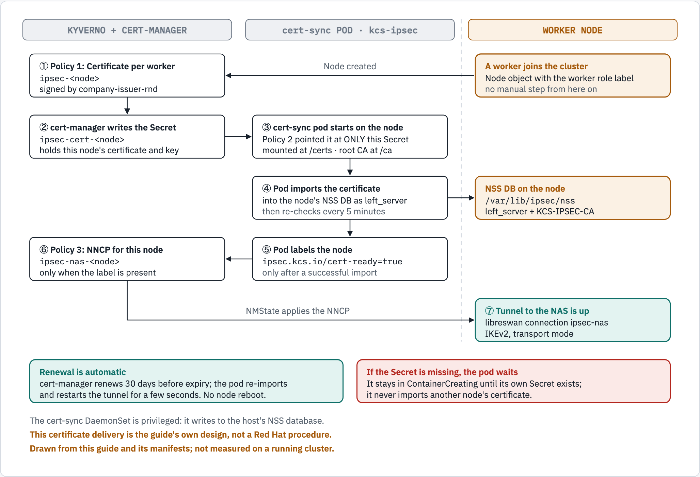
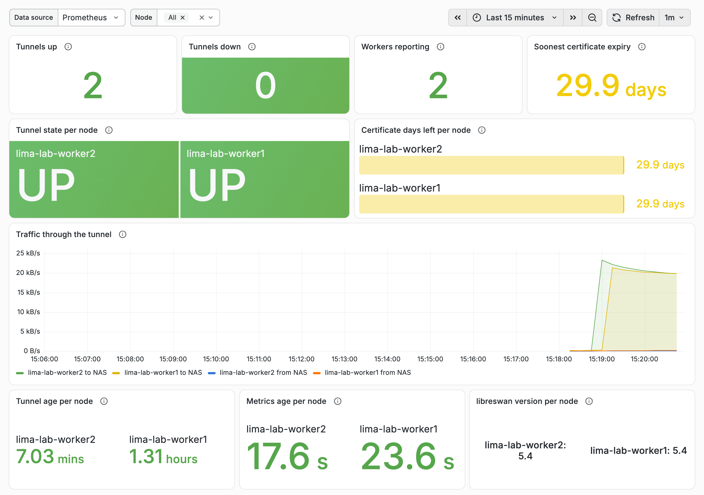
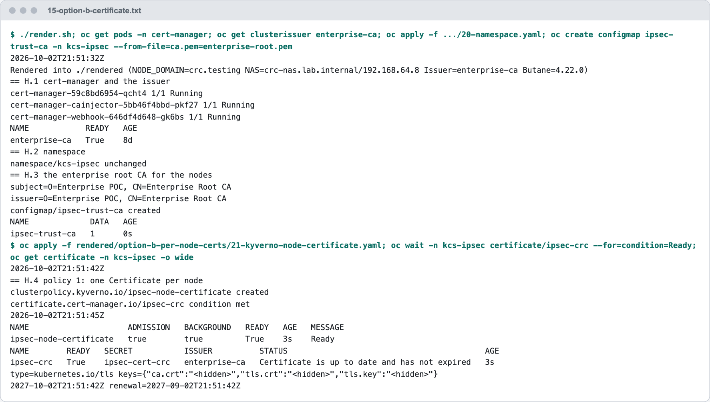
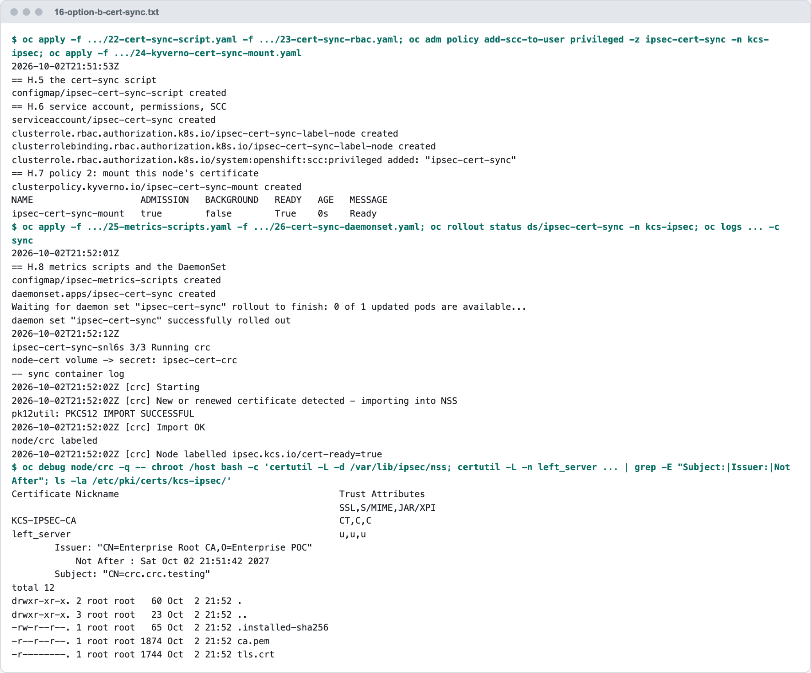
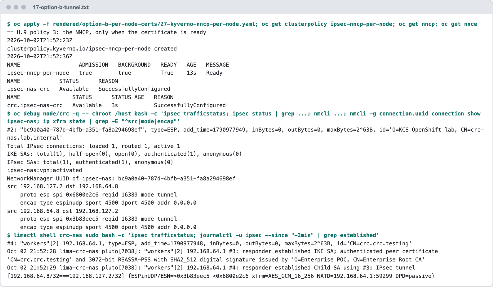
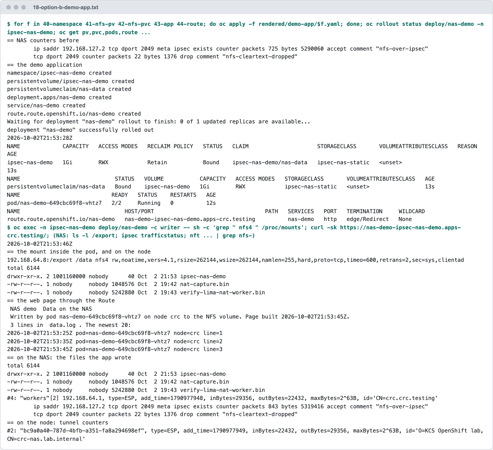
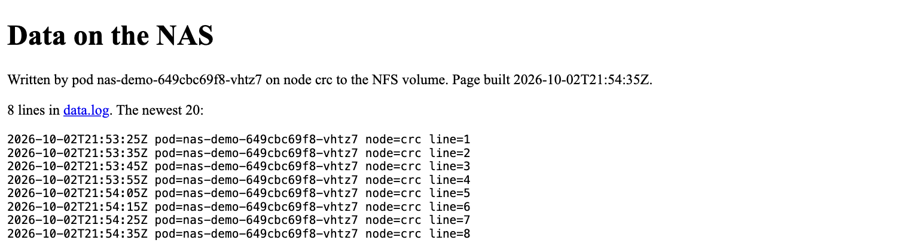
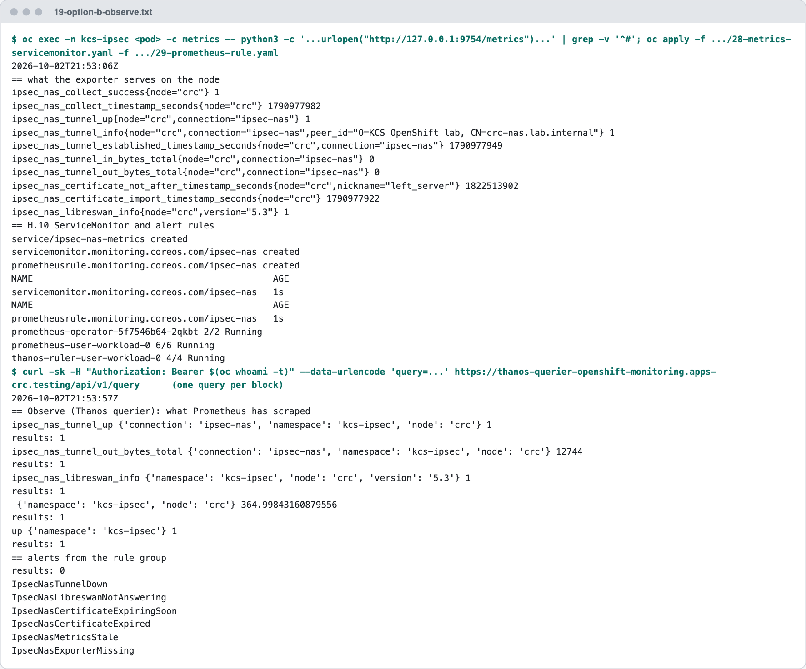
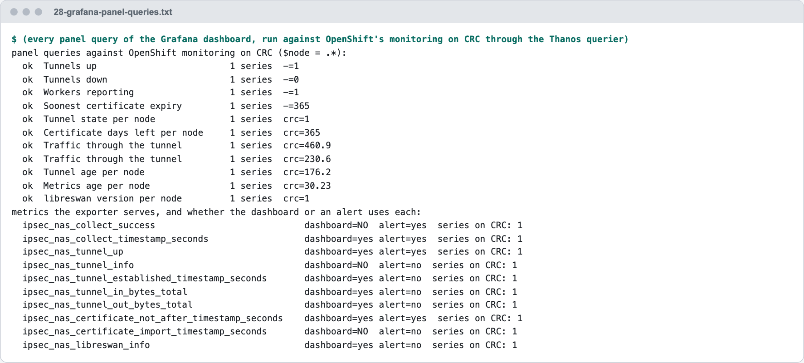

# Option B — One Certificate per Node (our standard, the enterprise north star)

**Audience:** platform engineers, including new ones. **Before this:** [00-prepare-the-cluster.md](00-prepare-the-cluster.md), Parts 0 and 1, and the NAS side (3.1).

This is **our standard for every cluster, and the enterprise north star**: each node gets **its own** certificate from the cluster's existing enterprise CA `ClusterIssuer`, delivered with no manual step and no reboot. A new node gets its certificate and tunnel by itself; renewal is automatic; one node can be revoked on its own. File names and step numbers call it **Option B**.

- [10-option-a-shared-certificate.md](10-option-a-shared-certificate.md) is the alternative Red Hat documents, one certificate for every node, and why we do not use it.
- [30-option-b-automated-helm-argocd.md](30-option-b-automated-helm-argocd.md) installs exactly the objects of this doc as one Helm release, from Git with Argo CD. Read this doc first: it explains what each object does.

> [!NOTE]
> **Kyverno policy kinds.** The steps use Kyverno's CEL policies (`policies.kyverno.io/v1`: `GeneratingPolicy`, `MutatingPolicy`, `NamespacedDeletingPolicy`), which need **Kyverno 1.19 or later**. Kyverno 1.19 deprecates the older `ClusterPolicy` and `CleanupPolicy` kinds and plans to remove them in 1.20 ([Kyverno: migrating to CEL policies](https://kyverno.io/docs/guides/migration-to-cel/)). On an older Kyverno, apply the files of [`manifests/option-b-per-node-certs/kyverno-legacy/`](../manifests/option-b-per-node-certs/kyverno-legacy/) in place of their namesakes (21, 24, 27, 32). Both sets have the same names and make the same objects.

**Contents:** [2.0 How it works](#20-how-it-works) · [2.1 Which nodes get a tunnel](#21-which-nodes-get-a-tunnel) · Steps [B.1](#step-b1--check-cert-manager-and-the-clusterissuer) to [B.14](#step-b14--remove-option-b) · [Measured on OpenShift Local (CRC)](#measured-on-openshift-local-crc) · [Gotchas](#gotchas)

## 2.0 How it works

This is our standard for every cluster. It is also called **Option B** in file names and step numbers.

Each worker gets **its own** certificate, issued automatically by the cluster's existing enterprise CA `ClusterIssuer` (`${CLUSTER_ISSUER}`; `company-issuer-rnd` is the placeholder name). No MachineConfig is used, so **nothing reboots** when nodes are added or certificates renew.



*Figure 2. Our standard (Option B): when a worker joins, Kyverno requests a certificate for it, cert-manager issues it into a Secret, the cert-sync pod on that node imports it and labels the node, and only then Kyverno generates the NNCP that brings the tunnel up. No manual step and no reboot. This certificate delivery is the guide's own design, not a Red Hat procedure.*

<details>
<summary>The figure as text</summary>

```text
KYVERNO + CERT-MANAGER                   cert-sync POD (kcs-ipsec)                WORKER NODE

1. Policy 1: Certificate per worker  <------------ Node created ------------  A worker joins the cluster
   ipsec-<node>                                                                (no manual step from here on)
   signed by the enterprise CA issuer
        |
2. cert-manager writes the Secret    -->  3. cert-sync pod starts on the node
   ipsec-cert-<node>                         Policy 2 pointed it at ONLY this Secret
   this node's certificate and key          mounted at /certs, root CA at /ca
                                                  |
                                          4. Pod imports the certificate       -->  NSS DB on the node
                                             into the NSS DB as left_server          /var/lib/ipsec/nss
                                             then re-checks every 5 minutes          left_server + KCS-IPSEC-CA
                                                  |
6. Policy 3: NNCP for this node      <--  5. Pod labels the node
   ipsec-nas-<node>                          ipsec.kcs.io/cert-ready=true
   only when the label is present            only after a successful import
        |
        +------------------- NMState applies the NNCP -------------------->  7. Tunnel to the NAS is up
                                                                                libreswan connection ipsec-nas

Renewal is automatic: cert-manager renews 30 days before expiry; the pod re-imports and restarts the tunnel
for a few seconds. No node reboot.
If the Secret is missing, the pod waits and says so in its log; it never imports another node's certificate.
```

</details>

What each piece does:

| Piece | Job |
|---|---|
| **Policy 1** `ipsec-node-certificate` | For every worker, create a cert-manager `Certificate` named `ipsec-<node>`. |
| **cert-manager** | Signs it with the enterprise CA `ClusterIssuer` (`${CLUSTER_ISSUER}`), stores it in Secret `ipsec-cert-<node>`, renews it automatically. |
| **Policy 2** `ipsec-cert-sync-mount` | When the DaemonSet starts a pod on a node, mount **only that node's** Secret into it. |
| **DaemonSet** `ipsec-cert-sync` | Imports the cert into the node's NSS DB, labels the node `ipsec.kcs.io/cert-ready=true`, re-imports on renewal. |
| **Policy 3** `ipsec-nncp-per-node` | Only after the label appears, create the NNCP for that node. This prevents NNCPs failing because the cert isn't there yet. |
| **Metrics** (in the same DaemonSet) | Each pod reports whether its node's tunnel is up, how much traffic it carries and when the node's certificate expires. OpenShift's monitoring scrapes it, and alerts fire when a tunnel is down (Step B.12). |

> [!IMPORTANT]
> ### Risks and responsibilities
>
> 1. **Support:** the NMState/IPsec configuration is the Red Hat documented one, but the **certificate delivery (DaemonSet + Kyverno) is our own design**. Get Red Hat's support stance on it (open a case or ask our Red Hat contact) **before production**. Kyverno itself is community software.
> 2. **The DaemonSet is privileged** (it writes to the host's NSS database). Only the platform team may have access to namespace `kcs-ipsec`. Include it in the security review.
> 3. **Private keys are stored as Secrets** in `kcs-ipsec`. Restrict `get secrets` there to the platform team, and make sure etcd encryption is enabled.
> 4. **Renewal causes a short tunnel restart** on each node (seconds). Configure the NAS to **reject non-IPsec NFS** from the worker subnet, so a restart causes an NFS retry, never cleartext traffic.
> 5. **If Kyverno is down**, new nodes don't get IPsec until it is back. Existing tunnels keep working. The webhooks Kyverno registers for these policies use `failurePolicy: Ignore` (read from the cluster for the CEL policies; set in the legacy ones), so Kyverno can never block a Node or Pod change.
> 6. **DNS:** every node FQDN must resolve, as in Part 0.
> 7. **The NAS must authorize peers by CA + worker subnet, not by individual host.** Otherwise every scale-up still needs a NAS change.

## 2.1 Which nodes get a tunnel

Two things decide it, and all three places that act on a node use the same two: policy 1 (the certificate), the DaemonSet (the import), and policy 3 (the NNCP).

| | Default | Meaning |
|---|---|---|
| **Include** | the label `node-role.kubernetes.io/worker` | Only nodes with this label are considered |
| **Exclude** | any of the labels `node-role.kubernetes.io/control-plane`, `node-role.kubernetes.io/master`, `node-role.kubernetes.io/ingress` | A node with **any** of these is left out, even if it also has the include label |

Why the exclusion list is needed: the include label alone leaves control-plane nodes out only by accident, because on most clusters they do not carry the worker label. On a compact cluster they do, and so do ingress or infra nodes that kept it. Without the list those nodes would get a certificate and a tunnel.

What happens by itself:

| Event | Result |
|---|---|
| A new node joins with the include label and none of the excluded ones | It gets its `Certificate`, a cert-sync pod, the `cert-ready` label and its NNCP, with nothing done by hand |
| A new node joins with an excluded label | Nothing: no certificate, no pod, no tunnel, and the "exporter missing" alert ignores it |
| A node is deleted | Its `Certificate` and Secret are removed (Step B.13) |
| A node reboots | Nothing changes |

To change the list:

- **Manifests:** edit the lines between `# exclude-nodes:begin` and `# exclude-nodes:end` in `21-kyverno-node-certificate.yaml`, `26-cert-sync-daemonset.yaml`, `27-kyverno-nncp-per-node.yaml` and `29-prometheus-rule.yaml`. Keep the four the same. Add `node-role.kubernetes.io/infra` there if your infra nodes must not reach the NAS.
- **Helm chart:** the value `excludeNodeLabels` (a list of label keys) sets all four at once.

> [!WARNING]
> Adding an excluded label to a node that **already has** a tunnel does not take the tunnel away. Kyverno removes the node's Certificate and NNCP, and the DaemonSet removes its pod, but a deleted NNCP leaves its tunnel on the node, and the certificate stays in the node's NSS database. Remove both by hand with the per-node steps of [3.4](#step-b14--remove-option-b).

## Step B.1 – Check cert-manager and the ClusterIssuer

```bash
oc get pods -n cert-manager
oc get clusterissuer                          # every issuer on this cluster; pick the enterprise CA one
oc get clusterissuer "${CLUSTER_ISSUER}"
```

✅ **Expected:** cert-manager pods `Running`, and `READY=True` on `${CLUSTER_ISSUER}`.

> [!IMPORTANT]
> **This guide does not create a certificate issuer.** An enterprise cluster already has a `ClusterIssuer` that signs with the enterprise CA. The per-node certificates must come from that issuer, so that they chain to the same root the NAS trusts. `company-issuer-rnd` is only a **placeholder** for its name.
>
> If the last command answers `NotFound`, `CLUSTER_ISSUER` is still the placeholder: set it to the real name in [0.3](00-prepare-the-cluster.md#03-open-a-shell-and-set-variables) and run the check again. If your cluster has no enterprise CA issuer at all, stop and ask the team that owns the enterprise CA; do not create a self-signed one for this.

## Step B.2 – Create the namespace

The manifests are files in this repository. Render them once with your values (Part 0.3 of [00-prepare-the-cluster.md](00-prepare-the-cluster.md#03-open-a-shell-and-set-variables) sets the variables), from the repository root:

```bash
./render.sh                          # writes rendered/, with NODE_DOMAIN, NAS_FQDN, NAS_IP and CLUSTER_ISSUER filled in
oc apply -f rendered/option-b-per-node-certs/20-namespace.yaml
```

The namespace `kcs-ipsec` carries the pod-security labels `privileged`, because the cert-sync DaemonSet runs privileged (Step B.8).

## Step B.3 – Store the enterprise **root** CA

The nodes need the root CA to trust the NAS certificate. Put **only the root** certificate (PEM) in `enterprise-root.pem`.

```bash
openssl x509 -in enterprise-root.pem -noout -subject -issuer   # subject == issuer for a root

oc create configmap ipsec-trust-ca -n kcs-ipsec --from-file=ca.pem=enterprise-root.pem
```

## Step B.4 – Policy 1: one Certificate per worker

```bash
oc apply -f rendered/option-b-per-node-certs/21-kyverno-node-certificate.yaml
oc get generatingpolicy ipsec-node-certificate      # READY must be true
```

The file is a Kyverno `GeneratingPolicy` (`policies.kyverno.io/v1`, Kyverno 1.19 or later). For every selected Node it creates this `Certificate` in `kcs-ipsec`:

| Field | Value | Why |
|---|---|---|
| Name, Secret | `ipsec-<node>`, `ipsec-cert-<node>` | One per node; policy 2 mounts the Secret by this name |
| Common name, DNS name | `<node>.${NODE_DOMAIN}` | Must equal the NNCP's `left` (policy 3). At most 64 characters, must not start with `ovs_` |
| Duration, renewal | 1 year, renewed 30 days before expiry | The CA may shorten the duration |
| Private key | RSA 3072, `rotationPolicy: Always` | The NNCP uses `leftrsasigkey: '%cert'`; a new key on every renewal |
| Usages | digital signature, key encipherment, server auth, client auth | Both ends of IKE authenticate |
| Issuer | `ClusterIssuer` `${CLUSTER_ISSUER}` | The existing enterprise CA issuer (Step B.1) |

Which Nodes it selects is written as two `matchConditions` (section [2.1](#21-which-nodes-get-a-tunnel)); `synchronize` deletes the Certificate when its Node is deleted or leaves the selection:

```yaml
  matchConditions:
  - name: selected-nodes
    expression: >-
      object.metadata.?labels[?"node-role.kubernetes.io/worker"] == optional.of("")
  - name: not-excluded
    expression: >-
      !["node-role.kubernetes.io/control-plane", "node-role.kubernetes.io/master", "node-role.kubernetes.io/ingress"].exists(k, k in object.metadata.?labels.orValue({}))
```

> [!NOTE]
> The selection is in `matchConditions`, not in an `objectSelector`. With an `objectSelector` the API server stops sending a Node to Kyverno once it no longer matches, so a node that gained an excluded label kept its Certificate (measured on CRC, [`evidence/crc/32-kyverno-cel-switch.txt`](evidence/crc/32-kyverno-cel-switch.txt)).

Verify (give it a minute):

```bash
oc get certificate -n kcs-ipsec
```

✅ **Expected:** one `ipsec-<node>` per worker, all `READY=True`. If one is not ready, see [Troubleshooting](00-prepare-the-cluster.md#33-troubleshooting).

## Step B.5 – The cert-sync script

The cert-sync script runs in the `sync` container of the DaemonSet pod on every worker (Step B.8). It is a ConfigMap:

```bash
oc apply -f rendered/option-b-per-node-certs/22-cert-sync-script.yaml
```

What it does, in order ([`22-cert-sync-script.yaml`](../manifests/option-b-per-node-certs/22-cert-sync-script.yaml) has the comments):

1. If the pod still mounts the placeholder Secret `ipsec-cert-unassigned` (policy 2 did not run when the pod was created), it logs `This pod mounts the placeholder secret`, waits 60 seconds and deletes its own pod, so that the DaemonSet creates one for Kyverno to see.
2. Once `/certs` holds this node's certificate and key, it imports them into the host's NSS database `/var/lib/ipsec/nss` as `left_server`, with the enterprise root CA as `KCS-IPSEC-CA`.
3. It labels the node `ipsec.kcs.io/cert-ready=true`. Policy 3 waits for this label.
4. Every 5 minutes it compares the mounted certificate with the imported one. A renewed certificate is imported, and the tunnel is restarted (`nmcli connection down`, then `up`) so that libreswan uses it.
5. If NetworkManager has the connection up but libreswan has no tunnel for it, it restarts the connection.

✅ **Measured** on CRC ([`evidence/crc/29-certificate-renewal.txt`](evidence/crc/29-certificate-renewal.txt)): a new certificate was issued at 23:10:38 and imported at 23:14:41, the tunnel restarted, the NAS authenticated the new certificate and the demo application kept writing. Before step 4 restarted the tunnel (commit `e525adf`), a renewal left the node without a tunnel: `nmcli connection up` alone answers `already active`.

## Step B.6 – ServiceAccount, permissions and SCC for the DaemonSet

The pod only needs to **read and label its node**, and to delete a pod of its own DaemonSet (Step B.5, item 1). It gets **no** permission to read Secrets: its own certificate is mounted by the kubelet (Step B.7).

```bash
oc apply -f rendered/option-b-per-node-certs/23-cert-sync-rbac.yaml
oc adm policy add-scc-to-user privileged -z ipsec-cert-sync -n kcs-ipsec
```

| Object | Grants |
|---|---|
| ServiceAccount `ipsec-cert-sync` | The pods' identity |
| ClusterRole and binding `ipsec-cert-sync-label-node` | `get`, `patch` on nodes |
| Role and binding `ipsec-cert-sync-recreate-pod` | `get`, `delete` on pods in `kcs-ipsec` |
| SCC `privileged` | The `sync` container writes to the host's NSS database |

## Step B.7 – Policy 2: mount each node's own certificate into its pod

A DaemonSet has **one** pod template, but each node needs a **different** Secret. When the DaemonSet creates a pod for a node, this policy rewrites the pod's `node-cert` volume to point at **that node's** Secret.

> **How does Kyverno know the node?** The DaemonSet controller pins every pod to its node with `nodeAffinity` → `matchFields: metadata.name`. The policy reads the node name from there.

> [!IMPORTANT]
> Apply this policy **before** the DaemonSet (Step B.8). A pod created while it is missing, or while Kyverno is down, keeps the placeholder secret; it deletes itself after 60 seconds (Step B.5, item 1). Measured on CRC: the replacement pod mounted the node's own secret, and the tunnel stayed up throughout.

```bash
oc apply -f rendered/option-b-per-node-certs/24-kyverno-cert-sync-mount.yaml
oc get mutatingpolicy ipsec-cert-sync-mount       # READY must be true
```

The file is a Kyverno `MutatingPolicy`. It matches only `CREATE` of pods labelled `app=ipsec-cert-sync` in `kcs-ipsec`, and only pods pinned to a node. The change it makes:

```yaml
  mutations:
  - patchType: ApplyConfiguration
    applyConfiguration:
      expression: >-
        Object{ spec: Object.spec{ volumes: [ Object.spec.volumes{
          name: "node-cert",
          secret: Object.spec.volumes.secret{ secretName: "ipsec-cert-" + variables.node } } ] } }
```

## Step B.8 – Deploy the DaemonSet

Each pod has three containers:

| Container | Privileged? | Job |
|---|---|---|
| `sync` | Yes | Imports the node's certificate into the host's NSS database and labels the node (Step B.5). |
| `collector` | Yes, host mounted **read-only** | Every 30 seconds reads the tunnel and certificate state from the host and writes it as Prometheus metrics into a shared volume. |
| `metrics` | **No** | Serves that file on port 9754 (`/metrics`). It is the pod's only network listener and has no access to the host. |

The template's `node-cert` volume points at a placeholder Secret (`ipsec-cert-unassigned`) that **does not exist**, marked `optional`. If the Kyverno mutation ever fails, the pod starts without a certificate, never imports another node's, and deletes itself after 60 seconds (Step B.5).

> [!NOTE]
> `sync` and `collector` use the OpenShift CLI image shipped with every cluster (`openshift/cli` image stream). If the internal image registry is disabled, replace it with our mirrored `ose-cli` image. `metrics` uses the Red Hat UBI Python image `registry.access.redhat.com/ubi9/python-312`; mirror it too on a disconnected cluster.

First the two scripts the `collector` and `metrics` containers run. They are long, and unit-tested in the repository, so apply the file from the repository instead of typing them:

```bash
oc apply -f rendered/option-b-per-node-certs/25-metrics-scripts.yaml
oc get configmap ipsec-metrics-scripts -n kcs-ipsec
```

Then the DaemonSet:

```bash
oc apply -f rendered/option-b-per-node-certs/26-cert-sync-daemonset.yaml
```

Its pods run on the nodes selected in [2.1](#21-which-nodes-get-a-tunnel): a `nodeSelector` for the include label, and `nodeAffinity` with `DoesNotExist` for each excluded label. Add tolerations in the file if some selected nodes are tainted.

Verify:

```bash
# 1. One Running pod per worker, 3/3 containers ready
oc get pods -n kcs-ipsec -o wide

# 2. Each pod mounts ITS OWN node's secret
oc get pods -n kcs-ipsec -o custom-columns='POD:.metadata.name,NODE:.spec.nodeName,SECRET:.spec.volumes[?(@.name=="node-cert")].secret.secretName'

# 3. Logs show "Import OK" and "Node labelled"
oc logs -n kcs-ipsec -l app=ipsec-cert-sync -c sync --prefix --tail=20

# 4. Every worker has the label
oc get nodes -l node-role.kubernetes.io/worker -L ipsec.kcs.io/cert-ready

# 5. The cert is in one node's NSS database
NODE=$(oc get nodes -l node-role.kubernetes.io/worker -o jsonpath='{.items[0].metadata.name}')
oc debug node/${NODE} -- chroot /host certutil -L -d /var/lib/ipsec/nss

# 6. The pod serves metrics (the tunnel itself comes in the next step, so tunnel_up is still 0)
oc exec -n kcs-ipsec ds/ipsec-cert-sync -c metrics -- python3 -c "import urllib.request; print(urllib.request.urlopen('http://127.0.0.1:9754/metrics').read().decode())" | grep -E '^ipsec_nas_(collect_success|tunnel_up)'
```

✅ **Expected:** in check 2, `SECRET` equals `ipsec-cert-<that NODE>` on every row. In check 5, you see `left_server u,u,u` and `KCS-IPSEC-CA CT,C,C`. In check 6, `ipsec_nas_collect_success{...} 1` and `ipsec_nas_tunnel_up{...} 0`.

## Step B.9 – Policy 3: NNCP per node, only when its cert is ready

> [!IMPORTANT]
> **Stop here until the NAS side is ready.** This step creates the NNCPs, so the storage team must have finished [3.1](00-prepare-the-cluster.md#31-nas-configuration-storage-team-not-us) first.

```bash
oc apply -f rendered/option-b-per-node-certs/27-kyverno-nncp-per-node.yaml
oc get generatingpolicy ipsec-nncp-per-node         # READY must be true
```

The file is a `GeneratingPolicy` with the same node selection as policy 1, plus the label `ipsec.kcs.io/cert-ready=true`. For each such node it creates the NNCP `ipsec-nas-<node>`:

```yaml
spec:
  nodeSelector:
    kubernetes.io/hostname: <the node's hostname label>
  desiredState:
    interfaces:
    - name: ipsec-nas
      type: ipsec
      libreswan:
        left: <node>.${NODE_DOMAIN}       # the Certificate's DNS name
        leftid: '%fromcert'
        leftrsasigkey: '%cert'
        leftcert: left_server
        leftmodecfgclient: false
        right: ${NAS_FQDN}
        rightid: '%fromcert'
        rightrsasigkey: '%cert'
        rightsubnet: ${NAS_IP}/32
        ikev2: insist
        type: transport
```

If the NAS requires specific proposals, add `esp: aes_gcm256` and `ike: aes256-sha2;dh20` (or what it asks for) under `libreswan` in the file.

Then go to [3.2](00-prepare-the-cluster.md#32-verify-end-to-end) to verify.

## Step B.10 – Scale-up test (prove it is automatic)

Do this once in a non-production cluster, then after go-live.

```bash
# Scale a worker MachineSet up by one
oc get machinesets -n openshift-machine-api
oc scale machineset <machineset-name> -n openshift-machine-api --replicas=<current+1>
```

Then watch the chain happen with **no manual steps**:

```bash
watch 'oc get nodes -l node-role.kubernetes.io/worker -L ipsec.kcs.io/cert-ready; echo; \
       oc get certificate -n kcs-ipsec; echo; \
       oc get pods -n kcs-ipsec -o wide; echo; \
       oc get nncp | grep ipsec-nas'
```

✅ **Expected order for the new node:** Node `Ready` → Certificate `Ready` → cert-sync pod `Running` → label `true` → NNCP created → NNCE `Available`.

## Step B.11 – Scale-down / node removal

When a node is deleted, Kyverno deletes its `Certificate` and NNCP, and the policy of Step B.13 deletes the Secret that cert-manager leaves behind. Then **revoke** that node's certificate at the CA, following our CA process. This is possible because each node has its own certificate.

To list leftover Secrets at any time:

```bash
for s in $(oc get secrets -n kcs-ipsec -o name | grep 'ipsec-cert-' | cut -d/ -f2); do
  n=${s#ipsec-cert-}; oc get node "$n" >/dev/null 2>&1 || echo "orphaned: $s"
done
```

## Step B.12 – Metrics in Observe, alerts and a dashboard

The `collector` and `metrics` containers from Step B.8 already produce the numbers. This step makes OpenShift collect them, adds alerts, and puts the dashboard in the console.

Every node reports its own metrics, each with a `node` label: whether its tunnel is up, the traffic through it, its certificate's expiry, and **why** a tunnel is down (no certificate, no connection, no IKE SA, libreswan not answering). The alerts fire on the node concerned. The full lists, 15 metrics and 12 alerts, are in [doc 60](60-monitoring-per-node.md#what-is-collected) (*What is collected*, *Alerts*).

**1. Check that user workload monitoring is on.** It is what scrapes metrics outside the `openshift-*` namespaces.

```bash
oc get pods -n openshift-user-workload-monitoring
```

✅ **Expected:** `prometheus-user-workload-0` is `Running`. If the namespace is empty, user workload monitoring is off: enable it first (Red Hat: *Enabling monitoring for user-defined projects*).

**2. Apply the Service and ServiceMonitor, and the alert rules**, from the repository root:

```bash
oc apply -f manifests/option-b-per-node-certs/28-metrics-servicemonitor.yaml
oc apply -f manifests/option-b-per-node-certs/29-prometheus-rule.yaml

oc get servicemonitor,prometheusrule -n kcs-ipsec
```

**3. See it in the console.** Open **Observe → Metrics**, run the query `ipsec_nas_tunnel_up`, and you get one row per worker. The alerts are under **Observe → Alerting → Alerting rules** (filter by source *User*).

✅ **Expected:** value `1` for every worker, with labels `node` and `connection="ipsec-nas"`.

**4. The dashboard in the console (Perses).** On a cluster with the Cluster Observability Operator 1.5 or later (installed by the [openshift-coo chart](https://github.com/ephico2real2/openshift-coo-helm/tree/main/charts/openshift-coo)):

```bash
oc apply -f manifests/option-b-per-node-certs/33-perses-dashboard.yaml
```

It appears under **Observe → Dashboards (Perses)**, project `kcs-ipsec`. Viewers need `view` in `kcs-ipsec` and `cluster-monitoring-view`. Everything about it, from how it works to troubleshooting: [doc 61](61-perses-dashboard-review.md). The Helm chart installs it by default.

**5. Grafana (optional, instead of or beside Perses).** Apply `manifests/option-b-per-node-certs/30-grafana-dashboard.yaml`: the same dashboard as a ConfigMap, `ipsec-nas-grafana-dashboard`, with the label `grafana_dashboard: "1"`. This guide does not install Grafana, and the ConfigMap needs one: a Grafana with a dashboard sidecar on that label, in `kcs-ipsec` or central and searching this namespace (both measured: [evidence kind/03](evidence/kind/03-grafana-dashboard-prerequisite.txt)). If the platform has a central Grafana run by the Grafana Operator (for example in `ocp-platform-grafana` or `ocp-grafana`), this object tells it to load the dashboard:

```bash
cat <<'EOF' > 31-grafana-dashboard-cr.yaml
apiVersion: grafana.integreatly.org/v1beta1
kind: GrafanaDashboard
metadata:
  name: ipsec-nas
  namespace: kcs-ipsec
spec:
  allowCrossNamespaceImport: true      # the Grafana instance lives in another namespace
  resyncPeriod: 10m
  instanceSelector:
    matchLabels:
      dashboards: grafana              # CHANGE: the labels on the central Grafana instance
  configMapRef:
    name: ipsec-nas-grafana-dashboard
    key: ipsec-nas.json
  datasources:
  - inputName: DS_PROMETHEUS
    datasourceName: openshift-thanos   # CHANGE: that Grafana's Prometheus (Thanos) datasource
EOF

oc apply -f 31-grafana-dashboard-cr.yaml
```

<picture>
  <source media="(prefers-color-scheme: dark)" srcset="images/grafana-ipsec-nas.dark.png">
  <source media="(prefers-color-scheme: light)" srcset="images/grafana-ipsec-nas.light.png">
  
</picture>

*The dashboard in the Lima lab on 2026-10-02, fed by two stand-in workers: 2 tunnels up, 0 down, 29.9 days to the soonest certificate expiry (the lab's test certificates last 30 days, hence yellow), and the traffic of a 5 MiB test write on each node. This is its first version, with ten panels; today's has more panels, in five sections: [doc 61, Capture 6](61-perses-dashboard-review.md#at-a-glance).*

> [!NOTE]
> **What was tested, and where.**
> - **The collector and the metrics container** were run on the lab workers against live tunnels, including taking a tunnel down and stopping libreswan.
> - **The ServiceMonitor, the alert rules and the per-node checks** were measured on CRC (OpenShift 4.22.7) and on a three-node kind cluster: [doc 60](60-monitoring-per-node.md#what-was-tested-and-where).
> - **The alert rules** pass `promtool` unit tests (`tests/test-alert-rules.sh`).
> - **The Perses dashboard** was measured on CRC with COO 1.5.3: [doc 61](61-perses-dashboard-review.md).
> - **The Grafana dashboard** was loaded in a real Grafana 13.2.3 (the Lima lab, and against CRC's Thanos), and all of its queries returned data. The ConfigMap's loading by a Grafana dashboard sidecar, in the same namespace or central, was measured on kind ([evidence kind/03](evidence/kind/03-grafana-dashboard-prerequisite.txt)); the `GrafanaDashboard` object above was not tested against a central Grafana.

## Step B.13 – Clean up after a deleted node

When a Node is deleted, Kyverno deletes that node's `Certificate` (policy 1 has `synchronize` enabled). cert-manager leaves the Certificate's Secret behind, with the node's private key in it. This Kyverno `NamespacedDeletingPolicy` deletes the cert-manager Secrets in the namespace whose Certificate no longer exists, every 5 minutes. Kyverno's cleanup controller gets the rights for it in this namespace only. (With the legacy policies, `kyverno-legacy/32-cleanup-orphaned-secrets.yaml` is a `CleanupPolicy` that does the same.)

```bash
oc apply -f manifests/option-b-per-node-certs/31-cleanup-rbac.yaml
oc apply -f manifests/option-b-per-node-certs/32-cleanup-orphaned-secrets.yaml
oc get namespaceddeletingpolicy -n kcs-ipsec
oc auth can-i delete secrets -n kcs-ipsec --as=system:serviceaccount:kyverno:kyverno-cleanup-controller   # yes
oc auth can-i delete secrets -n default   --as=system:serviceaccount:kyverno:kyverno-cleanup-controller   # no
```

✅ **Expected** (measured on CRC with a stand-in Node object, [Step I.4](#step-i4--a-node-is-deleted) below): the Node's `Certificate` was gone one second after the Node was deleted, and its Secret at the policy's next run. The other node's Certificate, Secret and tunnel were not touched.

> [!NOTE]
> A **reboot** does not delete the Node object, so it removes nothing: measured on CRC, the node had the same certificate after a restart and its tunnel came back by itself. If you want to keep the certificates of deleted nodes, do not apply this policy and set `evaluation.synchronize.enabled: false` in policy 1.

## ✅ Part 2 checklist

- [ ] All `Certificate`s `Ready`
- [ ] One cert-sync pod per worker, each mounting its own Secret
- [ ] All workers labelled `ipsec.kcs.io/cert-ready=true`
- [ ] One NNCP per worker, all NNCEs `Available`
- [ ] Scale-up test passed
- [ ] `ipsec_nas_tunnel_up` is `1` for every worker in **Observe → Metrics**
- [ ] Red Hat support stance recorded in the change ticket

## Step B.14 – Remove Option B

Run the cleanup the Helm chart runs when it is uninstalled. It works the same for objects applied from `manifests/`. It reaches the nodes through the cert-sync pods, so run it **before** deleting anything else. It needs `helm` on your workstation, to render its Job from the chart:

```bash
charts/ipsec-nas/examples/run-cleanup.sh kcs-ipsec        # with the legacy policies: add --set kyverno.legacyPolicies=true
oc delete --ignore-not-found -f rendered/option-b-per-node-certs/
```

The cleanup ([`charts/ipsec-nas/files/uninstall.sh`](../charts/ipsec-nas/files/uninstall.sh)) does, in this order:

1. Reads which nodes have a tunnel, then deletes policy 3, so that Kyverno stops creating NNCPs, and any NNCP it left.
2. Applies an NNCP with `state: absent` for each of those nodes, waits until NMState reports it `Available`, and deletes it. **Deleting an NNCP does not remove its tunnel**; only an `absent` NNCP does.
3. Removes the `ipsec.kcs.io/cert-ready` label from the nodes.
4. Removes the certificate, its private key and the CA from each node's NSS database, through that node's cert-sync pod.
5. Deletes policy 1, then the `Certificate` objects, then their Secrets. While a `Certificate` exists, cert-manager puts a deleted Secret back.

✅ **Measured** with the CEL policies ([`evidence/crc/32-kyverno-cel-switch.txt`](evidence/crc/32-kyverno-cel-switch.txt)): the cleanup took 9 seconds; afterwards the node had no tunnel, no `ipsec-nas` connection and no certificate in its NSS database, and the namespace no `Certificate` or Secret. The other 18 Certificates on the cluster were not touched.

Then ask the CA team to revoke the node certificates. [Gotcha 11](#gotcha-11--removing-the-setup-leaves-the-certificate-and-key-on-the-node) explains why each step is needed.

---

## Measured on OpenShift Local (CRC)

Everything in this section was run on OpenShift Local (CRC) 2.63.0 with OpenShift 4.22.7, one node named `crc`, against the NAS VM of [40-lab-crc-and-nas.md](40-lab-crc-and-nas.md). Four values differ from a production cluster (the `master` pool, tunnel mode because of NAT, `left: '%defaultroute'`, and the NAS IP as `right`); [the lab doc](40-lab-crc-and-nas.md#how-crc-differs-from-a-production-cluster) explains each.

Steps H.1 to H.7, I.4 and I.5 were run on 2026-10-02 with the **legacy** Kyverno policies, before the CEL policies became the default. The CEL policies were then switched in on the same cluster and the same checks repeated: [30-option-b-automated-helm-argocd.md](30-option-b-automated-helm-argocd.md#kyverno-policies-cel-or-legacy).

Each capture shows the commands and their output. The same text is under the picture and in [`evidence/crc/`](evidence/crc/).

### Part H – Option B, per-node certificates: our standard

This is the procedure above, and the setup we want on every cluster: cert-manager issues **one certificate per node** from the enterprise CA, a DaemonSet imports it, and Kyverno creates the NNCP when the certificate is in place. **No step in this part reboots the node**, and nothing is done by hand on a workstation: every step is an `oc apply` of a file from this repository.

It starts from the clean node Part G left behind. The manifests are rendered with the same CRC values as in Step F.1.

#### Step H.1 – Render, check the issuer, store the root CA (Steps B.1 to B.3 above)

```bash
export NODE_DOMAIN=crc.testing NAS_FQDN=crc-nas.lab.internal NAS_IP=192.168.64.8 CLUSTER_ISSUER=enterprise-ca
export MCP_ROLE=master IPSEC_TYPE=tunnel NAS_RIGHT=192.168.64.8 NODE_LEFT='%defaultroute'
./render.sh

oc get pods -n cert-manager
oc get clusterissuer enterprise-ca
oc apply -f rendered/option-b-per-node-certs/20-namespace.yaml

# enterprise-root.pem is the file from Step C.3
openssl x509 -in enterprise-root.pem -noout -subject -issuer
oc create configmap ipsec-trust-ca -n kcs-ipsec --from-file=ca.pem=enterprise-root.pem
```

✅ **Expected** (measured, 21:51:32 UTC): the issuer is `READY=True`; subject and issuer of the root are the same; the ConfigMap is created. No issuer is created: `enterprise-ca` is the one this cluster already has.

#### Step H.2 – Policy 1: one Certificate per node (Step B.4 above)

```bash
oc apply -f rendered/option-b-per-node-certs/21-kyverno-node-certificate.yaml
oc wait -n kcs-ipsec certificate/ipsec-crc --for=condition=Ready --timeout=90s
oc get certificate -n kcs-ipsec -o wide
oc get certificate -n kcs-ipsec ipsec-crc -o jsonpath='{.status.notAfter} renewal={.status.renewalTime}{"\n"}'
```

✅ **Expected** (measured): Kyverno created the `Certificate` and cert-manager issued it within **3 seconds** of the policy. It is valid for one year, and cert-manager has already set the renewal for 30 days before it expires.

<picture>
  <source media="(prefers-color-scheme: dark)" srcset="images/crc/15-option-b-certificate.dark.png">
  <source media="(prefers-color-scheme: light)" srcset="images/crc/15-option-b-certificate.light.png">
  
</picture>

*Capture 15. The node's own certificate, issued by the enterprise CA with no manual step. Text: [`evidence/crc/15-option-b-certificate.txt`](evidence/crc/15-option-b-certificate.txt).*

#### Step H.3 – The cert-sync script, its permissions, and policy 2 (Steps B.5 to B.7 above)

```bash
oc apply -f rendered/option-b-per-node-certs/22-cert-sync-script.yaml
oc apply -f rendered/option-b-per-node-certs/23-cert-sync-rbac.yaml
oc adm policy add-scc-to-user privileged -z ipsec-cert-sync -n kcs-ipsec

oc apply -f rendered/option-b-per-node-certs/24-kyverno-cert-sync-mount.yaml
oc get clusterpolicy ipsec-cert-sync-mount       # READY must be True, before the next step
```

#### Step H.4 – The DaemonSet (Step B.8 above)

```bash
oc apply -f rendered/option-b-per-node-certs/25-metrics-scripts.yaml
oc apply -f rendered/option-b-per-node-certs/26-cert-sync-daemonset.yaml
oc rollout status ds/ipsec-cert-sync -n kcs-ipsec --timeout=180s

p=$(oc get pods -n kcs-ipsec -l app=ipsec-cert-sync -o name | head -1)
oc get $p -n kcs-ipsec -o jsonpath='node-cert volume -> secret: {.spec.volumes[?(@.name=="node-cert")].secret.secretName}{"\n"}'
oc logs -n kcs-ipsec $p -c sync --tail=12

oc debug node/crc -q -- chroot /host bash -c '
certutil -L -d /var/lib/ipsec/nss
certutil -L -n left_server -d /var/lib/ipsec/nss | grep -E "Subject:|Issuer:|Not After"
ls -la /etc/pki/certs/kcs-ipsec/'
```

✅ **Expected** (measured): the pod is `3/3 Running` 11 seconds after the DaemonSet was applied. Kyverno pointed its `node-cert` volume at **this node's** secret, `ipsec-cert-crc`. The `sync` container imported the certificate one second after it started and labelled the node `ipsec.kcs.io/cert-ready=true`. On the node, `left_server` is now the node's **own** certificate, `CN=crc.crc.testing`, and neither the private key nor the `.p12` is left on disk.

<picture>
  <source media="(prefers-color-scheme: dark)" srcset="images/crc/16-option-b-cert-sync.dark.png">
  <source media="(prefers-color-scheme: light)" srcset="images/crc/16-option-b-cert-sync.light.png">
  
</picture>

*Capture 16. The certificate reaches the node without a MachineConfig and without a reboot. Text: [`evidence/crc/16-option-b-cert-sync.txt`](evidence/crc/16-option-b-cert-sync.txt).*

#### Step H.5 – Policy 3: the NNCP, and the tunnel (Step B.9 above)

```bash
oc apply -f rendered/option-b-per-node-certs/27-kyverno-nncp-per-node.yaml
oc get clusterpolicy ipsec-nncp-per-node
oc get nncp,nnce

oc debug node/crc -q -- chroot /host bash -c '
ipsec trafficstatus
ipsec status | grep -E "Total IPsec connections|IKE SAs|IPsec SAs"
nmcli -t -f NAME,TYPE,STATE connection show --active | grep -i vpn
ip xfrm state | grep -E "^src|mode|encap"'
limactl shell crc-nas sudo bash -c 'ipsec trafficstatus; journalctl -u ipsec --since "-2min" --no-pager | grep -E "established"'
```

✅ **Expected** (measured): the policy was applied at 21:52:23 and the NNCP was `Available` 13 seconds later. The NAS log shows the difference to Option A in one line: the peer is now **`CN=crc.crc.testing`**, this node's own identity, not the shared `CN=ocp-ipsec-workers`.

<picture>
  <source media="(prefers-color-scheme: dark)" srcset="images/crc/17-option-b-tunnel.dark.png">
  <source media="(prefers-color-scheme: light)" srcset="images/crc/17-option-b-tunnel.light.png">
  
</picture>

*Capture 17. The tunnel with the node's own certificate. Text: [`evidence/crc/17-option-b-tunnel.txt`](evidence/crc/17-option-b-tunnel.txt).*

From the first policy (21:51:42) to the established tunnel (21:52:29): **47 seconds, no reboot**.

#### Step H.6 – An application that stores its data on the NAS

The demo application from [`lab/nas-consumer-app.md`](lab/nas-consumer-app.md): a PersistentVolume that points at the NAS export, a claim, a pod that appends a line to a file every 10 seconds, and a Route that shows the file.

```bash
for f in 40-namespace 41-nfs-pv 42-nfs-pvc 43-app 44-route; do oc apply -f rendered/demo-app/$f.yaml; done
oc rollout status deploy/nas-demo -n ipsec-nas-demo --timeout=240s
oc get pv ipsec-nas-demo; oc get pvc,pods,route -n ipsec-nas-demo

oc exec -n ipsec-nas-demo deploy/nas-demo -c writer -- sh -c 'grep " nfs4 " /proc/mounts'
curl -sk https://nas-demo-ipsec-nas-demo.apps-crc.testing/
limactl shell crc-nas sudo bash -c 'ls -l /export; ipsec trafficstatus; nft list table inet nas_ipsec_only | grep -E "nfs-"'
```

✅ **Expected** (measured): the claim is `Bound` and the pod `2/2 Running` 13 seconds after the manifests were applied. The pod's `/data` is `192.168.64.8:/export` over NFS 4.1. On the NAS, the application's directory appears in `/export`, the rule for NFS **through IPsec** went from 725 to 843 packets, and the cleartext drop rule did not move (22 before and after).

<picture>
  <source media="(prefers-color-scheme: dark)" srcset="images/crc/18-option-b-demo-app.dark.png">
  <source media="(prefers-color-scheme: light)" srcset="images/crc/18-option-b-demo-app.light.png">
  
</picture>

*Capture 18. The demo application: its volume, its page, and the NAS counting its traffic on the IPsec rule. Text: [`evidence/crc/18-option-b-demo-app.txt`](evidence/crc/18-option-b-demo-app.txt).*

The page itself, opened through the Route in a browser:



*Screenshot 20. `https://nas-demo-ipsec-nas-demo.apps-crc.testing/` at 21:54:44 UTC. This one is a real browser screenshot; the page reads the file from the NAS.*

#### Step H.7 – Metrics in Observe, and the alert rules (Step B.12 above)

```bash
oc apply -f rendered/option-b-per-node-certs/28-metrics-servicemonitor.yaml
oc apply -f rendered/option-b-per-node-certs/29-prometheus-rule.yaml
oc get servicemonitor,prometheusrule -n kcs-ipsec
```

Then in the console: **Observe → Metrics**, and run `ipsec_nas_tunnel_up`. The same query from the command line:

```bash
curl -sk -H "Authorization: Bearer $(oc whoami -t)" --data-urlencode 'query=ipsec_nas_tunnel_up' \
  https://thanos-querier-openshift-monitoring.apps-crc.testing/api/v1/query
```

✅ **Expected** (measured, less than a minute after the ServiceMonitor was applied): OpenShift's own monitoring has the metrics, with the node's name on each. The tunnel is up, the certificate has 365 days left, the scrape target is up, and none of the six alerts is firing.

<picture>
  <source media="(prefers-color-scheme: dark)" srcset="images/crc/19-option-b-observe.dark.png">
  <source media="(prefers-color-scheme: light)" srcset="images/crc/19-option-b-observe.light.png">
  
</picture>

*Capture 19. The tunnel's metrics on the node and in OpenShift's monitoring. Text: [`evidence/crc/19-option-b-observe.txt`](evidence/crc/19-option-b-observe.txt).*

The collector reports the tunnel as up because it now looks the connection up under NetworkManager's UUID ([Gotcha 7](40-lab-crc-and-nas.md#gotcha-7--on-a-real-node-libreswan-names-the-connection-by-uuid)); before that fix it would have said `0` on every real node.

#### Step I.4 – A node is deleted

When a Node is deleted, Kyverno deletes that node's `Certificate`. cert-manager leaves the Certificate's Secret behind, with the node's private key in it. The chart adds a Kyverno policy that deletes such Secrets, with rights in this namespace only.

> [!NOTE]
> This run used the legacy policies (a `CleanupPolicy`). The same test with the CEL policies, a `NamespacedDeletingPolicy`, gave the same result: [`evidence/crc/32-kyverno-cel-switch.txt`](evidence/crc/32-kyverno-cel-switch.txt), and [30-option-b-automated-helm-argocd.md](30-option-b-automated-helm-argocd.md#kyverno-policies-cel-or-legacy).

CRC's only node cannot be deleted, so the test uses a **stand-in Node object** with no machine behind it:

```bash
cat <<'EOF' | oc apply -f -
apiVersion: v1
kind: Node
metadata:
  name: ipsec-test-node
  labels:
    node-role.kubernetes.io/worker: ""
    kubernetes.io/hostname: ipsec-test-node
EOF
oc get certificate -n kcs-ipsec
oc get secret -n kcs-ipsec -l controller.cert-manager.io/fao=true

oc delete node ipsec-test-node
oc get certificate -n kcs-ipsec
oc get secret -n kcs-ipsec -l controller.cert-manager.io/fao=true      # again after the policy's next run
```

✅ **Expected** (measured):

- The new Node had its own `Certificate` and Secret within **2 seconds**, with nothing done by hand. It got no NNCP, because no certificate had been imported on it.
- The Node was deleted at 22:14:57. Its `Certificate` was gone one second later. Its Secret was still there.
- The cleanup policy ran at 22:15:00 and deleted that Secret.
- The real node was not touched: `ipsec-crc`, `ipsec-cert-crc` and its tunnel were the same before and after.

<picture>
  <source media="(prefers-color-scheme: dark)" srcset="images/crc/24-node-deleted.dark.png">
  <source media="(prefers-color-scheme: light)" srcset="images/crc/24-node-deleted.light.png">
  
</picture>

*Capture 24. A stand-in node appears, gets its certificate, is deleted, and is cleaned up. Text: [`evidence/crc/24-node-deleted.txt`](evidence/crc/24-node-deleted.txt).*

Three values control this. They are all `true` (or the schedule) by default:

| Value | Default | What it controls |
|---|---|---|
| `nodeCleanup.deleteCertificate` | `true` | Kyverno deletes a node's `Certificate` when the Node is deleted. `false` keeps it |
| `nodeCleanup.deleteOrphanedSecrets` | `true` | The cleanup policy for Secrets whose `Certificate` is gone. `false` keeps those Secrets |
| `nodeCleanup.schedule` | `*/5 * * * *` | How often the cleanup policy runs |

#### Step I.5 – A reboot does not take the certificate away

None of the cleanup above is triggered by a reboot: a reboot does not delete the Node object. This was tested by restarting CRC with the setup in place and comparing before and after.

```bash
oc get certificate -n kcs-ipsec -o jsonpath='{range .items[*]}{.metadata.name} notAfter={.status.notAfter} revision={.status.revision}{"\n"}{end}'
oc get secret -n kcs-ipsec ipsec-cert-crc -o jsonpath='secret uid={.metadata.uid}{"\n"}'
oc debug node/crc -q -- chroot /host bash -c 'uptime -s; certutil -L -n left_server -d /var/lib/ipsec/nss -a | sha256sum | cut -c1-16; ipsec trafficstatus'

crc stop; crc start          # then the same three commands again
```

✅ **Expected** (measured, restart from 22:32:46 to 22:35:58): the node booted at 22:32:55, and everything about the certificate is the same as before: the `Certificate` is at revision 1 with the same expiry, the Secret has the same UID, and the certificate in the node's NSS database has the same fingerprint (`dbb35eec3d71aeca`). The tunnel **came back by itself**, and the Argo CD application was still `Synced` and `Healthy`.

<picture>
  <source media="(prefers-color-scheme: dark)" srcset="images/crc/27-restart-keeps-certificate.dark.png">
  <source media="(prefers-color-scheme: light)" srcset="images/crc/27-restart-keeps-certificate.light.png">
  
</picture>

*Capture 27. Before and after a restart: the same certificate, and the tunnel back by itself. Text: [`evidence/crc/27-restart-keeps-certificate.txt`](evidence/crc/27-restart-keeps-certificate.txt).*

#### Step I.8 – Does the Grafana dashboard show what we need?

This CRC has no Grafana, so the dashboard itself was last seen in the Lima lab. What can be checked here is whether its queries find the real metrics. Every panel query was run against OpenShift's monitoring on CRC:

<picture>
  <source media="(prefers-color-scheme: dark)" srcset="images/crc/28-grafana-panel-queries.dark.png">
  <source media="(prefers-color-scheme: light)" srcset="images/crc/28-grafana-panel-queries.light.png">
  
</picture>

*Capture 28. The dashboard's queries against real metrics on CRC, and which metrics it does not use. Text: [`evidence/crc/28-grafana-panel-queries.txt`](evidence/crc/28-grafana-panel-queries.txt).*

**What the dashboard answers today:** is every node's tunnel up, how many are down, is every worker reporting, how long until the first certificate expires, how much traffic goes through, how old each tunnel is, and which libreswan version runs. All ten panels return data on a real node.

**What it does not show, although the metric exists** (no change to the DaemonSet needed):

| Missing panel | Metric | Why it is worth having |
|---|---|---|
| Last certificate import per node | `ipsec_nas_certificate_import_timestamp_seconds` | Shows that a renewal really reached the node |
| NAS identity per node | `ipsec_nas_tunnel_info` (`peer_id`) | Shows which NAS certificate each node is talking to |
| libreswan answering per node | `ipsec_nas_collect_success` | Today only an alert uses it |
| Tunnel re-established, per hour | `changes(ipsec_nas_tunnel_established_timestamp_seconds[1h])` | A tunnel that keeps dropping looks "up" on every other panel |

**What needs a new metric from the DaemonSet.** When a tunnel was down during this work, the dashboard could say *that* it was down and not *why*. Each cause below happened here, and each would need one more metric:

| Proposed metric | What it would tell apart | Seen in |
|---|---|---|
| `ipsec_nas_certificate_present` (1 or 0: `left_server` is in the node's NSS database) | "No certificate on the node" from "tunnel down for another reason". Today a missing certificate only shows as a missing series | The placeholder-secret pod (Step I.2); a node after cleanup |
| `ipsec_nas_connection_configured` (1 or 0: NetworkManager has the `ipsec-nas` connection) | "No NNCP was applied" from "the NNCP is there and the tunnel does not come up" | The Kyverno gotchas 3 and 4 |
| `ipsec_nas_ike_sa_established` (1 or 0) | "The NAS does not answer or refuses the login" from "logged in, and the tunnel itself is refused" | Transport mode behind NAT (Part B) |
| `ipsec_nas_nfs_mounts` (number of NFS mounts from the NAS on the node) | Nodes that only have a tunnel from nodes that really use the NAS | The demo application stalled while the tunnel was down |

None of these is built yet. They are a proposal.

---

#### H.8 – Option A and Option B side by side, as measured on this CRC

| | Option A (shared certificate) | Option B (per-node certificates) |
|---|---|---|
| Work by hand before the cluster sees anything | Six steps on a workstation: SAN list, key, CSR, signing, bundle, Butane | None. Every step is `oc apply` of a file from the repository |
| Reboots of the node to install it | 1 (the MachineConfig) | **0** |
| From the first command to an established tunnel | Not comparable as a number: it included a reboot, a CRC restart and the two Kyverno gotchas. The reboot and CRC restart alone took 9 minutes when Option A was removed (Step G.3) | **47 seconds** |
| Where the private key is made | On an engineer's workstation, then copied into a MachineConfig | In the cluster, by cert-manager. No person handles it |
| Who the NAS sees | `CN=ocp-ipsec-workers`, the same for every node | `CN=crc.crc.testing`, this node only |
| Validity, and who renews it | 90 days as requested; nobody: redo everything by hand | One year; cert-manager, renewal already scheduled for 2 September 2027 |
| A new node | New certificate with a longer SAN list, new MachineConfig, every node reboots | By design, the policies give it a certificate and a tunnel by themselves. **Not tested here**: CRC has one node |
| Taking it away | Policy, `absent` NNCP, MachineConfig (reboot), **and** the key that stays in the NSS database ([10-option-a-shared-certificate.md](10-option-a-shared-certificate.md#step-g4--remove-the-shared-certificate-and-its-key-from-the-node)) | One cleanup script, no reboot: `helm uninstall` took 12 seconds and the Argo CD procedure 15 seconds, and left no tunnel, key, `Certificate` or Secret ([30-option-b-automated-helm-argocd.md](30-option-b-automated-helm-argocd.md)) |

#### Not tested on CRC

- **Scale-up and scale-down with a real node** (Steps B.10 and B.11 above): CRC has one node. Step I.4 covers the cluster side with a stand-in Node object: its certificate appears, and is cleaned up when the Node is deleted. The tunnel of a second real node was not tested.
- **Renewal on its own schedule**: a renewal was forced by deleting the node's Secret (Step B.5); a renewal 30 days before expiry was not waited for.
- **The alerts firing**: the rules are loaded and none fires; no tunnel was broken on purpose to see `IpsecNasTunnelDown`.
- **The Grafana dashboard**: this CRC has no `ocp-platform-grafana` or `ocp-grafana` namespace. The dashboard was tested in the Lima lab.
- **Dynamic provisioning** with `csi-driver-nfs` against this NAS.

---

## Gotchas

### Gotcha 11 – Removing the setup leaves the certificate and key on the node

**What happened.** Three removals each left something behind that holds a private key:

- Deleting Option A's MachineConfig left the shared certificate and its key in the node's NSS database (Step G.3).
- Removing Option B left the node's Secret in the namespace, the `cert-ready` label on the node, and the certificate, key and staging directory on the node.
- After `helm uninstall`, the node's `Certificate` was still there, and when its Secret was deleted, cert-manager **put the Secret back** nine seconds later.

**The cause.** Removing an object does not undo what it did on a node. And Kyverno, which deletes the `Certificate` when its policy is deleted, cannot do so during an uninstall: the uninstall removes Kyverno's permissions in the same moment.

**The fix.** The teardown ([Step B.14](#step-b14--remove-option-b)) now covers every one of these. The chart does it by itself in a pre-delete hook ([30-option-b-automated-helm-argocd.md](30-option-b-automated-helm-argocd.md#step-i6--remove-it-with-helm)), in this order: tunnels, node labels, the certificate on each node, the `Certificate` objects, and only then the Secrets.
