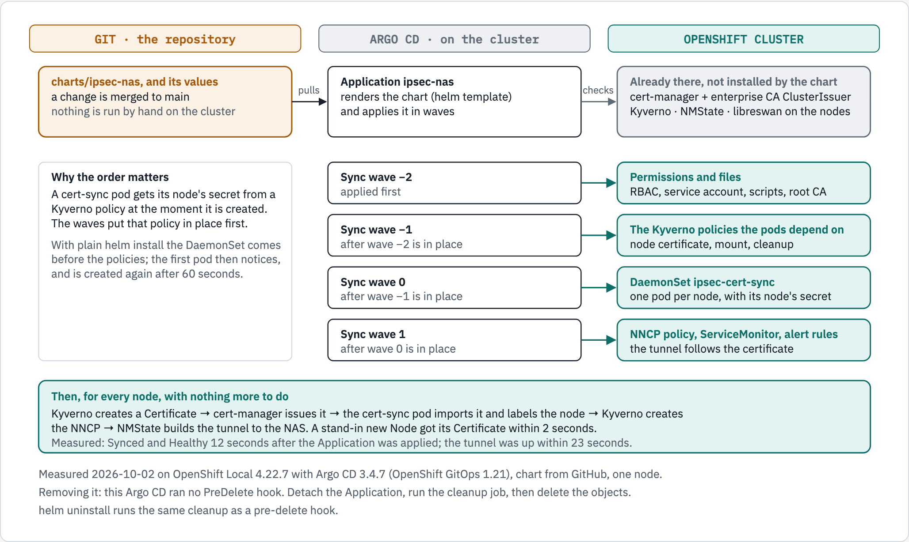
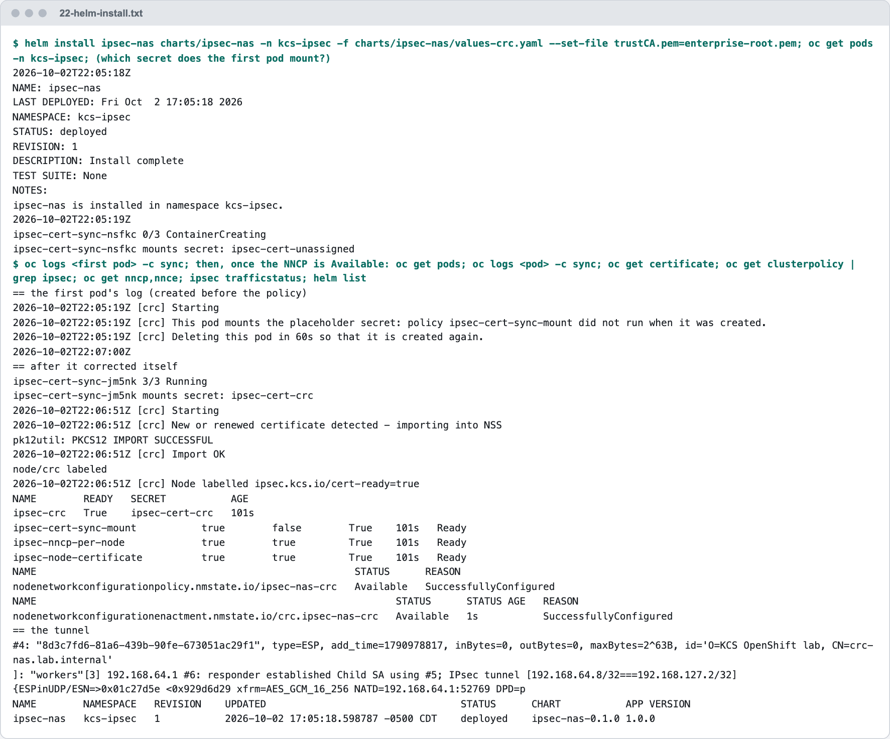
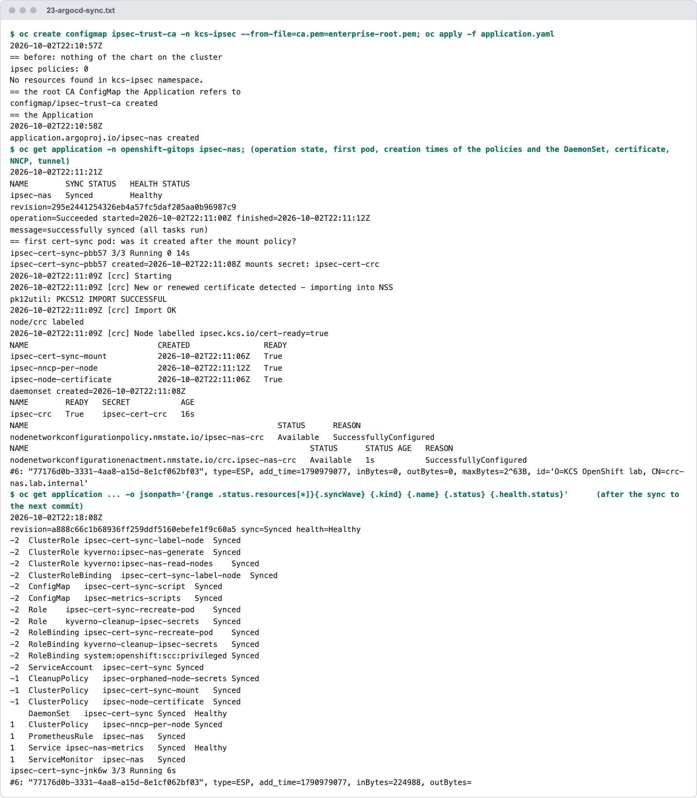
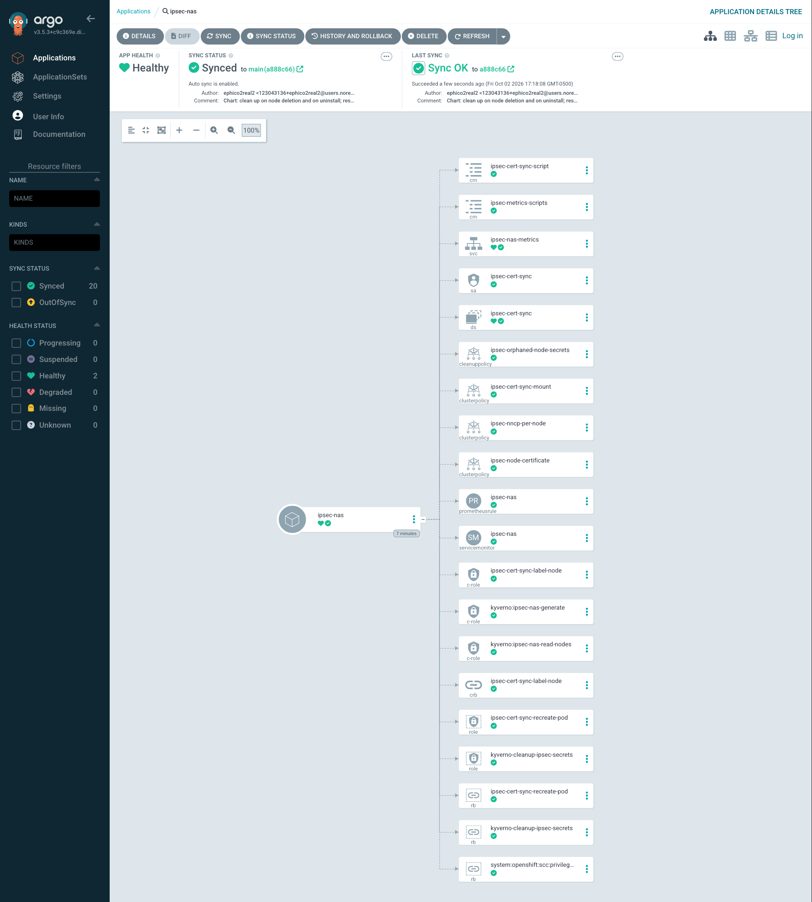
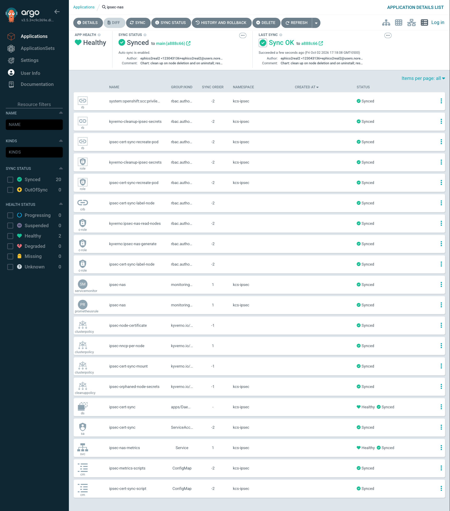
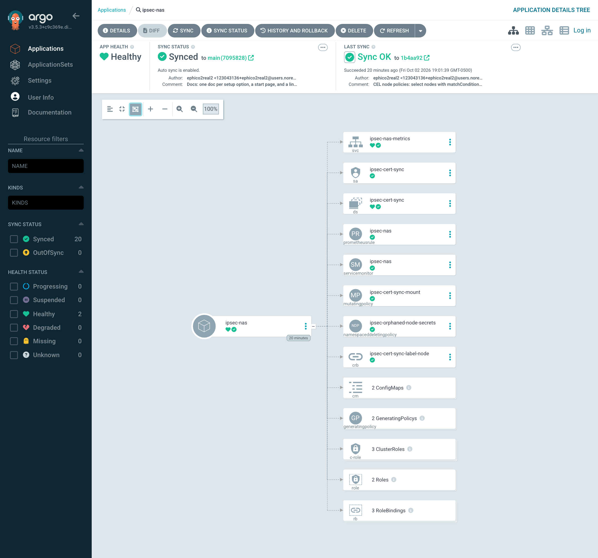
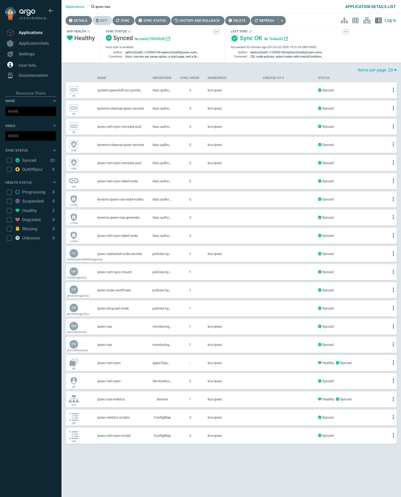

# Option B, Automated — the Helm Chart, with Helm and with Argo CD

**Audience:** platform engineers. **Before this:** [00-prepare-the-cluster.md](00-prepare-the-cluster.md), Parts 0 and 1, and the NAS side (3.1); and [20-option-b-per-node-certificates.md](20-option-b-per-node-certificates.md), which explains every object this chart creates.

This is **Option B, our standard and the enterprise north star**, as one Helm release: [`charts/ipsec-nas`](../charts/ipsec-nas/README.md). It is installed with `helm`, or from Git by Argo CD in sync waves. The chart's [README](../charts/ipsec-nas/README.md) has every value; this doc has the steps as they were run and measured on OpenShift Local (CRC), with the lab's values ([`values-crc.yaml`](../charts/ipsec-nas/values-crc.yaml)).

**Contents:** [How it reaches the cluster](#how-it-reaches-the-cluster) · [Step I.1 – Prerequisites](#step-i1--what-must-already-be-on-the-cluster) · [I.2 – Helm](#step-i2--install-with-helm) · [I.3 – Argo CD](#step-i3--install-with-argo-cd-from-git) · [I.6 – Remove with Helm](#step-i6--remove-it-with-helm) · [I.7 – Remove with Argo CD](#step-i7--remove-it-with-argo-cd) · [Kyverno policies: CEL or legacy](#kyverno-policies-cel-or-legacy) · [Gotchas](#gotchas)

Steps I.4 and I.5, a node deleted and a node restarted, are in [20-option-b-per-node-certificates.md](20-option-b-per-node-certificates.md#step-i4--a-node-is-deleted), with the rest of what Option B does on its own.

## How it reaches the cluster


[20-option-b-per-node-certificates.md](20-option-b-per-node-certificates.md) applies the manifests one by one. `charts/ipsec-nas` packages exactly those objects as one Helm release (`tests/test-chart.sh` compares them object by object), so that a cluster can be set up from Git. This doc installs it both ways and removes it both ways.



*Figure 2. From Git to a tunnel on every node. cert-manager, Kyverno, NMState and libreswan are prerequisites: the chart checks for them and never installs them.*

<details>
<summary>The figure as text</summary>

```text
GIT (the repository)             ARGO CD (on the cluster)              OPENSHIFT CLUSTER

charts/ipsec-nas + values   -->  Application ipsec-nas            -->  Already there, not installed by the chart:
  a change is merged to main       renders the chart (helm template)     cert-manager + enterprise CA ClusterIssuer,
                                   and applies it in waves               Kyverno, NMState, libreswan on the nodes

                                 Sync wave -2                      -->  Permissions and files: RBAC, service account, scripts, root CA
                                 Sync wave -1                      -->  The Kyverno policies the pods depend on: node certificate, mount, cleanup
                                 Sync wave  0                      -->  DaemonSet ipsec-cert-sync: one pod per node, with its node's secret
                                 Sync wave  1                      -->  NNCP policy, ServiceMonitor, alert rules

Then, for every node: Certificate -> the pod imports it and labels the node -> NNCP -> NMState builds the tunnel.
Measured: Synced and Healthy 12 seconds after the Application was applied; tunnel up within 23 seconds.
```

</details>

## Step I.1 – What must already be on the cluster

The chart treats these as **prerequisites**. It checks for them and stops with a message that names what is missing; it never installs or upgrades them.

| Prerequisite | On this CRC | Checked by the chart |
|---|---|---|
| cert-manager, with a `ClusterIssuer` for the enterprise CA | `enterprise-ca` | The API is served; the issuer named in `clusterIssuer` exists |
| Kyverno 1.19 or later (1.13 with `kyverno.legacyPolicies: true`), not filtering out Nodes | [Step D.3](40-lab-crc-and-nas.md#step-d3--kyverno-permissions-and-let-it-see-nodes-cluster-preparation-steps-163-and-17) | The API `policies.kyverno.io/v1` is served (legacy: `kyverno.io/v1`, and `kyverno.io/v2` for the cleanup); `[Node,*,*]` is not in its `resourceFilters` |
| NMState Operator with an instance | [Step D.2](40-lab-crc-and-nas.md#step-d2--nmstate-operator-and-instance-cluster-preparation-step-15) | The API is served |
| libreswan on the nodes | [Part E](40-lab-crc-and-nas.md#part-e--libreswan-on-the-crc-node-crc-only) (a production cluster: `ipsecConfig.mode: External`) | Not checked |
| The namespace, with the privileged pod-security labels | `kcs-ipsec` ([20-option-b-per-node-certificates.md](20-option-b-per-node-certificates.md), Step B.2) | Not checked |
| Cluster Observability Operator 1.5 or later, with Perses: for the dashboard in the console, **on by default**. Not needed with `metrics.persesDashboard.enabled: false` | COO 1.5.3 ([openshift-coo-helm](https://github.com/ephico2real2/openshift-coo-helm)) | The API `perses.dev/v1alpha2` is served ([doc 61](61-perses-dashboard-review.md)) |
| Grafana: only for the Grafana integration (`metrics.grafanaDashboard: true`, off by default). A Grafana with a dashboard sidecar on the label `grafana_dashboard: "1"`, in the release's namespace or central and searching it (both measured, [evidence kind/03](evidence/kind/03-grafana-dashboard-prerequisite.txt)); grafana-operator with a `GrafanaDashboard`: not measured | none on this CRC | Not checked: without a Grafana the ConfigMap is unused ([doc 61](61-perses-dashboard-review.md#grafana-if-you-need-it)) |

```bash
tests/test-chart.sh
helm install ipsec-nas charts/ipsec-nas -n kcs-ipsec -f charts/ipsec-nas/values-crc.yaml --set clusterIssuer=company-issuer-rnd --set trustCA.pem=x --dry-run=server
```

✅ **Expected** (measured): the test passes, and the dry run with an issuer that does not exist is refused:

```text
ok    values-crc.yaml (tunnel mode, as measured on CRC): 29 chart objects, identical to the manifests
ok    a cluster without Kyverno is refused
ok    Argo CD sync waves: RBAC and ConfigMaps, then the policies, then the DaemonSet
all chart tests passed

Error: INSTALLATION FAILED: ... prerequisite missing: ClusterIssuer "company-issuer-rnd" does not exist. Set clusterIssuer to the existing enterprise CA issuer (oc get clusterissuer). This chart does not create one.
```

Before installing the chart, the Option B installed by hand was removed ([20-option-b-per-node-certificates.md](20-option-b-per-node-certificates.md#step-b14--remove-option-b)); that run is how [Gotcha 11](20-option-b-per-node-certificates.md#gotcha-11--removing-the-setup-leaves-the-certificate-and-key-on-the-node) was found.

## Step I.2 – Install with Helm

```bash
helm install ipsec-nas charts/ipsec-nas -n kcs-ipsec -f charts/ipsec-nas/values-crc.yaml \
  --set-file trustCA.pem=enterprise-root.pem

oc get pods -n kcs-ipsec
oc get certificate -n kcs-ipsec; oc get nncp,nnce
oc debug node/crc -q -- chroot /host ipsec trafficstatus
```

✅ **Expected** (measured, installed at 22:05:18 UTC): the tunnel was up about **100 seconds** after `helm install`. Most of that time is one deliberate wait. Helm creates the DaemonSet a moment before the Kyverno policies, so the first pod is created without its node's secret. It notices, says so in its log, deletes itself after 60 seconds, and the pod that replaces it gets the secret.

<picture>
  <source media="(prefers-color-scheme: dark)" srcset="images/crc/22-helm-install.dark.png">
  <source media="(prefers-color-scheme: light)" srcset="images/crc/22-helm-install.light.png">
  
</picture>

*Capture 22. `helm install`, the first pod correcting itself, and the tunnel. Text: [`evidence/crc/22-helm-install.txt`](evidence/crc/22-helm-install.txt).*

## Step I.3 – Install with Argo CD, from Git

CRC already has an Argo CD (OpenShift GitOps 1.21, Argo CD 3.4.7). The Application points at the chart in the Git repository; [`charts/ipsec-nas/examples/argocd-application.yaml`](../charts/ipsec-nas/examples/argocd-application.yaml) is the template. Here it uses `values-crc.yaml` and a ConfigMap with the root CA that is created first.

```bash
oc create configmap ipsec-trust-ca -n kcs-ipsec --from-file=ca.pem=enterprise-root.pem

cat <<'EOF' | oc apply -f -
apiVersion: argoproj.io/v1alpha1
kind: Application
metadata:
  name: ipsec-nas
  namespace: openshift-gitops
spec:
  project: default
  source:
    repoURL: https://github.com/ephico2real2/openshift-ipsec-nas.git
    targetRevision: main
    path: charts/ipsec-nas
    helm:
      releaseName: ipsec-nas
      valueFiles:
      - values-crc.yaml
      valuesObject:
        trustCA:
          existingConfigMap: ipsec-trust-ca
  destination:
    server: https://kubernetes.default.svc
    namespace: kcs-ipsec
  syncPolicy:
    managedNamespaceMetadata:
      labels:
        pod-security.kubernetes.io/enforce: privileged
        pod-security.kubernetes.io/audit: privileged
        pod-security.kubernetes.io/warn: privileged
        security.openshift.io/scc.podSecurityLabelSync: "false"
    automated: {}
    syncOptions:
    - CreateNamespace=true
EOF

oc get application -n openshift-gitops ipsec-nas
oc get application -n openshift-gitops ipsec-nas -o jsonpath='{range .status.resources[*]}{.syncWave}{"\t"}{.kind}{"\t"}{.name}{"\t"}{.status}{"\n"}{end}' | sort -n
```

✅ **Expected** (measured, applied at 22:10:58 UTC): the sync ran from 22:11:00 to 22:11:12 and ended `Synced` and `Healthy`. The waves did what they are for: both policies were created at 22:11:06 and the DaemonSet at 22:11:08, so the **first** pod already mounted `ipsec-cert-crc`. The tunnel was up within **23 seconds** of applying the Application, against about 100 seconds with plain Helm.

<picture>
  <source media="(prefers-color-scheme: dark)" srcset="images/crc/23-argocd-sync.dark.png">
  <source media="(prefers-color-scheme: light)" srcset="images/crc/23-argocd-sync.light.png">
  
</picture>

*Capture 23. The Argo CD sync, the creation order, and every resource with its wave. Text: [`evidence/crc/23-argocd-sync.txt`](evidence/crc/23-argocd-sync.txt).*

The application in the Argo CD user interface, with every component deployed, as it was with the legacy policies (three `ClusterPolicy` objects and a `CleanupPolicy`). These two are real browser screenshots. They were taken without typing a password: `argocd admin dashboard -n openshift-gitops` serves the interface locally from the existing `oc` login.



*Screenshot 21a. The Argo CD application `ipsec-nas`: `Healthy`, `Synced` to `main`, all 20 objects.*



*Screenshot 21b. The same application as a list, with the `SYNC ORDER` column: the waves of Figure 2.*

The same application after the switch to the CEL policies (the next section), on 2026-10-03:



*Screenshot 33a. With the CEL policies: `Healthy`, `Synced`, all 20 objects, including the `MutatingPolicy`, the `NamespacedDeletingPolicy` and two `GeneratingPolicy` objects.*



*Screenshot 33b. The same as a list: the CEL policies the DaemonSet depends on are in wave -1, the NNCP policy in wave 1, as the legacy ones were.*

## Step I.6 – Remove it with Helm

Deleting the chart's objects does not undo what they did: the tunnel stays on the node, and the node keeps its certificate and key. Kyverno cannot clean up here, because the uninstall takes its policies and its permissions away in the same moment ([Gotcha 11](20-option-b-per-node-certificates.md#gotcha-11--removing-the-setup-leaves-the-certificate-and-key-on-the-node)). So the chart runs `files/uninstall.sh` **before** anything is removed, as a Helm pre-delete hook.

```bash
helm uninstall ipsec-nas -n kcs-ipsec
```

✅ **Expected** (measured, 12 seconds from 22:27:36 to 22:27:48): the hook removes the tunnel from the node, the node's certificate and key, its label, and the Secret; then Helm removes the release. Nothing is left on the cluster, on the node or on the NAS, except the root CA ConfigMap, which was created by hand and is not part of the release.

<picture>
  <source media="(prefers-color-scheme: dark)" srcset="images/crc/25-helm-uninstall.dark.png">
  <source media="(prefers-color-scheme: light)" srcset="images/crc/25-helm-uninstall.light.png">
  
</picture>

*Capture 25. `helm uninstall` with the cleanup hook, and what is left. Text: [`evidence/crc/25-helm-uninstall.txt`](evidence/crc/25-helm-uninstall.txt).*

`uninstallCleanup.removeCertificates: false` makes the hook take away the tunnels and labels and leave the certificates. That setting was **not tested on a cluster**.

## Step I.7 – Remove it with Argo CD

> [!WARNING]
> On this Argo CD (3.4.7), deleting the Application **ran no cleanup hook**, in either form the chart offers (`uninstallCleanup.hook: helm` or `argocd`). Everything the hook removes was left behind: the tunnel, the key in the node's NSS database, the label and the Secret. Do not delete the Application first.

The procedure that was tested instead: detach the Application, run the same cleanup script as a one-off job, then delete the objects.

```bash
# 1. Detach: delete the Application and keep its objects (no cascade finalizer on it)
oc patch application -n openshift-gitops ipsec-nas --type=json -p '[{"op":"remove","path":"/metadata/finalizers"}]'   # only if it has finalizers
oc delete application -n openshift-gitops ipsec-nas

# 2. Run the cleanup while the cert-sync pods are still there
charts/ipsec-nas/examples/run-cleanup.sh kcs-ipsec

# 3. Delete the chart's objects
helm template ipsec-nas charts/ipsec-nas -n kcs-ipsec --set prerequisites.skipCheck=true \
  -f charts/ipsec-nas/values-crc.yaml --set trustCA.existingConfigMap=ipsec-trust-ca | oc delete --ignore-not-found -f -
```

✅ **Expected** (measured, cleanup from 22:31:46 to 22:31:57): the same five steps as in Step I.6, then 18 objects deleted, and nothing left.

<picture>
  <source media="(prefers-color-scheme: dark)" srcset="images/crc/26-argocd-removal.dark.png">
  <source media="(prefers-color-scheme: light)" srcset="images/crc/26-argocd-removal.light.png">
  
</picture>

*Capture 26. An Argo CD delete that left everything behind, and the procedure that does not. Text: [`evidence/crc/26-argocd-removal.txt`](evidence/crc/26-argocd-removal.txt).*

## Kyverno policies: CEL or legacy

Kyverno 1.19 deprecates the `kyverno.io/v1 ClusterPolicy` and `kyverno.io/v2 CleanupPolicy` kinds and plans to remove them in 1.20 ([Kyverno: migrating to CEL policies](https://kyverno.io/docs/guides/migration-to-cel/)). The chart therefore creates the CEL kinds of `policies.kyverno.io/v1` by default. One value switches back:

| `kyverno.legacyPolicies` | Templates | Kinds | Needs |
|---|---|---|---|
| `false` (default) | `templates/kyverno/` | 2 × `GeneratingPolicy`, `MutatingPolicy`, `NamespacedDeletingPolicy` | Kyverno 1.19 or later |
| `true` | `templates/kyverno-legacy/` | 3 × `ClusterPolicy`, `CleanupPolicy` | Kyverno 1.13 or later |

Both sets have the same four names and make the same objects: the Certificates, the pod volume, the NNCPs, and the removal of a deleted node's Secret. The manifests have the same split: [`manifests/option-b-per-node-certs/`](../manifests/option-b-per-node-certs/) holds the CEL files, [`kyverno-legacy/`](../manifests/option-b-per-node-certs/kyverno-legacy/) the legacy ones under the same file names. `tests/test-chart.sh` compares the chart with each set.

Nothing in either set reaches outside its scope: the deleting policy lists the Certificates of the release namespace only and deletes only `ipsec-cert-*` Secrets there, with the namespaced Role it already had. Neither cert-manager's settings nor any other Certificate on the cluster is changed.

### Measured: switching a running cluster from legacy to CEL, through Argo CD

On CRC on 2026-10-02, with the Application of Step I.3 (`automated: {}`, which syncs but does not prune). Captures of the trial and the switch: [`evidence/crc/31-kyverno-cel-trial.txt`](evidence/crc/31-kyverno-cel-trial.txt), [`evidence/crc/32-kyverno-cel-switch.txt`](evidence/crc/32-kyverno-cel-switch.txt).

```bash
git push                                   # the chart with kyverno.legacyPolicies: false (commit e7323b2)
oc get application -n openshift-gitops ipsec-nas -o jsonpath='{range .status.resources[?(@.status=="OutOfSync")]}{.kind}/{.name} prune={.requiresPruning}{"\n"}{end}'
oc patch application -n openshift-gitops ipsec-nas --type merge \
  -p '{"operation":{"sync":{"revision":"main","prune":true}}}'      # sync once with prune
```

| | Result |
|---|---|
| After the push | Argo CD created the four CEL policies next to the legacy ones; the Application was `OutOfSync`, with the four legacy policies marked `requiresPruning` |
| The sync with prune | 23:47:08 to 23:47:21: the four legacy policies pruned, the Application `Synced` and `Healthy` |
| The node's `Certificate`, Secret and NNCP | The same UIDs before and after: nothing was re-created |
| The tunnel and the demo application | The same IPsec SA (`add_time` unchanged); the demo application kept writing, 562 to 572 lines |

With `helm upgrade`, Helm deletes the objects the chart no longer renders, so no separate prune is needed; that path was **not** run.

### Measured: Option B with the CEL policies

| Check | Result |
|---|---|
| A new cert-sync pod | Mounted `ipsec-cert-crc`, from the `MutatingPolicy` alone |
| A stand-in worker Node | Got its `Certificate` and a pending cert-sync pod mounting its own Secret |
| A Node that is an ingress node from the start | Nothing, for 90 seconds and more |
| A worker that gets the excluded ingress label | Its `Certificate` was gone within 5 seconds |
| The stand-in Nodes deleted | Their Certificates went at once; their Secrets at the deleting policy's next run (00:00:00); `ipsec-cert-crc` kept |
| Removal with Argo CD, the three steps of Step I.7 | 15 seconds, the cleanup 9 of them; no tunnel, connection, NSS entry, policy, `Certificate` or Secret left; 18 of the cluster's 19 Certificates, those of other teams, untouched |
| The same Application applied again | `Synced` and `Healthy` after 12 seconds, the first pod already with its Secret, the tunnel after 19 seconds; the NAS authenticated `CN=crc.crc.testing`; the demo application's writes paused for 75 seconds over the removal and reinstall, then went on |

One CEL policy needed a fix on the way: [Gotcha 15](#gotcha-15--an-objectselector-hides-a-node-from-kyverno-once-it-stops-matching).


---

## Gotchas

### Gotcha 10 – Helm creates the DaemonSet before the Kyverno policies

**What happened.** After `helm install`, the first cert-sync pod mounted the placeholder secret `ipsec-cert-unassigned`.

**The cause.** Each pod gets its node's secret from the Kyverno policy `ipsec-cert-sync-mount` at the moment the pod is created. Helm applies the kinds it knows first and custom resources last, so the DaemonSet exists a moment before the policy. The same happens on any cluster if Kyverno is down while a node joins. Before this work such a pod stayed in `ContainerCreating` until someone deleted it.

**The fix.** The pod now starts, sees that it has the placeholder, logs `This pod mounts the placeholder secret`, waits 60 seconds and deletes itself; the DaemonSet creates it again. With Argo CD the sync waves avoid the situation altogether (Step I.3).

### Gotcha 12 – The uninstall hook removed everything except the tunnel, twice

**What happened.** The first two versions of `files/uninstall.sh` reported success and left the tunnel up on the node and on the NAS.

**The mistakes.**

1. The script deleted the NNCP policy and then looked for the NNCPs to turn into `state: absent`. Kyverno deletes its NNCPs together with their policy, so there were none left to find, and a deleted NNCP leaves its tunnel in place.
2. The second version read the node list first, and then applied the `absent` NNCP under the **same name** as Kyverno's NNCP. Kyverno deleted it a moment later, before NMState had acted on it. The script's check, "is the connection gone on the node?", also passed when the check itself failed.

**The fix.** Read the nodes before deleting the policy; give the removal NNCP its own name (`ipsec-nas-remove-<node>`); and wait for that new object's `Available` condition, which can only come from this change. Found only because the hook was run on a cluster and the tunnel was looked at afterwards: three install and uninstall cycles.

### Gotcha 13 – Argo CD 3.4.7 runs no cleanup hook when an Application is deleted

**What happened.** Deleting the Argo CD Application, with the finalizer that deletes its resources, finished in about 30 seconds and ran no hook. The tunnel, the key on the node, the label and the Secret were left behind.

**What was tried.** The hook with Helm's annotation (`helm.sh/hook: pre-delete`) together with Argo CD's (`argocd.argoproj.io/hook: PreDelete`), and then with Argo CD's alone (`uninstallCleanup.hook: argocd`). Neither ran on OpenShift GitOps 1.21 (Argo CD 3.4.7); the application controller's log shows the deletion and no hook.

**What to do.** Use the three steps of Step I.7. The chart keeps the `argocd` form of the hook for an Argo CD that does run `PreDelete` hooks; that was **not** seen working here.

### Gotcha 14 – A legacy generate rule refuses a changed node selection

**What happened.** After `excludeNodeLabels` changed in Git, Argo CD could not sync the two Node policies: Kyverno refused the update with `changes of immutable fields of a rule spec in a generate rule is disallowed`.

**What to do.** With the legacy policies, delete `ipsec-node-certificate` and `ipsec-nncp-per-node` and let Argo CD create them again ([`evidence/crc/30-node-exclusion.txt`](evidence/crc/30-node-exclusion.txt)). A `GeneratingPolicy` accepts the changed selection in place (measured in the trial, [`evidence/crc/31-kyverno-cel-trial.txt`](evidence/crc/31-kyverno-cel-trial.txt)).

### Gotcha 15 – An objectSelector hides a Node from Kyverno once it stops matching

**What happened.** The first CEL version of the two Node policies selected Nodes with an `objectSelector`. A worker that then got the excluded ingress label kept its `Certificate`, and kept it after the Node was deleted. Kyverno later re-created that `Certificate` once when it was deleted by hand, from its record of the Node.

**The cause.** The API server evaluates an `objectSelector` before it calls the webhook. Once the Node no longer matched, Kyverno received no more of its changes, not even its deletion.

**The fix** (commit `1b4aa92`). The selection is written as `matchConditions`. Kyverno receives every Node change and decides itself: the `Certificate` was gone within 5 seconds of the label, and deleting a selected Node still deletes its `Certificate`.

### Gotcha 16 – In a namespaced policy, `resource.List` takes two arguments

**What happened.** The deleting policy with `resource.List("cert-manager.io/v1", "certificates", "kcs-ipsec")`, the form Kyverno's documentation shows, never ran. The cleanup controller logged `found no matching overload for 'List' applied to 'resource.Context.(string, string, string)'`. An earlier note in this repository concluded from it that a `NamespacedDeletingPolicy` cannot look up resources; that was wrong.

**The cause.** In a namespaced policy Kyverno confines the resource library to the policy's namespace, and its functions drop the namespace argument: `resource.List(apiVersion, resource)` and `resource.Get(apiVersion, resource, name)` (Kyverno SDK, `extensions/cel/libs/resource/lib.go`, `namespacedEnv`). The list's `items` is typed `any`, so it needs `dyn(...)` before `.map()`.

**The fix.** `dyn(resource.List("cert-manager.io/v1", "certificates").items).map(c, c.metadata.name)`. Measured: an orphaned Secret deleted at the next run, a Secret whose Certificate exists kept.
