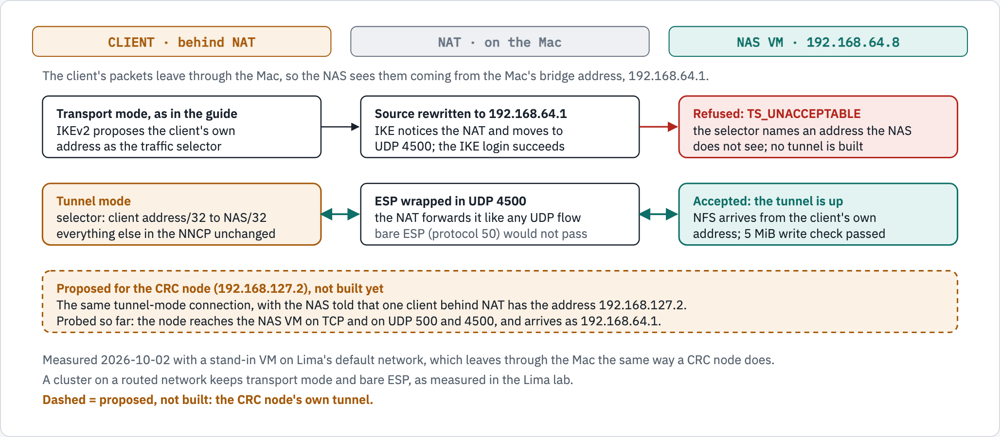
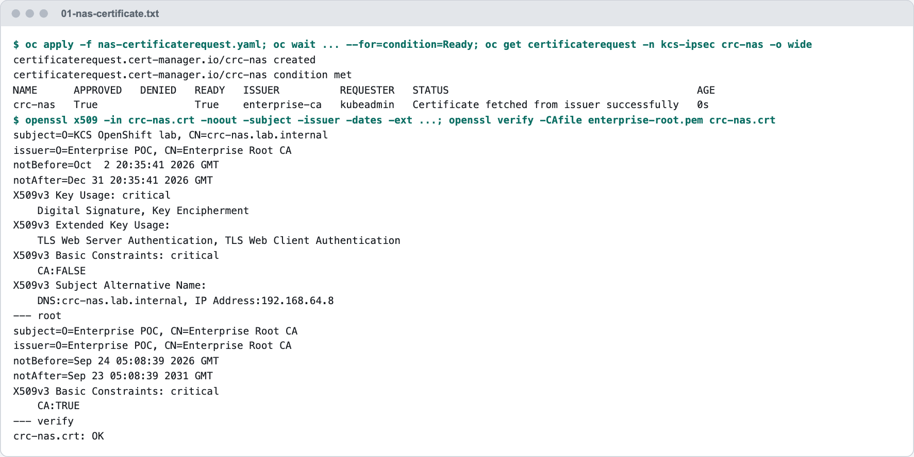
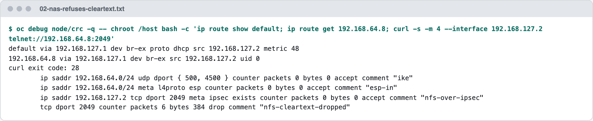
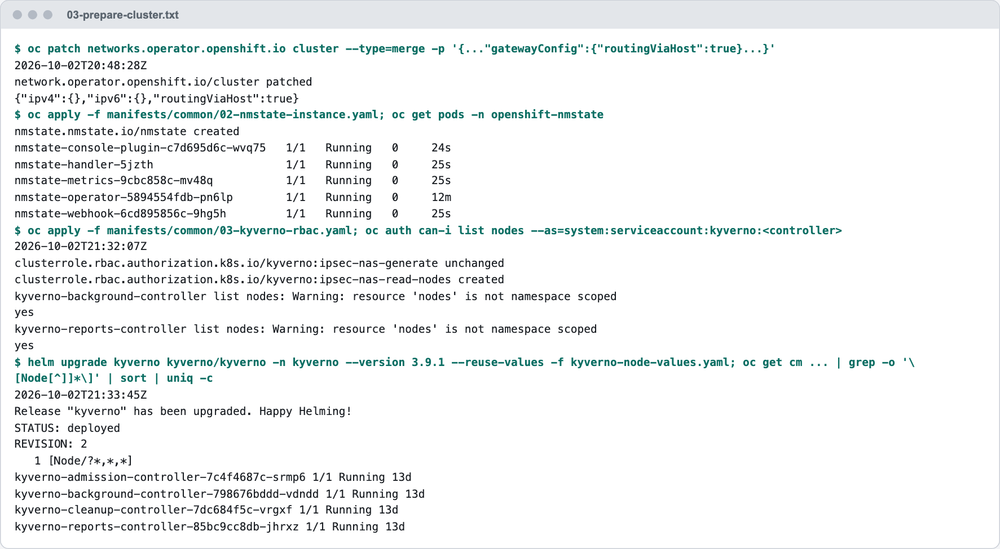
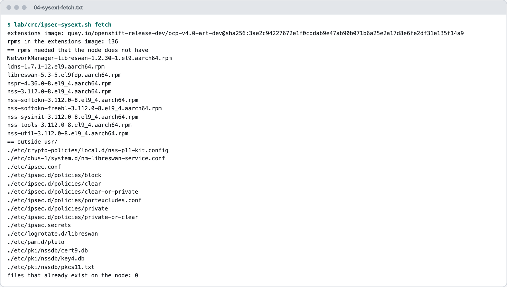
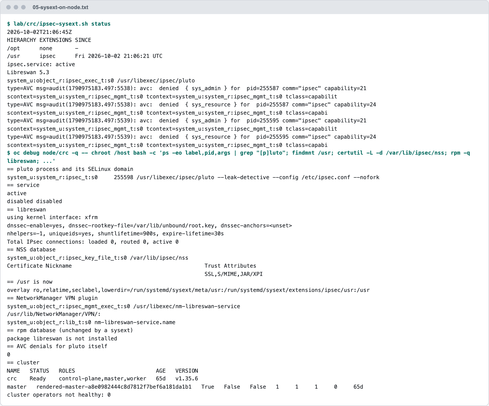
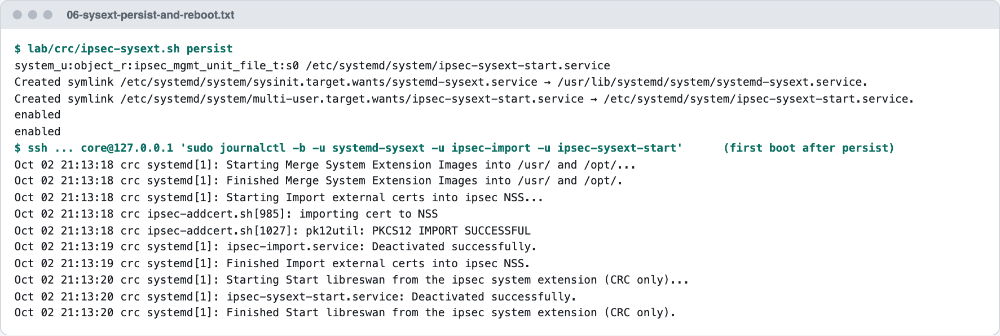
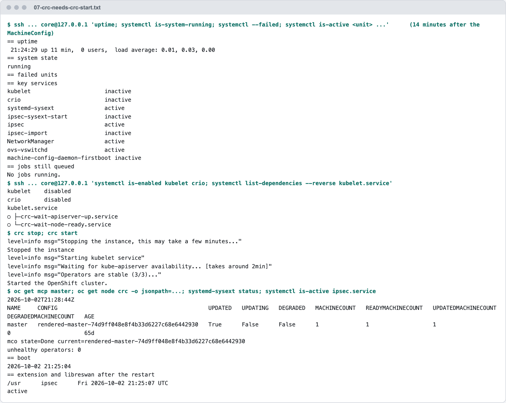
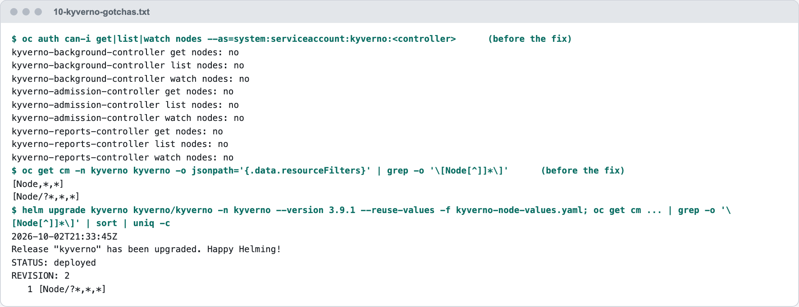

# The Lab — OpenShift Local (CRC) and a NAS on the Same Mac

**Team:** KCS OpenShift  **Audience:** platform engineers, including new ones  **Purpose:** run every setup option end to end on a laptop, against a NAS that refuses NFS unless it arrives through IPsec

This lab connects **OpenShift Local (CRC)** on a Mac to a NAS VM on the same Mac, and is where every measurement in these docs was taken. This doc covers what the lab is, how it differs from a production cluster, how it was built (Parts A to E), and how to test with an application. The certificate options were then installed on it, measured and removed; their runs are in their own docs:

| Part | What | Where |
|---|---|---|
| A to E | The path, NAT, the NAS certificate, cluster preparation, libreswan on the CRC node | This doc |
| F, G | Option A installed, measured, costed and removed | [10-option-a-shared-certificate.md](10-option-a-shared-certificate.md#measured-on-openshift-local-crc) |
| H | Option B by hand: certificate, DaemonSet, NNCP, tunnel, demo application, metrics; a node deleted, a restart | [20-option-b-per-node-certificates.md](20-option-b-per-node-certificates.md#measured-on-openshift-local-crc) |
| I | Option B as a Helm chart, with Helm and with Argo CD from Git; removal; the switch to Kyverno's CEL policies | [30-option-b-automated-helm-argocd.md](30-option-b-automated-helm-argocd.md) |

Steps titled "(cluster preparation, Step x)" are the CRC run of that step in [00-prepare-the-cluster.md](00-prepare-the-cluster.md). Every output shown was measured on 2026-10-02 (UTC times); things that went wrong are in [Gotchas](#gotchas). The Lima lab ([lab/lima-lab.md](lab/lima-lab.md)) adds the cases that need two nodes.


## What stands in for what

A laptop has no enterprise NAS, no storage team and no routed data-centre network. This table lists what plays each role here, and what that changes.

| In production | In this lab | What that changes |
|---|---|---|
| An OpenShift cluster with many worker nodes | OpenShift Local (CRC) 2.63.0, OpenShift 4.22.7, one node named `crc` | The node is in the `master` pool, so MachineConfigs use the role `master`. After a reboot CRC needs `crc stop` and `crc start` (Step E.5) |
| The enterprise NAS, run by the storage team | A Lima VM, `crc-nas` (CentOS Stream 10, libreswan 5, NFSv4, nftables), built with `lab/rhel/setup-nas.sh` | We configure both sides ourselves. The NAS rules are the ones [00-prepare-the-cluster.md](00-prepare-the-cluster.md#31-nas-configuration-storage-team-not-us) asks the storage team for: certificate login, and NFS refused unless it arrives through IPsec |
| A routed network between the nodes and the NAS | The Mac's NAT: the NAS sees the node as `192.168.64.1` | The tunnel uses **tunnel mode** with ESP in UDP 4500, not the transport mode of a routed network (Part B) |
| A DNS name for every node and for the NAS | No such names: `left: '%defaultroute'` and the NAS IP | Two values in the NNCP differ ([10-option-a-shared-certificate.md](10-option-a-shared-certificate.md#part-f--option-a-the-shared-certificate-installed-and-measured)) |
| The enterprise CA, reached through an existing `ClusterIssuer` (the placeholder `company-issuer-rnd` in the docs) | The `ClusterIssuer` `enterprise-ca` that this CRC already has | None: the same mechanism. No issuer is created |
| The storage team creating the NAS certificate | Us, on the NAS VM; the cluster's CA signs the CSR (Part C) | The private key still never leaves the NAS |
| libreswan installed on the nodes by `ipsecConfig.mode: External` | libreswan merged onto the node as a system extension, from the same RPMs (Part E) | CRC only, and not a supported configuration. See [Gotcha 1](#gotcha-1--ipsecconfigmode-external-cannot-install-libreswan-on-crc) |
| Worker nodes joining and leaving | One node; the Lima lab's two stand-in workers cover the many-node cases | What needs two nodes (duplicate identities on the NAS) is measured in [`lab/lima-lab.md`](lab/lima-lab.md), not here |

## What each part demonstrates

| Part | What it demonstrates | The measurement that shows it |
|---|---|---|
| A | The CRC node can reach a VM on the Mac, and its packets arrive through NAT | The NAS's SSH banner from the node; packets captured arriving from `192.168.64.1` |
| B | Behind NAT, transport mode is refused and tunnel mode works | `TS_UNACCEPTABLE` in the NAS log; then a 5 MiB write counted on a tunnel-mode connection |
| C | The NAS can get its certificate from the cluster's enterprise CA without its key leaving the NAS; the NAS refuses NFS that is not encrypted | `crc-nas.crt: OK`; the NAS's cleartext drop counter (captures 1 and 2) |
| D | The cluster-side preparation needs no reboot, and Kyverno needs two settings before it acts on Nodes | OVN back in 62 seconds; NMState pods `1/1`; Kyverno at Helm revision 2 (capture 3) |
| E | A CRC node can run libreswan from OpenShift's own RPMs, under SELinux, across reboots | `pluto` in `ipsec_t` with no denial; the extension merged again after each boot (captures 4 to 7) |
| F | The shared-certificate procedure works on a real OpenShift node through NMState, and what it costs | NNCP `Available` in 12 seconds; the tunnel on both sides; 5 MiB of NFS counted on it (captures 8 to 13); the cost table in F.8 |
| G | Option A can be taken off a cluster completely | No tunnel, no policy, no MachineConfig, no shared certificate left on the node (capture 14) |
| H | Our standard, Option B, works on a real OpenShift node with no manual step and no reboot; an application stores data on the NAS through it; OpenShift's monitoring sees the tunnel | The NAS logging the node's own identity `CN=crc.crc.testing`; the demo page through the Route; `ipsec_nas_tunnel_up 1` in Observe (captures 15 to 19, screenshot 20) |
| I | The setup can be deployed from Git by Argo CD in the right order; a deleted node is cleaned up; a reboot keeps the certificate; removal leaves nothing behind | Argo CD `Synced` and `Healthy` with 20 objects (screenshots 21a and 21b); the stand-in node test; the same certificate fingerprint before and after a restart; `helm uninstall` leaving no tunnel, key or Secret (captures 22 to 28) |

---

## How CRC differs from a production cluster

| | Production cluster | CRC on this Mac (measured) |
|---|---|---|
| Nodes | Many workers in the `worker` pool | One node, `crc`, with roles `control-plane,master,worker`, in the **`master`** MachineConfigPool. The `worker` pool has 0 machines. |
| Path to the NAS | Routed, no NAT | **Through NAT.** The node's packets leave through the Mac and reach the NAS from `192.168.64.1`. |
| IPsec mode on the tunnel | `transport`, bare ESP | **`tunnel`**, ESP wrapped in UDP 4500. Transport mode is refused behind NAT (Part B). |
| The node's address toward the NAS | `<node>.<NODE_DOMAIN>` resolves to it | `192.168.127.2`. No `crc.<domain>` name resolves to it, so the NNCP uses `left: '%defaultroute'`. The node's other address, `192.168.126.11`, cannot reach the NAS. |
| Enterprise CA issuer | The placeholder `company-issuer-rnd` stands for yours | `enterprise-ca`, a root CA valid to 2031 |
| Installing libreswan on the nodes | `ipsecConfig.mode: External` adds it as an OS extension and reboots each node | **Fails** ([Gotcha 1](#gotcha-1--ipsecconfigmode-external-cannot-install-libreswan-on-crc)). On CRC it is a system extension instead (Part E), and `ipsecConfig.mode` stays `Disabled`. |
| After a reboot of the node | The kubelet starts by itself | The kubelet is disabled; OpenShift stays down until `crc stop` and `crc start` (Step E.5) |
| Kyverno, cert-manager | Installed by the guide | Already installed (Kyverno chart 3.9.1, cert-manager running) |

> [!IMPORTANT]
> Tunnel mode, `%defaultroute` and the system extension are **CRC-only** settings. A production cluster on a routed network keeps transport mode, which the Lima lab measured with bare ESP, and gets libreswan from `ipsecConfig.mode: External`.

---

---

## Part A – Measure the path from the CRC node

### Step A.1 – Create the NAS VM for CRC

The lab's `lab-nas` sits on a network CRC cannot reach. This VM gets a second network, `vzNAT`, which puts it on the Mac's own bridge (`192.168.64.0/24`). The lab VMs are not touched.

```bash
limactl create --name=crc-nas --tty=false lab/lima/stream10-vznat.yaml
limactl start crc-nas --tty=false
limactl shell crc-nas ip -4 -br addr

NAS_IP="$(limactl shell crc-nas ip -4 -br addr | awk '$3 ~ /^192\.168\.64\./ {split($3,a,"/"); print a[1]}')"
echo "NAS_IP=${NAS_IP}"
```

✅ **Expected** (measured): two interfaces, and `NAS_IP` is the `192.168.64.x` one.

```text
eth0             UP             192.168.104.8/24
lima1            UP             192.168.64.8/24
NAS_IP=192.168.64.8
```

### Step A.2 – Check that the CRC node reaches it

`oc debug node` starts a temporary pod on the node and removes it when the command ends.

```bash
oc debug node/crc -q -- chroot /host bash -c "ip route get ${NAS_IP} | head -1; curl -s -m 4 --interface 192.168.127.2 telnet://${NAS_IP}:22 </dev/null | head -c 20; echo"
```

✅ **Expected** (measured): the route leaves through `br-ex` from `192.168.127.2`, and the NAS answers with its SSH banner.

```text
192.168.64.8 via 192.168.127.1 dev br-ex src 192.168.127.2 uid 0
SSH-2.0-OpenSSH_9.9
```

Also measured, with a packet capture on the NAS VM while the node sent one UDP packet to each IKE port: both arrived, **from `192.168.64.1`** with a changed source port. That is the NAT.

```text
IP 192.168.64.1.56670 > 192.168.64.6.ipsec-nat-t: UDP-encap:  [|esp]
IP 192.168.64.1.58166 > 192.168.64.6.isakmp:  [|isakmp]
```

---

## Part B – A tunnel that works through the NAT

<picture>
  <source media="(prefers-color-scheme: dark)" srcset="diagrams/crc-nat/nat-tunnel-mode.dark.png">
  <source media="(prefers-color-scheme: light)" srcset="diagrams/crc-nat/nat-tunnel-mode.light.png">
  
</picture>

*Figure 1. Behind NAT, the NAS refuses a transport-mode tunnel because the client proposes an address the NAS never sees. Tunnel mode works through the same NAT, with ESP wrapped in UDP 4500. Measured first with a stand-in VM, then from the CRC node itself ([10-option-a-shared-certificate.md](10-option-a-shared-certificate.md#part-f--option-a-the-shared-certificate-installed-and-measured)).*

<details>
<summary>The figure as text</summary>

```text
CLIENT (behind NAT)                    NAT (on the Mac)                        NAS VM (192.168.64.8)

Transport mode, as in the guide   -->  source rewritten to 192.168.64.1   -->  REFUSED: TS_UNACCEPTABLE
  IKEv2 proposes the client's own       IKE notices the NAT, moves to           the selector names an address
  address as the traffic selector       UDP 4500; the IKE login succeeds        the NAS does not see

Tunnel mode                       <->  ESP wrapped in UDP 4500            <->  ACCEPTED: the tunnel is up
  selector: client/32 to NAS/32         forwarded like any UDP flow             NFS arrives from the client's
  rest of the NNCP unchanged            (bare ESP would not pass)               own address; write check passed

The CRC node itself (192.168.127.2), measured: NMState built the same tunnel-mode connection; the NAS logged the tunnel
192.168.64.8/32 === 192.168.127.2/32; a 5 MiB NFS write from the node was counted on the tunnel and on the NAS.
```

</details>

### What was measured

A stand-in VM on Lima's default network leaves through the Mac the same way the CRC node does: the NAS saw it as `192.168.64.1`.

**Transport mode, the production setting.** The IKE login succeeded, then every attempt to build the tunnel was refused. From the NAS's log:

```text
"workers"[1] 192.168.64.1 #5: Child SA's Traffic Selector request {TSi=192.168.5.15/32;TSr=192.168.64.7/32} does not match any IKEv2 connection; responding with TS_UNACCEPTABLE
```

The client proposed its own address (`192.168.5.15`). The NAS only knows the peer as `192.168.64.1`, so nothing matches.

**Tunnel mode.** The same client, with `type=tunnel` and the NAS told the client's own address:

```text
"ipsec-nas" #2: initiator established Child SA using #1; IPsec tunnel [192.168.5.15/32===192.168.64.8/32] {ESPinUDP/ESN=>0x2f836478 <0xdf91b36d xfrm=AES_GCM_16_256 NATD=192.168.64.8:4500 ...
tunnel outBytes: before=4796 after=5467548 grew=5462752 (wrote 5242880)
  	proto esp spi 0x2f836478 reqid 16389 mode tunnel
  	encap type espinudp sport 4500 dport 4500 addr 0.0.0.0
PASS: 5 MiB written to /mnt/nas/verify-lima-nat-worker.bin went through the IPsec tunnel
```

On the wire at the NAS there was only UDP 4500 carrying ESP, and the NAS counted the NFS as arriving through IPsec from the client's own address:

```text
IP 192.168.64.1.60824 > 192.168.64.8.ipsec-nat-t: UDP-encap: ESP(spi=0x2f836478,seq=0xef6)
ip saddr 192.168.5.15 tcp dport 2049 meta ipsec exists counter packets 565 bytes 5281240 accept
tcp dport 2049 counter packets 0 bytes 0 drop comment "nfs-cleartext-dropped"
```

### Step B.1 – Rehearse it with a stand-in (optional, changes nothing on CRC)

This repeats the measurement above with the repository's scripts. `192.168.5.15` is the address every VM gets on Lima's default network.

```bash
limactl create --name=nat-worker --vm-type=vz --plain --cpus=2 --memory=2 --disk=10 --tty=false template:centos-stream-10
limactl start nat-worker --tty=false
for vm in crc-nas nat-worker; do limactl copy -r lab "${vm}:/tmp/lab"; done

# throwaway certificates, made on the NAS VM
limactl shell crc-nas sudo dnf -y -q install openssl
limactl shell crc-nas /tmp/lab/pki/make-test-pki.sh /tmp/pki crc-nas.lab.internal nat-worker.lab.internal
limactl shell crc-nas sudo install -D -m 0644 -t /root/ipsec-pki /tmp/pki/ca.pem /tmp/pki/nas.p12
limactl copy crc-nas:/tmp/pki/ca.pem nat-worker:/tmp/ca.pem
limactl copy crc-nas:/tmp/pki/nat-worker.lab.internal.p12 nat-worker:/tmp/left_server.p12
limactl shell nat-worker sudo install -D -m 0644 -t /root/ipsec-pki /tmp/ca.pem /tmp/left_server.p12

# the NAS: IKE arrives from the Mac's bridge network; ONE client behind NAT has the address 192.168.5.15
limactl shell crc-nas sudo WORKER_SUBNET=192.168.64.0/24 NAS_LEFT="${NAS_IP}" NAT_CLIENT=192.168.5.15 bash /tmp/lab/rhel/setup-nas.sh

# the stand-in: no shared DNS on this path, so the two names go in /etc/hosts
limactl shell nat-worker sudo bash -c "echo '${NAS_IP} crc-nas.lab.internal' >> /etc/hosts; echo '192.168.5.15 nat-worker.lab.internal' >> /etc/hosts"
limactl shell nat-worker sudo WORKER_FQDN=nat-worker.lab.internal NAS_FQDN=crc-nas.lab.internal NAS_IP="${NAS_IP}" IPSEC_TYPE=tunnel bash /tmp/lab/rhel/setup-worker.sh
limactl shell nat-worker sudo bash /tmp/lab/rhel/verify-worker.sh
```

✅ **Expected** (measured): `Worker ready: ...`, then `mode tunnel`, `encap type espinudp sport 4500 dport 4500` and a `PASS` line.

What the two script switches do:

| Switch | Script | Effect |
|---|---|---|
| `NAT_CLIENT=<address>` | `setup-nas.sh` | Builds the NAS connection in tunnel mode for that one client, and accepts and exports NFS to that address. `NAS_LEFT` must be the NAS IP. |
| `IPSEC_TYPE=tunnel` | `setup-worker.sh` | Uses `type=tunnel` in the stand-in's connection. Default `transport`. |

Delete the stand-in when done: `limactl stop nat-worker && limactl delete nat-worker`.

---

## Part C – The NAS side for CRC

In production the storage team owns the NAS certificate ([00-prepare-the-cluster.md, 3.1](00-prepare-the-cluster.md#31-nas-configuration-storage-team-not-us)). On a laptop we play both roles, and we keep the same rule: **the NAS private key is made on the NAS and never leaves it.** Only the CSR (a public file) goes to the cluster, where the existing enterprise CA issuer signs it through a cert-manager `CertificateRequest`. No issuer is created.

On the cluster this part creates one namespace and one `CertificateRequest`. It does not touch the cluster's network.

### Step C.1 – Create the key and the CSR on the NAS

```bash
limactl shell crc-nas sudo NAS_IP="${NAS_IP}" bash -c '
set -euo pipefail
umask 077
mkdir -p /root/ipsec-pki-crc && cd /root/ipsec-pki-crc
openssl req -new -newkey rsa:3072 -nodes -keyout nas.key -out nas.csr \
  -subj "/O=KCS OpenShift lab/CN=crc-nas.lab.internal" \
  -addext "subjectAltName=DNS:crc-nas.lab.internal,IP:${NAS_IP}" 2>/dev/null
openssl req -in nas.csr -noout -verify -subject
openssl req -in nas.csr -noout -text | grep -A1 "Subject Alternative Name"
install -m 0644 nas.csr /tmp/crc-nas.csr
'
limactl copy crc-nas:/tmp/crc-nas.csr crc-nas.csr
```

✅ **Expected** (measured):

```text
Certificate request self-signature verify OK
subject=O=KCS OpenShift lab, CN=crc-nas.lab.internal
                X509v3 Subject Alternative Name:
                    DNS:crc-nas.lab.internal, IP Address:192.168.64.8
```

The repository's `.gitignore` already excludes `*.csr`, `*.crt` and `*.pem`, so the files this part leaves in your working directory cannot be committed by accident.

### Step C.2 – Have the cluster's enterprise CA sign it

The namespace is the one Option B creates in [Step B.2](20-option-b-per-node-certificates.md#step-b2--create-the-namespace). `duration: 2160h` asks for 90 days.

```bash
oc apply -f manifests/option-b-per-node-certs/20-namespace.yaml

cat <<EOF > nas-certificaterequest.yaml
apiVersion: cert-manager.io/v1
kind: CertificateRequest
metadata:
  name: crc-nas
  namespace: kcs-ipsec
spec:
  request: $(base64 < crc-nas.csr | tr -d '\n')
  duration: 2160h
  isCA: false
  usages:
  - digital signature
  - key encipherment
  - server auth
  - client auth
  issuerRef:
    group: cert-manager.io
    kind: ClusterIssuer
    name: enterprise-ca
EOF

oc apply -f nas-certificaterequest.yaml
oc wait -n kcs-ipsec certificaterequest/crc-nas --for=condition=Ready --timeout=60s
oc get certificaterequest -n kcs-ipsec crc-nas -o wide
```

✅ **Expected** (measured):

```text
namespace/kcs-ipsec created
certificaterequest.cert-manager.io/crc-nas created
certificaterequest.cert-manager.io/crc-nas condition met
NAME      APPROVED   DENIED   READY   ISSUER          REQUESTER   STATUS                                         AGE
crc-nas   True                True    enterprise-ca   kubeadmin   Certificate fetched from issuer successfully   0s
```

### Step C.3 – Fetch the certificate and check it

The signed certificate and the CA's own certificate are both in the request's status. Neither is secret.

```bash
oc get certificaterequest -n kcs-ipsec crc-nas -o jsonpath='{.status.certificate}' | base64 -d > crc-nas.crt
oc get certificaterequest -n kcs-ipsec crc-nas -o jsonpath='{.status.ca}' | base64 -d > enterprise-root.pem

openssl x509 -in crc-nas.crt -noout -subject -issuer -dates -ext subjectAltName,keyUsage,extendedKeyUsage,basicConstraints
openssl verify -CAfile enterprise-root.pem crc-nas.crt
```

✅ **Expected** (measured):

<details>
<summary>The measured output as text</summary>

```text
subject=O=KCS OpenShift lab, CN=crc-nas.lab.internal
issuer=O=Enterprise POC, CN=Enterprise Root CA
notBefore=Oct  2 20:35:41 2026 GMT
notAfter=Dec 31 20:35:41 2026 GMT
X509v3 Key Usage: critical
    Digital Signature, Key Encipherment
X509v3 Extended Key Usage:
    TLS Web Server Authentication, TLS Web Client Authentication
X509v3 Basic Constraints: critical
    CA:FALSE
X509v3 Subject Alternative Name:
    DNS:crc-nas.lab.internal, IP Address:192.168.64.8
crc-nas.crt: OK
```

</details>

<picture>
  <source media="(prefers-color-scheme: dark)" srcset="images/crc/01-nas-certificate.dark.png">
  <source media="(prefers-color-scheme: light)" srcset="images/crc/01-nas-certificate.light.png">
  
</picture>

*Capture 1. The NAS certificate, signed by the cluster's enterprise CA. Text: [`evidence/crc/01-nas-certificate.txt`](evidence/crc/01-nas-certificate.txt).*

> [!NOTE]
> A `CertificateRequest` is signed once and is not renewed. Before `notAfter`, repeat Steps C.1 to C.4 with a new request name.

### Step C.4 – Install it on the NAS and configure the NAS for the CRC node

First bundle the certificate with the key that stayed on the NAS:

```bash
limactl copy crc-nas.crt crc-nas:/tmp/crc-nas.crt
limactl copy enterprise-root.pem crc-nas:/tmp/enterprise-root.pem
limactl shell crc-nas sudo bash -c '
set -euo pipefail
cd /root/ipsec-pki-crc
install -m 0644 /tmp/enterprise-root.pem ca.pem
install -m 0644 /tmp/crc-nas.crt nas.crt
# the certificate must belong to the key that never left this host
[[ "$(openssl x509 -in nas.crt -noout -pubkey | sha256sum)" == "$(openssl pkey -in nas.key -pubout | sha256sum)" ]] && echo "certificate matches the private key"
openssl verify -CAfile ca.pem nas.crt
openssl pkcs12 -export -in nas.crt -inkey nas.key -name nas -out nas.p12 -passout pass:
chmod 0600 nas.p12
'
```

✅ **Expected** (measured): `certificate matches the private key`, then `nas.crt: OK`.

Then configure the NAS. The two `certutil` lines are only needed if you ran the rehearsal in Step B.1: they remove its throwaway certificates, which use the same nicknames. `NAT_CLIENT` is now the CRC node's own address.

```bash
limactl copy -r lab crc-nas:/tmp/lab
limactl shell crc-nas sudo bash -c '
set -euo pipefail
systemctl stop ipsec
certutil -F -n nas -d /var/lib/ipsec/nss     # rehearsal certificate and its key
certutil -D -n CA  -d /var/lib/ipsec/nss     # rehearsal CA
PKI_DIR=/root/ipsec-pki-crc WORKER_SUBNET=192.168.64.0/24 NAS_LEFT=192.168.64.8 NAT_CLIENT=192.168.127.2 bash /tmp/lab/rhel/setup-nas.sh
certutil -L -n nas -d /var/lib/ipsec/nss | grep -E "Subject:|Issuer:|Not After"
'
```

✅ **Expected** (measured, shortened): the connection is loaded with the NAS's new identity and the CRC node's address, NFS is exported to that one address, and the certificate in the NSS database is the one from the enterprise CA.

```text
"workers": 192.168.64.8[O=KCS OpenShift lab, CN=crc-nas.lab.internal]...%any[%fromcert]===192.168.127.2/32; unrouted; my_ip=unset; their_ip=unset;
		ip saddr 192.168.127.2 tcp dport 2049 meta ipsec exists counter packets 0 bytes 0 accept comment "nfs-over-ipsec"
		tcp dport 2049 counter packets 0 bytes 0 drop comment "nfs-cleartext-dropped"
/export       	192.168.127.2(sync,wdelay,hide,no_subtree_check,sec=sys,rw,secure,root_squash,no_all_squash)
NAS ready: lima-crc-nas exports /export to 192.168.127.2, IPsec only.
        Issuer: "CN=Enterprise Root CA,O=Enterprise POC"
            Not After : Thu Dec 31 20:35:41 2026
        Subject: "CN=crc-nas.lab.internal,O=KCS OpenShift lab"
```

### Step C.5 – Confirm the NAS refuses NFS without IPsec

The node has no tunnel yet, so this is NFS in cleartext. It must fail.

```bash
oc debug node/crc -q -- chroot /host bash -c 'ip route show default; curl -s -m 4 --interface 192.168.127.2 telnet://192.168.64.8:2049 </dev/null; echo "curl exit code: $?"'
limactl shell crc-nas sudo nft list table inet nas_ipsec_only | grep counter
```

✅ **Expected** (measured): `curl` gives up after 4 seconds (exit code 28 is a timeout), and the NAS counted the packets on its drop rule.

<details>
<summary>The measured output as text</summary>

```text
default via 192.168.127.1 dev br-ex proto dhcp src 192.168.127.2 metric 48
curl exit code: 28
		ip saddr 192.168.64.0/24 udp dport { 500, 4500 } counter packets 0 bytes 0 accept comment "ike"
		ip saddr 192.168.64.0/24 meta l4proto esp counter packets 0 bytes 0 accept comment "esp-in"
		ip saddr 192.168.127.2 tcp dport 2049 meta ipsec exists counter packets 0 bytes 0 accept comment "nfs-over-ipsec"
		tcp dport 2049 counter packets 6 bytes 384 drop comment "nfs-cleartext-dropped"
```

</details>

<picture>
  <source media="(prefers-color-scheme: dark)" srcset="images/crc/02-nas-refuses-cleartext.dark.png">
  <source media="(prefers-color-scheme: light)" srcset="images/crc/02-nas-refuses-cleartext.light.png">
  
</picture>

*Capture 2. NFS without IPsec is refused by the NAS. Text: [`evidence/crc/02-nas-refuses-cleartext.txt`](evidence/crc/02-nas-refuses-cleartext.txt).*

The first line also shows that the node's default route leaves through `br-ex` from `192.168.127.2`. That is the address `left: '%defaultroute'` will pick in the NNCP, and the one the NAS now expects.

---

## Part D – Prepare the CRC cluster

> [!WARNING]
> These steps change cluster-wide settings on CRC. None of the steps in this part reboots the node.

The baseline before any change was recorded on 2026-10-02: OpenShift 4.22.7, all cluster operators healthy, the `master` pool updated, 196 pods, none failing.

### Step D.1 – Enable `routingViaHost` (cluster preparation, Step 1.3)

```bash
oc patch networks.operator.openshift.io cluster --type=merge -p \
'{"spec":{"defaultNetwork":{"ovnKubernetesConfig":{"gatewayConfig":{"routingViaHost":true}}}}}'

oc get networks.operator.openshift.io cluster -o jsonpath='{.spec.defaultNetwork.ovnKubernetesConfig.gatewayConfig}{"\n"}'
oc get pods -n openshift-ovn-kubernetes        # repeat until ovnkube-node shows 8/8
oc get co network                              # AVAILABLE=True, PROGRESSING=False, DEGRADED=False
```

✅ **Expected** (measured). The patch was applied at 20:48:28 UTC. The two OVN pods were replaced, and within 62 seconds of the patch `ovnkube-node` was back to `8/8`. The node did not reboot.

```text
network.operator.openshift.io/cluster patched
{"ipv4":{},"ipv6":{},"routingViaHost":true}

NAME                                     READY   STATUS    RESTARTS   AGE
ovnkube-control-plane-6dc8ffb6bf-v2g66   2/2     Running   0          44s
ovnkube-node-dgn5x                       8/8     Running   0          42s
NAME      VERSION   AVAILABLE   PROGRESSING   DEGRADED   SINCE   MESSAGE
network   4.22.7    True        False         False      65d
```

### Step D.2 – NMState Operator and instance (cluster preparation, Step 1.5)

CRC's `redhat-operators` catalog offers the package in the `stable` channel.

```bash
oc apply -f manifests/common/01-nmstate-operator.yaml
oc get csv -n openshift-nmstate | grep -i -E 'NAME|nmstate'    # wait for PHASE=Succeeded
```

✅ **Expected** (measured, columns shortened):

```text
namespace/openshift-nmstate created
operatorgroup.operators.coreos.com/openshift-nmstate created
subscription.operators.coreos.com/kubernetes-nmstate-operator created

NAME                                              DISPLAY                       VERSION               PHASE
kubernetes-nmstate-operator.4.22.0-202609230131   Kubernetes NMState Operator   4.22.0-202609230131   Succeeded
```

Then the instance, which starts the handler on the node:

```bash
oc apply -f manifests/common/02-nmstate-instance.yaml
oc get pods -n openshift-nmstate
oc get nns
```

✅ **Expected** (measured, 25 seconds after the instance was created): every pod `1/1`, and a `NodeNetworkState` for the node.

```text
nmstate.nmstate.io/nmstate created

nmstate-console-plugin-c7d695d6c-wvq75   1/1   Running   0     24s
nmstate-handler-5jzth                    1/1   Running   0     25s
nmstate-metrics-9cbc858c-mv48q           1/1   Running   0     25s
nmstate-operator-5894554fdb-pn6lp        1/1   Running   0     12m
nmstate-webhook-6cd895856c-9hg5h         1/1   Running   0     25s

NAME   AGE
crc    3s
```

### Step D.3 – Kyverno: permissions, and let it see Nodes (cluster preparation, Steps 1.6.3 and 1.7)

Kyverno itself is already installed on CRC (chart 3.9.1, Kyverno 1.19.1). It needs two things before any policy of Options A and B can work. Both were found the hard way; [Gotchas 3 and 4](#gotchas) show what happens without them.

**Permissions.** Two ClusterRoles: one to create NNCPs and Certificates, one to read Nodes.

```bash
oc apply -f manifests/common/03-kyverno-rbac.yaml

for sa in kyverno-background-controller kyverno-admission-controller; do
  for r in nodenetworkconfigurationpolicies.nmstate.io certificates.cert-manager.io; do
    printf '%s create %s: ' "$sa" "$r"
    oc auth can-i create "$r" --as="system:serviceaccount:kyverno:${sa}" -n kcs-ipsec
  done
done
for sa in kyverno-background-controller kyverno-reports-controller; do
  printf '%s list nodes: ' "$sa"; oc auth can-i list nodes --as="system:serviceaccount:kyverno:${sa}"
done
```

✅ **Expected** (measured): `yes` on every line. The warnings that a resource is not namespace scoped are harmless.

**The Node filter.** Kyverno ignores every Node object unless `[Node,*,*]` is taken out of its `resourceFilters`. The four other policies on this CRC match only Groups and Namespaces, so nothing else changes.

```bash
cat <<'EOF' > kyverno-node-values.yaml
config:
  resourceFiltersExclude:
  - '[Node,*,*]'
EOF
helm upgrade kyverno kyverno/kyverno -n kyverno --version 3.9.1 --reuse-values -f kyverno-node-values.yaml
oc get cm -n kyverno kyverno -o jsonpath='{.data.resourceFilters}' | grep -o '\[Node[^]]*\]' | sort | uniq -c
```

✅ **Expected** (measured): the release moves to revision 2 and only `[Node/?*,*,*]` is left. The Kyverno pods are not restarted; they read the new configuration by themselves.

<picture>
  <source media="(prefers-color-scheme: dark)" srcset="images/crc/03-prepare-cluster.dark.png">
  <source media="(prefers-color-scheme: light)" srcset="images/crc/03-prepare-cluster.light.png">
  
</picture>

*Capture 3. Part D on CRC: `routingViaHost`, NMState, the two Kyverno ClusterRoles, and the Kyverno release after the Node filter was removed. Text: [`evidence/crc/03-prepare-cluster.txt`](evidence/crc/03-prepare-cluster.txt).*

### Step D.4 – IPsec mode: leave it `Disabled` on CRC

On a production cluster the next step is `ipsecConfig.mode: External` (cluster preparation, Step 1.4), which installs libreswan on every node. **Do not run that on CRC.** It was tried, it failed, and it was undone; [Gotcha 1](#gotcha-1--ipsecconfigmode-external-cannot-install-libreswan-on-crc) has the evidence. On CRC, libreswan gets onto the node in Part E instead.

```bash
oc get networks.operator.openshift.io cluster -o jsonpath='{.spec.defaultNetwork.ovnKubernetesConfig.ipsecConfig}{"\n"}'
```

✅ **Expected:** `{"mode":"Disabled"}`.

---

## Part E – libreswan on the CRC node (CRC only)

**Why this part exists.** Everything from the NNCP onward needs libreswan on the node: NMState creates the tunnel through `NetworkManager-libreswan`, and the certificate import needs `certutil` and the NSS database. CRC does not have libreswan, and CRC cannot install it the supported way ([Gotcha 1](#gotcha-1--ipsecconfigmode-external-cannot-install-libreswan-on-crc)). To go on testing on a laptop, libreswan has to reach the node some other way.

Four ways were considered:

| Option | What it means | Decision |
|---|---|---|
| libreswan in a pod | A privileged, host-network DaemonSet runs libreswan. No change to the node's operating system | Not chosen: NMState could not create the tunnel, so the guide's NNCP and cert-sync steps would stay untested |
| **System extension (`systemd-sysext`)** | Merge the libreswan files from OpenShift's own extension RPMs into `/usr`, without `rpm-ostree` | **Chosen**: the node ends up with the same files in the same places as a real install, so the guide's own manifests can run |
| Remove the three layered packages | Uninstall them, reboot, retry `External` mode | Not chosen: three processes on the node were running under x86 emulation, so workloads would stop |
| Stop on CRC | Verify the rest on a full cluster later | Not chosen |

How it works: take the libreswan files from OpenShift's **own** extensions image and merge them into `/usr` with `systemd-sysext`, which the node already has (systemd 252). `rpm-ostree` and the packages CRC layers are left alone. `lab/crc/ipsec-sysext.sh` does it in separate steps. It runs on the Mac and needs no `sudo`: everything goes through `oc debug node`, so it needs a cluster-admin login.

| Step | What it does on the node |
|---|---|
| `fetch` | Copies the RPMs out of the extensions image into `/var/tmp/ipsec-sysext`, works out which ones are needed, and unpacks them there |
| `stage` | Builds `/var/lib/extensions/ipsec` with SELinux labels, and copies libreswan's configuration files into `/etc` |
| `activate` | Merges the extension into `/usr` and starts `ipsec.service` |
| `persist` | Enables the merge at boot, and a small unit that starts libreswan after it |
| `status` | Shows what is merged and whether libreswan answers |
| `remove` | Stops libreswan, unmerges, and deletes what the other steps created. **Not run yet** |

> [!WARNING]
> This changes the node's operating system by hand. It is for a CRC laptop cluster only. A production cluster gets libreswan from `ipsecConfig.mode: External` (cluster preparation, Step 1.4), which is supported; this is not.

### Step E.1 – `fetch`

```bash
lab/crc/ipsec-sysext.sh fetch
```

✅ **Expected** (measured): the extensions image holds 136 RPMs. libreswan and `NetworkManager-libreswan` need eight more of them, because the node has no NSS libraries. Nothing is unresolved, and none of the unpacked files already exists on the node.

<picture>
  <source media="(prefers-color-scheme: dark)" srcset="images/crc/04-sysext-fetch.dark.png">
  <source media="(prefers-color-scheme: light)" srcset="images/crc/04-sysext-fetch.light.png">
  
</picture>

*Capture 4. `fetch`: ten RPMs are needed, and no file clashes with the node. Text: [`evidence/crc/04-sysext-fetch.txt`](evidence/crc/04-sysext-fetch.txt).*

The files outside `usr/` are why `stage` also writes to `/etc`: a system extension can only add to `/usr`.

### Step E.2 – `stage` and `activate`

```bash
lab/crc/ipsec-sysext.sh stage
lab/crc/ipsec-sysext.sh activate
```

✅ **Expected** (measured, `activate` at 21:06:21 UTC): the extension shows under `/usr`, and libreswan answers.

```text
== 1. merge the extension into /usr
HIERARCHY EXTENSIONS SINCE
/opt      none       -
/usr      ipsec      Fri 2026-10-02 21:06:21 UTC
Libreswan 5.3
== 2. what the RPM scriptlets would have done
== 3. start libreswan (not enabled: a reboot undoes all of this)
active
using kernel interface: xfrm
```

### Step E.3 – Check what is on the node

The node runs SELinux in `Enforcing` mode, so the question was whether libreswan would start in its own SELinux domain from files that live under `/var/lib/extensions`. `stage` labels that directory as if it were `/`, and it does:

```bash
lab/crc/ipsec-sysext.sh status
oc debug node/crc -q -- chroot /host bash -c '
ps -eo label,pid,args | grep "[p]luto"
findmnt -no FSTYPE,OPTIONS /usr | cut -c1-160
ls -Zd /var/lib/ipsec/nss; certutil -L -d /var/lib/ipsec/nss
ipsec status | grep -E "using kernel|Total IPsec connections"
rpm -q libreswan
ausearch -m avc -ts recent | grep -c "comm=\"pluto\""'
oc get nodes; oc get mcp master
```

<picture>
  <source media="(prefers-color-scheme: dark)" srcset="images/crc/05-sysext-on-node.dark.png">
  <source media="(prefers-color-scheme: light)" srcset="images/crc/05-sysext-on-node.light.png">
  
</picture>

*Capture 5. libreswan on the node as a system extension. Text: [`evidence/crc/05-sysext-on-node.txt`](evidence/crc/05-sysext-on-node.txt).*

What this shows:

- `pluto` runs in the `ipsec_t` domain, and SELinux logged no denial for it.
- `/usr` is now a read-only overlay with the extension on top of the original `/usr`.
- The NSS database exists and is empty. Certificates go in later, exactly as on a production node.
- `rpm -q libreswan` still says **not installed**: a system extension adds files, not RPM database entries. `rpm-ostree` is untouched, so the machine-config-daemon sees no change (pool `UPDATED=True`).
- SELinux did log denials for the `ipsec` helper script (`ipsec_mgmt_t` asking for the `sys_admin` and `sys_resource` capabilities). They did not stop the service.

### Step E.4 – `persist`

Without this, a reboot of the node undoes the merge. systemd reads its unit files before the extension is merged, so at boot it does not know `ipsec.service` yet; `persist` adds a unit that reloads systemd after the merge and then starts libreswan.

```bash
lab/crc/ipsec-sysext.sh persist
```

✅ **Expected** (measured): two units enabled. The second half of the capture is the journal of the first boot afterwards (the reboot of Step F.4): the extension is merged, then the certificate import runs, then libreswan starts.

<picture>
  <source media="(prefers-color-scheme: dark)" srcset="images/crc/06-sysext-persist-and-reboot.dark.png">
  <source media="(prefers-color-scheme: light)" srcset="images/crc/06-sysext-persist-and-reboot.light.png">
  
</picture>

*Capture 6. `persist`, and the next boot. Text: [`evidence/crc/06-sysext-persist-and-reboot.txt`](evidence/crc/06-sysext-persist-and-reboot.txt).*

### Step E.5 – After every reboot of the node: `crc stop`, `crc start`

A reboot that OpenShift triggers from inside (every MachineConfig change does) leaves the cluster **down** on CRC. The node boots, libreswan starts, and then nothing starts the kubelet: on CRC the kubelet is **disabled on purpose**, and `crc start` is what starts it, after its own checks. Do **not** enable the kubelet by hand; restart CRC with its own tool.

> [!IMPORTANT]
> On CRC, after **every** step that reboots the node (applying or deleting a MachineConfig): wait until the API stops answering, give the node about three minutes to boot, then run `crc stop` and `crc start`. A production cluster needs none of this: its kubelet starts at boot.

```bash
crc stop
crc start
oc get nodes; oc get mcp master
```

`crc stop` also removes the `crc-admin` context from your kubeconfig; `oc` says `current-context is not set` until `crc start` has finished and put it back.

✅ **Expected** (measured at the reboot of Step F.4: stop at 21:24:59, start finished at 21:28:30, about three and a half minutes). The first half of the capture is what the node looked like before the restart, 14 minutes after the MachineConfig: running, no failed units, libreswan active, kubelet and crio inactive and disabled.

<picture>
  <source media="(prefers-color-scheme: dark)" srcset="images/crc/07-crc-needs-crc-start.dark.png">
  <source media="(prefers-color-scheme: light)" srcset="images/crc/07-crc-needs-crc-start.light.png">
  
</picture>

*Capture 7. Why CRC needs `crc stop` and `crc start` after a reboot, and the cluster after it. Text: [`evidence/crc/07-crc-needs-crc-start.txt`](evidence/crc/07-crc-needs-crc-start.txt).*

---

---

## Test with an application

The proof that matters is an application storing data on the NAS through the tunnel, on a NAS that refuses NFS in cleartext (Step C.5).

- **The demo application** ([`manifests/demo-app/`](../manifests/demo-app/)): a PersistentVolume for the NAS export, a claim, a pod that appends a line every 10 seconds, and a Route to a page that shows the file. Its run on CRC, with the NAS counting the traffic on the tunnel and a browser screenshot of the page, is [Step H.6 of 20-option-b-per-node-certificates.md](20-option-b-per-node-certificates.md#step-h6--an-application-that-stores-its-data-on-the-nas).
- **Using the NAS from any application**, with a static PV or with the NFS CSI driver: [lab/nas-consumer-app.md](lab/nas-consumer-app.md).
- **What the lab measured with it:** writes kept going through a certificate renewal and through the switch to Kyverno's CEL policies, and paused for 75 seconds while Option B was removed and installed again ([30-option-b-automated-helm-argocd.md](30-option-b-automated-helm-argocd.md#kyverno-policies-cel-or-legacy)).

---

## Gotchas

Things that went wrong while these docs were built, in the order they were met. The steps above already avoid them; this section is the record of what happens if you do not, and it includes the mistakes made along the way.

| # | Gotcha | Kind | Written up in |
|---|---|---|---|
| 1 | `ipsecConfig.mode: External` cannot install libreswan on CRC | CRC limit | [below](#gotcha-1--ipsecconfigmode-external-cannot-install-libreswan-on-crc) |
| 2 | A MachineConfig reboot leaves OpenShift down on CRC | CRC behaviour | [below](#gotcha-2--a-machineconfig-reboot-leaves-openshift-down-on-crc) |
| 3 | Kyverno may not read Nodes | Gap in this repository, fixed | [below](#gotcha-3--kyverno-may-not-read-nodes) |
| 4 | Kyverno ignores Nodes by default | Gap in this repository, fixed | [below](#gotcha-4--kyverno-ignores-nodes-by-default) |
| 5 | `ipsec-sysext.sh activate` ended with an error although it had worked | Mistake in the script, fixed | [below](#gotcha-5--ipsec-sysextsh-activate-ended-with-an-error-although-it-had-worked) |
| 6 | The first wait for the NMState Operator said "done" too early | Mistake in a one-off command | [below](#gotcha-6--the-first-wait-for-the-nmstate-operator-said-done-too-early) |
| 7 | On a real node libreswan names the connection by UUID | Difference from the lab; the collector is fixed | [below](#gotcha-7--on-a-real-node-libreswan-names-the-connection-by-uuid) |
| 8 | The Butane download in Step A.1 is a Linux binary | Gap in the docs, fixed | [10-option-a-shared-certificate.md](10-option-a-shared-certificate.md#gotcha-8--the-butane-download-in-step-a1-is-a-linux-binary) |
| 9 | A command kept in a shell variable does nothing in zsh | Mistake in one-off commands | [below](#gotcha-9--a-command-kept-in-a-shell-variable-does-nothing-in-zsh) |
| 10 | Helm creates the DaemonSet before the Kyverno policies | Helm behaviour; the pods now correct themselves | [30-option-b-automated-helm-argocd.md](30-option-b-automated-helm-argocd.md#gotcha-10--helm-creates-the-daemonset-before-the-kyverno-policies) |
| 11 | Removing the setup leaves the certificate and key on the node | Gap in this repository, fixed | [20-option-b-per-node-certificates.md](20-option-b-per-node-certificates.md#gotcha-11--removing-the-setup-leaves-the-certificate-and-key-on-the-node) |
| 12 | The uninstall hook removed everything except the tunnel, twice | Mistakes in the script, fixed | [30-option-b-automated-helm-argocd.md](30-option-b-automated-helm-argocd.md#gotcha-12--the-uninstall-hook-removed-everything-except-the-tunnel-twice) |
| 13 | Argo CD 3.4.7 runs no cleanup hook when an Application is deleted | Limit of this Argo CD version | [30-option-b-automated-helm-argocd.md](30-option-b-automated-helm-argocd.md#gotcha-13--argo-cd-347-runs-no-cleanup-hook-when-an-application-is-deleted) |
| 14 | A legacy generate rule refuses a changed node selection | Kyverno behaviour | [30-option-b-automated-helm-argocd.md](30-option-b-automated-helm-argocd.md#gotcha-14--a-legacy-generate-rule-refuses-a-changed-node-selection) |
| 15 | An objectSelector hides a Node from Kyverno once it stops matching | Mistake in the first CEL policies, fixed | [30-option-b-automated-helm-argocd.md](30-option-b-automated-helm-argocd.md#gotcha-15--an-objectselector-hides-a-node-from-kyverno-once-it-stops-matching) |
| 16 | In a namespaced policy, `resource.List` takes two arguments | Wrong conclusion, retracted and fixed | [30-option-b-automated-helm-argocd.md](30-option-b-automated-helm-argocd.md#gotcha-16--in-a-namespaced-policy-resourcelist-takes-two-arguments) |

### Gotcha 1 – `ipsecConfig.mode: External` cannot install libreswan on CRC

> [!CAUTION]
> **Do not run this on CRC.** It was run here to find out, it failed, and it was undone. It is recorded so that nobody has to repeat it. It is **not** part of the steps.

What was run, at 20:50:14 UTC, exactly as [Step 1.4](00-prepare-the-cluster.md#step-14--enable-ipsec-in-external-mode) says:

```bash
oc patch networks.operator.openshift.io cluster --type=merge -p \
'{"spec":{"defaultNetwork":{"ovnKubernetesConfig":{"ipsecConfig":{"mode":"External"}}}}}'
```

The Cluster Network Operator created `80-ipsec-master-extensions` and `80-ipsec-worker-extensions`, as on any cluster. The first asks for the `ipsec` extension and enables `ipsecenabler.service`. The node then tried to install the extension and could not. Within 55 seconds of the patch the `master` pool was degraded, and the `network` cluster operator went `DEGRADED=True` with `master machine config pool in degraded state`. The node **did not reboot** and stayed `Ready`.

<picture>
  <source media="(prefers-color-scheme: dark)" srcset="images/crc/gotcha-external-mode-fails.dark.png">
  <source media="(prefers-color-scheme: light)" srcset="images/crc/gotcha-external-mode-fails.light.png">
  
</picture>

*Capture G1. `External` mode on CRC: the failure, its cause, and the undo. Text: [`evidence/crc/gotcha-external-mode-fails.txt`](evidence/crc/gotcha-external-mode-fails.txt).*

#### Why it fails

The error is `Packages not found: cloud-init, gvisor-tap-vsock-gvforwarder, qemu-user-static-x86`. Those three are not libreswan's packages. They are packages the CRC image already has installed on top of the base operating system: `rpm-ostree status` lists exactly those three as `LayeredPackages`, and `/etc/yum.repos.d/` is empty. The machine-config-daemon's log shows the only repository in use during the install, `coreos-extensions` (136 packages), and that the install is retried about once a minute.

So: to add libreswan, `rpm-ostree` must also find the three packages that are already layered, and the only repository it is given does not contain them.

Removing the three packages from the node was **not tried**. They come with the CRC image: `cloud-init`, the gvisor-tap-vsock forwarder (not running on this Mac: `gv-user-network@tap0.service` is inactive) and x86 emulation, which is registered on the node (`qemu-x86_64` in `/proc/sys/fs/binfmt_misc/`) and in use: three processes on the node were running under `qemu-x86_64-static` when checked. Removing them changes the node's operating system, needs a reboot, and would stop those workloads.

This was measured on CRC 2.63.0 with the OpenShift 4.22.7 bundle on an Apple Silicon Mac. Other CRC versions were not tested.

#### Is libreswan built into a full OpenShift cluster (4.19 and later)?

No. On a full cluster libreswan is **not part of the node's base image** either. It ships inside the OpenShift release as an **OS extension** named `ipsec`, and the Machine Config Operator installs it on each node when IPsec is switched on. Nothing has to be downloaded from outside the release.

What was checked, and where:

| Version | Evidence | Result |
|---|---|---|
| 4.19, 4.20, 4.21, 4.22 | Machine Config Operator source, `SupportedExtensions()` in [`pkg/controller/common/helpers.go`](https://github.com/openshift/machine-config-operator/blob/release-4.19/pkg/controller/common/helpers.go), read on each `release-4.x` branch | The same line in all four: `"ipsec": {"NetworkManager-libreswan", "libreswan"}` |
| 4.19 | The node image definition, [`extensions-ocp-rhel-9.6.yaml`](https://github.com/openshift/os/blob/release-4.19/extensions-ocp-rhel-9.6.yaml) in `openshift/os` | `ipsec:` lists `libreswan` and `NetworkManager-libreswan` as an extension, not as base packages |
| 4.22.7 | This CRC node, measured | `rpm -q libreswan` on the base image: `package libreswan is not installed`. The extensions image holds 136 RPMs, among them `libreswan-5.3-5.el9fdp` and `NetworkManager-libreswan-1.2.30-1.el9` |

So Step 1.4 is the same on every one of these versions: `ipsecConfig.mode: External` makes the Cluster Network Operator create the `80-ipsec-*-extensions` MachineConfigs, and each node installs the extension and reboots once. The reference is Red Hat's [Configuring IPsec encryption](https://docs.redhat.com/en/documentation/openshift_container_platform/4.19/html/network_security/configuring-ipsec-ovn) chapter.

Why that works on a full cluster and not on CRC: the install is the same `rpm-ostree` command, and CRC really did run it. A full cluster's nodes carry no extra layered packages, so there is nothing for `rpm-ostree` to look for besides libreswan itself. The failure here names only the three packages that CRC adds. **This was not run on a full cluster in this work**; it rests on the two source files above and on the cause measured on CRC.

Watch out for one thing when a release moves the nodes to RHEL 10: in the 4.19 branch of `openshift/os`, the RHEL 10.1 extensions file has the `ipsec` entry commented out, with the note `Uncomment once fast-datapath repo exists for RHEL 10`. Before relying on external IPsec on a RHEL 10 based node image, check that the `ipsec` extension is offered:

```bash
oc get mc | grep ipsec                                  # after setting the mode: both 80-ipsec-* MachineConfigs
oc debug node/<node> -q -- chroot /host rpm -q libreswan NetworkManager-libreswan    # after the reboot
```

#### How it was undone

```bash
oc patch networks.operator.openshift.io cluster --type=merge -p \
'{"spec":{"defaultNetwork":{"ovnKubernetesConfig":{"ipsecConfig":{"mode":"Disabled"}}}}}'

oc get mc | grep ipsec      # no output: both MachineConfigs are gone
oc get mcp master
oc get co network machine-config
```

The patch was applied at 20:53:25 UTC. The two MachineConfigs were removed at once, and within 38 seconds the pool and both operators were healthy, with no reboot (bottom of capture G1).

### Gotcha 2 – A MachineConfig reboot leaves OpenShift down on CRC

**What happened.** The first MachineConfig (Step F.4) was applied at 21:10:21 UTC. The node rebooted and was up again at about 21:13. Fourteen minutes after the MachineConfig, the API was still unreachable.

**The mistake.** Waiting for the cluster to come back by itself, as it does on a production cluster.

**The cause.** The VM was fine (`systemctl is-system-running` said `running`, no failed units, libreswan active), but `kubelet` and `crio` were `inactive` and `disabled`. Only CRC's own `crc-wait-*` services depend on the kubelet: CRC starts it itself during `crc start`.

**The fix.** `crc stop`, then `crc start` (Step E.5, capture 7). To look inside the VM while the API is down:

```bash
ssh -i ~/.crc/machines/crc/id_ed25519 -p 2222 core@127.0.0.1 \
  'uptime; systemctl is-system-running; systemctl --failed; systemctl is-active kubelet crio ipsec; systemctl is-enabled kubelet crio'
```

### Gotcha 3 – Kyverno may not read Nodes

**What happened.** The first time the policy of Step F.5 was applied (21:31:18 UTC), it showed `READY=True` and **no NNCP** appeared.

**The cause.** Kyverno's background controller lists the Nodes that a policy matches, and it was not allowed to:

```bash
oc logs -n kyverno deploy/kyverno-background-controller --since=5m | grep -i forbidden
```

```text
ERR ... failed to list matched resource error="nodes is forbidden: User \"system:serviceaccount:kyverno:kyverno-background-controller\" cannot list resource \"nodes\" in API group \"\" at the cluster scope"
```

**The mistake.** The repository's `03-kyverno-rbac.yaml` gave Kyverno the right to create NNCPs and Certificates, and not the right to read the Nodes that trigger them. It had only ever been dry-run, never run with a policy.

**The fix.** A second ClusterRole, `kyverno:ipsec-nas-read-nodes`, now in `manifests/common/03-kyverno-rbac.yaml` and in [Step 1.7](00-prepare-the-cluster.md#step-17--give-kyverno-permission-to-create-nncps-and-certificates) (Step D.3 here).

### Gotcha 4 – Kyverno ignores Nodes by default

**What happened.** With the permission fixed and the policy re-created, there was still no NNCP, and this time **no error either**: Kyverno's log stopped at `policy created`.

**The cause.** Kyverno's own configuration tells it to skip every Node:

```bash
oc get cm -n kyverno kyverno -o jsonpath='{.data.resourceFilters}' | grep -o '\[Node[^]]*\]'
```

<details>
<summary>The measured output as text</summary>

```text
[Node,*,*]
[Node/?*,*,*]
```

</details>

**The fix.** The chart setting `config.resourceFiltersExclude`, now in [Step 1.6.3](00-prepare-the-cluster.md#163-openshift-scc-setting) (Step D.3 here). After it, the policy has to be deleted and applied again, because Kyverno only looks at existing Nodes when a policy is created.

<picture>
  <source media="(prefers-color-scheme: dark)" srcset="images/crc/10-kyverno-gotchas.dark.png">
  <source media="(prefers-color-scheme: light)" srcset="images/crc/10-kyverno-gotchas.light.png">
  
</picture>

*Capture G3. Before the fixes: Kyverno may not read Nodes, and filters them out. After: only the sub-resource filter is left. Text: [`evidence/crc/10-kyverno-gotchas.txt`](evidence/crc/10-kyverno-gotchas.txt).*

> [!IMPORTANT]
> Gotchas 3 and 4 are **not CRC problems**. On any cluster with a default Kyverno install, every policy of Options A and B would be accepted and would do nothing. Both fixes are in [00-prepare-the-cluster.md](00-prepare-the-cluster.md).

### Gotcha 5 – `ipsec-sysext.sh activate` ended with an error although it had worked

**What happened.** The first run of `activate` ended with `error: non-zero exit code from debug container`, right after libreswan had started.

**The mistake.** The script ran `ipsec status | head -5` under `set -o pipefail`. `head` closes the pipe after five lines, `ipsec status` is killed while writing the rest, and `pipefail` turns that into a failure. The last check (`certutil -L`) never ran.

**The fix.** `sed -n "1,5p"` reads the whole input, so nothing is killed. Rule for scripts with `pipefail`: do not end a pipe with `head`.

### Gotcha 6 – The first wait for the NMState Operator said "done" too early

**What happened.** A one-off loop waited for the operator and reported success after 10 seconds, while `oc get pods -n openshift-nmstate` still said `No resources found`.

**The mistake.** The loop read `oc get csv -n openshift-nmstate -o jsonpath='{.items[0].status.phase}'`. OpenShift copies the CSV of every cluster-wide operator into every namespace, so the first item was another operator's CSV, already `Succeeded`.

**The fix.** Select the CSV by name, as Step D.2 does (`grep -i nmstate`), and check the pods as well.

### Gotcha 7 – On a real node libreswan names the connection by UUID

`ipsec trafficstatus` on the CRC node shows the connection as `"c5ccbae6-1377-43d4-8a6b-ae155d137023"`, NetworkManager's UUID, not as `ipsec-nas` (capture 12). In the Lima lab the stand-ins named it `ipsec-nas`, because there the connection is written straight into libreswan's configuration. Anything that looks for the connection by name in `ipsec trafficstatus` has to allow for this. The metrics collector of the standard installation did exactly that, and would have reported the tunnel as down on every real node. It now asks NetworkManager for the connection's UUID first (`manifests/option-b-per-node-certs/25-metrics-scripts.yaml`, tested in `tests/test-metrics-collector.sh` with the line recorded here), and Step H.7 shows it reporting `1`.

### Gotcha 9 – A command kept in a shell variable does nothing in zsh

**What happened.** Three one-off wait commands in this work silently did nothing, the last one while waiting for the node in Step G.3.

**The mistake.** They kept a command with its options in a variable (`SSH="ssh -i ... core@127.0.0.1"`) and ran `$SSH 'uptime'`. The Mac's default shell is zsh, and zsh does not split a variable into words: it looks for one program whose name is the whole string.

**The fix.** Use a function (`crcssh() { ssh -i ... core@127.0.0.1 "$@"; }`) or an array. The scripts in this repository start with `#!/bin/bash` and are not affected.

---

## State of CRC, and how to undo everything

State now: `routingViaHost: true`, `ipsecConfig.mode: Disabled`, the NMState Operator with its instance, both Kyverno ClusterRoles, Kyverno no longer ignoring Nodes (Helm revision 2), libreswan 5.3 as a system extension (persistent), and **Option B installed and running, deployed by Argo CD from Git** (Application `ipsec-nas` in `openshift-gitops`, chart `charts/ipsec-nas`): the policies, the node's certificate, the cert-sync DaemonSet, the NNCP with its tunnel, the ServiceMonitor and alert rules; plus the demo application in `ipsec-nas-demo`.

To undo the rest, in this order:

| What | How | Run for these docs? |
|---|---|---|
| The demo application | `oc delete namespace ipsec-nas-demo; oc delete pv ipsec-nas-demo` | No |
| Option B (the Argo CD application) | The three steps of [Step I.7](30-option-b-automated-helm-argocd.md#step-i7--remove-it-with-argo-cd) | **Yes**, measured (twice: legacy and CEL policies) |
| libreswan on the node | `lab/crc/ipsec-sysext.sh remove` | **No**, not run yet |
| Kyverno's Node filter | `helm rollback kyverno 1 -n kyverno` | No |
| The Kyverno ClusterRoles | `oc delete -f manifests/common/03-kyverno-rbac.yaml` | No |
| NMState | Delete the `NMState` instance, then the operator's subscription and namespace | No |
| `routingViaHost` | The patch of Step D.1 with `false` | No |
| The NAS VM | `limactl stop crc-nas && limactl delete crc-nas` | No |

---

## Diagram and capture sources

The NAT figure (Part B) and the deployment figure ([30-option-b-automated-helm-argocd.md](30-option-b-automated-helm-argocd.md)) are rendered from `source.html` pages by `docs/diagrams/render.py` (see [Diagram sources](00-prepare-the-cluster.md#diagram-sources)):

```bash
python3 docs/diagrams/render.py docs/diagrams/crc-nat/source.html docs/diagrams/crc-nat nat-tunnel-mode
python3 docs/diagrams/render.py docs/diagrams/deploy-flow/source.html docs/diagrams/deploy-flow gitops-deploy-flow
```

The Mermaid text versions are `docs/diagrams/mermaid/nat-tunnel-mode.mmd` and `gitops-deploy-flow.mmd`; they are not what the docs display.

Screenshots 20, 21a and 21b are real browser screenshots. The numbered captures are **not** screenshots of a screen. Each one is the saved output of the commands shown in it, kept as text in `docs/evidence/crc/` and rendered as an image by `docs/images/render-terminal.py`, in a light and a dark version. Lines that start with `$` are the commands; everything else is their output, exactly as saved. Where a file leaves lines out, the step says the output is shortened. To render them again:

```bash
python3 docs/images/render-terminal.py docs/evidence/crc docs/images/crc
```

If a capture and its text file ever differ, the text file is the record: change it only by running the command again, then re-render.
