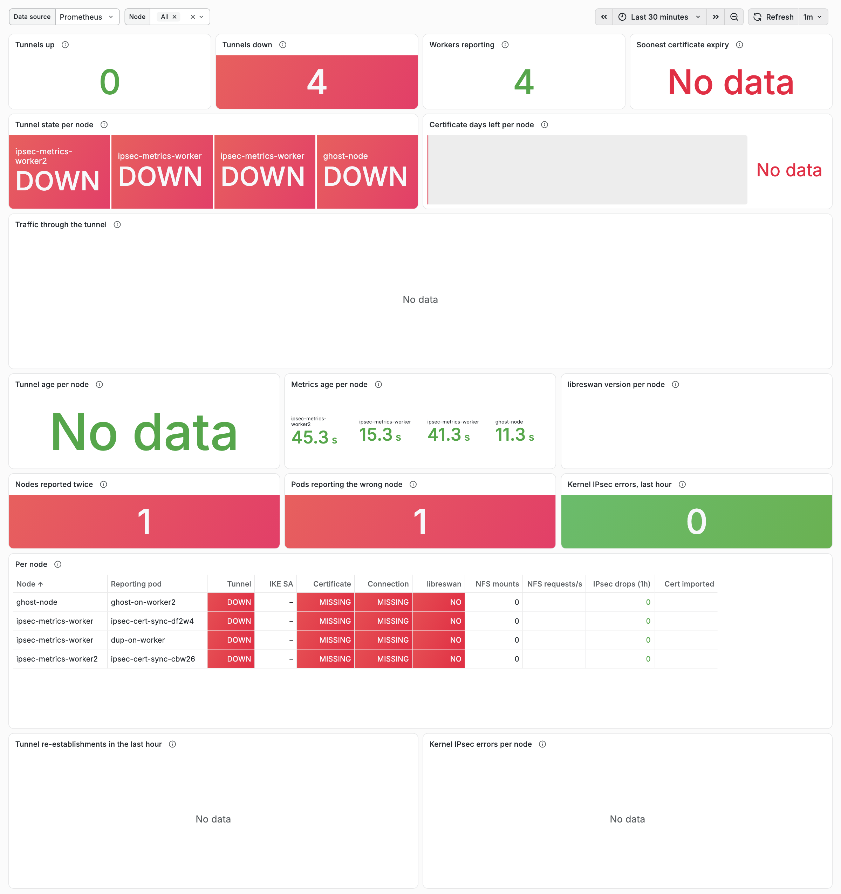

# Monitoring — Every Node Reports Its Own IPsec State

On a real cluster there are many workers, and each must report its own tunnel: the right data, under the right node's name, once. This document says where the numbers come from, how they stay pinned to their node, what each metric and alert means, and what was measured. It covers Option B (the `ipsec-cert-sync` DaemonSet); the setup steps are in [20-option-b-per-node-certificates.md, Step B.12](20-option-b-per-node-certificates.md#step-b12--metrics-in-observe-alerts-and-a-dashboard).

## No extra aggregator: OpenShift's monitoring is the single plane

- Each worker runs one `ipsec-cert-sync` pod. Its `collector` container reads the host every 30 seconds; its `metrics` container serves the result on port 9754.
- The ServiceMonitor `ipsec-nas` makes the user workload Prometheus scrape **every pod as its own target**.
- **Thanos Querier** (console: Observe → Metrics) answers queries over the platform's metrics and the user-defined ones together. Red Hat: it "aggregates and optionally deduplicates core OpenShift Container Platform metrics and metrics for user-defined projects under a single, multi-tenant interface" ([Monitoring overview](https://docs.redhat.com/en/documentation/openshift_container_platform/4.13/html/monitoring/monitoring-overview)).
- Measured on CRC: one query joins our `ipsec_nas_tunnel_up` with the platform's `node_nfs_requests_total` per node (2.01 NFS requests/s on `crc`, tunnel up) ([evidence 39](evidence/crc/39-metrics-dashboard-queries.txt)).
- **Several clusters:** Red Hat Advanced Cluster Management Observability collects user metrics named in the ConfigMap `observability-metrics-custom-allowlist`, key `uwl_metrics_list.yaml` ([ACM 2.15 Observability](https://docs.redhat.com/en/documentation/red_hat_advanced_cluster_management_for_kubernetes/2.15/html-single/observability)). Not tested: we have no second cluster.

## How each node's data stays its own

| Layer | What pins the data to a node | If it goes wrong |
|---|---|---|
| DaemonSet | One pod per selected node. A second pod with the same labels in the same namespace is deleted by the DaemonSet itself (measured on kind: `SuccessfulDelete`) | A second copy in another namespace is not removed (measured on kind, namespace `kcs-ipsec-second-install`): `IpsecNasDuplicateNode` |
| The collector | Reads the host it runs on (`chroot /host`, the host's `/proc/1/…`) and writes `node` from the downward API (`spec.nodeName`) | A pod that names another node: `IpsecNasNodeLabelMismatch` |
| Prometheus | Adds `pod` and `exporter_node` (from `__meta_kubernetes_pod_node_name`, where Kubernetes placed the pod), independently of the collector | — |
| Coverage | `kube_node_role` (platform kube-state-metrics) lists the workers that should report | A worker with no scraped pod: `IpsecNasExporterMissing` |

To pin any query to one node, filter on `node`, and check it against `exporter_node`:

```promql
ipsec_nas_tunnel_up{node="worker-3"}                                   # one node
count by (node) (ipsec_nas_collect_timestamp_seconds) > 1             # a node reported twice
ipsec_nas_collect_timestamp_seconds{exporter_node!=""}
  unless on (node, pod)
  label_replace(ipsec_nas_collect_timestamp_seconds, "node", "$1", "exporter_node", "(.+)")   # a pod naming the wrong node
```

## What is collected

Every metric carries `node`. All are read-only: the collector changes nothing on the host.

| Metric | Meaning | Source on the host |
|---|---|---|
| `ipsec_nas_tunnel_up` | 1 if an IPsec SA to the NAS is established | `ipsec trafficstatus` |
| `ipsec_nas_ike_sa_established` | 1 if the IKE SA (the login) is established; absent when libreswan does not answer | `ipsec status` |
| `ipsec_nas_connection_configured` | 1 if NetworkManager has the `ipsec-nas` connection, that is, the NNCP reached the node | `nmcli` |
| `ipsec_nas_certificate_present` | 1 if the node certificate is in the NSS database | `certutil -L` |
| `ipsec_nas_certificate_not_after_timestamp_seconds` | When that certificate expires | `certutil` + `openssl` |
| `ipsec_nas_certificate_import_timestamp_seconds` | When cert-sync last imported a certificate | cert-sync's stamp file |
| `ipsec_nas_tunnel_established_timestamp_seconds` | When the current tunnel was set up | `ipsec trafficstatus` |
| `ipsec_nas_tunnel_in_bytes_total`, `…_out_bytes_total` | Bytes through the current tunnel | `ipsec trafficstatus` |
| `ipsec_nas_tunnel_info{peer_id}` | The identity the NAS presented | `ipsec trafficstatus` |
| `ipsec_nas_xfrm_errors_total{counter}` | Packets the kernel IPsec code dropped, per reason (all IPsec traffic of the node) | the host netns `/proc/net/xfrm_stat` ([kernel docs](https://kernel.org/doc/Documentation/networking/xfrm_proc.rst)) |
| `ipsec_nas_nfs_mounts{server}` | NFS mounts on the node, per server | the host's `/proc/1/mounts` |
| `ipsec_nas_libreswan_info{version}` | The libreswan version | `ipsec --version` |
| `ipsec_nas_collect_success` | 1 if libreswan answered | exit code of `ipsec trafficstatus` |
| `ipsec_nas_collect_timestamp_seconds` | When the collector last ran | — |

## Alerts

| Alert | Fires when | For | Severity |
|---|---|---|---|
| `IpsecNasTunnelDown` | `tunnel_up == 0` | 5m | critical |
| `IpsecNasNfsWithoutTunnel` | The node sends NFS requests (platform node-exporter) while its tunnel is down | 5m | critical |
| `IpsecNasCertificateMissing` | No certificate in the node's NSS database | 10m | critical |
| `IpsecNasConnectionMissing` | The certificate is there but the `ipsec-nas` connection is not (the NNCP did not reach the node) | 15m | warning |
| `IpsecNasTunnelFlapping` | The tunnel was set up again more than 3 times in an hour | – | warning |
| `IpsecNasLibreswanNotAnswering` | `collect_success == 0` | 5m | warning |
| `IpsecNasNodeLabelMismatch` | A pod's `node` differs from where it runs | 5m | warning |
| `IpsecNasDuplicateNode` | More than one pod reports a node | 10m | warning |
| `IpsecNasExporterMissing` | A worker has no scraped pod | 15m | warning |
| `IpsecNasMetricsStale` | The collector has not written for 5 minutes | 5m | warning |
| `IpsecNasCertificateExpiringSoon`, `…Expired` | Less than 14 days left; expired | 1h; – | warning; critical |

Two of the waits are measured, not chosen:

- **`IpsecNasDuplicateNode`, 10 minutes.** When the ServiceMonitor changed on CRC, the old and the new series of the same pod both existed for one 15-second step (18:08:15Z); the alert went pending and cleared by 18:09:00Z ([evidence 39](evidence/crc/39-metrics-dashboard-queries.txt)). Without the wait, that change alone would have paged.
- **`IpsecNasCertificateMissing`, 10 minutes.** cert-sync puts a deleted certificate back at its next check (every 5 minutes). On CRC it was missing for 72 seconds and the alert never fired ([evidence 38](evidence/crc/38-metrics-certificate-removed.txt)).

## The dashboard

**Where you see it:** in the OpenShift console, **Observe → Dashboards (Perses)**, project `kcs-ipsec`. The ipsec chart installs it there by default; how it works, who can see it and how to change it: [doc 61](61-perses-dashboard-review.md). The same dashboard ships to Grafana only if asked (`metrics.grafanaDashboard: true`). Both come from one source, `charts/ipsec-nas/files/ipsec-nas.json`, and show the same five sections.

It has five sections, each answering one question ([doc 61, *At a glance*](61-perses-dashboard-review.md#at-a-glance)):

- **Summary**: is anything wrong? Tunnels up and down, workers reporting, the soonest certificate expiry.
- **Tunnels per node**: tunnel state, certificate time left, traffic, tunnel age, metrics age, libreswan version.
- **Checks (all should be 0)**: **Nodes reported twice**, **Pods reporting the wrong node**, **Kernel IPsec errors, last hour**.
- **Per-node detail**: one row per node with tunnel, IKE SA, certificate, connection, libreswan answering, NFS mounts and requests, IPsec drops and last certificate import; under it in Perses, the NAS identity and the reporting pod of each node whose tunnel is up (Grafana's table shows the reporting pod of every node, and the NAS identity of each node whose tunnel is up). A node in two rows there is reported by two pods. In Grafana **"–" means unknown** (no series), never healthy (Capture 1); the Perses table maps only 0 and 1, and how it shows a missing value was not measured.
- **History**: tunnel re-establishments in the last hour, with the alert's threshold; kernel IPsec errors per node and counter over time.

<!-- markdownlint-disable MD033 -->

<!-- markdownlint-enable MD033 -->

*Capture 3. The dashboard today, in the OpenShift console on CRC, in its five sections. How it was captured: [doc 61, Capture 6](61-perses-dashboard-review.md#at-a-glance) and [evidence 42](evidence/crc/42-console-perses-capture.txt).*

The two Grafana captures below were taken earlier, before the sections and before Perses was adopted. Each shows a test of its own, recorded in its evidence file.

<!-- markdownlint-disable MD033 -->
<picture>
  <source media="(prefers-color-scheme: dark)" srcset="images/kind/dashboard-faults.dark.png">
  <source media="(prefers-color-scheme: light)" srcset="images/kind/dashboard-faults.light.png">
  
</picture>
<!-- markdownlint-enable MD033 -->

*Capture 1. The dashboard (in Grafana, before the sections) on kind with a duplicate pod (`dup-on-worker`) and a pod naming the wrong node (`ghost-on-worker2`), the same two faults as in [`evidence/kind/01-per-node-metrics-faults.txt`](evidence/kind/01-per-node-metrics-faults.txt), applied again at 18:27Z after the tests of [evidence kind/02](evidence/kind/02-exporter-missing.txt) (hence other pod names). kind nodes have no libreswan, NSS database or NNCP, so the IPsec columns are DOWN or MISSING by design; what the capture shows is that each pod's data lands in its own row, and that unknown (the IKE SA) shows as –.*

With real IPsec, on CRC: the same dashboard in Grafana 13.2.3, run locally as a stand-in and reading CRC's Thanos Querier (CRC has no Grafana of ours; the console's Perses now shows the same dashboard, doc 61), while a bounded Job in `ipsec-nas-demo` wrote and read back 8 MiB on the NAS volume every 2 seconds:

<!-- markdownlint-disable MD033 -->
<picture>
  <source media="(prefers-color-scheme: dark)" srcset="images/crc/40-grafana-dashboard-crc-data.dark.png">
  <source media="(prefers-color-scheme: light)" srcset="images/crc/40-grafana-dashboard-crc-data.light.png">
  
</picture>
<!-- markdownlint-enable MD033 -->

*Capture 2. Every panel populated from CRC (in Grafana, before the sections). Traffic: 4.13 MB/s out and 4.09 MB/s in (five-minute rates), 39.5 NFS requests/s; NFS mounts reads 2 because the load Job mounts the same export as the demo application. Text and the Job: [evidence 40](evidence/crc/40-grafana-dashboard-crc-data.txt).*

## What was tested, and where

| Where | What it proves | Result |
|---|---|---|
| `tests/test-metrics-collector.sh` | The parsers on recorded libreswan 4, libreswan 5 and CRC output; `collect()` end to end against a stubbed host: healthy, no NNCP, no certificate, libreswan not answering | All pass |
| `tests/test-alert-rules.sh` (promtool) | Six nodes, one fault each: every new alert fires for its node and only that node | All pass; a swapped node makes it fail |
| **kind, 3 nodes** (1 control plane, 2 workers), kube-prometheus-stack, the chart's real collector, ServiceMonitor, rules and dashboard | 2 targets, each `node == exporter_node`, the control plane excluded; a duplicate pod and a pod naming `ghost-node` each caught on its node only; one pod deleted changes only its node; a worker without a pod raises `IpsecNasExporterMissing` for that worker only | [evidence kind/01](evidence/kind/01-per-node-metrics-faults.txt), [kind/02](evidence/kind/02-exporter-missing.txt) |
| **CRC** (OpenShift 4.22.7, real IPsec), deployed from Git by Argo CD | Every new series with real values; every dashboard query answers; the certificate deleted from NSS and put back by cert-sync | [evidence 38](evidence/crc/38-metrics-certificate-removed.txt), [39](evidence/crc/39-metrics-dashboard-queries.txt) |
| A real multi-node OpenShift cluster | — | **Not tested yet**: tracked in issue #20 |

What the tests showed, beyond pass or fail:

1. **`tunnel_up` does not see a tunnel restart.** On CRC, cert-sync restarted the tunnel at 18:11:44Z; `tunnel_up` stayed 1 in every sample. Only `tunnel_established_timestamp_seconds` moved (12:39:20Z to 18:11:44Z) and `changes()` counted 1 ([evidence 38](evidence/crc/38-metrics-certificate-removed.txt)). A tunnel that keeps restarting looks up on every other panel; `IpsecNasTunnelFlapping` is the only alert for it, and the tunnel age panel the only other place it shows.
2. **A stray pod is removed by the DaemonSet** when it is in the DaemonSet's namespace with its labels (measured). A duplicate that lasts comes from elsewhere, such as the second copy in another namespace that was measured here.
3. **The NFS join needs OpenShift's node-exporter.** There, `instance` is the node's name (`crc`, measured). In the kube-prometheus-stack on kind it is `IP:9100`, so `IpsecNasNfsWithoutTunnel` and the NFS column find nothing outside OpenShift.
4. **kind is not OpenShift.** The kind run used `ubi9/ubi` for the collector (the `openshift/cli` image is amd64 only), had no `sync` container, and no IPsec. It proves the per-node plumbing; CRC proves the IPsec values.

## Not covered here

- **The dashboard in the console (Perses)**: [doc 61](61-perses-dashboard-review.md).
- **Option C** gets the same collector and alerts from a separate chart, [`ipsec-nas-option-c-metrics`](../charts/ipsec-nas-option-c-metrics/README.md), without cert-sync and without `ipsec_nas_certificate_import_timestamp_seconds` ([evidence 46](evidence/crc/46-option-c-metrics-chart.txt)). Its dashboards: issue #43.
- **Per-flow encryption** (was this NFS packet encrypted?) is out of reach of a collector that reads counters. Issue #35 evaluates the Network Observability Operator's eBPF agent and its IPsec feature, as a read-only probe that must run beside OVN-Kubernetes without touching its datapath.
