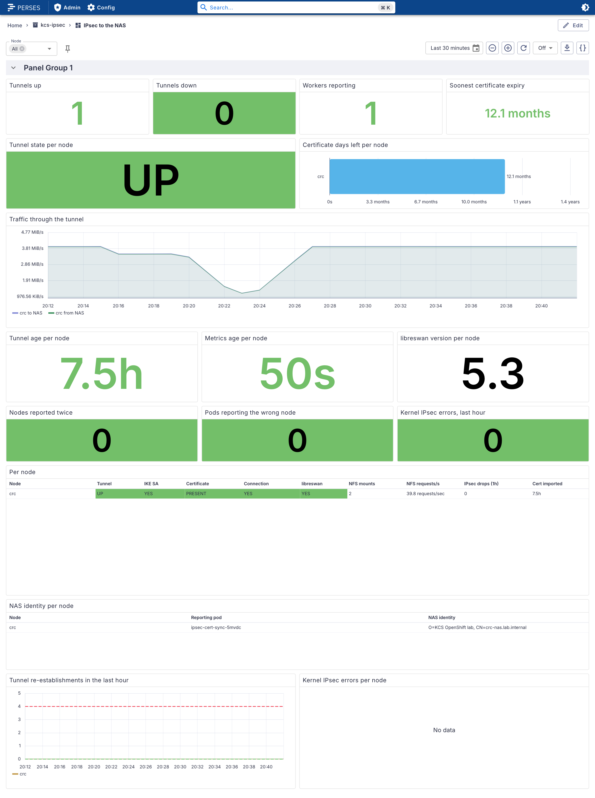

# Perses — Our Dashboard Converted and Reviewed

Red Hat's Cluster Observability Operator (COO) brings **Perses**, a dashboard tool built into the OpenShift console, where each application keeps its dashboards in its own namespace. This document shows what our Grafana dashboard (*IPsec to the NAS*, [doc 60](60-monitoring-per-node.md)) becomes in Perses: what converts, what each panel shows, and what an application team's reader can see. It is the review step of issue [#36](https://github.com/ephico2real2/openshift-ipsec-nas/issues/36). COO itself, and how it was installed and studied by hand, belong to [openshift-coo-helm](https://github.com/ephico2real2/openshift-coo-helm) ([manual-install findings](https://github.com/ephico2real2/openshift-coo-helm/blob/main/docs/manual-install-findings.md)).

Measured on CRC 4.22.7 with COO 1.5.3 on 2026-10-03, with a bounded load Job writing to the NAS for traffic. Text: [evidence 41](evidence/crc/41-perses-dashboard-review.txt). **The Grafana dashboard is not changed by any of this.**

## Decision: one data source on Thanos port 9091; metrics readable by namespace owners

**Decided 2026-10-03.** The metrics contain **no PHI and no PII**. Self-service and metrics accessibility come first: a namespace owner must see their own metrics in their dashboard **without technical gymnastics**. So:

- **The data source.** A `PersesDatasource` on Thanos Querier's cluster-wide port **9091**, and no `namespace` parameter.
- **The viewers.** People who view dashboards hold **`cluster-monitoring-view`**, so they may read metrics across the cluster.

**The technical reason** (measured on CRC; sections 2 and 4):

1. **Perses sends each viewer's own token** to Thanos, so Thanos's own rules decide what a viewer sees.
2. **The Perses UI sends its data queries as `POST`**, and Perses has no setting to send them as `GET`.
3. **Thanos's per-namespace port 9092 checks a `POST` as `create pods` in the namespace.** That is the right to run workloads; it cannot be handed out for viewing a dashboard. A namespace-only reader on 9092 got `Forbidden` on every panel (Capture 3).
4. **Port 9091 checks a `POST` as `create` on `prometheuses/api`.** `cluster-monitoring-view` grants exactly that (with `get`/`update` on the same, and `get` on namespaces: read access to metrics, nothing else). As a viewer holding it, every panel answered (Capture 4).
5. **Port 9091 also serves platform metrics.** The *NFS requests/s* column, empty on 9092, shows data (`30 requests/sec` under load).

The alternative, a namespace-only data source, stays unworkable until Perses can query with `GET`. Who receives `cluster-monitoring-view`, and how, is a platform setting. It belongs with COO in [openshift-coo-helm](https://github.com/ephico2real2/openshift-coo-helm), so every application team gets it the same way, without filing a request per namespace.

<!-- markdownlint-disable MD033 -->
<picture>
  <source media="(prefers-color-scheme: dark)" srcset="images/crc/41-perses-reader-9091.dark.png">
  <source media="(prefers-color-scheme: light)" srcset="images/crc/41-perses-reader-9091.light.png">
  
</picture>
<!-- markdownlint-enable MD033 -->

*Capture 4. The working setup: the namespace reader, now also holding `cluster-monitoring-view`, on a 9091 data source. No errors; the NFS column has data. Text: [evidence 41](evidence/crc/41-perses-dashboard-review.txt).*

## 1. Converting

```bash
percli migrate -f charts/ipsec-nas/files/ipsec-nas.json --format cr --project kcs-ipsec \
  --plugin.path <unpacked Perses plugins> --use-default-datasource -o yaml
```

- **The tool.** `percli` 0.54.0, the Perses version COO 1.5 builds on ([how to install it](https://github.com/ephico2real2/openshift-coo-helm/blob/main/docs/percli.md)). Its plugins must be **unpacked**; pointed at the packed archives it silently turns every panel into a placeholder.
- **The result.** 16 panels: 11 stat charts, 1 table, 3 time series and 1 bar chart. The `node` filter became a Perses variable over the `node` label of `ipsec_nas_tunnel_up`.
- **The data source.** With `--use-default-datasource`, every query uses the namespace's default Perses data source. The Grafana `${DS_PROMETHEUS}` input is dropped.
- **COO's own converter** (`POST /api/migrate` on its Perses) produces the same, except the table: it names the value columns `Value #A…` and drops value mappings and units.
- **The resource version.** `percli` writes `perses.dev/v1alpha1`, which the API server reports as deprecated. `v1alpha2` puts the dashboard under `spec.config`; ours validates (server dry run).

## 2. The data, as an application team's reader

**The reader.** A ServiceAccount with only `view`, `persesdashboard-viewer-role` and `persesdatasource-viewer-role` in `kcs-ipsec`.

**What Perses does with it.** Perses passes the reader's own token to Thanos ([findings §6](https://github.com/ephico2real2/openshift-coo-helm/blob/main/docs/manual-install-findings.md#6-how-perses-authenticates-and-reaches-thanos)). The review therefore started with a data source on Thanos's per-namespace port **9092** with `namespace=kcs-ipsec`. The *Decision* above replaced it with port 9091.

**Every panel query, sent through COO's Perses as `GET`:**

| | Reader, port 9092 | kubeadmin, port 9091 |
|---|---|---|
| The `node` variable (label values) | `crc` | — |
| 26 of the 27 queries | same number of series | same number of series |
| *NFS requests/s* (table column) | **nothing** | 1 series |

The NFS column reads the platform's `node_nfs_requests_total`, which does not belong to `kcs-ipsec`, so a namespace data source cannot see it.

## 3. What each panel shows

COO's Perses has **no web UI of its own**: its index page reads *"This is the default index, looks like you forget to generate the react app"*. Its UI is the one inside the OpenShift console. The captures below are from the **upstream Perses 0.54.0 UI**, the same version COO builds on, run locally in podman. Its data source was CRC's Thanos on port 9092 with `namespace=kcs-ipsec`. The console runs Red Hat's build of the same code, and may render details differently.

**The offline conversion**, with an identity that may query port 9092 (kubeadmin; the reader is section 4):

<!-- markdownlint-disable MD033 -->
<picture>
  <source media="(prefers-color-scheme: dark)" srcset="images/crc/41-perses-ipsec-nas.dark.png">
  <source media="(prefers-color-scheme: light)" srcset="images/crc/41-perses-ipsec-nas.light.png">
  
</picture>
<!-- markdownlint-enable MD033 -->

*Capture 1. The offline conversion in Perses 0.54.0 on CRC's data. Text: [evidence 41](evidence/crc/41-perses-dashboard-review.txt).*

| Panel | In Perses | Same as Grafana? |
|---|---|---|
| Tunnels up / down, Workers reporting | 1 / 0 / 1 | yes |
| Tunnel state per node | UP in green | yes, the value mapping converted |
| Soonest certificate expiry | 364.1 | value yes; **the "days" unit is lost** |
| Certificate days left per node | a bar, `crc` 364.1 | yes |
| Traffic through the tunnel | to and from the NAS, rising steeply as the load starts (axis up to 3.34 MiB/s) | yes |
| Tunnel age / Metrics age | 6.75h / 32s | yes |
| libreswan version per node | **`1`** | **no**: Grafana showed the version label (`crc: 5.3`) |
| Nodes reported twice, Pods reporting the wrong node, Kernel IPsec errors | 0, 0, 0 in green | yes |
| **Per node** (table) | UP, YES, PRESENT, YES, YES in green; NFS mounts 2; drops 0; certificate imported 6.75h | **no**: see below |
| Tunnel re-establishments | 0, under a dashed threshold at 4 | yes |
| Kernel IPsec errors per node | "No data" | the value is right (no drops); Grafana said "No drops" |

**The table shows node `crc` in three rows instead of one.** Perses merges series only when their labels are equal, and ours are not:
- the reporting pod comes from a query labelled `node, pod`;
- the NAS identity comes from one labelled `node, peer_id`;
- the other columns come from queries labelled `node` only.

The colours and values are right; the layout is not. Its *NFS requests/s* column is empty, as section 2 explains.

**COO's server conversion**, the same view:

<!-- markdownlint-disable MD033 -->
<picture>
  <source media="(prefers-color-scheme: dark)" srcset="images/crc/41-perses-server-conversion.dark.png">
  <source media="(prefers-color-scheme: light)" srcset="images/crc/41-perses-server-conversion.light.png">
  
</picture>
<!-- markdownlint-enable MD033 -->

*Capture 2. COO's server conversion: the table's value columns are empty, because their names (`Value #B…`) do not match what this table plugin produces (`value #1…`), and an unconfigured `value #1` column appears. The other 15 panels match Capture 1.*

## 4. What an application team's reader sees: every panel refused

<!-- markdownlint-disable MD033 -->
<picture>
  <source media="(prefers-color-scheme: dark)" srcset="images/crc/41-perses-reader-forbidden.dark.png">
  <source media="(prefers-color-scheme: light)" srcset="images/crc/41-perses-reader-forbidden.light.png">
  
</picture>
<!-- markdownlint-enable MD033 -->

*Capture 3. The reader: every panel `Forbidden (… verb=create, resource=pods)`.*

**The cause, measured.**
- The Perses UI adds `namespace=kcs-ipsec` to all its requests: 63 of 63.
- It sends the node lookup as `GET` (`200`).
- It sends every data query as **`POST /api/v1/query_range`** (`403`, 11 of 11).
- Thanos's per-namespace port treats the HTTP method as the permission it checks: a `POST` needs `create pods`, which `view` does not grant. The [openshift-grafana chart](https://github.com/ephico2real2/group-sync-dashboard/tree/main/charts/openshift-grafana) met the same rule and set Grafana to `GET`.
- **Perses has no such setting.** Its Prometheus data source accepts only the common HTTP settings, `scrapeInterval` and `queryParams` (plugin 0.58.0 schema).
- Red Hat's Perses fork and the console's monitoring plugin show nothing that changes this. That is from a code search, not a test.

**So, as measured, a reader with namespace rights only cannot see this dashboard's data through 9092.** One with `cluster-monitoring-view` on port 9091 can (Capture 4).

**Options considered:**
1. **The console with a non-admin login.** Its Red Hat build might query differently. Not needed after the decision; still worth knowing.
2. **Give readers `cluster-monitoring-view` and use port 9091. Chosen** (see *Decision* above).
3. **A shared data source on 9091 with a ServiceAccount's token.** Every reader would see through one account's rights: rejected.
4. **Ask upstream and Red Hat for a `GET` option** in the Perses Prometheus data source. It would make namespace-only data sources possible later; not needed for the decision.

## 5. To fix before Perses replaces anything (in the chart's `PersesDashboard`, not in Grafana)

| Gap | Fix |
|---|---|
| The table splits a node into three rows | build the table from queries labelled `node` only; show the reporting pod and the NAS identity in a panel of their own |
| libreswan version shows `1` | a table or series-name display that shows the `version` label |
| The certificate expiry lost "days" | set the unit on the stat panel |
| NFS requests/s empty for namespace data sources | resolved by the decision: on 9091 it shows data |
| "No data" where Grafana said "No drops" | a no-data text on the panel, if Perses supports one |
| `v1alpha1` deprecated | write the resource as `perses.dev/v1alpha2` |
| Readers refused (section 4) | resolved by the decision: 9091 and `cluster-monitoring-view` |

## 6. In the chart: `metrics.persesDashboard.enabled`

The chart ships the dashboard and its data source, behind one value (default `false`), and refuses to install them where COO's Perses API (`perses.dev/v1alpha2`) is missing:

| Object (`perses.dev/v1alpha2`, in the release's namespace) | What |
|---|---|
| `PersesDatasource` `ipsec-nas-thanos` | Thanos Querier, port **9091** (`metrics.persesDashboard.thanosURL`), TLS with the service CA. It names the Perses secret COO derives from its TLS settings. Not the namespace's default: every query names it |
| `PersesDashboard` `ipsec-nas` | `files/ipsec-nas.perses.json`, **generated** from the Grafana dashboard |

**Generated, not hand-edited.** `scripts/perses-dashboard.sh` runs `percli migrate` (0.54.0, unpacked plugins) on `files/ipsec-nas.json`. It then applies `scripts/perses-dashboard-fix.py`, which carries the fixes of section 5 and refuses placeholder output, and writes both the chart's file and `manifests/option-b-per-node-certs/33-perses-dashboard.yaml`. Rerun it after any change to the Grafana dashboard. `tests/test-chart.sh` keeps the chart and the manifest identical.

| Section 5 gap | In the generated dashboard |
|---|---|
| The table split a node into three rows | **fixed**: the table keeps the nine queries labelled by `node`, so one row per node. The reporting pod and the NAS identity moved to a new panel, *NAS identity per node* |
| libreswan version showed `1` | **fixed**: shows `5.3` |
| "days" unit lost | **fixed**, with a twist: Perses writes days in the largest fitting unit, so 364 days reads **12.1 months** |
| NFS requests/s | **fixed** by port 9091: 39.8 requests/sec under load |
| "No data" where Grafana said "No drops" | as before: the value is right (no drops) |
| `v1alpha1` deprecated | **fixed**: `v1alpha2` |
| *(found in the second pass)* The node filter had no data source: percli leaves the variables without one, so they use the namespace's **default** data source, and the chart's is not the default | **fixed**: the variables name `ipsec-nas-thanos` too. Measured with no default data source: before, the filter sent no request at all; after, it queries `ipsec-nas-thanos` |

**Who sees it.** COO's roles for Perses are aggregated into OpenShift's own: `view` already allows reading `PersesDashboard`s and `PersesDatasource`s in the namespace, and `edit` and `admin` allow changing them. Measured with a ServiceAccount holding **only `view`** in `kcs-ipsec`: `get` on both kinds was allowed, `create` was refused, and the Perses API listed the namespace's dashboards (HTTP 200). So the chart creates **no RoleBindings**. A viewer who can open the namespace and holds `cluster-monitoring-view` sees every panel.

<!-- markdownlint-disable MD033 -->
<picture>
  <source media="(prefers-color-scheme: dark)" srcset="images/crc/41-perses-chart.dark.png">
  <source media="(prefers-color-scheme: light)" srcset="images/crc/41-perses-chart.light.png">
  
</picture>
<!-- markdownlint-enable MD033 -->

*Capture 5. The dashboard the chart ships, as the namespace reader holding `cluster-monitoring-view`, in the upstream Perses 0.54.0 UI on CRC's data: one row per node, the NAS identity in its own panel, `5.3`, the NFS column. The same objects applied on CRC are `Available`, and queries through COO's Perses with the chart's data source answer with `GET` and `POST` (HTTP 200).*

## Not covered here

- How the console renders this dashboard: [#36](https://github.com/ephico2real2/openshift-ipsec-nas/issues/36), step 2.
- COO itself: [openshift-coo-helm](https://github.com/ephico2real2/openshift-coo-helm).
