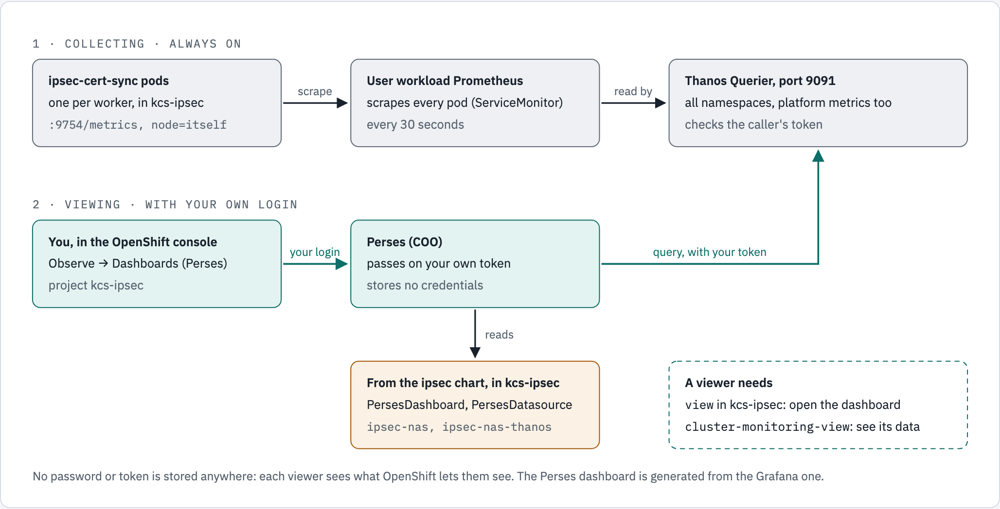
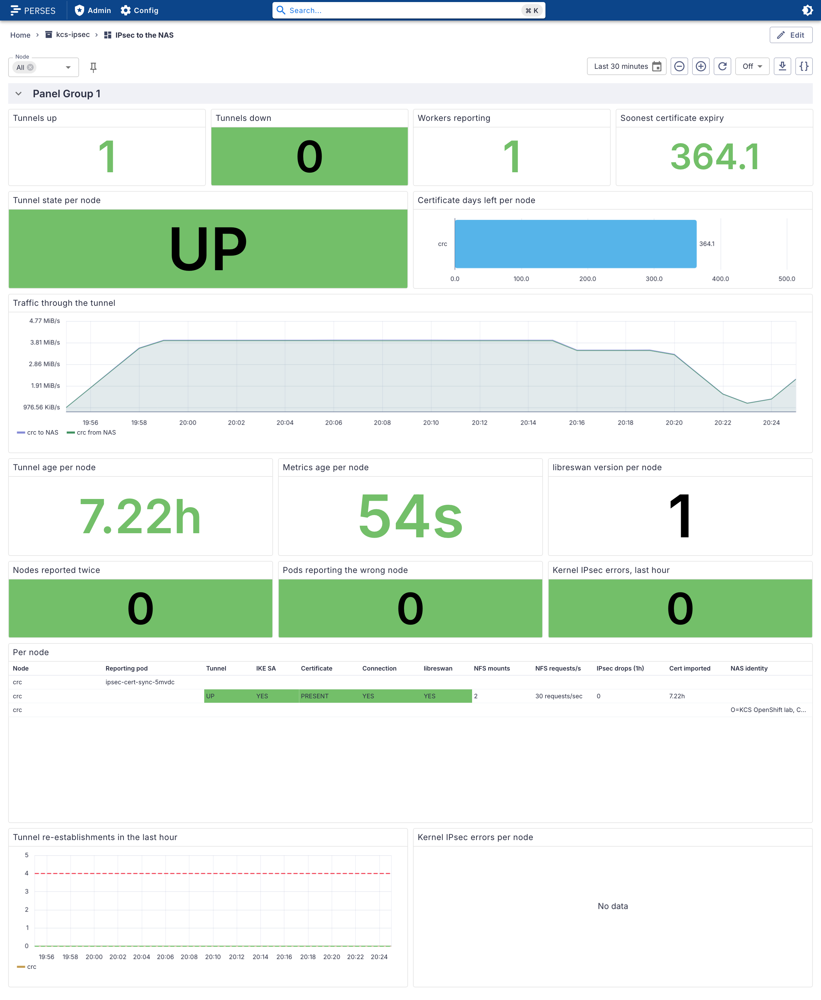
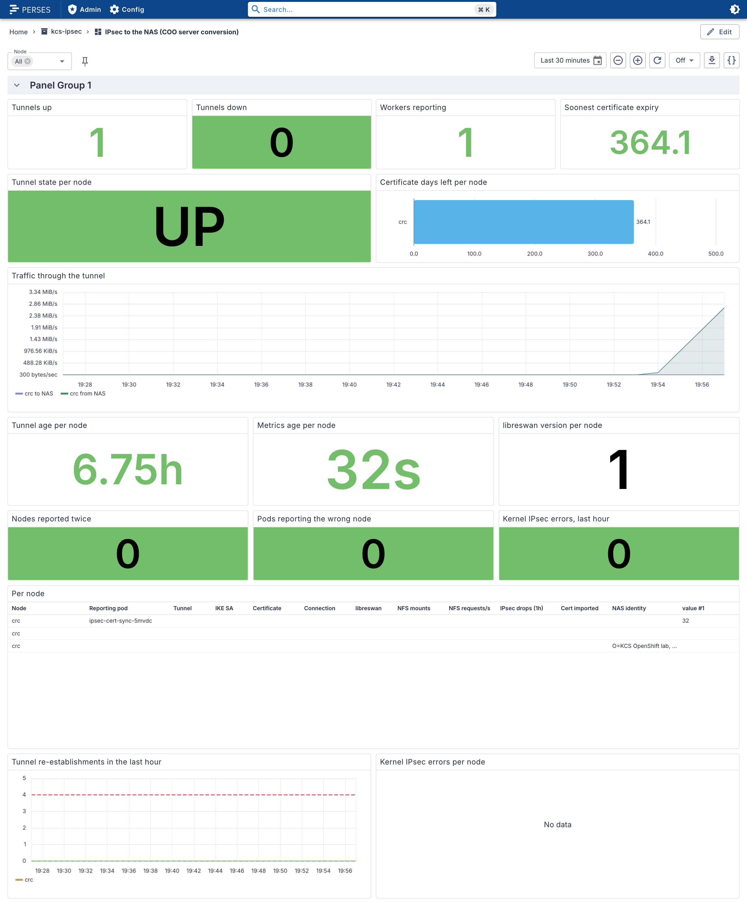
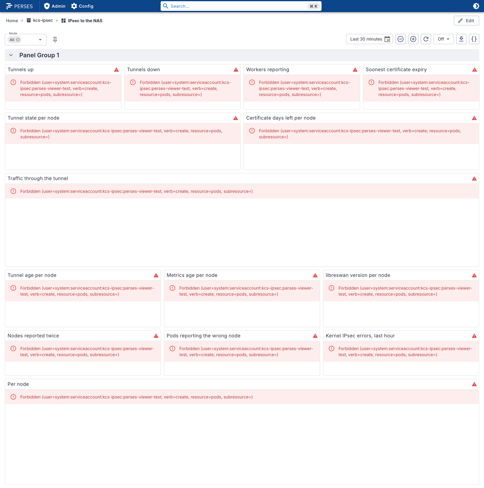

# Perses — The IPsec Dashboard in the OpenShift Console

The *IPsec to the NAS* dashboard lives in the **OpenShift console**: **Observe → Dashboards (Perses)**. It runs on Perses, the dashboard tool Red Hat ships with the Cluster Observability Operator (COO). The ipsec chart installs it **by default**. The Grafana version is **off** by default and kept for clusters that run Grafana.

Everything below was measured on CRC 4.22.7 with COO 1.5.3 on 2026-10-03 and 2026-10-04 ([evidence 41](evidence/crc/41-perses-dashboard-review.txt), [42](evidence/crc/42-console-perses-capture.txt)). The metrics, the alerts and the collector are described in [doc 60](60-monitoring-per-node.md). COO itself is installed by its own chart, [openshift-coo-helm](https://github.com/ephico2real2/openshift-coo-helm).

## At a glance

<!-- markdownlint-disable MD033 -->
<picture>
  <source media="(prefers-color-scheme: dark)" srcset="images/crc/42-console-perses-ipsec-nas.dark.png">
  <source media="(prefers-color-scheme: light)" srcset="images/crc/42-console-perses-ipsec-nas.light.png">
  
</picture>
<!-- markdownlint-enable MD033 -->

*Capture 6. **Observe → Dashboards (Perses)**, project `kcs-ipsec`: the dashboard the chart ships, in its five sections, on CRC's data. "No data" on the last panel means no kernel IPsec errors: it shows only error counters above 0. The console shell here is the community (OKD) build of the same console, `quay.io/openshift/origin-console:4.22`, run on a laptop against CRC with sign-in turned off (hence the `okd` logo and "Auth disabled"). The Perses plugin, the Perses server, the dashboard and the data are CRC's own ([evidence 42](evidence/crc/42-console-perses-capture.txt)).*

The dashboard has five sections, top to bottom. Each answers one question:

| Section | Panels | The question it answers |
|---|---|---|
| **Summary** | Tunnels up, tunnels down, workers reporting, soonest certificate expiry | Is anything wrong? |
| **Tunnels per node** | Tunnel state, certificate time left, traffic to and from the NAS, tunnel age, metrics age, libreswan version | Which node, and how is it doing? A young tunnel age means a recent restart; an old metrics age, a stopped collector |
| **Checks (all should be 0)** | Nodes reported twice, pods reporting the wrong node, kernel IPsec errors in the last hour | Can these numbers be trusted? (doc 60, *How each node's data stays its own*) |
| **Per-node detail** | **Per node** table: one row per node; NAS identity per node | **Why** a tunnel is down (no certificate, no connection, no IKE SA, libreswan not answering), NFS mounts and requests, IPsec drops, last certificate import; which pod reports each node, and the identity the NAS presented |
| **History** | Tunnel re-establishments in the last hour, kernel IPsec errors per node | Is a tunnel flapping (alert above 3 an hour), and are errors growing? "No data" there means no errors: it shows only counters above 0 |

Each section folds with the arrow beside its title; all are open when the dashboard loads.

## How it works

<!-- markdownlint-disable MD033 -->
<picture>
  <source media="(prefers-color-scheme: dark)" srcset="diagrams/ipsec-nas/perses-dashboard.dark.png">
  <source media="(prefers-color-scheme: light)" srcset="diagrams/ipsec-nas/perses-dashboard.light.png">
  
</picture>
<!-- markdownlint-enable MD033 -->

*Figure 1. How the dashboard reaches you.*

```text
COLLECTING (always on)
  ipsec-cert-sync pod, one per worker ──scrape──▶ user workload Prometheus ──store──▶ Thanos Querier :9091
  (kcs-ipsec, :9754/metrics, node=itself)          (ServiceMonitor, every 30 s)       (all namespaces, checks the caller's token)

VIEWING (with your own login)
  You, in the console ──your login──▶ Perses (COO) ──query, with your token──▶ Thanos Querier :9091
  Observe → Dashboards (Perses)          │
                                         └──reads──▶ PersesDashboard ipsec-nas + PersesDatasource ipsec-nas-thanos (kcs-ipsec, from the ipsec chart)

A viewer needs: view in kcs-ipsec (open the dashboard) + cluster-monitoring-view (see its data).
No password or token is stored anywhere.
```

1. **Each worker's `ipsec-cert-sync` pod reports its own node**, labelled with that node's name.
2. **OpenShift's user workload Prometheus scrapes every pod** (the chart's ServiceMonitor). **Thanos Querier** serves those metrics together with the platform's own.
3. **You open the dashboard in the console.** The console passes your login (your token) to Perses.
4. **Perses reads the dashboard and its data source from `kcs-ipsec`**, both put there by the ipsec chart.
5. **Perses queries Thanos with your token.** Thanos answers if you hold `cluster-monitoring-view`. Nothing is stored: each viewer sees what OpenShift lets them see.

## Turn it on (or off)

It is **on by default** in the ipsec chart (`metrics.persesDashboard.enabled: true`). The Grafana dashboard is **off** (`metrics.grafanaDashboard: false`).

**Prerequisites:**

| Needs | Why | How |
|---|---|---|
| COO 1.5 or later, with Perses enabled | It runs Perses and its console page | [openshift-coo-helm](https://github.com/ephico2real2/openshift-coo-helm). The chart refuses to install without the API `perses.dev/v1alpha2`, and says so |
| User workload monitoring | It collects the metrics | [doc 20, Step B.12](20-option-b-per-node-certificates.md#step-b12--metrics-in-observe-alerts-and-a-dashboard) |

**What the chart creates**, in its own namespace, `perses.dev/v1alpha2`:

| Object | What |
|---|---|
| `PersesDatasource` `ipsec-nas-thanos` | Thanos Querier on port 9091 (`metrics.persesDashboard.thanosURL`), TLS with the service CA |
| `PersesDashboard` `ipsec-nas` | The dashboard: `charts/ipsec-nas/files/ipsec-nas.perses.json`, generated from the Grafana one |

It creates **no RoleBindings**: see [Who can see it](#who-can-see-it).

A cluster without COO sets `metrics.persesDashboard.enabled: false`, and can turn the Grafana dashboard on instead. With the plain manifests, apply `manifests/option-b-per-node-certs/33-perses-dashboard.yaml`.

**Check it:**

```bash
oc -n kcs-ipsec get persesdatasource ipsec-nas-thanos -o jsonpath='{.status.conditions[?(@.type=="Available")].status}{"\n"}'
oc -n kcs-ipsec get persesdashboard ipsec-nas -o jsonpath='{.status.conditions[?(@.type=="Available")].status}{"\n"}'
```

✅ **Expected:** `True` twice.

## Open it

**Observe → Dashboards (Perses)**, project **`kcs-ipsec`**, dashboard **IPsec to the NAS** (Capture 6). The **Node** filter at the top narrows every panel to the nodes you pick (default: all).

## Who can see it

| To | You need | Who usually has it |
|---|---|---|
| Open the dashboard | **`view`** in `kcs-ipsec` (or `edit` / `admin`) | The namespace's team. COO's Perses roles are part of OpenShift's `view`, `edit` and `admin`, so no extra role is needed (measured: `view` alone reads the dashboard, and cannot change it) |
| See its data | **`cluster-monitoring-view`** | Granted by the platform: [openshift-coo-helm](https://github.com/ephico2real2/openshift-coo-helm) grants it to the groups it is given, for example everyone who logs in |
| Change the dashboard | Edit the Grafana JSON in Git and regenerate: [Change the dashboard](#change-the-dashboard) | — |

### Decision: one data source on Thanos port 9091; metrics readable by namespace owners

**Decided 2026-10-03.** The metrics contain **no PHI and no PII**. Self-service and metrics accessibility come first: a namespace owner must see their own metrics **without technical gymnastics**. So the data source uses Thanos's cluster-wide port **9091**, and viewers hold `cluster-monitoring-view`.

**Why not a namespace-only data source** (measured; details in [Appendix A](#appendix-a--how-we-got-here)):

1. **Perses sends each viewer's own token** to Thanos.
2. **The Perses UI sends its data queries as `POST`**, and has no setting to send `GET`.
3. **Thanos's per-namespace port, 9092, checks a `POST` as `create pods`** in the namespace: the right to run workloads, which cannot be handed out for viewing a dashboard. A namespace-only reader got `Forbidden` on every panel (Capture 3).
4. **Port 9091 checks a `POST` as `create` on `prometheuses/api`.** That is what `cluster-monitoring-view` grants. Its rules are `get` on namespaces, and `get`/`create`/`update` on `prometheuses/api`: read access to metrics, nothing else.
5. **Port 9091 also serves platform metrics.** The *NFS requests/s* column needs them.

<!-- markdownlint-disable MD033 -->
<picture>
  <source media="(prefers-color-scheme: dark)" srcset="images/crc/41-perses-reader-9091.dark.png">
  <source media="(prefers-color-scheme: light)" srcset="images/crc/41-perses-reader-9091.light.png">
  
</picture>
<!-- markdownlint-enable MD033 -->

*Capture 4. The same reader as in Capture 3, now also holding `cluster-monitoring-view`, on port 9091: every panel answers (this capture predates the panel fixes of Appendix A.5).*

<!-- markdownlint-disable MD033 -->
<picture>
  <source media="(prefers-color-scheme: dark)" srcset="images/crc/41-perses-chart.dark.png">
  <source media="(prefers-color-scheme: light)" srcset="images/crc/41-perses-chart.light.png">
  
</picture>
<!-- markdownlint-enable MD033 -->

*Capture 5. The finished dashboard (after Appendix A.5) as the same reader. Taken in the upstream Perses 0.54.0 UI, the version COO builds on, signed in as that reader.*

A namespace-only data source becomes possible only if Perses learns to query with `GET`.

## Change the dashboard

The Grafana dashboard, `charts/ipsec-nas/files/ipsec-nas.json`, is the **one source**. The Perses dashboard is **generated** from it; never edit `ipsec-nas.perses.json` by hand.

1. Edit `charts/ipsec-nas/files/ipsec-nas.json`, for example in a Grafana, and export the JSON. The sections are Grafana **rows**: put a new panel under the row whose question it answers, and add a row for a new question. Keep rows expanded; a row saved collapsed becomes a folded section in Perses too.
2. Regenerate, from the repository root. This needs `percli` 0.54.0 with its plugins unpacked ([how to install it](https://github.com/ephico2real2/openshift-coo-helm/blob/main/docs/percli.md)):

   ```bash
   scripts/perses-dashboard.sh     # PERCLI=... PERSES_PLUGINS=... to point at another percli
   ```

   It writes `charts/ipsec-nas/files/ipsec-nas.perses.json` and `manifests/option-b-per-node-certs/33-perses-dashboard.yaml`, and refreshes the Grafana ConfigMap `manifests/option-b-per-node-certs/30-grafana-dashboard.yaml`.
3. Run `tests/test-chart.sh`, which keeps the chart and the manifests identical, and commit all of them with the Grafana one.

**What the generator fixes after `percli`** (`scripts/perses-dashboard-fix.py`; each fix is measured in Appendix A.5):
- every query and the **Node** filter name the data source `ipsec-nas-thanos`;
- the per-node table keeps one row per node, and the NAS identity moves to its own panel, under it in **Per-node detail**;
- the libreswan panel shows the version;
- the certificate panels count days;
- it **refuses** output in which `percli` produced placeholders, which happens when the plugins are not unpacked.

The generator finds panels by their **title** and sections by theirs: `percli` names panels after their section (`0_3`, `3_0`, …), so those names change whenever a section is added. If a panel or section it fixes is renamed, or the panels change shape (more panels, a moved table), it stops with a message naming what to update.

## Troubleshooting

| You see | Why | Do |
|---|---|---|
| No **Dashboards (Perses)** under Observe | COO is missing, or its console plugin is off | Install COO with Perses: [openshift-coo-helm](https://github.com/ephico2real2/openshift-coo-helm) |
| The install is refused: *prerequisite missing: the Cluster Observability Operator* | The cluster does not serve `perses.dev/v1alpha2` | Install COO first, or set `metrics.persesDashboard.enabled: false` |
| *IPsec to the NAS* is not in the list | No `view` in `kcs-ipsec`, or the dashboard is not `Available` | Ask for `view` in the namespace; run the checks in [Turn it on](#turn-it-on-or-off) |
| Every panel says `Forbidden (… resource=prometheuses, subresource=api)` | You lack `cluster-monitoring-view` | The platform grants it ([Who can see it](#who-can-see-it)) |
| Every panel says `Forbidden (… resource=pods …)` | The data source points at port 9092 | Keep `thanosURL` on port 9091 ([Decision](#decision-one-data-source-on-thanos-port-9091-metrics-readable-by-namespace-owners)) |
| The **Node** filter is empty | The data source `ipsec-nas-thanos` is not `Available`, or you lack `cluster-monitoring-view` (the filter queries Thanos too) | Run the checks in [Turn it on](#turn-it-on-or-off); see [Who can see it](#who-can-see-it) |
| Certificate expiry reads "12.1 months", not "364 days" | Perses writes a duration in its largest fitting unit | Expected; the alerts still fire at 14 days |
| *Kernel IPsec errors per node* says "No data" | There were no drops | Expected; the panel draws only counters that moved |

## Grafana, if you need it

The same dashboard is still available for Grafana: `metrics.grafanaDashboard: true` ships it as a ConfigMap labelled `grafana_dashboard: "1"`. Both flags may be on at once: they add data only (measured: 47 KiB for the ConfigMap, 44 KiB for the two Perses objects, no pods), and both dashboards come from the same JSON.

**Prerequisite for the Grafana integration: a Grafana that loads the ConfigMap.** Measured on kind with the Grafana Helm chart and its dashboard sidecar ([evidence kind/03](evidence/kind/03-grafana-dashboard-prerequisite.txt)):

| Grafana | Its dashboard sidecar searches | Loads the dashboard? |
|---|---|---|
| **In the same namespace** (`kcs-ipsec`) | its own namespace | **yes**, measured |
| **Central**, in another namespace | all namespaces (`searchNamespace: ALL`) | **yes**, measured |
| In another namespace | only its own namespace | **no**, measured: the prerequisite is not met |
| grafana-operator, with a `GrafanaDashboard` pointing at the ConfigMap ([doc 20, Step B.12](20-option-b-per-node-certificates.md#step-b12--metrics-in-observe-alerts-and-a-dashboard), step 5) | — | **not measured** |

The chart **does not check** this: nothing on the cluster tells it a Grafana sidecar is there, and without a Grafana the ConfigMap is simply unused. Its install notes say so when the flag is on.

## Appendix A — How we got here

The review that led to the setup above, kept for its measurements. Captures 1 to 4 show the dashboard **before** the fixes of A.5.

### A.1 Converting

```bash
percli migrate -f charts/ipsec-nas/files/ipsec-nas.json --format cr --project kcs-ipsec \
  --plugin.path <unpacked Perses plugins> --use-default-datasource -o yaml
```

- **The tool.** `percli` 0.54.0, the Perses version COO 1.5 builds on. Its plugins must be **unpacked**; pointed at the packed archives it silently turns every panel into a placeholder.
- **The result.** 16 panels: 11 stat charts, 1 table, 3 time series and 1 bar chart. The `node` filter became a Perses variable over the `node` label of `ipsec_nas_tunnel_up`.
- **COO's own converter** (`POST /api/migrate` on its Perses) produces the same, except the table: it names the value columns `Value #A…` and drops value mappings and units.
- **The resource version.** `percli` writes `perses.dev/v1alpha1`, which the API server reports as deprecated. `v1alpha2` puts the dashboard under `spec.config`.

### A.2 The data, as an application team's reader

**The reader.** A ServiceAccount with `view`, `persesdashboard-viewer-role` and `persesdatasource-viewer-role` in `kcs-ipsec`. Perses passes the reader's own token to Thanos ([openshift-coo-helm findings §6](https://github.com/ephico2real2/openshift-coo-helm/blob/main/docs/manual-install-findings.md#6-how-perses-authenticates-and-reaches-thanos)), so the review started with a data source on Thanos's per-namespace port **9092** with `namespace=kcs-ipsec`.

**Every panel query, sent through COO's Perses as `GET`:**

| | Reader, port 9092 | kubeadmin, port 9091 |
|---|---|---|
| The `node` variable (label values) | `crc` | — |
| 26 of the 27 queries | same number of series | same number of series |
| *NFS requests/s* (table column) | **nothing** | 1 series |

The NFS column reads the platform's `node_nfs_requests_total`, which does not belong to `kcs-ipsec`, so a namespace data source cannot see it.

### A.3 What each panel showed

These captures are from the upstream Perses 0.54.0 UI run locally on CRC's data, with an identity that may query port 9092 (kubeadmin).

<!-- markdownlint-disable MD033 -->
<picture>
  <source media="(prefers-color-scheme: dark)" srcset="images/crc/41-perses-ipsec-nas.dark.png">
  <source media="(prefers-color-scheme: light)" srcset="images/crc/41-perses-ipsec-nas.light.png">
  
</picture>
<!-- markdownlint-enable MD033 -->

*Capture 1. The first conversion, before the fixes.*

| Panel | In Perses | Same as Grafana? |
|---|---|---|
| Tunnels up / down, Workers reporting | 1 / 0 / 1 | yes |
| Tunnel state per node | UP in green | yes, the value mapping converted |
| Soonest certificate expiry | 364.1 | value yes; **the "days" unit is lost** |
| Certificate days left per node | a bar, `crc` 364.1 | yes |
| Traffic through the tunnel | to and from the NAS, rising steeply as the load starts (axis up to 3.34 MiB/s) | yes |
| Tunnel age / Metrics age | 6.75h / 32s | yes |
| libreswan version per node | **`1`** | **no**: Grafana showed the version label (`crc: 5.3`) |
| Nodes reported twice, Pods reporting the wrong node, Kernel IPsec errors | 0, 0, 0 in green | yes |
| **Per node** (table) | UP, YES, PRESENT, YES, YES in green; NFS mounts 2; drops 0; certificate imported 6.75h | **no**: node `crc` in three rows |
| Tunnel re-establishments | 0, under a dashed threshold at 4 | yes |
| Kernel IPsec errors per node | "No data" | the value is right (no drops); Grafana said "No drops" |

**Why the table split a node into three rows.** Perses merges series only when their labels are equal, and ours were not: the reporting pod came from a query labelled `node, pod`, the NAS identity from one labelled `node, peer_id`, and the other columns from queries labelled `node` only.

<!-- markdownlint-disable MD033 -->
<picture>
  <source media="(prefers-color-scheme: dark)" srcset="images/crc/41-perses-server-conversion.dark.png">
  <source media="(prefers-color-scheme: light)" srcset="images/crc/41-perses-server-conversion.light.png">
  
</picture>
<!-- markdownlint-enable MD033 -->

*Capture 2. COO's server conversion: the table's value columns are empty, because their names (`Value #B…`) do not match what the table plugin produces (`value #1…`). The other 15 panels match Capture 1. The chart uses the `percli` conversion.*

### A.4 A namespace-only reader on port 9092: every panel refused

<!-- markdownlint-disable MD033 -->
<picture>
  <source media="(prefers-color-scheme: dark)" srcset="images/crc/41-perses-reader-forbidden.dark.png">
  <source media="(prefers-color-scheme: light)" srcset="images/crc/41-perses-reader-forbidden.light.png">
  
</picture>
<!-- markdownlint-enable MD033 -->

*Capture 3. The reader: every panel `Forbidden (… verb=create, resource=pods)`.*

**The cause, measured:**
- The Perses UI adds `namespace=kcs-ipsec` to all its requests (63 of 63).
- It sends the node lookup as `GET` (`200`), and every data query as **`POST /api/v1/query_range`** (`403`, 11 of 11).
- Thanos's per-namespace port treats the HTTP method as the permission it checks: a `POST` needs `create pods`, which `view` does not grant. The [openshift-grafana chart](https://github.com/ephico2real2/group-sync-dashboard/tree/main/charts/openshift-grafana) met the same rule and set Grafana to `GET`.
- **Perses has no such setting.** Its Prometheus data source accepts only the common HTTP settings, `scrapeInterval` and `queryParams` (plugin 0.58.0 schema). Red Hat's Perses fork and the console's monitoring plugin show nothing that changes this (a code search, not a test).

**Options considered:**
1. Give readers `cluster-monitoring-view` and use port 9091. **Chosen**: the [Decision](#decision-one-data-source-on-thanos-port-9091-metrics-readable-by-namespace-owners).
2. A shared data source on 9091 with a ServiceAccount's token: every reader would see through one account's rights. Rejected.
3. Ask upstream and Red Hat for a `GET` option in the Perses Prometheus data source: it would make namespace-only data sources possible later.

### A.5 The gaps, and how the generated dashboard fixes them

| Gap in the first conversion | In the dashboard the chart ships |
|---|---|
| The table split a node into three rows | **Fixed**: the table keeps the nine queries labelled by `node`; the reporting pod and the NAS identity moved to *NAS identity per node* |
| libreswan version showed `1` | **Fixed**: shows `5.3` (`percli` had garbled the label to show) |
| The "days" unit was lost | **Fixed**, with a twist: Perses writes days in its largest fitting unit, so 364 days reads 12.1 months |
| NFS requests/s empty on a namespace data source | **Fixed** by port 9091: 39.8 requests/sec under load |
| Readers refused (A.4) | **Fixed** by the Decision: port 9091 and `cluster-monitoring-view` |
| `v1alpha1` deprecated | **Fixed**: `v1alpha2` |
| *(found in the second pass)* The node filter had no data source, so it used the namespace's default one, and the chart's is not the default | **Fixed**: the variables name `ipsec-nas-thanos`. Measured with no default data source: before, the filter sent no request; after, it queries `ipsec-nas-thanos` |
| "No data" where Grafana said "No drops" | Not fixed: the value is right (no drops) |

The generated dashboard carries every Grafana expression over verbatim, except the two queries moved to the identity panel. Applied on CRC, both objects are `Available`; queries through COO's Perses with the chart's data source answer with `GET` and `POST`; Argo CD deploys them from Git.

## Not covered here

- COO itself, Perses' installation, `percli`: [openshift-coo-helm](https://github.com/ephico2real2/openshift-coo-helm).
- Granting `cluster-monitoring-view` to teams: a setting of that chart ([its issue #1](https://github.com/ephico2real2/openshift-coo-helm/issues/1)).
- The figure's source: [`diagrams/ipsec-nas/source.html`](diagrams/ipsec-nas/source.html) (its fourth figure), rendered with `diagrams/render.py`; Mermaid text: [`diagrams/mermaid/perses-dashboard.mmd`](diagrams/mermaid/perses-dashboard.mmd). Figure, text version and source change together.
