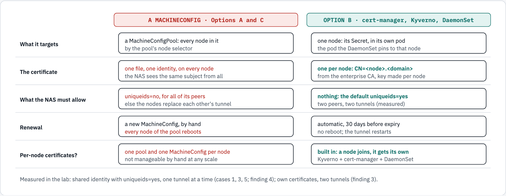
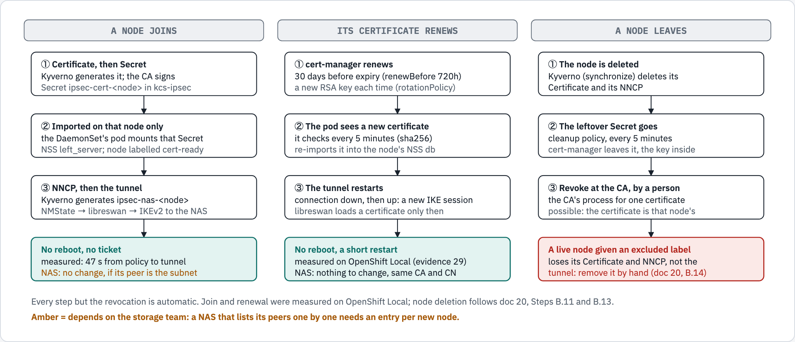

# Option B — Implementation Plan: Per-Node IPsec to the NAS on OpenShift

**Audience:** platform engineering, architecture, security, the storage and PKI teams. **Status:** 2026-10-07, a plan for an engineering proof of concept on an enterprise cluster. **Read with:** [doc 70](70-review-enterprise-linux-ipsec-config.md) (our enterprise Linux IPsec standard against the options) and [doc 71](71-option-b-nas-team-engagement.md) (the NAS-team meeting and what is left to specify).

**Contents:** [1. Decision](#1-decision) · [2. Why there is no turnkey solution on OpenShift](#2-why-there-is-no-turnkey-solution-on-openshift) · [3. The architecture](#3-the-architecture) · [4. The case for each component](#4-the-case-for-each-component) · [5. End-to-end automation](#5-end-to-end-automation) · [6. The engineering PoC](#6-the-engineering-poc) · [7. Rollout, roles and risks](#7-rollout-roles-and-risks) · [Diagram sources](#diagram-sources)

## 1. Decision

**Option B, one certificate per node, with the tunnel definition refined to the enterprise standard**, for every enterprise cluster that mounts the NAS over NFS.

Our enterprise IPsec standard for Linux hosts gives every host its own certificate from the enterprise CA, identified by that certificate (`%fromcert`), checks the NAS against the same CA, and protects NFS ([doc 70](70-review-enterprise-linux-ipsec-config.md#the-reference-configuration)). An OpenShift node has to meet the same standard. Of the three setup options, only Option B does.

Options A and C are not pursued. Both put **one** certificate on every node, so every node presents the same identity, which the enterprise standard never does:

| Peers present | NAS `uniqueids` | Result (measured, libreswan NAS, Lima lab) |
|---|---|---|
| Each its own certificate (**B**) | `yes` (default) | **Two tunnels at once, both NFS writes through IPsec** (finding 3) |
| One shared identity (**A**, **C**) | `yes` (default) | One tunnel at a time: the nodes keep replacing each other (finding 4; Option C cases 1, 3, 5) |
| One shared identity (**A**, **C**) | `no` | Works, but `uniqueids=no` applies to **every** peer of that NAS (finding 5; cases 2, 6, 7) |

| | **B: per-node certificates** | A: shared certificate | C: wildcard certificate |
|---|---|---|---|
| Identity per node, as the standard | **Yes** | No | No |
| NAS change for many nodes | **None** | `uniqueids=no` | `uniqueids=no` |
| A new node | **Automatic, no reboot** | New certificate by hand; every node reboots | Automatic |
| Renewal | **Automatic** (cert-manager) | By hand; every node reboots | By hand every 2 years; every node reboots |
| Revoke one node | **Yes** | No: one key everywhere | No: one key everywhere |

Sources: [lab/lima-lab.md, *What the lab showed*](lab/lima-lab.md#8-what-the-lab-showed), [doc 51](51-option-c-summary.md), [docs/README.md](README.md). The lab's peers were stand-in workers (Linux VMs) against a libreswan NAS: the NAS decides from each peer's identity and certificate, which OpenShift nodes send the same way ([doc 51](51-option-c-summary.md#what-the-lab-showed)).

## 2. Why there is no turnkey solution on OpenShift

**An OpenShift node is not a Linux server we configure by hand.** It runs Red Hat Enterprise Linux CoreOS (RHCOS), an image-based operating system that the cluster manages like an appliance. Red Hat's own documentation for RHCOS: it "is designed to be managed more tightly than a default RHEL installation"; "`/usr` is where the operating system binaries and libraries are stored and is read-only"; "In OpenShift Container Platform, the Machine Config Operator handles operating system upgrades"; "Directly changing an RHCOS machine is discouraged" ([openshift-docs, *About RHCOS*](https://github.com/openshift/openshift-docs/blob/enterprise-4.19/modules/rhcos-about.adoc)). So the procedure our Linux hosts use, a `conn` file in `/etc/ipsec.d/` and `certutil` on each host, **does not apply**: on a node, the tunnel is an NMState `NodeNetworkConfigurationPolicy`, and anything put on the node's disk goes through a `MachineConfig` or a privileged pod.

**What Red Hat documents for IPsec to external hosts is one certificate for every node.** The procedure ([OpenShift 4.19, *Configuring IPsec encryption for external traffic*](https://docs.redhat.com/en/documentation/openshift_container_platform/4.19/html/network_security/configuring-ipsec-ovn); source: [`nw-ovn-ipsec-north-south-enable.adoc`](https://github.com/openshift/openshift-docs/blob/enterprise-4.19/modules/nw-ovn-ipsec-north-south-enable.adoc)) takes "an existing PKCS#12 certificate for the IPsec endpoint and a CA cert", writes them with a Butane config into one `MachineConfig` per role (`master`, `worker`), imports them at boot with a systemd unit, and writes one NNCP per node by `kubernetes.io/hostname`. It notes that "the MCO updates one machine per pool at a time". It says nothing about renewal. That is our Option A ([doc 10](10-option-a-shared-certificate.md)).

**Why that cannot give each node its own certificate.** A `MachineConfig` is applied to a **MachineConfigPool**, and the pool to every node it selects: every node of the pool gets the same files. One certificate per node through MachineConfigs would need one pool and one MachineConfig per node, created and renewed by hand, and a reboot of that node at every change. It does not scale past a handful of nodes, and it would put every node's private key in a cluster object.

<!-- markdownlint-disable MD033 -->
<picture>
  <source media="(prefers-color-scheme: dark)" srcset="diagrams/option-b-workflow/option-b-why-automation.dark.png">
  <source media="(prefers-color-scheme: light)" srcset="diagrams/option-b-workflow/option-b-why-automation.light.png">
  
</picture>
<!-- markdownlint-enable MD033 -->

*Figure 1. A MachineConfig reaches nodes through their pool, so it gives every node of the pool the same certificate (Options A and C). Option B makes one certificate per node possible without one pool per node.*

```text
                     A MachineConfig (A, C)                 Option B
What it targets      a MachineConfigPool: every node in it  one node: its Secret, in its own pod
The certificate      one file, one identity, every node     one per node: CN=<node>.<domain>
What the NAS allows  uniqueids=no, for all its peers        nothing: the default uniqueids=yes
Renewal              a new MachineConfig; the pool reboots  automatic, 30 days before; no reboot
Per-node certs?      one pool + one MachineConfig per node  built in: Kyverno + cert-manager + DaemonSet
```

## 3. The architecture

Cluster settings put libreswan, a certificate and one tunnel definition on each worker; the node and the NAS authenticate each other with certificates over IKEv2, and NFS to the NAS's IP is carried as ESP ([doc 00](00-prepare-the-cluster.md#overview--how-ipsec-to-the-nas-works)):

<!-- markdownlint-disable MD033 -->
<picture>
  <source media="(prefers-color-scheme: dark)" srcset="diagrams/ipsec-nas/overview.dark.png">
  <source media="(prefers-color-scheme: light)" srcset="diagrams/ipsec-nas/overview.light.png">
  
</picture>
<!-- markdownlint-enable MD033 -->

*Figure 2. The technical overview (doc 00), as deployed today: transport mode, all traffic to the NAS's IP. The refined tunnel definition proposed in [section 5](#the-refined-tunnel-definition) would use tunnel mode and cover only NFS, as the enterprise standard does.*

How Option B gives a node its certificate and tunnel ([doc 20](20-option-b-per-node-certificates.md#20-how-it-works)):

<!-- markdownlint-disable MD033 -->
<picture>
  <source media="(prefers-color-scheme: dark)" srcset="diagrams/ipsec-nas/option-b-per-node-certs.dark.png">
  <source media="(prefers-color-scheme: light)" srcset="diagrams/ipsec-nas/option-b-per-node-certs.light.png">
  
</picture>
<!-- markdownlint-enable MD033 -->

*Figure 3. Option B's mechanism (doc 20): Kyverno, cert-manager, the cert-sync pod on the node, and only then the NNCP.*

## 4. The case for each component

Every component is part of OpenShift or a Red Hat operator, except Kyverno and our own chart (the policies and the DaemonSet).

| Component | What it does here | Product and support | Lab version | Enterprise clusters today |
|---|---|---|---|---|
| **cert-manager Operator for Red Hat OpenShift** | Issues and renews one certificate per node; the key is generated in the cluster and never leaves it | Red Hat operator | v1.20.0 | Not integrated with the enterprise CA |
| **ClusterIssuer → Venafi TPP** | Every node certificate is requested from the enterprise CA, in a zone with the profile of [doc 71](71-option-b-nas-team-engagement.md#the-certificate-profile-for-venafi): the enterprise CA stays the authority | cert-manager's Venafi issuer | (lab: an in-cluster CA) | — |
| **Kyverno** | Watches Nodes: makes each node's `Certificate`, mounts that node's Secret into its pod, makes its NNCP once the certificate is on the node, and cleans up after a deleted node | The most popular policy engine for Kubernetes; a CNCF project, graduated March 2026 ([CNCF](https://www.cncf.io/announcements/2026/03/24/cloud-native-computing-foundation-announces-kyvernos-graduation/)). We run the open-source release as-is and support it ourselves | 3.9.1 chart (1.19+ policies) | Not installed |
| **The `ipsec-cert-sync` DaemonSet** | One pod per selected node: imports **that node's** certificate into the node's NSS database, labels the node, re-imports and restarts the tunnel on renewal, heals a tunnel NetworkManager thinks is up; its collector reports the node's metrics | Ours ([`charts/ipsec-nas`](../charts/ipsec-nas/README.md)) | — | — |
| **NMState Operator** | Turns each node's NNCP into a NetworkManager connection and the libreswan tunnel | Red Hat operator | NMState 2.2.60 | — |
| **User workload monitoring** | Scrapes each pod's metrics; the alert rules | Part of OpenShift | 4.22 | — |
| **Cluster Observability Operator** | The dashboard in the console (Perses) | Red Hat operator | v1.5.3 | — |
| **OpenShift GitOps (Argo CD)** | Installs the chart from Git, in sync waves | Red Hat operator | — | — |

**Why cert-manager.** The enterprise CA must sign one certificate per node, renew it before it expires, and never ship private keys around. cert-manager does all three from a `Certificate` object: the key is made in the cluster, the CSR goes to the CA through the issuer, the signed certificate lands in a Secret, and it renews 30 days before expiry with a new key (`renewBefore: 720h`, `rotationPolicy: Always`). Doing this by hand for every node of every cluster, every year, is not an operation anyone can keep up.

**Why Kyverno.** Something must react to Nodes: a new worker needs its own `Certificate`, its pod needs **its** Secret, and its tunnel must wait until its certificate is on the node. Kyverno does it declaratively, from four policies in the chart (`ipsec-node-certificate`, `ipsec-cert-sync-mount`, `ipsec-nncp-per-node`, `ipsec-orphaned-node-secrets`), with no code of ours to maintain. It is **the most popular policy engine for Kubernetes**, in our assessment, and the facts behind it are public: the CNCF graduated it in March 2026, its highest maturity level; it grew from 574 to more than 9,000 GitHub stars; Bloomberg, Coinbase, Deutsche Telekom, LinkedIn, Spotify, Vodafone and Wayfair rely on it; LinkedIn runs it on more than 230 clusters with more than 500,000 nodes, at more than 20,000 admission requests a minute ([CNCF](https://www.cncf.io/announcements/2026/03/24/cloud-native-computing-foundation-announces-kyvernos-graduation/)).

**We run Kyverno's open-source release as-is and support it ourselves.** It is the one component that is not a Red Hat product, and it needs no subscription: platform engineering owns its version, its upgrades and its incidents, as for the chart. Upgrades go through Git and the lab cluster first, like every other change here. (A commercially supported distribution exists, Nirmata's, certified for OpenShift ([Red Hat Marketplace](https://marketplace.redhat.com/en-us/products/nirmata-enterprise-for-kyverno)); we do not need it.)

**Why a DaemonSet.** A node's NSS database lives on the node's disk, and RHCOS is managed through MachineConfigs, which can only carry one file for a whole pool (section 2). A DaemonSet is the Kubernetes way to run exactly one pod on each selected node: that pod, pinned to its node, can mount that node's Secret and import it, with no MachineConfig and no reboot. It is also the natural place for per-node metrics: each pod reports its own node ([doc 60](60-monitoring-per-node.md)).

**Why NMState.** It is Red Hat's supported way to define a node's network, IPsec included, and the procedure Red Hat documents uses it too.

**Why COO and user workload monitoring.** Each node's tunnel, certificate expiry and NFS traffic is visible per node, with alerts (`IpsecNasTunnelDown`, `IpsecNasCertificateExpiringSoon`, `IpsecNasExporterMissing` and nine more) and a dashboard in the console, from the same pods ([doc 60](60-monitoring-per-node.md), [doc 61](61-perses-dashboard-review.md)).

<!-- markdownlint-disable MD033 -->
<picture>
  <source media="(prefers-color-scheme: dark)" srcset="diagrams/ipsec-nas/perses-dashboard.dark.png">
  <source media="(prefers-color-scheme: light)" srcset="diagrams/ipsec-nas/perses-dashboard.light.png">
  
</picture>
<!-- markdownlint-enable MD033 -->

*Figure 4. Metrics and the console dashboard (doc 61).*

## 5. End-to-end automation

**Day 0, once per cluster, by people:** the platform team installs the cert-manager Operator with a `ClusterIssuer` for Venafi TPP, Kyverno, the NMState Operator, the monitoring settings, and the `ipsec-nas` chart through Argo CD ([doc 00](00-prepare-the-cluster.md), [doc 30](30-option-b-automated-helm-argocd.md)); the storage team defines the cluster's worker subnet as a peer and installs the NAS's certificate ([doc 71](71-option-b-nas-team-engagement.md#the-meeting-with-the-nas-team)). **From then on, every worker gets its certificate and tunnel with no human step:**

<!-- markdownlint-disable MD033 -->
<picture>
  <source media="(prefers-color-scheme: dark)" srcset="diagrams/option-b-workflow/option-b-onboarding.dark.png">
  <source media="(prefers-color-scheme: light)" srcset="diagrams/option-b-workflow/option-b-onboarding.light.png">
  
</picture>
<!-- markdownlint-enable MD033 -->

*Figure 5. Onboarding, from day 0 to a node's tunnel. Dashed: the storage team's side, to agree. Amber: the refined tunnel settings, proposed.*

```text
Day 0 (people): cert-manager Operator + ClusterIssuer (Venafi TPP) · Kyverno, NMState, the chart (Argo CD) · UWM, COO
                storage team: NAS certificate from the same CA · peer = worker subnet · NFS only over IPsec   [to agree]
Per node (automatic):
 ① a worker joins                         → Kyverno, policy ipsec-node-certificate
 ② Certificate ipsec-<node>               CN/SAN <node>.<domain>, RSA 3072, server + client auth, 1 year
 ③ the CA signs (Venafi TPP zone)         → ④ Secret ipsec-cert-<node>
 ⑤ the DaemonSet's pod on that node       Kyverno mounts that node's Secret   (no Secret yet → it waits)
 ⑥ import into the node's NSS (left_server), label ipsec.kcs.io/cert-ready=true
 ⑦ Kyverno: NNCP ipsec-nas-<node>         [proposed: + rightca, NFS port selectors, tunnel mode]
 ⑧ NMState → NetworkManager → libreswan → IKEv2 with the node's own certificate
 ⑨ the NAS checks the node's CN against the same CA → tunnel up, NFS as ESP   (refused → IpsecNasTunnelDown)
 ⑩ the same pod reports metrics → UWM → alerts, Perses dashboard
Measured in the lab: first policy to an established tunnel in 47 s, no reboot.
```

**Onboarding a new node, renewing, removing:**

<!-- markdownlint-disable MD033 -->
<picture>
  <source media="(prefers-color-scheme: dark)" srcset="diagrams/option-b-workflow/option-b-lifecycle.dark.png">
  <source media="(prefers-color-scheme: light)" srcset="diagrams/option-b-workflow/option-b-lifecycle.light.png">
  
</picture>
<!-- markdownlint-enable MD033 -->

*Figure 6. The lifecycle of a node's certificate and tunnel. Only revocation needs a person: cert-manager does not revoke a certificate when it is deleted, and revocation needs planning first ([runbook, doc 73](73-runbook-node-certificate-revocation.md)).*

```text
A node joins                       Its certificate renews                 A node leaves
① Certificate, then Secret         ① cert-manager renews at 30 days       ① Kyverno deletes its Certificate, NNCP
② imported on that node only       ② the pod sees it within 5 minutes     ② cleanup policy deletes the Secret
③ NNCP, then the tunnel            ③ the tunnel restarts (new IKE)        ③ a person revokes it at the CA
no reboot, no ticket (47 s)        no reboot (measured, evidence 29)      live node given an excluded label:
NAS: no change if peer = subnet    NAS: nothing to change                 the tunnel stays, remove by hand
```

Measured in the lab: the first policy to an established tunnel in 47 seconds ([docs/README.md](README.md)); from Git through Argo CD, `Synced` and `Healthy` in 12 seconds and the tunnel up within 23 seconds ([doc 30](30-option-b-automated-helm-argocd.md)); a forced renewal re-imported and restarted the tunnel ([evidence 29](evidence/crc/29-certificate-renewal.txt)).

### The refined tunnel definition

The NNCP Option B generates today, plus the enterprise standard's `rightca: '%same'`, `leftprotoport: tcp`, `rightprotoport: tcp/2049` and `type: tunnel` ([doc 70, Sample 2](70-review-enterprise-linux-ipsec-config.md#sample-2--matching-the-enterprise-standard-not-tested)). NMState 2.2.60 accepts it (generated offline on the lab cluster); it has not been applied to a node. To build: the four settings as chart values of the `ipsec-nncp-per-node` policy, with today's behaviour as the default.

## 6. The engineering PoC

**Goal:** show on an enterprise non-production cluster, against the enterprise NAS, that Option B meets the enterprise IPsec standard with no step by hand per node.

**Prerequisites** (owners in [doc 71](71-option-b-nas-team-engagement.md#what-is-left-for-us-to-specify)):

- [ ] An enterprise non-production cluster with **at least three workers**, on OpenShift 4.19 or later.
- [ ] The cert-manager Operator for Red Hat OpenShift, and a `ClusterIssuer` for the Venafi TPP zone with the node certificate profile.
- [ ] Kyverno 1.19 or later: the open-source release, supported by platform engineering.
- [ ] The NMState Operator; `routingViaHost` and IPsec `External` mode ([doc 00](00-prepare-the-cluster.md)).
- [ ] The storage team's peer definition for the PoC cluster's worker subnet, the NAS certificate and its chain, the firewall rules.
- [ ] The refined tunnel settings built into the chart (section 5).

**Acceptance criteria**, each with how it is checked:

| # | Criterion | How it is checked | In the lab today |
|---|---|---|---|
| 1 | Every selected worker gets its **own** certificate from Venafi TPP, with server and client authentication | `oc get certificate -n kcs-ipsec`; `openssl x509` on each Secret: subject, issuer chain, EKU | With an in-cluster CA |
| 2 | Every worker's tunnel is up **at the same time**, each under its own identity, with the NAS on `uniqueids=yes` | `ipsec trafficstatus` on the nodes; the NAS's status lists one `id` per node | Two stand-in workers (Lima); one OpenShift node |
| 3 | The refined tunnel (tunnel mode, `rightca`, TCP 2049 only) is accepted by the enterprise NAS | NNCP `Available`, IKE SA established, NFS writes through the tunnel | Not run |
| 4 | NFS is refused outside the tunnel | A mount with no tunnel fails; the NAS's cleartext counter rises | Measured against the lab NAS |
| 5 | A new worker gets its certificate and tunnel with no human step | Scale a MachineSet up; time from Node to tunnel | Documented (doc 20, B.10); the lab cluster has one node |
| 6 | A removed worker leaves nothing behind | Scale down; its Certificate, Secret and NNCP are gone; its certificate revoked at Venafi with the [runbook](73-runbook-node-certificate-revocation.md) | Documented (doc 20, B.11, B.13); revocation not run |
| 7 | A renewal causes no outage beyond the tunnel restart | Force a renewal (`cmctl renew`); NFS from an application continues | Measured (evidence 29) |
| 8 | The NAS restarting does not need any cluster action | Restart the NAS's IPsec; every tunnel comes back within the cert-sync pod's 5-minute check | Not measured under Option B. Under Option C the node's connection was restarted by hand after the NAS restart, which is what Option B's pod does by itself ([evidence 36](evidence/crc/36-option-c-crc-renewal-and-c2.txt)) |
| 9 | Each node's state is visible: metrics, alerts, the console dashboard | `IpsecNasTunnelDown` fires for a node whose tunnel is stopped, and only for it | Measured (doc 60) |
| 10 | Install and removal from Git leave the nodes clean | The Argo CD Application synced, then removed with its hook | Measured (doc 30) |

**Phases:** (1) prerequisites and the storage team's change, (2) install from Git on the PoC cluster, (3) criteria 1 to 10, with the evidence saved as in `docs/evidence/`, (4) a review with the storage, PKI and security teams, (5) the go or no-go for production.

## 7. Rollout, roles and risks

| Role | Owns |
|---|---|
| Platform engineering | The operators, Kyverno (the open-source release, and its support), the chart and its values, Argo CD, the PoC, monitoring and runbooks |
| PKI | The Venafi zone and its policy for node certificates, the issuer's credential, revocation |
| Storage | The NAS's certificate, peer definition, proposals, firewall, and their changes |
| Security and architecture | The review of the PoC evidence |

| Risk | What would happen | Mitigation |
|---|---|---|
| The enterprise NAS is not libreswan and behaves differently | A setting the lab never needed | The PoC runs against the enterprise NAS; the NAS product is on doc 71's question list |
| The NAS lists its peers one by one | Every new node needs a NAS change | Ask for a subnet peer definition; otherwise a NAS change per scale-up |
| Kyverno is down | New nodes wait for their certificate and tunnel; existing NNCPs and tunnels are not Kyverno's to run (expected, not measured) | Kyverno's high-availability install; `IpsecNasExporterMissing` and `IpsecNasCertificateMissing` alerts |
| Kyverno is supported by us, not a vendor | A Kyverno defect or security fix is ours to find and roll out | Follow the project's releases and security advisories; upgrade through Git, on the lab cluster first |
| The Venafi zone refuses the profile | No certificate, so no tunnel; the pod waits | Agree the profile with the PKI team before the PoC (doc 71) |
| A tunnel is down | That node's NFS stops | `IpsecNasTunnelDown`, per node; the cert-sync pod heals a tunnel NetworkManager reports as up |

Open items and owners: [doc 71](71-option-b-nas-team-engagement.md#what-is-left-for-us-to-specify).

## Diagram sources

Figures 1, 5 and 6 are [`diagrams/option-b-workflow/source.html`](diagrams/option-b-workflow/source.html); figures 2, 3 and 4 are [`diagrams/ipsec-nas/source.html`](diagrams/ipsec-nas/source.html). Re-render with the diagram kit (`diagram-render <page> <out-dir> <names>`, light and dark at 2× density). The page, its PNGs and the text twins here change together.
