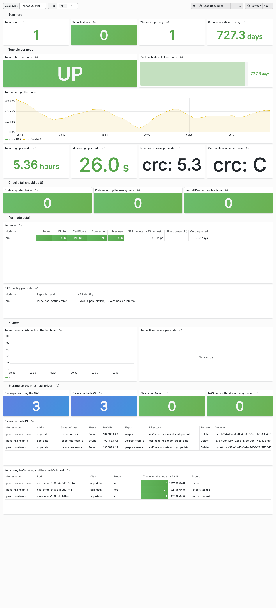
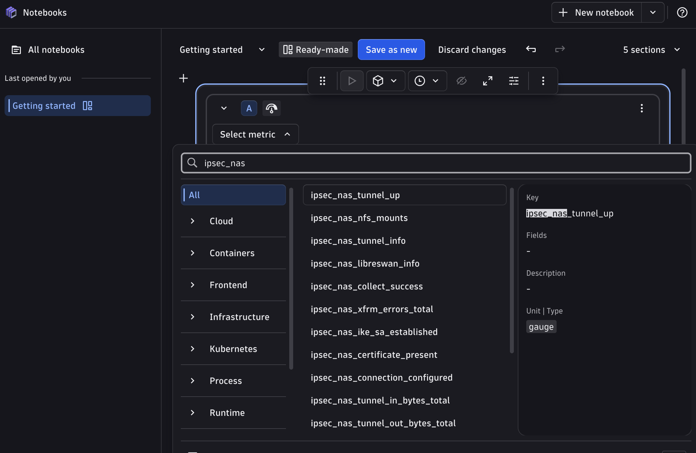

# Architecture and Design Guide — Our In-House DaemonSet and End-to-End Monitoring

**Audience:** platform engineering, architecture, security, the storage team, and the application teams who store data on the NAS. **Status:** 2026-10-08. The north star of the design, once the NAS team is on board. **Read with:** [doc 71](71-option-b-nas-team-engagement.md) (the NAS-team meeting), [doc 72](72-option-b-implementation-plan.md) (the implementation plan and the PoC), [doc 73](73-runbook-node-certificate-revocation.md) (revocation), and the decks: [Option B](deck/option-b/README.md) and [Architecture and Design](deck/architecture/README.md).

**Contents:** [1. The north star](#1-the-north-star) · [2. Our in-house DaemonSet](#2-our-in-house-daemonset-ipsec-cert-sync) · [3. Prometheus metrics](#3-prometheus-metrics) · [4. From the node to every dashboard](#4-from-the-node-to-every-dashboard) · [5. The dashboard: Perses and Grafana](#5-the-dashboard-perses-and-grafana) · [6. Why a dashboard is critical for NAS encryption](#6-why-a-dashboard-is-critical-for-nas-encryption) · [7. Self-service](#7-self-service) · [8. Dynatrace and other APMs](#8-dynatrace-and-other-apms) · [9. What is measured, and what is not](#9-what-is-measured-and-what-is-not) · [Diagram sources](#diagram-sources)

## 1. The north star

Every OpenShift node that mounts the NAS has **its own certificate** from the enterprise CA and **its own IPsec tunnel** to the NAS, set up with no step by hand, and **reports its own state**: whether its tunnel is up, when its certificate expires, whether its NFS traffic goes through the tunnel. One pod per node, from our in-house DaemonSet, does both: it keeps the node's certificate in place, and it publishes the node's state as Prometheus metrics that OpenShift's monitoring, the console, Grafana and Dynatrace all read from the same endpoint.

<!-- markdownlint-disable MD033 -->
<picture>
  <source media="(prefers-color-scheme: dark)" srcset="diagrams/option-b-workflow/option-b-onboarding.dark.png">
  <source media="(prefers-color-scheme: light)" srcset="diagrams/option-b-workflow/option-b-onboarding.light.png">
  
</picture>
<!-- markdownlint-enable MD033 -->

*Figure 1. End to end: day 0 once per cluster, then every node by itself, steps ① to ⑩. Step ⑤, ⑥ and ⑩ are our DaemonSet's pod on that node. (Doc 72, section 5.)*

## 2. Our in-house DaemonSet, `ipsec-cert-sync`

OpenShift has no built-in way to put a **different** certificate on each node: a MachineConfig reaches a whole MachineConfigPool, and RHCOS is not changed by hand ([doc 72, section 2](72-option-b-implementation-plan.md#2-why-there-is-no-turnkey-solution-on-openshift)). We built the missing piece: the `ipsec-cert-sync` DaemonSet in our chart ([`charts/ipsec-nas`](../charts/ipsec-nas/README.md)). It runs exactly one pod on each node that gets a tunnel, and that pod works only on its own node.

| Container | Privilege | What it does | Why it is built this way |
|---|---|---|---|
| **`sync`** | Privileged, the host mounted | Imports **its node's** certificate (the Secret Kyverno mounts into this pod only) into the node's NSS database as `left_server`, labels the node `ipsec.kcs.io/cert-ready=true`, re-imports and restarts the tunnel when cert-manager renews, and restarts a tunnel NetworkManager reports as up while libreswan has none | The only way to write a per-node file on RHCOS without a MachineConfig and a reboot. The private key is removed from the node's disk right after the import |
| **`collector`** | Privileged, the host mounted **read-only** | Every 30 s reads the node: libreswan's tunnel and IKE state, the certificate in NSS, the NetworkManager connection, the kernel's IPsec drop counters, the NFS mounts; writes 16 metric families to a file | Read-only: it changes nothing on the host. It reads what only the host can tell |
| **`metrics`** | **Unprivileged** | Serves that file on port 9754, `/metrics` | The pod's only network listener has no privilege and no host access |

Design rules it follows:

- **One pod, one node, one identity.** The DaemonSet pins each pod to its node; Kyverno gives that pod that node's Secret and no other ([doc 20](20-option-b-per-node-certificates.md#20-how-it-works)). A node's data is reported by that node's pod, labelled with its `node`; OpenShift's monitoring adds the `exporter_node` it scraped, and two checks catch a pod that reports the wrong node or a node reported twice.
- **No reboot, no MachineConfig, no step by hand.** Joining, renewal and leaving are automatic; only revoking a removed node's certificate is a person's job ([doc 73](73-runbook-node-certificate-revocation.md)).
- **Self-healing.** Every 5 minutes it checks the certificate and the tunnel, and repairs what it can.
- **One collector for every option.** The same collector code (`shared/collector/`) runs in Option B's DaemonSet and in Option C's metrics-only DaemonSet, so every option reports the same metrics.

## 3. Prometheus metrics

**The proposal: every node's IPsec state as Prometheus metrics.** Prometheus's text format is what OpenShift's own monitoring scrapes, what the console's dashboards read, and what Grafana and Dynatrace read without an adapter. Publishing it once, per node, gives every consumer the same data.

What is collected, grouped by the question it answers (the full table, with the source of each metric on the host, is in [doc 60](60-monitoring-per-node.md#what-is-collected)):

| Question | Metrics |
|---|---|
| Is the node's tunnel up? | `ipsec_nas_tunnel_up`, `ipsec_nas_ike_sa_established`, `ipsec_nas_connection_configured`, `ipsec_nas_tunnel_established_timestamp_seconds` |
| Is its certificate in place, and for how long? | `ipsec_nas_certificate_present`, `ipsec_nas_certificate_not_after_timestamp_seconds`, `ipsec_nas_certificate_import_timestamp_seconds`, `ipsec_nas_certificate_source_info` |
| Does NFS go through it? | `ipsec_nas_tunnel_in_bytes_total`, `ipsec_nas_tunnel_out_bytes_total`, `ipsec_nas_nfs_mounts` |
| Is the kernel dropping IPsec packets? | `ipsec_nas_xfrm_errors_total{counter}` |
| Who is the NAS, and which libreswan? | `ipsec_nas_tunnel_info{peer_id}`, `ipsec_nas_libreswan_info{version}` |
| Can the numbers be trusted? | `ipsec_nas_collect_success`, `ipsec_nas_collect_timestamp_seconds` |

The 12 alerts ([doc 60, *Alerts*](60-monitoring-per-node.md#alerts)), each for one node:

| Severity | Alerts |
|---|---|
| Critical | `IpsecNasTunnelDown` (5 min), `IpsecNasCertificateExpired`, `IpsecNasCertificateMissing` (10 min), `IpsecNasNfsWithoutTunnel` (5 min) |
| Warning | `IpsecNasLibreswanNotAnswering`, `IpsecNasCertificateExpiringSoon`, `IpsecNasMetricsStale`, `IpsecNasExporterMissing`, `IpsecNasNodeLabelMismatch`, `IpsecNasDuplicateNode`, `IpsecNasConnectionMissing`, `IpsecNasTunnelFlapping` |

## 4. From the node to every dashboard

<!-- markdownlint-disable MD033 -->
<picture>
  <source media="(prefers-color-scheme: dark)" srcset="diagrams/observability/observability.dark.png">
  <source media="(prefers-color-scheme: light)" srcset="diagrams/observability/observability.light.png">
  
</picture>
<!-- markdownlint-enable MD033 -->

*Figure 2. One endpoint per node, every consumer. Solid: built and measured in the lab (Dynatrace on a trial tenant). Dashed: another APM, proposed.*

```text
each node: ipsec-cert-sync pod
  sync (privileged)       imports this node's certificate, labels the node, restarts a stuck tunnel
  collector (privileged,  reads the host every 30 s → a file with 16 metric families
             host read-only)
  metrics (unprivileged)  serves the file on :9754/metrics
the cluster:
  Service ipsec-nas-metrics (headless) + ServiceMonitor ipsec-nas, every 30 s
    → user workload Prometheus (node, exporter_node; PrometheusRule: 12 alerts → Alertmanager)
    → Thanos Querier :9091 (readers: cluster-monitoring-view) → Perses in the console (COO), Grafana
outside:
  the same Service, annotated metrics.dynatrace.com/* → Dynatrace ActiveGate → Dynatrace   (measured, trial)
  any APM that reads Prometheus text, from :9754 or from Thanos                            (proposed)
```

## 5. The dashboard: Perses and Grafana

**One dashboard, two viewers.** It is written once, as a Grafana file (`charts/ipsec-nas/files/ipsec-nas.json`), and generated into the Perses dashboard the OpenShift console shows (through the Cluster Observability Operator) and into Option C's copy ([doc 61](61-perses-dashboard-review.md)). The console is where operators and application teams already are; Grafana is there for teams that use it.

<!-- markdownlint-disable MD033 -->
<picture>
  <source media="(prefers-color-scheme: dark)" srcset="images/crc/61-console-perses-two-tables.dark.png">
  <source media="(prefers-color-scheme: light)" srcset="images/crc/61-console-perses-two-tables.light.png">
  
</picture>
<!-- markdownlint-enable MD033 -->

*Figure 3. The dashboard in the lab's own OpenShift console, as a namespace reader (doc 61, Capture 8): all six sections.*

Each section answers one question; the data behind it was chosen because it answers that question and nothing else:

| Section | The question | Why this data |
|---|---|---|
| **Summary** | Is anything wrong? | Tunnels up and down, workers reporting, the soonest certificate expiry: the four numbers an on-call engineer needs first |
| **Tunnels per node** | Which node, and how is it doing? | State, certificate time left, traffic, tunnel age (a young tunnel means a recent restart), metrics age (an old one means a stopped collector), libreswan version, how the certificate got there |
| **Checks (all should be 0)** | Can these numbers be trusted? | A node reported twice, a pod reporting the wrong node, kernel IPsec drops |
| **Per-node detail** | **Why** is a tunnel down? | Certificate, connection, IKE login, libreswan answering, NFS mounts and requests, drops, last import: each "no" points at one cause |
| **History** | Is it getting worse? | Tunnel re-establishments (the flapping alert's threshold) and kernel drops over time |
| **Storage on the NAS** | Who stores data on the NAS, and can their pods reach it? | Every claim with its NAS IP, export and directory; every pod with its node's tunnel UP, DOWN or NO COLLECTOR |

<!-- markdownlint-disable MD033 -->
<picture>
  <source media="(prefers-color-scheme: dark)" srcset="images/crc/61-grafana-two-tables.dark.png">
  <source media="(prefers-color-scheme: light)" srcset="images/crc/61-grafana-two-tables.light.png">
  
</picture>
<!-- markdownlint-enable MD033 -->

*Figure 4. The same dashboard in Grafana, loaded on the cluster from a ConfigMap (doc 61, Capture 9).*

## 6. Why a dashboard is critical for NAS encryption

IPsec to a NAS fails in ways an application cannot see: NFS mounts are `hard`, so when the tunnel goes, the application's reads and writes **hang** rather than fail. Without per-node data, every one of these looks like "the application is stuck". Each row was seen in the lab, except where it says otherwise:

| What happened | What the application sees | What the dashboard and alerts show |
|---|---|---|
| The NAS and the node disagree on the tunnel's traffic selectors (evidence 62) | NFS hangs | IKE login YES, tunnel DOWN: `IpsecNasTunnelDown` |
| NetworkManager reports the connection up, libreswan has no tunnel (evidence 36, 62) | NFS hangs | Connection YES, tunnel DOWN; the `sync` container restarts it |
| The tunnel restarts again and again (doc 60) | Short stalls | Tunnel age stays young; `IpsecNasTunnelFlapping` (tunnel up alone does not show it) |
| The certificate is close to expiry, or missing | Nothing yet, then NFS hangs | Certificate days left; `IpsecNasCertificateExpiringSoon`, `…Missing` |
| NFS still runs on a node whose tunnel is down | Cleartext NFS the NAS drops | `IpsecNasNfsWithoutTunnel`, from the node's own NFS counters |
| A pod reports the wrong node, or a node twice (fault-injected on a three-node cluster) | — | The Checks section and `IpsecNasNodeLabelMismatch`, `IpsecNasDuplicateNode` |
| The kernel drops IPsec packets | Possibly slow or stalled NFS (not reproduced in the lab) | Kernel IPsec errors, per node and counter |
| An application's pod runs on a node with no working tunnel | Its NFS hangs | Storage section: that pod's row, DOWN or NO COLLECTOR |

<!-- markdownlint-disable MD033 -->
<picture>
  <source media="(prefers-color-scheme: dark)" srcset="images/kind/dashboard-faults.dark.png">
  <source media="(prefers-color-scheme: light)" srcset="images/kind/dashboard-faults.light.png">
  
</picture>
<!-- markdownlint-enable MD033 -->

*Figure 5. The checks catching two injected faults on a three-node cluster (doc 60, Capture 1; kind nodes have no libreswan, so their IPsec columns are DOWN by design).*

## 7. Self-service

The dashboard is built so that the people affected can answer their own question first:

- **Application teams** open the console, in the project where the dashboard lives, and see whether their pods' nodes have a working tunnel (the Storage section), without a ticket.
- **Who can see it** was decided for self-service ([doc 61, *Decision*](61-perses-dashboard-review.md#decision-one-data-source-on-thanos-port-9091-metrics-readable-by-namespace-owners)): the metrics hold no personal or health data, so readers need only `view` in the dashboard's project and `cluster-monitoring-view`, which the platform grants to groups.
- **The storage team** sees each node's view of the tunnel and the NAS identity it presented, without access to the cluster's nodes.

## 8. Dynatrace and other APMs

Because the data is Prometheus, an enterprise monitoring tool can take it as it is.

**Dynatrace, measured on a trial tenant** ([doc 62](62-dynatrace-operator-on-openshift.md#the-ipsec-metrics-in-dynatrace), evidence 55): with the Dynatrace Operator on the cluster and the tenant's setting *Monitor annotated Prometheus exporters* on, the chart value `metrics.dynatrace.scrape: true` annotates the metrics Service, and the ActiveGate scrapes every node's pod. The metrics arrive under their own names, gauges as gauges and counters as counters, with each node's series.

<!-- markdownlint-disable MD033 -->

<!-- markdownlint-enable MD033 -->

*Figure 6. The `ipsec_nas_*` metrics in Dynatrace, from the lab cluster (doc 62).*

**Any other APM that reads Prometheus** can take the same data in one of two ways, neither tested here: scraping each pod's `:9754/metrics` (through the headless Service), or reading OpenShift's monitoring through Thanos. No change to the DaemonSet is needed for either; that is the point of publishing Prometheus.

## 9. What is measured, and what is not

| Measured (lab) | Not measured |
|---|---|
| The DaemonSet end to end on OpenShift: certificate, import, NNCP, tunnel, renewal (docs 20, 30; evidence 29) | More than one OpenShift node with real IPsec (the lab cluster has one) |
| Per-node integrity on a three-node cluster: each pod's data on its own node, faults caught (doc 60) | The enterprise NAS, Venafi issuance (the PoC, doc 72) |
| The dashboard in the console and in Grafana, every panel answering (doc 61) | An APM other than Dynatrace |
| Dynatrace receiving the metrics (doc 62) | Dynatrace dashboards and alerts of our own (the extension, issue #47, parked) |

## Diagram sources

Figure 2 is [`diagrams/observability/source.html`](diagrams/observability/source.html); Figure 1 is [`diagrams/option-b-workflow/source.html`](diagrams/option-b-workflow/source.html). Re-render with the diagram kit (`diagram-render <page> <out-dir> <names>`, light and dark). The page, its PNGs and the text twin here change together.
