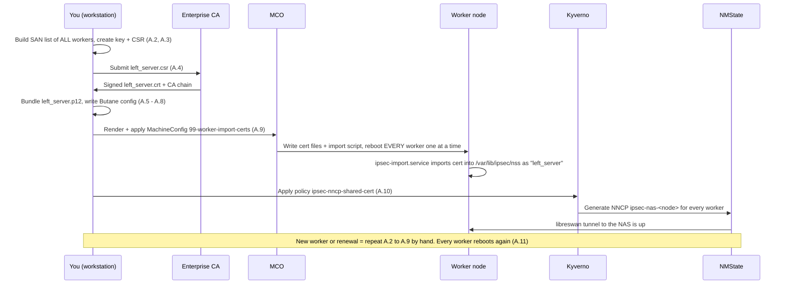
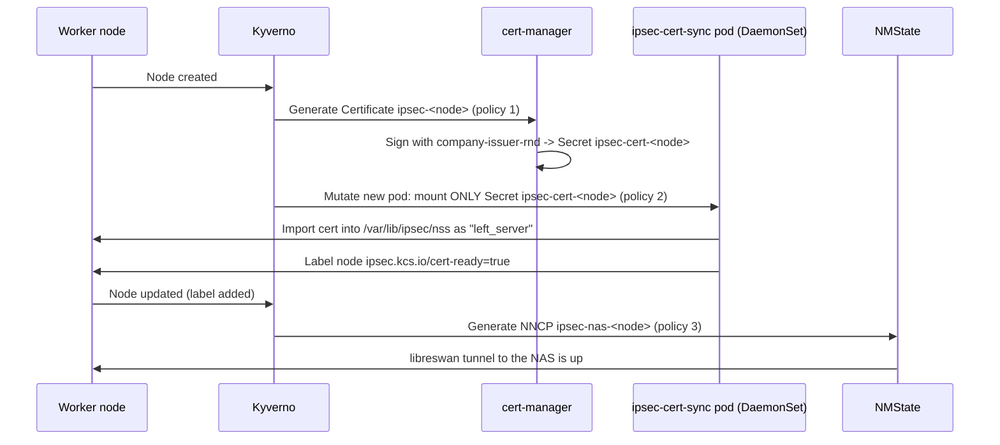

# IPsec from OpenShift Worker Nodes to the NAS — Guide

**Team:** KCS OpenShift  **Audience:** junior/new platform engineers  **Tested design target:** OpenShift 4.19, RHCOS workers

This guide encrypts NFS traffic between every **worker node** and the **external NAS** using IPsec (libreswan, transport mode), configured through the **NMState Operator** and automated with **Kyverno**.

You will pick **one** of two certificate options:

| | **Option A – Shared certificate** | **Option B – Per-node certificates (recommended)** |
|---|---|---|
| How certs get to nodes | One `.p12` baked into a MachineConfig | cert-manager issues one cert per node; a DaemonSet imports it |
| Red Hat documented? | **Yes**, this is the documented procedure | NMState/IPsec part is documented; **cert delivery is our own design** |
| Adding a worker node | **Manual**: re-issue cert, re-roll MachineConfig → **every worker reboots** | **Automatic**: no manual steps, no reboots |
| Certificate renewal | **Manual**: same as above, on a deadline | **Automatic** (cert-manager), short tunnel restart per node |
| Revoke a single node | **Not possible**: one key everywhere | Yes |
| Extra components | None | Kyverno, cert-manager, one privileged DaemonSet |

> [!CAUTION]
> **Do not run Option A and Option B on the same cluster.** Both import a certificate into each node's NSS database under the nickname `left_server`, and they will overwrite each other.

---

## Table of contents

- [Part 0 – Before you start](#part-0--before-you-start)
- [Part 1 – Common cluster preparation (both options)](#part-1--common-cluster-preparation-both-options)
- [Part 2 – Option A: one shared certificate](#part-2--option-a-one-shared-certificate)
- [Part 3 – Option B: per-node certificates with cert-manager + Kyverno](#part-3--option-b-per-node-certificates-with-cert-manager--kyverno)
- [Part 4 – NAS side, verification, troubleshooting, teardown](#part-4--nas-side-verification-troubleshooting-teardown)

---

## Part 0 – Before you start

### 0.1 Words you will see

| Term | Meaning |
|---|---|
| **NNCP** | `NodeNetworkConfigurationPolicy`: tells the NMState Operator how to configure networking on a node. Here it creates the IPsec tunnel. |
| **NNCE** | `NodeNetworkConfigurationEnactment`: the per-node result of an NNCP. This is where you look for errors. |
| **NSS database** | The certificate store libreswan uses on each node: `/var/lib/ipsec/nss`. |
| **`left` / `right`** | libreswan terms. `left` = the OpenShift node, `right` = the NAS. |
| **Kyverno** | Policy engine. We use it to **generate** one object per node (NNCP, Certificate) and to **mutate** pods. |
| **cert-manager** | Issues and renews certificates from a `ClusterIssuer`. Ours is `company-issuer-rnd`. |
| **MCO / MachineConfig** | Machine Config Operator. Changing a MachineConfig **reboots nodes one at a time**. |

### 0.2 Requirements checklist

- [ ] You are `cluster-admin` (`oc whoami` and `oc auth can-i '*' '*' --all-namespaces` returns `yes`).
- [ ] Platform is **bare metal, vSphere, RHOSP or Google Cloud**. External IPsec is not supported on other platforms, on **RHEL compute nodes**, or with **hosted control planes**.
- [ ] Every worker FQDN `<node-name>.<NODE_DOMAIN>` **resolves in DNS** to that node's IP. libreswan and the certificates use this name.
- [ ] Firewalls allow **UDP 500**, **UDP 4500** and **ESP (IP protocol 50)** between all workers and the NAS.
- [ ] The NAS supports **IKEv2, transport mode and certificate (PKI) authentication**, and trusts our enterprise root CA.
- [ ] The **storage team** has a ticket to create the **NAS (`right`) certificate** and IPsec policy (see [4.1](#41-nas-configuration-storage-team-not-us)). We do not create the NAS certificate.
- [ ] Tools on your workstation: `oc`, `openssl`, `helm` (Part 1), `butane` (Option A only).
- [ ] A **change window** has been approved: Part 1 reboots every node at least once.
- [ ] **Option B only:** the cert-manager Operator is installed and `ClusterIssuer/company-issuer-rnd` is `Ready`.

### 0.3 Open a shell and set variables

Every command below uses these variables. **Set them in every new terminal.**

```bash
# Stop bash from treating "!" specially, so the heredocs below paste cleanly
set +H

# ---- CHANGE THESE ----
export NODE_DOMAIN="ocp.example.com"   # worker FQDN = <node-name>.${NODE_DOMAIN}
export NAS_FQDN="nas01.example.com"    # NAS hostname (must match the NAS certificate)
export NAS_IP="10.10.10.50"            # NAS NFS data IP
# ----------------------

# Butane version = your cluster's x.y with .0 on the end (e.g. 4.19.0)
export OCP_VERSION="$(oc get clusterversion version -o jsonpath='{.status.desired.version}' | cut -d. -f1,2).0"

# Working folder for files we create
mkdir -p ~/ipsec-nas && cd ~/ipsec-nas
echo "Domain=${NODE_DOMAIN} NAS=${NAS_FQDN}/${NAS_IP} Butane=${OCP_VERSION}"
```

> [!TIP]
> **About `cat <<EOF` vs `cat <<'EOF'`:** with `<<EOF`, bash **replaces** `${VARIABLES}` inside the block. With `<<'EOF'` (quoted), the text is written **exactly as typed**. Each step uses the right one, so copy the blocks exactly.

---

## Part 1 – Common cluster preparation (both options)

### Step 1.1 – Confirm platform and node OS

```bash
oc get clusterversion
oc get infrastructure cluster -o jsonpath='{.status.platformStatus.type}{"\n"}'
oc get nodes -o wide        # OS-IMAGE column must say "Red Hat Enterprise Linux CoreOS"
```

✅ **Expected:** a supported platform (`BareMetal`, `VSphere`, `OpenStack`, `GCP`), and all nodes on RHCOS.

### Step 1.2 – Check the cluster MTU

Red Hat lists **"cluster MTU reduced by 46 bytes"** (room for the IPsec ESP header) as a prerequisite for enabling IPsec.

```bash
oc get network.config cluster -o jsonpath='{.status.clusterNetworkMTU}{"\n"}'
```

If the MTU has **not** already been lowered, follow the Red Hat procedure **"Changing the MTU for the cluster network"** in a change window, with a senior engineer. It reboots nodes. Confirm with Red Hat whether this is required for **External-only** mode in our environment before scheduling it.

### Step 1.3 – Enable `routingViaHost`

External IPsec requires OVN-Kubernetes to route egress traffic through the **host's** routing table.

```bash
oc patch networks.operator.openshift.io cluster --type=merge -p \
'{"spec":{"defaultNetwork":{"ovnKubernetesConfig":{"gatewayConfig":{"routingViaHost":true}}}}}'
```

Verify:

```bash
oc get networks.operator.openshift.io cluster \
  -o jsonpath='{.spec.defaultNetwork.ovnKubernetesConfig.gatewayConfig.routingViaHost}{"\n"}'
oc get pods -n openshift-ovn-kubernetes -w     # wait until ovnkube-node pods are all Running again, then Ctrl+C
```

✅ **Expected:** `true`.

> [!WARNING]
> `routingViaHost` changes how **all** pod egress leaves the node. If you use egress IPs, egress routers or custom host routes, review the impact before production.

### Step 1.4 – Enable IPsec in **External** mode

`External` = encrypt traffic to external hosts only. Pod-to-pod traffic is **not** encrypted.

```bash
oc patch networks.operator.openshift.io cluster --type=merge -p \
'{"spec":{"defaultNetwork":{"ovnKubernetesConfig":{"ipsecConfig":{"mode":"External"}}}}}'
```

This makes the Cluster Network Operator add the libreswan extension to every node (`80-ipsec-*-extensions` MachineConfigs), which **reboots each node once**.

Watch the rollout:

```bash
oc get mc | grep ipsec           # expect 80-ipsec-master-extensions and 80-ipsec-worker-extensions
watch oc get mcp                 # wait until UPDATED=True, UPDATING=False, DEGRADED=False for ALL pools
```

✅ **Expected:** both pools updated, and `mode` shows `External`:

```bash
oc get networks.operator.openshift.io cluster \
  -o jsonpath='{.spec.defaultNetwork.ovnKubernetesConfig.ipsecConfig.mode}{"\n"}'
```

### Step 1.5 – Install the NMState Operator

```bash
cat <<'EOF' > 01-nmstate-operator.yaml
apiVersion: v1
kind: Namespace
metadata:
  name: openshift-nmstate
  labels:
    name: openshift-nmstate
---
apiVersion: operators.coreos.com/v1
kind: OperatorGroup
metadata:
  name: openshift-nmstate
  namespace: openshift-nmstate
spec:
  targetNamespaces:
  - openshift-nmstate
---
apiVersion: operators.coreos.com/v1alpha1
kind: Subscription
metadata:
  name: kubernetes-nmstate-operator
  namespace: openshift-nmstate
spec:
  channel: stable
  installPlanApproval: Automatic
  name: kubernetes-nmstate-operator
  source: redhat-operators
  sourceNamespace: openshift-marketplace
EOF

oc apply -f 01-nmstate-operator.yaml
```

Wait for the operator:

```bash
watch oc get csv -n openshift-nmstate      # wait for PHASE=Succeeded, then Ctrl+C
```

Create the `NMState` instance, which starts the per-node handlers:

```bash
cat <<'EOF' > 02-nmstate-instance.yaml
apiVersion: nmstate.io/v1
kind: NMState
metadata:
  name: nmstate
EOF

oc apply -f 02-nmstate-instance.yaml
oc get pods -n openshift-nmstate           # nmstate-handler pod on every node, all Running
```

### Step 1.6 – Install Kyverno

Kyverno is installed with Helm. On OpenShift 4.11+ the chart deploys as-is under the `restricted-v2` SCC.

> [!IMPORTANT]
> Kyverno is a **community project, not Red Hat-supported**. Use the chart version approved by our change process (`--version`), and the internal mirror if the cluster is disconnected. This guide needs **Kyverno 1.13 or later**.

```bash
helm repo add kyverno https://kyverno.github.io/kyverno/
helm repo update

helm install kyverno kyverno/kyverno -n kyverno --create-namespace \
  --set admissionController.replicas=3 \
  --set backgroundController.replicas=2 \
  --set cleanupController.replicas=2 \
  --set reportsController.replicas=2
```

Verify:

```bash
oc get pods -n kyverno                     # all Running
oc get deploy -n kyverno -o jsonpath='{range .items[*]}{.metadata.name}{"  "}{.spec.template.spec.containers[0].image}{"\n"}{end}'
```

✅ **Expected:** image tags are `v1.13` or later.

### Step 1.7 – Give Kyverno permission to create NNCPs and Certificates

By default Kyverno cannot create these resource types. This ClusterRole is **aggregated** into Kyverno's own roles through the labels.

```bash
cat <<'EOF' > 03-kyverno-rbac.yaml
apiVersion: rbac.authorization.k8s.io/v1
kind: ClusterRole
metadata:
  name: kyverno:ipsec-nas-generate
  labels:
    rbac.kyverno.io/aggregate-to-background-controller: "true"
    rbac.kyverno.io/aggregate-to-admission-controller: "true"
rules:
# NMState policies (both options)
- apiGroups: ["nmstate.io"]
  resources: ["nodenetworkconfigurationpolicies"]
  verbs: ["get", "list", "watch", "create", "update", "patch", "delete"]
# cert-manager Certificates (Option B only, harmless for Option A)
- apiGroups: ["cert-manager.io"]
  resources: ["certificates"]
  verbs: ["get", "list", "watch", "create", "update", "patch", "delete"]
EOF

oc apply -f 03-kyverno-rbac.yaml
```

### ✅ Part 1 checklist

- [ ] MTU checked (and lowered if required)
- [ ] `routingViaHost: true`
- [ ] `ipsecConfig.mode: External`, all MCPs `UPDATED=True`
- [ ] NMState Operator `Succeeded`, `NMState` instance created
- [ ] Kyverno running (≥ 1.13), RBAC applied

**Now go to Part 2 (Option A) _or_ Part 3 (Option B). Not both.**

---

## Part 2 – Option A: one shared certificate

### 2.0 How it works

This is the **Red Hat documented** method. One certificate and private key are copied to **every worker** through a MachineConfig. You create the certificate by hand, so **every worker reboots** each time it changes.



What each piece does:

| Piece | Job |
|---|---|
| **You** (workstation) | Build the SAN list of every worker, create the key and CSR, bundle `left_server.p12`. Nothing here is automatic. |
| **Enterprise CA** | Signs the CSR. One certificate for all workers, no automatic renewal. |
| **MachineConfig** `99-worker-import-certs` | Copies `ca.pem`, `left_server.p12` and the import script to every worker. Applying it makes the MCO reboot every worker, one at a time. |
| **`ipsec-import.service`** | Runs on each worker at boot, before libreswan (`ipsec.service`). Imports the certificate into the node's NSS DB as `left_server`. |
| **Policy** `ipsec-nncp-shared-cert` | For every worker, create the NNCP `ipsec-nas-<node>`. Unlike Option B's policy 3, it does **not** wait for the certificate, so finish Step A.9 before applying it. |

> [!CAUTION]
> ### Risks of the shared certificate. Read before choosing Option A.
>
> 1. **Scaling up is a manual, disruptive procedure.** Each node's `left` name must be in the certificate's SAN list. A new worker is **not** in the SAN, so its tunnel cannot be set up correctly until you re-issue the certificate with the new name **and** roll a new MachineConfig, which **reboots every worker in the pool** (rolling, one at a time). With the MachineAutoscaler or MachineSet scaling, new nodes arrive **without working IPsec** until someone does this by hand.
> 2. **Renewal is the same disruptive procedure**, and it has a hard deadline (certificate expiry). A missed renewal takes down IPsec for **all** nodes at once.
> 3. **One private key on every node.** If any single node is compromised, the attacker can impersonate **every** node to the NAS.
> 4. **You cannot revoke one node.** Revoking the cert breaks all nodes.
> 5. **The private key is readable in the cluster API.** It is embedded in the MachineConfig, so anyone who can read `machineconfigs` can extract it.
> 6. **Same identity from every node.** The NAS sees N peers with the same certificate identity. Many IPsec stacks (libreswan's default `uniqueids=yes`) treat this as "the same peer reconnected" and **drop the previous node's tunnel**. The NAS must be configured to allow duplicate IDs.
>
> **Correction to a common assumption:** re-issuing does **not** require taking the whole cluster down. The MCO reboots nodes **one at a time**. It is still a full-pool reboot every time you add a node or renew, which is why **Option B is recommended**.
>
> **Partial mitigation:** a **wildcard SAN** (e.g. `DNS:*.ocp.example.com`) avoids re-issuing on scale-up, **if** our CA policy allows wildcards. It does not fix risks 2–6 and widens what the certificate is trusted for.

### Step A.1 – Install Butane

```bash
curl -sSL https://mirror.openshift.com/pub/openshift-v4/clients/butane/latest/butane --output butane
chmod +x butane && sudo mv butane /usr/local/bin/
butane --version
```

### Step A.2 – Build the SAN list from the current workers

```bash
SAN_LIST=$(oc get nodes -l node-role.kubernetes.io/worker \
  -o jsonpath='{range .items[*]}{.metadata.name}{"\n"}{end}' \
  | sed "s/.*/DNS:&.${NODE_DOMAIN}/" | paste -sd, -)

echo "${SAN_LIST}"
```

✅ **Expected:** something like `DNS:worker-0.ocp.example.com,DNS:worker-1.ocp.example.com,...`, one entry per worker.

> [!NOTE]
> Save this list in the change ticket. You will rebuild it every time a worker is added (see Step A.11).

### Step A.3 – Create the private key and CSR

```bash
openssl req -new -newkey rsa:3072 -nodes \
  -keyout left_server.key -out left_server.csr \
  -subj "/CN=ocp-ipsec-workers/O=KCS" \
  -addext "subjectAltName=${SAN_LIST}"

# Check what you are about to send to the CA
openssl req -in left_server.csr -noout -text | grep -A1 "Subject Alternative Name"
```

Rules:
- The **CN must not start with `ovs_`**, because that clashes with OpenShift's own IPsec certificates.
- Keep the key **RSA**, because the NNCP uses `leftrsasigkey: '%cert'`.
- `left_server.key` is the **private key**. Keep it in a protected location and never commit it to Git.

### Step A.4 – Get the CSR signed by the enterprise CA

Submit `left_server.csr` to the enterprise CA. Ask for a template with:
- **Key usage:** Digital Signature, Key Encipherment
- **Extended key usage:** Server Authentication **and** Client Authentication

You get back:
- `left_server.crt`, the signed certificate
- The CA chain: the **root** certificate and any **intermediate** certificates

If the CA gives you `.cer` / DER files, convert them to PEM:

```bash
openssl x509 -inform der -in left_server.cer       -out left_server.crt
openssl x509 -inform der -in enterprise-root.cer   -out enterprise-root.pem
openssl x509 -inform der -in intermediate.cer      -out intermediate.pem   # only if you have one
```

### Step A.5 – Create `ca.pem` (root CA only)

```bash
cp enterprise-root.pem ca.pem
openssl x509 -in ca.pem -noout -subject -issuer
```

✅ **Expected:** subject and issuer are **the same** (that is what a root CA looks like).

> **Why root only?** The node's import script runs `certutil -A` on `ca.pem`, which imports **one** certificate as the trust anchor. Intermediates go inside the `.p12` in the next step.

### Step A.6 – Bundle `left_server.p12`

```bash
openssl pkcs12 -export \
  -in left_server.crt -inkey left_server.key \
  -certfile intermediate.pem \
  -name left_server \
  -out left_server.p12 -passout pass:
```

What each part does:

| Flag | Why |
|---|---|
| `-name left_server` | Sets the **friendly name**. It becomes the certificate's nickname in the node's NSS database, and the NNCP refers to it as `leftcert: left_server`. **Must be exactly `left_server`.** |
| `-passout pass:` | **Empty password.** The import runs unattended at boot with `pk12util -W ""`, so a password would make it fail. |
| `-certfile intermediate.pem` | Adds the intermediate CA. **Remove this line** if our CA has no intermediate. |

### Step A.7 – Verify the bundle

```bash
openssl pkcs12 -in left_server.p12 -nokeys -passin pass: | grep friendlyName
openssl x509 -in left_server.crt -noout -ext subjectAltName
openssl x509 -in left_server.crt -noout -dates
```

✅ **Expected:** `friendlyName: left_server`; **every** worker FQDN in the SAN list; `notAfter` far enough in the future. Put the expiry date in the team calendar.

### Step A.8 – Write the Butane config

This creates a systemd service on every worker that imports the certificates into NSS at boot, before libreswan starts.

```bash
cat <<EOF > 99-ipsec-worker-endpoint-config.bu
variant: openshift
version: ${OCP_VERSION}
metadata:
  name: 99-worker-import-certs
  labels:
    machineconfiguration.openshift.io/role: worker
systemd:
  units:
  - name: ipsec-import.service
    enabled: true
    contents: |
      [Unit]
      Description=Import external certs into ipsec NSS
      Before=ipsec.service

      [Service]
      Type=oneshot
      ExecStart=/usr/local/bin/ipsec-addcert.sh
      RemainAfterExit=false
      StandardOutput=journal

      [Install]
      WantedBy=multi-user.target
storage:
  files:
  - path: /etc/pki/certs/ca.pem
    mode: 0400
    overwrite: true
    contents:
      local: ca.pem
  - path: /etc/pki/certs/left_server.p12
    mode: 0400
    overwrite: true
    contents:
      local: left_server.p12
  - path: /usr/local/bin/ipsec-addcert.sh
    mode: 0740
    overwrite: true
    contents:
      inline: |
        #!/bin/bash -e
        echo "importing cert to NSS"
        certutil -A -n "CA" -t "CT,C,C" -d /var/lib/ipsec/nss/ -i /etc/pki/certs/ca.pem
        pk12util -W "" -i /etc/pki/certs/left_server.p12 -d /var/lib/ipsec/nss/
        certutil -M -n "left_server" -t "u,u,u" -d /var/lib/ipsec/nss/
EOF
```

> [!NOTE]
> `ca.pem` and `left_server.p12` **must be in the current folder**. `local:` reads them from there.

### Step A.9 – Render and apply the MachineConfig

```bash
butane -d . 99-ipsec-worker-endpoint-config.bu -o 99-ipsec-worker-endpoint-config.yaml
oc apply -f 99-ipsec-worker-endpoint-config.yaml
```

> [!WARNING]
> The MCO now reboots **every worker, one at a time**. External IPsec only works once **all** of them are done.

```bash
watch oc get mcp worker          # wait for UPDATED=True, UPDATING=False, DEGRADED=False
```

Check one node:

```bash
NODE=$(oc get nodes -l node-role.kubernetes.io/worker -o jsonpath='{.items[0].metadata.name}')
oc debug node/${NODE} -- chroot /host certutil -L -d /var/lib/ipsec/nss
```

✅ **Expected:** `left_server` with trust `u,u,u` and `CA` with `CT,C,C`.

### Step A.10 – Kyverno policy: one NNCP per worker

> [!IMPORTANT]
> **Stop here until the NAS side is ready.** This step creates the NNCPs, so the storage team must have finished [4.1](#41-nas-configuration-storage-team-not-us) first.

```bash
cat <<EOF > 10-kyverno-nncp-shared-cert.yaml
apiVersion: kyverno.io/v1
kind: ClusterPolicy
metadata:
  name: ipsec-nncp-shared-cert
spec:
  # If Kyverno is down, never block Node updates
  failurePolicy: Ignore
  rules:
  - name: nncp-per-worker
    match:
      any:
      - resources:
          kinds:
          - Node
          selector:
            matchLabels:
              node-role.kubernetes.io/worker: ""
    generate:
      generateExisting: true     # also create NNCPs for workers that already exist
      synchronize: true          # Kyverno owns these NNCPs: edit the policy, not the NNCPs
      apiVersion: nmstate.io/v1
      kind: NodeNetworkConfigurationPolicy
      name: "ipsec-nas-{{ request.object.metadata.name }}"
      data:
        spec:
          nodeSelector:
            kubernetes.io/hostname: '{{ request.object.metadata.labels."kubernetes.io/hostname" }}'
          desiredState:
            interfaces:
            - name: ipsec-nas
              type: ipsec
              libreswan:
                left: "{{ request.object.metadata.name }}.${NODE_DOMAIN}"   # must be in the cert SAN
                leftid: '%fromcert'
                leftrsasigkey: '%cert'
                leftcert: left_server
                leftmodecfgclient: false
                right: ${NAS_FQDN}
                rightid: '%fromcert'
                rightrsasigkey: '%cert'
                rightsubnet: ${NAS_IP}/32
                ikev2: insist
                type: transport
                # Uncomment ONLY if the NAS requires specific proposals:
                # esp: aes_gcm256
                # ike: aes256-sha2;dh20
EOF

oc apply -f 10-kyverno-nncp-shared-cert.yaml
oc get clusterpolicy ipsec-nncp-shared-cert      # READY must be True
```

Then go to [4.2](#42-verify-end-to-end) to verify.

### Step A.11 – Scale-up procedure (every time a worker is added)

> [!CAUTION]
> Until all of these steps are done, the **new worker has no working IPsec tunnel** to the NAS.

1. Add the new worker (MachineSet scale-up, or however we normally add nodes) and wait until it is `Ready`.
2. Repeat **Step A.2** (new SAN list including the new node).
3. Repeat **Steps A.3 → A.7** (new key, new CSR, CA signs, new `.p12`).
4. Repeat **Step A.8 → A.9** (re-render and re-apply the MachineConfig). **Every worker reboots, one at a time.**
5. When `mcp/worker` is `UPDATED=True`, check the new node's NNCE (Part 4.2).
6. Update the change ticket with the new SAN list and expiry date.
7. Revoke the **old** certificate at the CA.

Renewal before expiry is the same procedure, steps 2–7.

---

## Part 3 – Option B: per-node certificates with cert-manager + Kyverno

### 3.0 How it works

Each worker gets **its own** certificate, issued automatically by `ClusterIssuer/company-issuer-rnd`. No MachineConfig is used, so **nothing reboots** when nodes are added or certificates renew.



What each piece does:

| Piece | Job |
|---|---|
| **Policy 1** `ipsec-node-certificate` | For every worker, create a cert-manager `Certificate` named `ipsec-<node>`. |
| **cert-manager** | Signs it with `company-issuer-rnd`, stores it in Secret `ipsec-cert-<node>`, renews it automatically. |
| **Policy 2** `ipsec-cert-sync-mount` | When the DaemonSet starts a pod on a node, mount **only that node's** Secret into it. |
| **DaemonSet** `ipsec-cert-sync` | Imports the cert into the node's NSS DB, labels the node `ipsec.kcs.io/cert-ready=true`, re-imports on renewal. |
| **Policy 3** `ipsec-nncp-per-node` | Only after the label appears, create the NNCP for that node. This prevents NNCPs failing because the cert isn't there yet. |

> [!IMPORTANT]
> ### Risks and responsibilities for Option B
>
> 1. **Support:** the NMState/IPsec configuration is the Red Hat documented one, but the **certificate delivery (DaemonSet + Kyverno) is our own design**. Get Red Hat's support stance on it (open a case or ask our Red Hat contact) **before production**. Kyverno itself is community software.
> 2. **The DaemonSet is privileged** (it writes to the host's NSS database). Only the platform team may have access to namespace `kcs-ipsec`. Include it in the security review.
> 3. **Private keys are stored as Secrets** in `kcs-ipsec`. Restrict `get secrets` there to the platform team, and make sure etcd encryption is enabled.
> 4. **Renewal causes a short tunnel restart** on each node (seconds). Configure the NAS to **reject non-IPsec NFS** from the worker subnet, so a restart causes an NFS retry, never cleartext traffic.
> 5. **If Kyverno is down**, new nodes don't get IPsec until it is back. Existing tunnels keep working. The policies use `failurePolicy: Ignore`, so Kyverno can never block the cluster.
> 6. **DNS:** every node FQDN must resolve, as in Part 0.
> 7. **The NAS must authorize peers by CA + worker subnet, not by individual host.** Otherwise every scale-up still needs a NAS change.

### Step B.1 – Check cert-manager and the ClusterIssuer

```bash
oc get pods -n cert-manager
oc get clusterissuer company-issuer-rnd
```

✅ **Expected:** cert-manager pods `Running`, and `READY=True` on `company-issuer-rnd`.

### Step B.2 – Create the namespace

```bash
cat <<'EOF' > 20-namespace.yaml
apiVersion: v1
kind: Namespace
metadata:
  name: kcs-ipsec
  labels:
    # The cert-sync DaemonSet must run privileged
    pod-security.kubernetes.io/enforce: privileged
    pod-security.kubernetes.io/audit: privileged
    pod-security.kubernetes.io/warn: privileged
    security.openshift.io/scc.podSecurityLabelSync: "false"
EOF

oc apply -f 20-namespace.yaml
```

### Step B.3 – Store the enterprise **root** CA

The nodes need the root CA to trust the NAS certificate. Put **only the root** certificate (PEM) in `enterprise-root.pem`.

```bash
openssl x509 -in enterprise-root.pem -noout -subject -issuer   # subject == issuer for a root

oc create configmap ipsec-trust-ca -n kcs-ipsec --from-file=ca.pem=enterprise-root.pem
```

### Step B.4 – Policy 1: one Certificate per worker

```bash
cat <<EOF > 21-kyverno-node-certificate.yaml
apiVersion: kyverno.io/v1
kind: ClusterPolicy
metadata:
  name: ipsec-node-certificate
spec:
  failurePolicy: Ignore
  rules:
  - name: certificate-per-worker
    match:
      any:
      - resources:
          kinds:
          - Node
          selector:
            matchLabels:
              node-role.kubernetes.io/worker: ""
    generate:
      generateExisting: true
      synchronize: true          # Certificate is deleted when the Node is deleted
      apiVersion: cert-manager.io/v1
      kind: Certificate
      name: "ipsec-{{ request.object.metadata.name }}"
      namespace: kcs-ipsec
      data:
        spec:
          secretName: "ipsec-cert-{{ request.object.metadata.name }}"
          commonName: "{{ request.object.metadata.name }}.${NODE_DOMAIN}"   # max 64 chars, must not start with ovs_
          dnsNames:
          - "{{ request.object.metadata.name }}.${NODE_DOMAIN}"           # must equal the NNCP "left" value
          duration: 8760h          # 1 year (the CA may override this)
          renewBefore: 720h        # renew 30 days before expiry
          privateKey:
            algorithm: RSA         # NNCP uses leftrsasigkey: '%cert'
            size: 3072
            rotationPolicy: Always # new key on every renewal
          usages:
          - digital signature
          - key encipherment
          - server auth
          - client auth
          issuerRef:
            group: cert-manager.io
            kind: ClusterIssuer
            name: company-issuer-rnd
EOF

oc apply -f 21-kyverno-node-certificate.yaml
oc get clusterpolicy ipsec-node-certificate      # READY must be True
```

Verify (give it a minute):

```bash
oc get certificate -n kcs-ipsec
```

✅ **Expected:** one `ipsec-<node>` per worker, all `READY=True`. If one is not ready, see [Troubleshooting](#43-troubleshooting).

### Step B.5 – The cert-sync script

This script runs in the DaemonSet pod on every worker. Read the comments to see what it does.

```bash
cat <<'EOF' > 22-cert-sync-script.yaml
apiVersion: v1
kind: ConfigMap
metadata:
  name: ipsec-cert-sync-script
  namespace: kcs-ipsec
data:
  sync.sh: |
    #!/bin/bash
    # ipsec-cert-sync: runs on every worker node.
    # 1) Imports THIS node's certificate (mounted at /certs by Kyverno) into the
    #    host's IPsec NSS database under the nickname "left_server".
    # 2) Labels the node ipsec.kcs.io/cert-ready=true so Kyverno creates the NNCP.
    # 3) Every 5 minutes, checks for a renewed cert and re-imports it.
    set -uo pipefail

    NSS_DB=/var/lib/ipsec/nss
    CERT_NICK=left_server
    CA_NICK=KCS-IPSEC-CA
    CONN_NAME=ipsec-nas
    READY_LABEL=ipsec.kcs.io/cert-ready
    HOST_STAGE=/etc/pki/certs/kcs-ipsec     # path as the HOST sees it
    STAGE=/host${HOST_STAGE}                # same path as this container sees it
    STAMP=${STAGE}/.installed-sha256
    CHECK_EVERY=300

    log() { echo "$(date -u +%FT%TZ) [${NODE_NAME}] $*"; }

    import_cert() {
      mkdir -p "${STAGE}" &&
      install -m 0400 /certs/tls.crt "${STAGE}/tls.crt" &&
      install -m 0400 /certs/tls.key "${STAGE}/tls.key" &&
      install -m 0444 /ca/ca.pem     "${STAGE}/ca.pem" &&
      chroot /host /bin/bash -euo pipefail -c "
        cd ${HOST_STAGE}
        # never leave the private key or p12 on the host disk
        trap 'rm -f tls.key left_server.p12' EXIT
        openssl pkcs12 -export -in tls.crt -inkey tls.key -name ${CERT_NICK} \
          -out left_server.p12 -passout pass:
        # remove the previous cert + key (ignore errors on first run)
        certutil -F -n ${CERT_NICK} -d ${NSS_DB} >/dev/null 2>&1 || true
        certutil -D -n ${CERT_NICK} -d ${NSS_DB} >/dev/null 2>&1 || true
        certutil -A -n ${CA_NICK} -t 'CT,C,C' -d ${NSS_DB} -i ca.pem
        pk12util -W '' -i left_server.p12 -d ${NSS_DB}
        certutil -M -n ${CERT_NICK} -t 'u,u,u' -d ${NSS_DB}
      "
    }

    log "Starting"
    while true; do
      if [[ -s /certs/tls.crt && -s /certs/tls.key && -s /ca/ca.pem ]]; then
        want=$(cat /certs/tls.crt /ca/ca.pem | sha256sum | cut -d' ' -f1)
        have=$(cat "${STAMP}" 2>/dev/null || echo none)
        # If the cert is missing from NSS (e.g. DB rebuilt), force a re-import
        chroot /host certutil -L -n "${CERT_NICK}" -d "${NSS_DB}" >/dev/null 2>&1 || have=missing

        if [[ "${want}" != "${have}" ]]; then
          log "New or renewed certificate detected - importing into NSS"
          if import_cert; then
            echo "${want}" > "${STAMP}"
            log "Import OK"
            # On renewal, restart the tunnel so libreswan loads the new cert
            if chroot /host nmcli -t -f NAME connection show --active | grep -qx "${CONN_NAME}"; then
              log "Restarting ${CONN_NAME} to load the new certificate"
              chroot /host nmcli connection up "${CONN_NAME}" || log "WARNING: restart of ${CONN_NAME} failed"
            fi
          else
            log "ERROR: import failed - retrying in 60s"
            sleep 60
            continue
          fi
        fi

        current=$(oc get node "${NODE_NAME}" -o jsonpath="{.metadata.labels.ipsec\.kcs\.io/cert-ready}" 2>/dev/null)
        if [[ "${current}" != "true" ]]; then
          oc label node "${NODE_NAME}" "${READY_LABEL}=true" --overwrite \
            && log "Node labelled ${READY_LABEL}=true"
        fi
      else
        log "Waiting for certificate files in /certs (is Certificate ipsec-${NODE_NAME} Ready?)"
      fi
      sleep "${CHECK_EVERY}"
    done
EOF

oc apply -f 22-cert-sync-script.yaml
```

### Step B.6 – ServiceAccount, permissions and SCC for the DaemonSet

The pod only needs to **read and label its node**. It gets **no** permission to read Secrets. Its own certificate is mounted by the kubelet (Step B.7).

```bash
cat <<'EOF' > 23-cert-sync-rbac.yaml
apiVersion: v1
kind: ServiceAccount
metadata:
  name: ipsec-cert-sync
  namespace: kcs-ipsec
---
apiVersion: rbac.authorization.k8s.io/v1
kind: ClusterRole
metadata:
  name: ipsec-cert-sync-label-node
rules:
- apiGroups: [""]
  resources: ["nodes"]
  verbs: ["get", "patch"]
---
apiVersion: rbac.authorization.k8s.io/v1
kind: ClusterRoleBinding
metadata:
  name: ipsec-cert-sync-label-node
roleRef:
  apiGroup: rbac.authorization.k8s.io
  kind: ClusterRole
  name: ipsec-cert-sync-label-node
subjects:
- kind: ServiceAccount
  name: ipsec-cert-sync
  namespace: kcs-ipsec
EOF

oc apply -f 23-cert-sync-rbac.yaml
oc adm policy add-scc-to-user privileged -z ipsec-cert-sync -n kcs-ipsec
```

### Step B.7 – Policy 2: mount each node's own certificate into its pod

A DaemonSet has **one** pod template, but each node needs a **different** Secret. When the DaemonSet creates a pod for a node, this policy rewrites the pod's `node-cert` volume to point at **that node's** Secret.

> **How does Kyverno know the node?** The DaemonSet controller pins every pod to its node with `nodeAffinity` → `matchFields: metadata.name`. The policy reads the node name from there.

> [!IMPORTANT]
> Apply this policy **before** the DaemonSet (Step B.8). Otherwise pods start without the mutation and sit in `ContainerCreating` (that is the safe failure: delete the pods and they are recreated correctly).

```bash
cat <<'EOF' > 24-kyverno-cert-sync-mount.yaml
apiVersion: kyverno.io/v1
kind: ClusterPolicy
metadata:
  name: ipsec-cert-sync-mount
  annotations:
    # Only mutate Pods, do not auto-generate rules for DaemonSets/Deployments
    pod-policies.kyverno.io/autogen-controllers: none
spec:
  failurePolicy: Ignore
  background: false
  rules:
  - name: mount-this-nodes-certificate
    match:
      any:
      - resources:
          kinds:
          - Pod
          namespaces:
          - kcs-ipsec
          operations:
          - CREATE
          selector:
            matchLabels:
              app: ipsec-cert-sync
    preconditions:
      all:
      - key: "{{ request.object.spec.affinity.nodeAffinity.requiredDuringSchedulingIgnoredDuringExecution.nodeSelectorTerms[0].matchFields[0].values[0] || '' }}"
        operator: NotEquals
        value: ""
    mutate:
      patchStrategicMerge:
        spec:
          volumes:
          - name: node-cert
            secret:
              secretName: "ipsec-cert-{{ request.object.spec.affinity.nodeAffinity.requiredDuringSchedulingIgnoredDuringExecution.nodeSelectorTerms[0].matchFields[0].values[0] }}"
EOF

oc apply -f 24-kyverno-cert-sync-mount.yaml
oc get clusterpolicy ipsec-cert-sync-mount       # READY must be True
```

### Step B.8 – Deploy the DaemonSet

The template's `node-cert` volume points at a placeholder Secret (`ipsec-cert-unassigned`) that **does not exist**. If the Kyverno mutation ever fails, the pod waits safely instead of importing the wrong certificate.

> [!NOTE]
> The image is the OpenShift CLI image shipped with every cluster (`openshift/cli` image stream). If the internal image registry is disabled, replace it with our mirrored `ose-cli` image.

```bash
cat <<'EOF' > 25-cert-sync-daemonset.yaml
apiVersion: apps/v1
kind: DaemonSet
metadata:
  name: ipsec-cert-sync
  namespace: kcs-ipsec
spec:
  selector:
    matchLabels:
      app: ipsec-cert-sync
  updateStrategy:
    type: RollingUpdate
  template:
    metadata:
      labels:
        app: ipsec-cert-sync
    spec:
      serviceAccountName: ipsec-cert-sync
      nodeSelector:
        node-role.kubernetes.io/worker: ""
      # Add tolerations here if some workers are tainted (e.g. infra nodes that mount the NAS)
      containers:
      - name: sync
        image: image-registry.openshift-image-registry.svc:5000/openshift/cli:latest
        command: ["/bin/bash", "/scripts/sync.sh"]
        env:
        - name: NODE_NAME
          valueFrom:
            fieldRef:
              fieldPath: spec.nodeName
        securityContext:
          privileged: true
          runAsUser: 0
        resources:
          requests:
            cpu: 10m
            memory: 32Mi
          limits:
            memory: 128Mi
        volumeMounts:
        - name: host
          mountPath: /host
        - name: node-cert
          mountPath: /certs
          readOnly: true
        - name: trust-ca
          mountPath: /ca
          readOnly: true
        - name: script
          mountPath: /scripts
          readOnly: true
      volumes:
      - name: host
        hostPath:
          path: /
          type: Directory
      - name: node-cert
        secret:
          secretName: ipsec-cert-unassigned   # replaced per node by Kyverno policy ipsec-cert-sync-mount
          optional: false
      - name: trust-ca
        configMap:
          name: ipsec-trust-ca
      - name: script
        configMap:
          name: ipsec-cert-sync-script
          defaultMode: 0555
EOF

oc apply -f 25-cert-sync-daemonset.yaml
```

Verify:

```bash
# 1. One Running pod per worker
oc get pods -n kcs-ipsec -o wide

# 2. Each pod mounts ITS OWN node's secret
oc get pods -n kcs-ipsec -o custom-columns='POD:.metadata.name,NODE:.spec.nodeName,SECRET:.spec.volumes[?(@.name=="node-cert")].secret.secretName'

# 3. Logs show "Import OK" and "Node labelled"
oc logs -n kcs-ipsec -l app=ipsec-cert-sync --prefix --tail=20

# 4. Every worker has the label
oc get nodes -l node-role.kubernetes.io/worker -L ipsec.kcs.io/cert-ready

# 5. The cert is in one node's NSS database
NODE=$(oc get nodes -l node-role.kubernetes.io/worker -o jsonpath='{.items[0].metadata.name}')
oc debug node/${NODE} -- chroot /host certutil -L -d /var/lib/ipsec/nss
```

✅ **Expected:** in check 2, `SECRET` equals `ipsec-cert-<that NODE>` on every row. In check 5, you see `left_server u,u,u` and `KCS-IPSEC-CA CT,C,C`.

### Step B.9 – Policy 3: NNCP per node, only when its cert is ready

> [!IMPORTANT]
> **Stop here until the NAS side is ready.** This step creates the NNCPs, so the storage team must have finished [4.1](#41-nas-configuration-storage-team-not-us) first.

```bash
cat <<EOF > 26-kyverno-nncp-per-node.yaml
apiVersion: kyverno.io/v1
kind: ClusterPolicy
metadata:
  name: ipsec-nncp-per-node
spec:
  failurePolicy: Ignore
  rules:
  - name: nncp-when-cert-ready
    match:
      any:
      - resources:
          kinds:
          - Node
          selector:
            matchLabels:
              node-role.kubernetes.io/worker: ""
              ipsec.kcs.io/cert-ready: "true"     # set by ipsec-cert-sync after import
    generate:
      generateExisting: true
      synchronize: true
      apiVersion: nmstate.io/v1
      kind: NodeNetworkConfigurationPolicy
      name: "ipsec-nas-{{ request.object.metadata.name }}"
      data:
        spec:
          nodeSelector:
            kubernetes.io/hostname: '{{ request.object.metadata.labels."kubernetes.io/hostname" }}'
          desiredState:
            interfaces:
            - name: ipsec-nas
              type: ipsec
              libreswan:
                left: "{{ request.object.metadata.name }}.${NODE_DOMAIN}"   # matches the Certificate dnsNames
                leftid: '%fromcert'
                leftrsasigkey: '%cert'
                leftcert: left_server
                leftmodecfgclient: false
                right: ${NAS_FQDN}
                rightid: '%fromcert'
                rightrsasigkey: '%cert'
                rightsubnet: ${NAS_IP}/32
                ikev2: insist
                type: transport
                # Uncomment ONLY if the NAS requires specific proposals:
                # esp: aes_gcm256
                # ike: aes256-sha2;dh20
EOF

oc apply -f 26-kyverno-nncp-per-node.yaml
oc get clusterpolicy ipsec-nncp-per-node         # READY must be True
```

Then go to [4.2](#42-verify-end-to-end) to verify.

### Step B.10 – Scale-up test (prove it is automatic)

Do this once in a non-production cluster, then after go-live.

```bash
# Scale a worker MachineSet up by one
oc get machinesets -n openshift-machine-api
oc scale machineset <machineset-name> -n openshift-machine-api --replicas=<current+1>
```

Then watch the chain happen with **no manual steps**:

```bash
watch 'oc get nodes -l node-role.kubernetes.io/worker -L ipsec.kcs.io/cert-ready; echo; \
       oc get certificate -n kcs-ipsec; echo; \
       oc get pods -n kcs-ipsec -o wide; echo; \
       oc get nncp | grep ipsec-nas'
```

✅ **Expected order for the new node:** Node `Ready` → Certificate `Ready` → cert-sync pod `Running` → label `true` → NNCP created → NNCE `Available`.

### Step B.11 – Scale-down / node removal

When a node is deleted, Kyverno deletes its `Certificate` and NNCP automatically. Two things stay behind:

```bash
# 1. Delete the leftover Secret (cert-manager does not delete it by default)
oc delete secret ipsec-cert-<deleted-node-name> -n kcs-ipsec

# 2. List leftovers at any time
for s in $(oc get secrets -n kcs-ipsec -o name | grep 'ipsec-cert-' | cut -d/ -f2); do
  n=${s#ipsec-cert-}; oc get node "$n" >/dev/null 2>&1 || echo "orphaned: $s"
done
```

Then **revoke** that node's certificate at the CA, following our CA process. Option B makes this possible because each node has its own certificate.

### ✅ Option B checklist

- [ ] All `Certificate`s `Ready`
- [ ] One cert-sync pod per worker, each mounting its own Secret
- [ ] All workers labelled `ipsec.kcs.io/cert-ready=true`
- [ ] One NNCP per worker, all NNCEs `Available`
- [ ] Scale-up test passed
- [ ] Red Hat support stance recorded in the change ticket

---

## Part 4 – NAS side, verification, troubleshooting, teardown

### 4.1 NAS configuration (storage team, not us)

The NAS needs its **own** certificate (the `right` side), and the **storage team** creates it. The key and CSR are generated on the NAS and the enterprise CA signs it. We never generate, hold or transfer the NAS private key. The only thing we install from that side is the **enterprise root CA**, so the nodes can trust the NAS.

> [!IMPORTANT]
> **Timing:** raise the storage ticket at the start (it is on the [Part 0 checklist](#02-requirements-checklist)). Everything in [What they send back](#3-what-they-send-back) must be confirmed **before Step A.10 / Step B.9**, because those steps create the NNCPs.

#### The two certificates

| | Node certificate (`left`) | NAS certificate (`right`) |
|---|---|---|
| Installed on | Every worker, NSS nickname `left_server` | The NAS |
| Key + CSR created by | **Us.** Option A: by hand (Step A.3). Option B: cert-manager (Step B.4) | **Storage team**, on the NAS |
| Signed by | Enterprise CA (Option B: through `company-issuer-rnd`) | The **same** enterprise CA |
| Name in the SAN | Worker FQDN `<node-name>.${NODE_DOMAIN}` | `${NAS_FQDN}` |
| IP address in the certificate | Not needed | Not needed. `${NAS_IP}` is only used in the NNCP `rightsubnet` |
| Private key stays | On our side | On the NAS |
| What the other side installs | The enterprise root CA | The enterprise root CA: `ca.pem` (A) / `ipsec-trust-ca` (B) |

#### Who does what

| Task | KCS OpenShift (us) | Storage / NAS team |
|---|---|---|
| Node (`left`) certificates | ✅ Option A: our CSR. Option B: cert-manager automatically | – |
| NAS (`right`) certificate: key + CSR **generated on the NAS** | – | ✅ |
| Submit the NAS CSR to the **enterprise CA** (same CA as ours) | – | ✅ |
| Install the signed cert + chain on the NAS | – | ✅ |
| Configure IPsec policy on the NAS ([settings below](#2-nas-ipsec-settings-to-request)) | Provide requirements | ✅ |
| Provide the enterprise root CA to trust | ✅ (or they get it from the CA team) | Install it on the NAS |
| Renew/revoke the NAS cert before expiry | Get notified | ✅ |

The work goes in four steps.

#### 1. What we send them (copy into their ticket)

- Our **worker subnet(s)** (all node IPs that will connect)
- The enterprise **root CA** the node certificates chain to
- The NAS name and IP we put in the NNCP: `${NAS_FQDN}` / `${NAS_IP}`
- The IPsec settings in the next table

#### 2. NAS IPsec settings to request

| Setting | Value |
|---|---|
| Protocol | IKEv2, **transport** mode |
| Authentication | Certificate (PKI), NAS cert signed by our enterprise CA, SAN = `${NAS_FQDN}` |
| Trusted CA | Enterprise root CA (same as `ca.pem` / `ipsec-trust-ca`) |
| Peers | **Worker node subnet** (not individual hosts), so scale-up needs no NAS change |
| Proposals | Must match the NNCP. Default libreswan proposals, or the `esp`/`ike` lines you uncommented |
| Duplicate peer IDs | **Option A only:** must be allowed (`uniqueids=no` equivalent) |
| Cleartext NFS from workers | **Rejected**, so IPsec is required and never silently bypassed |

#### 3. What they send back

Do not apply any NNCP (Step A.10 / Step B.9) until every box is ticked.

- [ ] Confirmation that the NAS cert's **SAN contains `${NAS_FQDN}`**. The NNCP uses `right: ${NAS_FQDN}`, and Red Hat's procedure says that name should match the certificate SAN.
- [ ] The NAS cert's **issuer chain**: it must chain to the root in `ca.pem` / `ipsec-trust-ca`
- [ ] The NAS cert's **expiry date** (put it in our calendar too)
- [ ] The IKE/ESP proposals the NAS accepts, if not the defaults
- [ ] The NFS data IP(s) that will be protected (one `rightsubnet` / tunnel per IP)
- [ ] The NAS certificate itself (**public part only**, PEM), so we can check it in the next step

#### 4. Check the NAS certificate ourselves

```bash
openssl x509 -in nas.crt -noout -subject -issuer -dates -ext subjectAltName
openssl verify -CAfile enterprise-root.pem -untrusted intermediate.pem nas.crt   # must print: nas.crt: OK
```

✅ **Expected:** the SAN lists `${NAS_FQDN}`, `notAfter` is far enough in the future, and `openssl verify` prints `nas.crt: OK`.

> [!IMPORTANT]
> If the NAS cert is signed by a **different** CA than our node certs, the nodes won't trust it: `ca.pem` / `ipsec-trust-ca` holds **one** root only. Agree on **one enterprise CA for both sides** before starting.

> [!NOTE]
> We *could* issue the NAS cert from `company-issuer-rnd` with cert-manager, but the private key would then be created inside our cluster and handed to another team. Only do this if the storage team and security explicitly agree, and the key is transferred securely.

### 4.2 Verify end to end

```bash
# Policies
oc get clusterpolicy

# NNCPs and per-node results
oc get nncp | grep ipsec-nas
oc get nnce | grep ipsec-nas            # STATUS must be Available

# Tunnel state on one node
NODE=$(oc get nodes -l node-role.kubernetes.io/worker -o jsonpath='{.items[0].metadata.name}')
oc debug node/${NODE} -- chroot /host ipsec trafficstatus
```

✅ **Expected:** `trafficstatus` lists the `ipsec-nas` connection with `inBytes`/`outBytes`.

Final proof: run a workload on that node that reads/writes the NAS (NFS PVC), run `ipsec trafficstatus` again, and confirm the byte counters **increased**.

### 4.3 Troubleshooting

| Symptom | Likely cause | What to do |
|---|---|---|
| `clusterpolicy` READY = False | Policy syntax or missing RBAC | `oc describe clusterpolicy <name>`; re-check Step 1.7 |
| No NNCP / Certificate created | Kyverno generate error | `oc get updaterequests -n kyverno`; `oc logs -n kyverno deploy/kyverno-background-controller` |
| Certificate not `Ready` (B) | Issuer rejected the request | `oc describe certificate ipsec-<node> -n kcs-ipsec`; `oc get certificaterequest -n kcs-ipsec`; check `company-issuer-rnd` |
| cert-sync pod `ContainerCreating`, event says `secret "ipsec-cert-unassigned" not found` (B) | Kyverno mutation did not run | Check policy `ipsec-cert-sync-mount` is Ready, then `oc delete pod <pod> -n kcs-ipsec` |
| cert-sync pod `ContainerCreating`, event says `secret "ipsec-cert-<node>" not found` (B) | Certificate not issued yet | Fix the Certificate first (row above) |
| Logs: `ERROR: import failed` (B) | `openssl`/NSS refused the bundle (e.g. FIPS-mode cluster rejecting an empty password) | Read the full log; on FIPS clusters, change the script to use a non-empty password for `-passout`/`-W` |
| Node never gets `cert-ready` label (B) | RBAC/SCC | `oc logs` of that node's pod; re-run Step B.6 |
| NNCE `Failing` | Cert nickname missing, DNS for `left`/`right` not resolving | `oc get nnce <node>.ipsec-nas-<node> -o yaml` and read `status.conditions`; check `certutil -L` on the node |
| NNCE `Available` but no traffic in `trafficstatus` | NAS proposal/CA mismatch, firewall | `oc debug node/<node> -- chroot /host journalctl -u ipsec --since "30 min ago"`; check UDP 500/4500 + ESP |
| Option A: tunnels on other nodes drop when one connects | NAS treats identical IDs as one peer | Allow duplicate IDs on the NAS (4.1) |
| Option A: MCP `DEGRADED` | Bad Butane render or file missing | `oc describe mcp worker`; check `ipsec-import.service` on the node: `journalctl -u ipsec-import` |

### 4.4 Teardown (remove IPsec to the NAS)

> [!WARNING]
> Deleting an NNCP does **not** remove the tunnel from the node. You must apply an NNCP with `state: absent`. Also delete the Kyverno policy first, or Kyverno will put the old NNCP back.

```bash
# 1. Stop Kyverno from (re)creating NNCPs
oc delete clusterpolicy ipsec-nncp-per-node ipsec-nncp-shared-cert --ignore-not-found

# 2. Remove the tunnel from every worker
for n in $(oc get nodes -l node-role.kubernetes.io/worker -o jsonpath='{.items[*].metadata.name}'); do
cat <<EOF | oc apply -f -
apiVersion: nmstate.io/v1
kind: NodeNetworkConfigurationPolicy
metadata:
  name: ipsec-nas-${n}
spec:
  nodeSelector:
    kubernetes.io/hostname: ${n}
  desiredState:
    interfaces:
    - name: ipsec-nas
      type: ipsec
      state: absent
EOF
done

# 3. Wait until every NNCE is Available, then delete the "absent" NNCPs
oc get nnce | grep ipsec-nas
oc get nncp -o name | grep ipsec-nas | xargs oc delete
```

Option B extra cleanup:

```bash
oc delete clusterpolicy ipsec-node-certificate ipsec-cert-sync-mount
oc delete ds ipsec-cert-sync -n kcs-ipsec
oc delete namespace kcs-ipsec           # removes Certificates and Secrets: revoke certs at the CA
```

Option A extra cleanup (reboots every worker):

```bash
oc delete mc 99-worker-import-certs
watch oc get mcp worker
```

---

### Reference

- Red Hat: *OpenShift Container Platform 4.19, Network security, Chapter 6: Configuring IPsec encryption* (sections "Enabling IPsec encryption" and "Configuring IPsec encryption for external traffic")
- Red Hat: *Changing the MTU for the cluster network*
- Kyverno: *Installation, Platform Notes (OpenShift)* and *Generate Rules*
- cert-manager: *Certificate resource*
