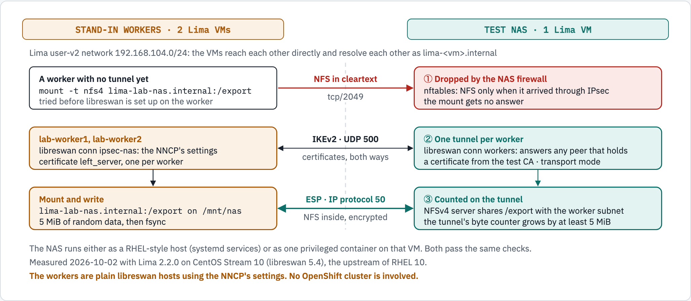

# Lima Lab Guide — a Test NAS and Stand-in Workers on a Mac

**Team:** KCS OpenShift  **Audience:** junior/new platform engineers  **Purpose:** try the NAS side of the IPsec design on a laptop before touching a cluster

This guide shows how to use **Lima** (`limactl`) to run real Linux VMs on a Mac, and then uses it to build a small lab: one **test NAS** and two **stand-in workers**. The lab proves that NFS to the NAS only works through an IPsec tunnel set up with the same libreswan settings as the NNCP in the main guide ([`ipsec-nas-guide.md`](ipsec-nas-guide.md)).

| | |
|---|---|
| Measured on | 2026-10-02, Apple silicon Mac, macOS 26.5, Lima 2.2.0 |
| Guest | CentOS Stream 10 (libreswan 5.4), the public upstream of RHEL 10. What differed on Stream 9 is listed in the [RHEL guide](test-nas-rhel-guide.md#on-rhel-9-what-to-watch-out-for). |
| NAS variants tested | RHEL-style host ([`test-nas-rhel-guide.md`](test-nas-rhel-guide.md)) and container ([`lab/container/`](../lab/container/)) |
| Not in this lab | An OpenShift cluster. The workers are plain libreswan hosts. See [What the lab does not cover](#9-what-the-lab-does-not-cover). |

<picture>
  <source media="(prefers-color-scheme: dark)" srcset="diagrams/lima-lab/lab-checks.dark.png">
  <source media="(prefers-color-scheme: light)" srcset="diagrams/lima-lab/lab-checks.light.png">
  
</picture>

*Figure 1. The lab runs a test NAS and two stand-in workers as Lima VMs on one network and checks three things: cleartext NFS is dropped, each worker gets a certificate-authenticated IKEv2 tunnel, and data written to the mount is counted on the tunnel as ESP. The workers are plain libreswan hosts using the NNCP's settings; no OpenShift cluster is involved.*

```text
STAND-IN WORKERS (2 Lima VMs)                                        TEST NAS (1 Lima VM)
Lima user-v2 network 192.168.104.0/24; the VMs resolve each other as lima-<vm>.internal

A worker with no tunnel yet            --- NFS in cleartext --->   1. Dropped by the NAS firewall
  mount -t nfs4 lima-lab-nas.internal:/export   tcp/2049             nftables: NFS only when it arrived through IPsec
  tried before libreswan is set up                                    the mount gets no answer

lab-worker1, lab-worker2               <--- IKEv2, UDP 500 --->    2. One tunnel per worker
  libreswan conn ipsec-nas: the NNCP's settings  certificates,       conn workers: answers any peer with a
  certificate left_server, one per worker        both ways           certificate from the test CA, transport mode
        |                                                                  |
Mount and write                        <--- ESP, protocol 50 --->  3. Counted on the tunnel
  lima-lab-nas.internal:/export on /mnt/nas      NFS inside,         NFSv4 server shares /export
  5 MiB of random data, then fsync               encrypted           tunnel byte counter grows by at least 5 MiB

The NAS runs either as a RHEL-style host (systemd services) or as one privileged container on that VM.
```

---

## Table of contents

1. [What Lima is, and why this lab uses it](#1-what-lima-is-and-why-this-lab-uses-it)
2. [Install Lima on the Mac](#2-install-lima-on-the-mac)
3. [The Lima commands this lab uses](#3-the-lima-commands-this-lab-uses)
4. [The lab at a glance](#4-the-lab-at-a-glance)
5. [Quick start: one command](#5-quick-start-one-command)
6. [The same thing by hand, step by step](#6-the-same-thing-by-hand-step-by-step)
7. [Variations](#7-variations)
8. [What the lab showed](#8-what-the-lab-showed)
9. [What the lab does not cover](#9-what-the-lab-does-not-cover)
10. [Troubleshooting](#10-troubleshooting)
11. [Clean up](#11-clean-up)

---

## 1. What Lima is, and why this lab uses it

Lima describes itself this way: *"Lima launches Linux virtual machines with automatic file sharing and port forwarding (similar to WSL2)."* On a Mac it starts each VM with Apple's Virtualization.framework, so every VM has **its own kernel, its own systemd and its own network address**.

That is what this lab needs. IPsec and the NFS server both live in the kernel, and the NAS and the workers must be separate machines that talk over a network. Colima, which many of us use for containers, is built on Lima but gives you one VM whose job is to run a container engine. Using Lima directly gives one VM per lab host, each from a RHEL-family image.

### Capabilities this lab relies on

| Lima capability | What it gives the lab | Used as |
|---|---|---|
| Templates per distribution | RHEL-family guests without building images. `limactl create --list-templates` lists `centos-stream-10`, `almalinux-10`, `rocky-10`, `oraclelinux-10` and many more. | [`lab/lima/stream10.yaml`](../lab/lima/stream10.yaml) |
| Your own template on top of a base | One small file fixes CPU, memory, disk and network for every lab VM. | `base: template:_images/centos-stream-10` |
| `vmType: vz` | Apple's Virtualization.framework. Lima's documentation says it is the default on macOS 13.5 or later. | set explicitly in the template |
| `plain: true` | A plain server: no host directories mounted into the VM, no port forwarding, no containerd. | set in the template |
| `user-v2` network | All VMs on one network, reaching each other directly, with names `lima-<vm>.internal`. No sudo on the Mac. | `networks: - lima: user-v2` |
| `limactl shell` | Run a command in a VM, as you or with `sudo`. | every setup step |
| `limactl copy` | Copy files host to guest, and **guest to guest**. | scripts in, certificates from the NAS to the workers |
| `limactl validate` | Check a template file before creating a VM. | on the template file |

### The network choices, and why `user-v2`

| Lima network | Can VMs reach each other? | Can the Mac reach the VM by IP? | Extra setup | Used here |
|---|---|---|---|---|
| Default user-mode | Not offered for this: every guest gets the same address, `192.168.5.15`. Lima: "not accessible from the host by design". | No | None | No |
| **`user-v2`** | **Yes.** Lima: "An instance's IP address is resolvable from another instance as `lima-<NAME>.internal`." Default subnet `192.168.104.0/24`. | Not directly (Lima documents `limactl tunnel`, marked experimental) | None | **Yes** |
| `vzNAT` | Not tested here | Yes, per Lima's documentation; the address range is not user-specifiable | None (vz only) | No |
| `socket_vmnet` (shared, bridged) | Not tested here | Yes, per Lima's documentation | Build and install `socket_vmnet`, plus a sudoers file | No |

Measured in this lab on `user-v2`: the tunnel between VMs carried native **ESP** (IP protocol 50), with no UDP encapsulation, so the lab exercises the same packet path the main guide's firewall section asks for.

Sources: [Lima documentation](https://lima-vm.io/docs/), [network: user-v2](https://lima-vm.io/docs/config/network/user-v2/), [network: user](https://lima-vm.io/docs/config/network/user/), [network: vmnet](https://lima-vm.io/docs/config/network/vmnet/), [VM types](https://lima-vm.io/docs/config/vmtype/).

---

## 2. Install Lima on the Mac

```bash
brew install lima
limactl --version
```

✅ **Expected:** `limactl version 2.2.0` or later. The lab's template files need Lima 2.0.0 or later.

Lima keeps everything under `~/.lima/` (one directory per VM) and caches downloaded images under `~/Library/Caches/lima/`. Each lab VM uses 2 CPUs, 2 GiB of memory and a 10 GiB disk; the lab runs three of them.

---

## 3. The Lima commands this lab uses

| Command | What it does |
|---|---|
| `limactl create --list-templates` | List the built-in templates |
| `limactl validate FILE.yaml` | Check a template file |
| `limactl create --name=NAME --tty=false FILE.yaml` | Create a VM from a template file (downloads the image the first time) |
| `limactl start NAME --tty=false` | Boot the VM and wait until it is ready |
| `limactl list` | Show the VMs and their state |
| `limactl shell NAME COMMAND...` | Run a command in the VM as your user |
| `limactl shell NAME sudo COMMAND...` | Run a command in the VM as root |
| `limactl copy -r DIR NAME:/path` | Copy a directory from the Mac into a VM |
| `limactl copy NAME1:/path NAME2:/path` | Copy a file from one VM to another |
| `limactl stop NAME` / `limactl delete NAME` | Shut the VM down / remove it and its disk |

`--tty=false` stops Lima from opening an editor or asking questions, which is what you want in scripts.

---

## 4. The lab at a glance

| VM | Role | Name on the lab network |
|---|---|---|
| `lab-nas` | Test NAS: libreswan, the IPsec-only firewall rule, the NFSv4 server | `lima-lab-nas.internal` |
| `lab-worker1` | Stand-in worker with its own certificate | `lima-lab-worker1.internal` |
| `lab-worker2` | Stand-in worker with its own certificate | `lima-lab-worker2.internal` |

Files, all under [`lab/`](../lab/):

| File | Runs on | What it does |
|---|---|---|
| `lab.sh` | the Mac | Creates the VMs and runs everything below |
| `lima/stream10.yaml` | the Mac | Lima template for the lab VMs (CentOS Stream 10) |
| `pki/make-test-pki.sh` | the NAS VM | Throwaway CA, NAS certificate, one certificate per worker, and one shared certificate |
| `rhel/setup-nas.sh` | the NAS VM | The five steps of the [RHEL 10 NAS guide](test-nas-rhel-guide.md) |
| `rhel/setup-worker.sh` | each worker VM | libreswan with the NNCP's settings, then mounts the NAS |
| `rhel/verify-worker.sh` | each worker VM | Writes 5 MiB and checks the tunnel counter grew by at least that much |
| `rhel/switch-worker-cert.sh` | each worker VM | Swaps the worker's certificate (used by the shared-certificate scenario) |
| `container/` | the NAS VM | The NAS as a container image, and `run-nas.sh` to start it |

A stand-in worker is **not** an OpenShift node. It is a host whose libreswan connection uses the same keys, in the same order, as the NNCP in the main guide:

```text
conn ipsec-nas
    left=<worker FQDN>            leftid=%fromcert        leftrsasigkey=%cert
    leftcert=left_server          leftmodecfgclient=no
    right=<NAS FQDN>              rightid=%fromcert       rightrsasigkey=%cert
    rightsubnet=<NAS IP>/32       ikev2=insist            type=transport
```

---

## 5. Quick start: one command

From the repository root:

```bash
lab/lab.sh up
```

This creates the three VMs from CentOS Stream 10, builds the test certificates, sets up the NAS and both workers, and runs the three checks. Measured: 62 to 73 seconds once the image is cached.

✅ **Expected**, near the end of the output:

```text
PASS: the cleartext mount got no answer
...
PASS: 5 MiB written to /mnt/nas/verify-lima-lab-worker1.bin went through the IPsec tunnel (sha256 ...)
PASS: 5 MiB written to /mnt/nas/verify-lima-lab-worker2.bin went through the IPsec tunnel (sha256 ...)

### NAS: tunnels and firewall counters
#2: "workers"[1] 192.168.104.3, type=ESP, ... inBytes=5371408, outBytes=32116, ... id='CN=lima-lab-worker1.internal, O=IPsec NAS test'
#4: "workers"[2] 192.168.104.6, type=ESP, ... inBytes=5371632, outBytes=32384, ... id='CN=lima-lab-worker2.internal, O=IPsec NAS test'
		... tcp dport 2049 meta ipsec exists counter packets 7485 bytes 10892740 accept comment "nfs-over-ipsec"
		tcp dport 2049 counter packets 6 bytes 360 drop comment "nfs-cleartext-dropped"
```

| Command | What it does |
|---|---|
| `lab/lab.sh up [vm\|container]` | Create and verify the lab. Default `vm`. |
| `lab/lab.sh verify` | Write through both tunnels again and show the NAS counters |
| `lab/lab.sh status` | List the VMs and the NAS tunnels |
| `lab/lab.sh option-a` | The shared-certificate scenario, see [7.2](#72-the-shared-certificate-scenario-option-a) |
| `lab/lab.sh down` | Delete the three VMs |

---

## 6. The same thing by hand, step by step

These are the steps `lab/lab.sh up` runs. Do them once by hand to learn what each one does. Run every block on the **Mac**, from the repository root.

### Step 1 – Create and start the three VMs

```bash
limactl validate lab/lima/stream10.yaml

for vm in lab-nas lab-worker1 lab-worker2; do
  limactl create --name="${vm}" --tty=false lab/lima/stream10.yaml
  limactl start "${vm}" --tty=false
done

limactl list
```

✅ **Expected:** three VMs with `STATUS` `Running` and `VMTYPE` `vz`.

### Step 2 – Look around

```bash
limactl shell lab-nas cat /etc/redhat-release
limactl shell lab-nas ip -4 -br addr show eth0
limactl shell lab-worker1 getent hosts lima-lab-nas.internal
```

✅ **Expected:** `CentOS Stream release 10 (Coughlan)`, an address in `192.168.104.0/24`, and the worker resolving the NAS's name to that address.

### Step 3 – Copy the lab files into each VM

The VMs are `plain`, so nothing from the Mac is mounted in them.

```bash
for vm in lab-nas lab-worker1 lab-worker2; do
  limactl copy -r lab "${vm}:/tmp/lab"
done
```

### Step 4 – Create the test certificates, inside the NAS VM

```bash
limactl shell lab-nas sudo dnf -y -q install openssl
limactl shell lab-nas /tmp/lab/pki/make-test-pki.sh /tmp/pki \
  lima-lab-nas.internal lima-lab-worker1.internal lima-lab-worker2.internal
limactl shell lab-nas sudo install -D -m 0644 -t /root/ipsec-pki /tmp/pki/ca.pem /tmp/pki/nas.p12
```

✅ **Expected:** four lines ending in `: OK` (the NAS certificate, two worker certificates and the shared one), then `test PKI written to /tmp/pki`.

> [!CAUTION]
> This CA is for the lab only. Its private key sits in `/tmp/pki` on the NAS VM.

### Step 5 – Give each worker the CA and its own certificate

`limactl copy` copies straight from one VM to another. Each worker's bundle is renamed to `left_server.p12`, the name the main guide uses.

```bash
for vm in lab-worker1 lab-worker2; do
  limactl copy lab-nas:/tmp/pki/ca.pem "${vm}:/tmp/ca.pem"
  limactl copy "lab-nas:/tmp/pki/lima-${vm}.internal.p12" "${vm}:/tmp/left_server.p12"
  limactl shell "${vm}" sudo install -D -m 0644 -t /root/ipsec-pki /tmp/ca.pem /tmp/left_server.p12
done
```

### Step 6 – Set up the NAS

This runs the five steps of the [RHEL 10 NAS guide](test-nas-rhel-guide.md): packages, certificates, the libreswan connection, the firewall, the NFS server.

```bash
limactl shell lab-nas sudo WORKER_SUBNET=192.168.104.0/24 bash /tmp/lab/rhel/setup-nas.sh
```

✅ **Expected:** the last line is `NAS ready: lima-lab-nas exports /export to 192.168.104.0/24, IPsec only.`

### Step 7 – Check 1: cleartext NFS is refused

Before any tunnel exists, try to mount the share from a worker.

```bash
limactl shell lab-worker1 sudo dnf -y -q install nfs-utils
limactl shell lab-worker1 sudo bash -c 'mkdir -p /mnt/cleartext; timeout 12 mount -t nfs4 -o retry=0,timeo=30,retrans=1 lima-lab-nas.internal:/export /mnt/cleartext; echo "mount exit=$?"'
limactl shell lab-nas sudo nft list table inet nas_ipsec_only
```

✅ **Expected:** `mount.nfs4: Connection timed out` and `mount exit=32`. On the NAS, the `nfs-cleartext-dropped` counter is above 0 (6 packets in the measured run).

### Step 8 – Set up both workers (check 2: the tunnel)

```bash
NAS_IP="$(limactl shell lab-nas getent hosts lima-lab-nas.internal | awk '{print $1}')"

for vm in lab-worker1 lab-worker2; do
  limactl shell "${vm}" sudo WORKER_FQDN="lima-${vm}.internal" NAS_FQDN=lima-lab-nas.internal NAS_IP="${NAS_IP}" \
    bash /tmp/lab/rhel/setup-worker.sh
done
```

✅ **Expected** for each worker: an `ipsec trafficstatus` line for `"ipsec-nas"` with `id='CN=lima-lab-nas.internal, O=IPsec NAS test'`, then `Worker ready: ... mounted lima-lab-nas.internal:/export on /mnt/nas.`

### Step 9 – Check 3: the data really goes through the tunnel

```bash
for vm in lab-worker1 lab-worker2; do
  limactl shell "${vm}" sudo bash /tmp/lab/rhel/verify-worker.sh
done

limactl shell lab-nas sudo ipsec trafficstatus
limactl shell lab-nas sudo nft list table inet nas_ipsec_only
```

✅ **Expected** for each worker:

```text
tunnel outBytes: before=4316 after=5371376 grew=5367060 (wrote 5242880)
kernel SAs to the NAS:
  src 192.168.104.3 dst 192.168.104.1
  	proto esp spi 0xfd1dfb82 reqid 16389 mode transport
  src 192.168.104.1 dst 192.168.104.3
  	proto esp spi 0xd959cdb5 reqid 16389 mode transport
PASS: 5 MiB written to /mnt/nas/verify-lima-lab-worker1.bin went through the IPsec tunnel (sha256 ...)
```

On the NAS: one `"workers"` line per worker with `inBytes` above 5,000,000, the `esp-in` and `nfs-over-ipsec` counters in the thousands of packets, and no `encap` line in the kernel SAs (native ESP).

---

## 7. Variations

### 7.1 The NAS as a container

```bash
lab/lab.sh down
lab/lab.sh up container
```

`lab-nas` then only gets podman, and the NAS runs as one privileged, host-network container built from [`lab/container/`](../lab/container/). The workers and the checks are unchanged. Measured: 72 to 76 seconds, including building the image inside the fresh VM.

### 7.2 The shared-certificate scenario (Option A)

```bash
lab/lab.sh option-a
```

Run it on a lab that is up. It moves both workers to the **one shared certificate** and shows what the NAS does with two peers that present the same identity, then applies the fix (`uniqueids=no` on the NAS).

✅ **Expected:**

```text
### expected problem: the NAS keeps only ONE tunnel for the shared identity
CONFIRMED: over 10 seconds the NAS never held both workers' tunnels at once (most: 1)

### the fix on the NAS: allow duplicate peer IDs (uniqueids=no)
NAS tunnels now: 2 (expected 2)
PASS: 5 MiB written to /mnt/nas/verify-lima-lab-worker1.bin went through the IPsec tunnel (sha256 ...)
PASS: 5 MiB written to /mnt/nas/verify-lima-lab-worker2.bin went through the IPsec tunnel (sha256 ...)
```

---

## 8. What the lab showed

Every row was measured on 2026-10-02 in this lab, on CentOS Stream 10 (libreswan 5.4), with the NAS both as a host and as a container unless a row says otherwise.

| # | Finding | What it means for the main guide |
|---|---|---|
| 1 | The NNCP's libreswan settings bring up an IKEv2, transport-mode tunnel against a certificate-authenticated NAS, and NFS over it is carried as native ESP. | The connection settings in the guide are workable as written. |
| 2 | With the `meta ipsec exists` firewall rule, a cleartext NFS mount gets no answer. | This is the "cleartext NFS from workers: rejected" setting the guide asks the storage team for. |
| 3 | Two workers with **their own** certificates hold two tunnels at the same time. | The per-node certificate case (Option B) works against one NAS. |
| 4 | Two workers with **one shared** certificate, NAS on the default `uniqueids=yes`: the NAS never holds both tunnels. The two workers keep replacing each other; in one run the NAS reached connection instance 744 in about 15 seconds. | Confirms the guide's Option A risk about identical identities. |
| 5 | With `uniqueids=no` on the NAS, both shared-certificate workers hold tunnels and pass the write check. | The "duplicate peer IDs must be allowed" NAS setting is necessary for Option A. |
| 6 | A third worker whose name was **not** in the shared certificate's SAN still got a tunnel and passed the write check. Measured by hand, NAS as a host; it is not part of `lab.sh`. | With `%fromcert` on both sides, libreswan did not check the SAN. The guide says a new worker has no working tunnel until the certificate is re-issued; that did not hold against this libreswan NAS. A different NAS product may check more. |
| 7 | Host names in `left=` and `right=` did not resolve (`unbound error: initialization failure`) until `dnssec-enable=no` was set. | Affects a libreswan 5 client. OpenShift 4.19 nodes are RHEL 9 based, where the names resolved without it. |

Findings 4 and 6 were also seen on CentOS Stream 9 (libreswan 4.15), with one difference in finding 4: there the second worker silently replaced the first, whose NFS then hung. The other Stream 9 differences are in the [RHEL guide](test-nas-rhel-guide.md#on-rhel-9-what-to-watch-out-for).

---

## 9. What the lab does not cover

- **No OpenShift.** Nothing here runs NMState, Kyverno, the Machine Config Operator or cert-manager. The lab tests the IPsec and NFS behaviour that those components are meant to produce on a node.
- **The NAS is libreswan on Linux.** A storage appliance may authorize peers differently, check certificates differently, or need other proposals.
- **CentOS Stream 10, not RHEL**, and arm64, because that is what runs natively on this Mac. The stand-in workers therefore run libreswan 5, while OpenShift 4.19 nodes are RHEL 9 based (libreswan 4).
- **One flat lab network.** No NAT and no firewall between the workers and the NAS.

---

## 10. Troubleshooting

All of these were hit while building the lab.

| Symptom | Cause | What to do |
|---|---|---|
| Worker: no tunnel; `journalctl -u ipsec` shows `failed to resolve 'right=...', unbound error: initialization failure` | libreswan 5 resolves host names through libunbound, which did not initialise with DNSSEC validation on | `setup-worker.sh` adds `dnssec-enable=no` under `config setup`. By hand: add that line to `/etc/ipsec.conf` and `systemctl restart ipsec`. |
| Container NAS: `mount.nfs4: mounting ...:/export failed, reason given by server: No such file or directory` | The container's root filesystem is overlayfs, which the kernel NFS server will not use as the NFSv4 root | The entrypoint exports a small tmpfs as the NFSv4 root and binds the real share under it. Mount a real filesystem at `/export`. |
| Container NAS: the first write after the NAS starts waits about 90 seconds; the VM's `dmesg` shows `NFSD: Unable to initialize client recovery tracking` and `starting 90-second grace period` | The NFS client-tracking daemon `nfsdcld` was not running | The entrypoint starts `nfsdcld`. `dmesg` then shows `no clients to reclaim, skipping NFSv4 grace period`. |
| `limactl copy -r lab VM:/tmp/lab` put the files in `/tmp/lab/lab` | `/tmp/lab` already existed in the VM | `limactl shell VM rm -rf /tmp/lab`, then copy again. `lab.sh` does this. |
| `lab.sh up` says a VM already exists | An earlier lab is still there | `lab/lab.sh down`, then `up` again. |

Where to look:

```bash
limactl shell lab-worker1 sudo journalctl -u ipsec --no-pager -n 40    # the worker's libreswan log
limactl shell lab-nas sudo journalctl -u ipsec --no-pager -n 40        # the NAS's (NAS as host)
limactl shell lab-nas sudo podman logs --tail 40 ipsec-test-nas        # the NAS's (NAS as container)
```

---

## 11. Clean up

```bash
lab/lab.sh down
limactl list
```

✅ **Expected:** the three lab VMs are gone. The downloaded images stay in `~/Library/Caches/lima/`, so the next `up` is quick.

---

## Diagram sources

Figure 1 is rendered from `docs/diagrams/lima-lab/source.html` by `docs/diagrams/render.py` (see the main guide's [Diagram sources](ipsec-nas-guide.md#diagram-sources) for what the renderer needs). From the repository root:

```bash
python3 docs/diagrams/render.py docs/diagrams/lima-lab/source.html docs/diagrams/lima-lab lab-checks
```

The Mermaid text version is `docs/diagrams/mermaid/lab-checks.mmd`; it is not what this document displays. If the lab changes, change the figure, its text twin above and the Mermaid file together.
