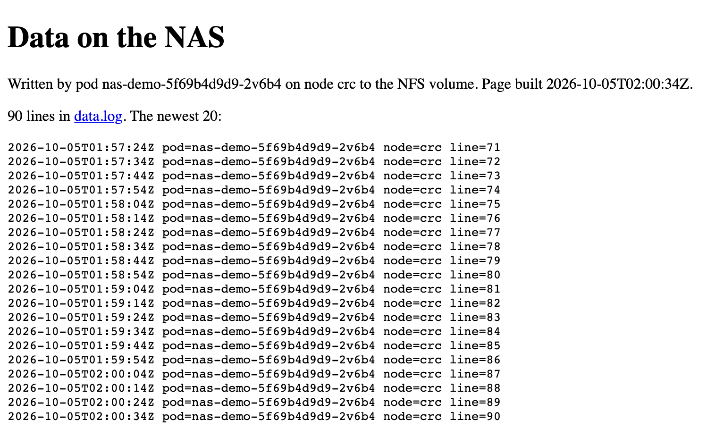

# Storage on Demand from the NAS — csi-driver-nfs over IPsec

**Team:** KCS OpenShift  **Audience:** junior/new platform engineers  **Purpose:** let applications ask for NAS storage with a PersistentVolumeClaim, with nobody writing a PersistentVolume by hand, and every byte travelling through the IPsec tunnel

[nas-consumer-app.md](nas-consumer-app.md) gives an application **one** share that an administrator hands out (a static PersistentVolume). This guide sets up **dynamic provisioning**: install the NFS CSI driver once, create one StorageClass for the NAS, and from then on every claim of that class gets its own directory on the NAS by itself.

| | |
|---|---|
| Driver | [`csi-driver-nfs`](https://github.com/kubernetes-csi/csi-driver-nfs) 4.13.4 (Kubernetes CSI project, upstream Helm chart), in the namespace `csi-driver-nfs` |
| StorageClass | `ipsec-nas-csi`: the NAS IP, the export, one directory per claim (`csi/<namespace>/<claim>`); deleting a claim deletes its PersistentVolume and keeps its data |
| Demo | The demo app of nas-consumer-app.md on a dynamic claim, in the namespace `ipsec-nas-csi-demo`, with a Route |
| Files | [`manifests/csi-driver-nfs/values.yaml`](../../manifests/csi-driver-nfs/values.yaml), [`manifests/demo-app-csi/`](../../manifests/demo-app-csi/) (Part 5: [`teams/`](../../manifests/demo-app-csi/teams/)) |
| Running on the lab | The driver in `csi-driver-nfs`; the classes `ipsec-nas-csi`, `ipsec-nas-team-a`, `ipsec-nas-team-b`; the demo app in `ipsec-nas-csi-demo`, `ipsec-nas-team-a` and `ipsec-nas-team-b`; on the NAS the exports `/export`, `/export-team-a`, `/export-team-b` |
| Measured | Every step on OpenShift Local (CRC 4.22.7) against the lab NAS (NFS accepted only through IPsec), 2026-10-05: evidence [56](../evidence/crc/56-csi-driver-nfs-dynamic-provisioning.txt) (the setup), [57](../evidence/crc/57-csi-demo-app.txt) (the demo), [58](../evidence/crc/58-csi-multiple-exports.txt) (several exports), [59](../evidence/crc/59-csi-reclaim-and-ondelete.txt) (what deleting does) |

**Contents:** [How it works](#how-it-works) · [Before you start](#before-you-start) · [Part 1 – Install the driver](#part-1--install-the-driver) · [Part 2 – The StorageClass](#part-2--the-storageclass) · [Part 3 – Use it: the demo app](#part-3--use-it-the-demo-app) · [Part 4 – Use it for your application](#part-4--use-it-for-your-application) · [Part 5 – More exports, more StorageClasses](#part-5--more-exports-more-storageclasses) · [Part 6 – What deleting a claim does, and how to change it](#part-6--what-deleting-a-claim-does-and-how-to-change-it) · [Remove everything](#remove-everything) · [Troubleshooting](#troubleshooting) · [References](#references)

---

## How it works

```text
 application pod                       csi-nfs-node (DaemonSet, every node, host network)
   PVC app-data  ──────────────────▶    mounts NAS_IP:/export/csi/<ns>/<claim> on the node,
   (class ipsec-nas-csi)                 hands the directory to the pod
        │
        │ new claim                      csi-nfs-controller (Deployment, a worker, host network)
        └──────────────────────────▶    mounts NAS_IP:/export, creates csi/<ns>/<claim>,
                                          the PersistentVolume is created and bound

 both mounts leave the node from the node's own address to NAS_IP  ══ IPsec tunnel ══▶  NAS (NFS only over IPsec)
```

- **No NFS client in the application.** The node mounts the share; the pod runs under the default `restricted-v2` SCC with no privileges.
- **Both driver pods use the host network**, so their NFS traffic is the node's traffic: exactly what the tunnel covers. The **controller** mounts the share too (to create each claim's directory), so the node it runs on needs a tunnel. That is why [Step 1.3](#step-13--install-the-chart) keeps it on worker nodes.
- **The StorageClass uses the NAS IP**, not its name: the tunnel protects traffic to that one address (`rightsubnet: ${NAS_IP}/32` in the NNCP).

### Words you will see

| Term | Meaning |
|---|---|
| **CSI driver** | A plug-in that teaches Kubernetes a storage system. `csi-driver-nfs` is the one for NFS. Its name in the cluster is `nfs.csi.k8s.io`. |
| **StorageClass** | A named kind of storage. A claim of that class makes the driver create a PersistentVolume. |
| **PersistentVolumeClaim (PVC)** | A request for storage, in a namespace. |
| **PersistentVolume (PV)** | The cluster-wide object for one piece of storage. Here the driver creates it; its name is `pvc-<id>`. |
| **root_squash** | An NFS export option: requests from the user (and group) root on the client are handled as the NAS's anonymous user, usually `nobody` (65534). |

---

## Before you start

- [ ] The IPsec setup is finished: every worker's NNCE is `Available` and `ipsec trafficstatus` on a worker shows the tunnel: a `type=ESP` line whose `id=` is the NAS's certificate ([verify end to end](../00-prepare-the-cluster.md#32-verify-end-to-end)).
- [ ] You are logged in with `oc` as `cluster-admin`, and `helm` is installed (measured with Helm 4.3.0).
- [ ] From the storage team: the NAS IP, the export path, and these two facts about the export:

| Ask the storage team | Why | The lab NAS |
|---|---|---|
| The export is shared to every worker's address, NFS 4.1, read-write | The node plugin mounts from each worker; the controller from the worker it runs on | `/export 192.168.127.2(rw,sync,no_subtree_check)` (CRC's one node) |
| The export's top directory is writable by the anonymous user, or a directory `csi` in it is owned by the anonymous user | With `root_squash` (the default), the driver creates directories as the anonymous user | `/export` mode `0777`, `root_squash` |

`no_root_squash` is **not** needed: everything below was measured with `root_squash`.

### Set the variables

```bash
# ---- CHANGE THESE ----
export NAS_IP="10.10.10.50"       # the NAS NFS data IP, the same value as in the setup docs
export NAS_EXPORT="/export"       # the path the NAS exports
# ----------------------
```

---

## Part 1 – Install the driver

### Step 1.1 – Add the chart repository

```bash
helm repo add csi-driver-nfs https://raw.githubusercontent.com/kubernetes-csi/csi-driver-nfs/master/charts
helm repo update csi-driver-nfs
helm search repo csi-driver-nfs/csi-driver-nfs --versions | head -3
```

✅ **Expected:** `csi-driver-nfs/csi-driver-nfs  4.13.4  4.13.4  CSI NFS Driver for Kubernetes` at the top.

### Step 1.2 – A namespace, and the privileged SCC for the driver's two service accounts

The driver's pods mount file systems on the node, so they need the `privileged` SCC. Grant it to the two service accounts the chart creates, by name, before installing it:

```bash
oc create namespace csi-driver-nfs
oc adm policy add-scc-to-user privileged -z csi-nfs-controller-sa -n csi-driver-nfs
oc adm policy add-scc-to-user privileged -z csi-nfs-node-sa -n csi-driver-nfs
```

✅ **Expected:** `clusterrole.rbac.authorization.k8s.io/system:openshift:scc:privileged added: "csi-nfs-controller-sa"`, and the same for `csi-nfs-node-sa`.

> [!NOTE]
> The upstream instructions install into `kube-system`. A namespace of its own keeps the driver, its grants and its removal in one place.

### Step 1.3 – Install the chart

```bash
helm install csi-driver-nfs csi-driver-nfs/csi-driver-nfs --namespace csi-driver-nfs --version 4.13.4 \
  -f manifests/csi-driver-nfs/values.yaml --wait
```

[`values.yaml`](../../manifests/csi-driver-nfs/values.yaml) changes two things from the chart's defaults:

| Value | Chart default | Here | Why |
|---|---|---|---|
| `controller.nodeSelector` | none (`kubernetes.io/os: linux` only) | `node-role.kubernetes.io/worker: ""` | The controller mounts the NAS from its node, and the setup builds tunnels on workers. The chart's controller tolerates the control-plane taints, and `controller.runOnControlPlane: false` does not keep it off them. |
| `controller.defaultOnDeletePolicy` | `delete` | `retain` | When a volume is deleted, the driver keeps its data on the NAS unless its StorageClass says otherwise ([Part 6](#part-6--what-deleting-a-claim-does-and-how-to-change-it)). A safety net: a class that forgets `onDelete` cannot delete data. |

### Step 1.4 – Verify

```bash
oc get pods -n csi-driver-nfs -o wide
oc get pods -n csi-driver-nfs -o jsonpath='{range .items[*]}{.metadata.name} scc={.metadata.annotations.openshift\.io/scc}{"\n"}{end}'
oc get csidriver nfs.csi.k8s.io
```

✅ **Expected** (measured): `csi-nfs-controller-…` `5/5 Running` on a worker, one `csi-nfs-node-…` `3/3 Running` per node, both `scc=privileged`, and the CSIDriver `nfs.csi.k8s.io`.

```bash
oc -n csi-driver-nfs get deploy csi-nfs-controller -o jsonpath='{.spec.template.spec.containers[?(@.name=="nfs")].args}' | tr ',' '\n' | grep ondelete
```

✅ **Expected** (measured): `"--default-ondelete-policy=retain"`.

---

## Part 2 – The StorageClass

### Step 2.1 – Render and read it

From the repository root. `render.sh` fills `${NAS_IP}` and `${NAS_EXPORT}` into the templates and writes everything to `rendered/`; it leaves `${pvc.metadata.…}`, which the driver fills in per claim.

```bash
export NODE_DOMAIN="${NODE_DOMAIN:-ocp.example.com}" NAS_FQDN="${NAS_FQDN:-nas01.example.com}" CLUSTER_ISSUER="${CLUSTER_ISSUER:-company-issuer-rnd}"
./render.sh
cat rendered/demo-app-csi/51-storageclass.yaml
```

| Line | Why |
|---|---|
| `provisioner: nfs.csi.k8s.io` | The driver from Part 1 |
| `server: ${NAS_IP}` | The address the tunnel protects. Never the NAS's name |
| `share: ${NAS_EXPORT}` | The export |
| `subDir: csi/${pvc.metadata.namespace}/${pvc.metadata.name}` | One directory per claim, named after it, under a parent of its own (see below) |
| `onDelete: retain` | When the volume is deleted, its directory and data **stay** on the NAS ([Part 6](#part-6--what-deleting-a-claim-does-and-how-to-change-it)) |
| `reclaimPolicy: Delete` | Deleting a claim deletes its PersistentVolume too, so no `Released` volumes are left behind |
| `volumeBindingMode: Immediate` | The volume is made when the claim is created, not when a pod first uses it |
| `mountOptions: nfsvers=4.1, hard, noatime` | The same as the static volume of nas-consumer-app.md |

**Why the `csi/` parent.** With `root_squash`, the driver creates directories as the NAS's anonymous user, and that user cannot create a directory inside one that another user owns. Measured: with `subDir: ${pvc.metadata.namespace}/${pvc.metadata.name}`, a claim in `ipsec-nas-demo` failed with `mkdir …/ipsec-nas-demo/app-data: permission denied`, because `/export/ipsec-nas-demo` belongs to the static demo's pod. Under `csi/`, every directory is the driver's own.

### Step 2.2 – Create it

```bash
oc apply -f rendered/demo-app-csi/51-storageclass.yaml
oc get storageclass ipsec-nas-csi
```

✅ **Expected:** `ipsec-nas-csi   nfs.csi.k8s.io   Delete   Immediate`. It is not the default class; claims ask for it by name.

---

## Part 3 – Use it: the demo app

The same demo app as [nas-consumer-app.md](nas-consumer-app.md#step-5--deploy-the-demo-app) (a `writer` that appends a line every 10 seconds, a `web` that serves the page), on a dynamic claim.

### Step 3.1 – The namespace and the claim

```bash
oc apply -f rendered/demo-app-csi/50-namespace.yaml -f rendered/demo-app-csi/52-pvc.yaml
oc get pvc app-data -n ipsec-nas-csi-demo
oc get pv "$(oc get pvc app-data -n ipsec-nas-csi-demo -o jsonpath='{.spec.volumeName}')" \
  -o custom-columns=NAME:.metadata.name,RECLAIM:.spec.persistentVolumeReclaimPolicy,STATUS:.status.phase,SUBDIR:.spec.csi.volumeAttributes.subDir
```

✅ **Expected** (measured, about 2 seconds after the apply): `app-data   Bound   pvc-<id>   1Gi   RWX   ipsec-nas-csi`, and the volume `Delete   Bound   csi/ipsec-nas-csi-demo/app-data`.

On the NAS (ask the storage team, or on the test NAS run it yourself), the directory is there:

```text
$ find /export/csi -printf "%p %m %U:%G\n"
/export/csi 755 65534:65534
/export/csi/ipsec-nas-csi-demo 755 65534:65534
/export/csi/ipsec-nas-csi-demo/app-data 755 65534:65534
```

### Step 3.2 – The app and its URL

```bash
oc apply -f rendered/demo-app-csi/53-app.yaml -f rendered/demo-app-csi/54-route.yaml
oc rollout status deploy/nas-demo -n ipsec-nas-csi-demo
URL="https://$(oc get route nas-demo -n ipsec-nas-csi-demo -o jsonpath='{.spec.host}')"
curl -sk "${URL}/"
```

✅ **Expected** (measured, 40 seconds after the pod started):

```text
<title>NAS demo</title><h1>Data on the NAS</h1>
<p>Written by pod nas-demo-5f69b4d9d9-2v6b4 on node crc to the NFS volume. Page built 2026-10-05T01:46:23Z.</p>
<p>5 lines in <a href=data.log>data.log</a>. The newest 20:</p><pre>
2026-10-05T01:45:43Z pod=nas-demo-5f69b4d9d9-2v6b4 node=crc line=1
…
2026-10-05T01:46:23Z pod=nas-demo-5f69b4d9d9-2v6b4 node=crc line=5
</pre>
```

Open `${URL}` in a browser to watch it refresh every 10 seconds; `${URL}/data.log` is the raw file.



*The page through the Route (headless Chromium), 15 minutes after the pod started: 90 lines, one every 10 seconds, read from the claim's directory on the NAS.*

### Step 3.3 – See the data on the NAS, and prove it used the tunnel

On the NAS:

```text
$ ls -lan /export/csi/ipsec-nas-csi-demo/app-data
drwxrwsr-x. 2      65534 65534  ... .
-rw-r--r--. 1 1001250000 65534  ... data.log
-rw-r--r--. 1 1001250000 65534  ... index.html
```

The files belong to the pod's user ID. The directory became `2775` (group-writable, set-group-ID) when the pod mounted it: the kubelet applies the pod's `fsGroup` to the volume (the driver declares `fsGroupPolicy: File`). Its group stays the anonymous one, and that is why the pod can write: a `restricted-v2` pod's primary group is root (0), which `root_squash` maps to the same anonymous group.

On the cluster, the node's mount and its tunnel counters, read twice a minute apart:

```bash
NODE="$(oc get pod -n ipsec-nas-csi-demo -l app=nas-demo -o jsonpath='{.items[0].spec.nodeName}')"
oc debug node/${NODE} -- chroot /host bash -c 'findmnt -t nfs4 -o SOURCE,OPTIONS | grep csi; ipsec trafficstatus'
```

✅ **Expected** (measured): the source `${NAS_IP}:${NAS_EXPORT}/csi/ipsec-nas-csi-demo/app-data` with `vers=4.1,…,hard`, and the tunnel's `type=ESP` line with `outBytes` higher on the second read (NMState names the connection by a UUID, not `ipsec-nas`). On the lab NAS, which accepts NFS only when it arrived through IPsec, the counter of that rule rose (13,187,359 → 13,187,923 packets) and the counter of cleartext NFS it drops stayed at 660.

<picture>
  <source media="(prefers-color-scheme: dark)" srcset="../images/crc/57-csi-demo-app.dark.png">
  <source media="(prefers-color-scheme: light)" srcset="../images/crc/57-csi-demo-app.light.png">
  
</picture>

*The demo on its dynamic claim, end to end: the claim and its volume, the pod, the page, the node's mounts (this one, and the team exports of [Part 5](#part-5--more-exports-more-storageclasses)) and tunnel, and on the NAS the files and the IPsec-only rule. Text: [evidence 57](../evidence/crc/57-csi-demo-app.txt).*

---

## Part 4 – Use it for your application

Once Parts 1 and 2 are done, an application team needs only a claim of class `ipsec-nas-csi` in its own namespace:

```yaml
apiVersion: v1
kind: PersistentVolumeClaim
metadata:
  name: <claim name>
  namespace: <your namespace>
spec:
  accessModes:
  - ReadWriteMany            # NFS: many pods on many nodes may mount it
  storageClassName: ipsec-nas-csi
  resources:
    requests:
      storage: 10Gi          # recorded on the volume; the NAS decides the real limit
```

and a volume in the pod that names it:

```yaml
      volumes:
      - name: data
        persistentVolumeClaim:
          claimName: <claim name>
```

What the team gets: a directory `csi/<namespace>/<claim name>` on the NAS, writable by its pods under `restricted-v2`, reached only through the tunnel. Things to know:

- **The size is not a quota.** NFS has no per-directory limit here; ask the storage team for quotas if they matter.
- **Deleting the claim keeps the data.** The PersistentVolume goes with the claim; the directory and its data stay on the NAS (also when the whole namespace is deleted; measured).
- **The name is the directory.** A new claim with the same name in the same namespace gets a new volume on the **same** directory, with the old data in it (measured).
- **Pods write with the pod's user ID**, through the directory's group: the anonymous group, which `root_squash` also gives the pod's group 0 ([Step 3.3](#step-33--see-the-data-on-the-nas-and-prove-it-used-the-tunnel)). If the NAS maps users differently and writes fail, see [Troubleshooting](#troubleshooting).

---

## Part 5 – More exports, more StorageClasses

The driver is installed once. A StorageClass is only a set of parameters for it, and a claim picks one by name, so one driver serves **several classes**: one per NAS export, or per way of handling data.

| A class per… | The parameter that differs | Example |
|---|---|---|
| Export | `share` | `/export-team-a`, `/export-team-b` (below) |
| What deleting does to the data | `onDelete` (with `reclaimPolicy`) | keep it for applications, remove it for scratch space ([Part 6](#part-6--what-deleting-a-claim-does-and-how-to-change-it)) |
| Permissions | `mountPermissions` | `"0777"` for a NAS that maps users differently ([Troubleshooting](#troubleshooting)) |
| NFS behaviour | `mountOptions` | `nfsvers`, `rsize`/`wsize` |
| Directory layout | `subDir` | a parent of its own per class |

### What a new export needs first

| The export is… | Needed before its class works |
|---|---|
| On the same NAS IP | From the storage team: the export, shared to every worker's address, its top directory writable by the anonymous user ([Before you start](#before-you-start)). **Nothing changes on the cluster's IPsec**: the tunnel already covers that IP. |
| On another IP of the same NAS, or on another NAS | First a tunnel to that IP: the tunnel protects only `rightsubnet: ${NAS_IP}/32`, so it needs its own NNCP and certificate setup ([docs/README.md](../README.md)). Without it, NFS to that IP leaves the node in clear text, and an IPsec-only NAS drops it. |

The steps below add two exports on the same NAS, one per team, as measured on the lab ([evidence 58](../evidence/crc/58-csi-multiple-exports.txt)).

### Step 5.1 – The exports (on the NAS, by the storage team)

On the lab NAS, beside `/export`, in a file of their own so the lab script's file stays untouched:

```bash
sudo mkdir -p /export-team-a /export-team-b
sudo chmod 0777 /export-team-a /export-team-b          # as lab/rhel/setup-nas.sh makes /export
printf '%s\n' \
  "/export-team-a 192.168.127.2(rw,sync,no_subtree_check)" \
  "/export-team-b 192.168.127.2(rw,sync,no_subtree_check)" | sudo tee /etc/exports.d/ipsec-nas-teams.exports
sudo exportfs -ra
sudo exportfs -v
```

✅ **Expected** (measured): `/export-team-a` and `/export-team-b` listed beside `/export`, each `192.168.127.2(…,rw,…,root_squash,…)`. The NAS's firewall rule is per port (2049, only over IPsec), so it covers the new exports without a change.

### Step 5.2 – A StorageClass per export

```yaml
apiVersion: storage.k8s.io/v1
kind: StorageClass
metadata:
  name: ipsec-nas-team-a
provisioner: nfs.csi.k8s.io
parameters:
  server: ${NAS_IP}                 # the same NAS IP: the same IPsec tunnel. Never the NAS's name
  share: /export-team-a             # this class's export
  subDir: csi/${pvc.metadata.namespace}/${pvc.metadata.name}
  onDelete: retain                  # deleting a volume keeps its data (Part 6)
reclaimPolicy: Delete               # deleting a claim deletes its PersistentVolume
volumeBindingMode: Immediate
mountOptions:
- nfsvers=4.1
- hard
- noatime
```

`ipsec-nas-team-b` is the same with `share: /export-team-b`. Both are in [`manifests/demo-app-csi/teams/`](../../manifests/demo-app-csi/teams/), each with its team's namespace and claim (Step 5.3); `render.sh` fills in `${NAS_IP}`:

```bash
./render.sh
oc apply -f rendered/demo-app-csi/teams/60-team-a.yaml -f rendered/demo-app-csi/teams/61-team-b.yaml
```

```bash
oc get storageclass -o custom-columns=NAME:.metadata.name,RECLAIM:.reclaimPolicy,SHARE:.parameters.share,ONDELETE:.parameters.onDelete | grep -E 'NAME|ipsec-nas'
```

✅ **Expected** (measured):

```text
NAME               RECLAIM   SHARE            ONDELETE
ipsec-nas-csi      Delete    /export          retain
ipsec-nas-team-a   Delete    /export-team-a   retain
ipsec-nas-team-b   Delete    /export-team-b   retain
```

### Step 5.3 – Each team claims from its class

In each team's namespace, a claim as in [Part 4](#part-4--use-it-for-your-application) with `storageClassName: ipsec-nas-team-a` (or `-b`). The files applied in Step 5.2 made the namespaces `ipsec-nas-team-a` and `ipsec-nas-team-b`, each with a claim `app-data`. The demo app of Part 3 goes into each, with only its namespace changed:

```bash
for t in a b; do
  for f in 53-app 54-route; do        # one file at a time: the files do not start with ---
    sed "s/namespace: ipsec-nas-csi-demo/namespace: ipsec-nas-team-${t}/" rendered/demo-app-csi/${f}.yaml | oc apply -f -
  done
  oc rollout status deploy/nas-demo -n ipsec-nas-team-${t}
done
curl -sk https://nas-demo-ipsec-nas-team-a.apps-crc.testing/ | grep 'lines in'      # the Route's host on CRC
```

Then:

```bash
oc get pvc -A -o custom-columns=NS:.metadata.namespace,NAME:.metadata.name,STATUS:.status.phase,CLASS:.spec.storageClassName | grep -E 'NS|team'
oc get pv "$(oc get pvc app-data -n ipsec-nas-team-a -o jsonpath='{.spec.volumeName}')" -o jsonpath='{.spec.csi.volumeHandle}{"\n"}'
```

✅ **Expected** (measured): both claims `Bound`; the volume handle names the export, `192.168.64.8#export-team-a#csi/ipsec-nas-team-a/app-data#…`.

### Step 5.4 – Verify each claim landed in its own export, through the tunnel

On the NAS:

```text
$ find /export-team-a /export-team-b -name app-data
/export-team-a/csi/ipsec-nas-team-a/app-data
/export-team-b/csi/ipsec-nas-team-b/app-data
$ ls /export/csi
ipsec-nas-csi-demo
```

On the node, one mount per export, all over the one NFS connection, which the tunnel carries:

```bash
oc debug node/<node> -- chroot /host bash -c "findmnt -t nfs4 -o SOURCE | grep csi; ss -tn dst ${NAS_IP}"
```

✅ **Expected** (measured): `192.168.64.8:/export/csi/ipsec-nas-csi-demo/app-data`, `192.168.64.8:/export-team-a/csi/ipsec-nas-team-a/app-data`, `192.168.64.8:/export-team-b/csi/ipsec-nas-team-b/app-data`, and one `ESTAB … 192.168.64.8:2049`. Each team's files on the NAS belong to that namespace's user ID (1001270000 and 1001280000), and the NAS's IPsec-only rule counted the traffic (13,196,958 → 13,197,591 packets) while its cleartext drops stayed at 660.

### Rules for several classes

1. **One parent directory per class on a shared export.** The driver names each directory after the claim's namespace and name, not after its class. Measured with a class that keeps data and one that removes it, both using `csi/…` on `/export`: a claim of the removing class, given the name of an earlier claim of the keeping class, bound to the kept directory and could read its data, and deleting it removed the directory and the data. Give each class its own parent (`csi/…`, `csi-scratch/…`), or its own export.
2. **A class cannot be edited.** To change one, delete it and create it again ([Part 6](#how-to-change-it)); its volumes are not touched.
3. **Name the class in every claim.** Only one class can be the cluster's default (`storageclass.kubernetes.io/is-default-class: "true"`); on CRC it is `crc-csi-hostpath-provisioner`, so a claim without `storageClassName` does not reach the NAS.

**Not measured:** a second NAS IP, or a second NAS. That needs a second tunnel, which the lab does not have.

---

## Part 6 – What deleting a claim does, and how to change it

Two settings decide it, at two levels:

| Setting | Where | Decides | Values |
|---|---|---|---|
| `reclaimPolicy` | StorageClass (copied onto each PersistentVolume) | What Kubernetes does with the **PersistentVolume** when its claim is deleted | `Delete`: delete it, and ask the driver to delete the volume. `Retain`: keep it, `Released`, and ask the driver nothing |
| `onDelete` | StorageClass `parameters` (written into each volume's handle at creation); the driver's default otherwise | What the driver does with the **data on the NAS** when it is asked to delete the volume | `retain`: keep the directory. `delete`: remove it and its empty parents. `archive`: move it to `archived-<subDir>` |

The driver's default for `onDelete` is a Helm value, `controller.defaultOnDeletePolicy` (chart default `delete`; **here `retain`**, [Step 1.3](#step-13--install-the-chart)).

### Every combination, measured

| `reclaimPolicy` | `onDelete` | After `oc delete pvc` | Data on the NAS | Use it for |
|---|---|---|---|---|
| **`Delete`** | **`retain`** | **PersistentVolume deleted** | **Kept** in `csi/<ns>/<claim>` | **Applications: this setup's classes** |
| `Delete` | `delete` | PersistentVolume deleted | **Deleted**, with its empty parent directories | Scratch space you never need back, in a class with its own parent directory |
| `Delete` | `archive` | PersistentVolume deleted, the first time | Moved to `archived-csi/<ns>/<claim>` | **Do not use.** Re-using a claim name breaks it: deleting the second volume fails with `rename …: file exists`, and the volume stays `Released` with `VolumeFailedDelete` events, retried for ever. In one run, a claim re-used 6 seconds after the archive got no directory at all |
| `Retain` | any | PersistentVolume stays, `Released` | Kept | Where a person must decide about each volume; leaves `Released` volumes to delete by hand |

Measured in [evidence 59](../evidence/crc/59-csi-reclaim-and-ondelete.txt); `Retain`, and `Delete` with `delete` (then the driver's default), in [56](../evidence/crc/56-csi-driver-nfs-dynamic-provisioning.txt) and [58](../evidence/crc/58-csi-multiple-exports.txt). Also measured, with `Delete` + `retain`:

- **Deleting a namespace** deletes its claims, so their volumes too; the data stays on the NAS. With `onDelete: delete` it would be removed: that follows from deleting a claim with `delete` (measured), not from a namespace deletion run with it.
- **The same claim name again** gets a new volume on the old directory, with the old data in it.

### How to change it

| To change… | Do this | What it affects |
|---|---|---|
| A class's `reclaimPolicy` or `onDelete` | A class cannot be edited. Delete it and create it again with the new values: `oc delete storageclass ipsec-nas-csi`, edit the template, render, `oc apply -f rendered/demo-app-csi/51-storageclass.yaml` | Claims made **from then on**. Deleting a class does not touch its volumes or their data (measured) |
| An existing volume's `reclaimPolicy` | `oc patch pv <pv> -p '{"spec":{"persistentVolumeReclaimPolicy":"Delete"}}'` (or `"Retain"`) | That volume only |
| An existing volume's `onDelete` | Cannot be changed: it is part of the volume's handle (`…#retain`). A handle made with no policy (`…#`, from before a class or the default set one) gets the driver's **current** default when it is deleted (measured) | — |
| The driver's default `onDelete` | `controller.defaultOnDeletePolicy` in [`values.yaml`](../../manifests/csi-driver-nfs/values.yaml), then `helm upgrade csi-driver-nfs csi-driver-nfs/csi-driver-nfs --namespace csi-driver-nfs --version 4.13.4 -f manifests/csi-driver-nfs/values.yaml --wait` | Classes without `onDelete`: written into their new volumes' handles; and volumes whose handle has no policy |

Check a volume before deleting its claim:

```bash
oc get pv <pv> -o custom-columns=RECLAIM:.spec.persistentVolumeReclaimPolicy,HANDLE:.spec.csi.volumeHandle
# RECLAIM Delete and a handle ending in #retain (or in # with the driver's default retain): the data stays
```

What this lab did, as an example: the classes were first `Retain` with no `onDelete`; the driver's default was set to `retain` (Helm revision 3), each class was deleted and created again with `Delete` and `onDelete: retain`, and the volumes made before were patched to `Delete` (their handles have no policy, so the default `retain` applies).

### Clean up data the NAS keeps

With `onDelete: retain`, nothing on the cluster refers to a deleted claim's directory any more. To list the directories that no volume uses (on a host with `oc` and access to the NAS):

```bash
oc get pv -o jsonpath='{range .items[?(@.spec.csi.driver=="nfs.csi.k8s.io")]}{.spec.csi.volumeAttributes.share}/{.spec.csi.volumeAttributes.subDir}{"\n"}{end}' | sort > in-use.txt
# on the NAS: find /export/csi /export-team-a/csi /export-team-b/csi -mindepth 2 -maxdepth 2 -type d | sort > on-nas.txt
comm -13 in-use.txt on-nas.txt        # directories on the NAS that no volume uses
```

The storage team archives or removes those (`rm -r <dir>`), then any parent left empty.

### A volume stuck `Released` with `VolumeFailedDelete`

The driver could not delete it (for example an `archive` class with a re-used name). Stop the retries without touching the NAS, then remove the volume:

```bash
oc describe pv <pv> | sed -n '/Events/,$p'
oc patch pv <pv> -p '{"spec":{"persistentVolumeReclaimPolicy":"Retain"}}'
oc delete pv <pv>
```

---

## Remove everything

```bash
# the demo
oc delete -f rendered/demo-app-csi/54-route.yaml -f rendered/demo-app-csi/53-app.yaml -f rendered/demo-app-csi/52-pvc.yaml
oc delete -f rendered/demo-app-csi/50-namespace.yaml
oc get pv -o custom-columns=NAME:.metadata.name,CLASS:.spec.storageClassName,STATUS:.status.phase | grep ipsec-nas   # none left (reclaimPolicy Delete)

# the StorageClasses (and Part 5's), then the driver: only when no volume of the driver is left
oc delete -f rendered/demo-app-csi/51-storageclass.yaml
oc delete storageclass ipsec-nas-team-a ipsec-nas-team-b --ignore-not-found
helm uninstall csi-driver-nfs --namespace csi-driver-nfs --wait
oc adm policy remove-scc-from-user privileged -z csi-nfs-controller-sa -n csi-driver-nfs
oc adm policy remove-scc-from-user privileged -z csi-nfs-node-sa -n csi-driver-nfs
oc delete namespace csi-driver-nfs
```

The data stays on the NAS (`onDelete: retain`) under `${NAS_EXPORT}/csi/` and each team export's `csi/`; the storage team deletes it if it is no longer wanted, and removes the exports of Part 5 (`/etc/exports.d/ipsec-nas-teams.exports`, then `exportfs -ra`).

---

## Troubleshooting

| Symptom | Likely cause | What to do |
|---|---|---|
| Claim `Pending`, event `failed to make subdirectory: mkdir …: permission denied` | The anonymous user cannot create the directory: the parent belongs to someone else, or the export's top directory is not writable for it | `oc describe pvc <claim> -n <namespace>`; keep the `csi/` parent in `subDir`; ask the storage team to make the top directory (or `csi`) writable for the anonymous user |
| Claim `Pending`, the controller log shows a mount that timed out | The controller's node has no working tunnel, so the NAS drops its NFS | `oc logs -n csi-driver-nfs deploy/csi-nfs-controller -c nfs --tail=30`; `oc get pod -n csi-driver-nfs -l app=csi-nfs-controller -o wide`; on that node `ipsec trafficstatus` |
| Pod stuck in `ContainerCreating`, `oc describe pod` shows a mount that timed out | The pod's node has no working tunnel | On that node: `oc debug node/<node> -- chroot /host ipsec trafficstatus`. No `type=ESP` line with the NAS's `id=` means the tunnel is down; go to the setup docs' troubleshooting |
| No driver pods, or fewer than expected | The SCC grants of Step 1.2 are missing (not measured: Step 1.2 was always run first) | `oc get events -n csi-driver-nfs`; run Step 1.2, then `oc rollout restart` the controller Deployment and the node DaemonSet in `csi-driver-nfs` |
| Volume `Released`, events `VolumeFailedDelete` repeating | The driver cannot delete or archive the directory (measured with `onDelete: archive` and a re-used claim name) | [Part 6](#a-volume-stuck-released-with-volumefaileddelete): switch the volume to `Retain`, then delete it |
| Pod `Running` but writes fail with `Permission denied` | The NAS maps users or groups differently from the lab's `root_squash` (anonymous 65534) | Add `mountPermissions: "0777"` to the class's `parameters` (a new class: parameters cannot be changed). Measured: the claim's directory becomes `2777` and a `restricted-v2` pod writes |

---

## References

- kubernetes-csi: [csi-driver-nfs](https://github.com/kubernetes-csi/csi-driver-nfs), its [chart](https://github.com/kubernetes-csi/csi-driver-nfs/tree/master/charts) and its [StorageClass parameters](https://github.com/kubernetes-csi/csi-driver-nfs/blob/master/docs/driver-parameters.md) (`subDir`, `mountPermissions`, `onDelete`)
- [Connecting OpenShift to NFS storage with csi-driver-nfs](https://hackmd.io/@johnsimcall/BJeW2Y5mT) (a community guide): the `privileged` SCC for `csi-nfs-controller-sa` and `csi-nfs-node-sa` in a namespace of its own
- `exports(5)`: `root_squash` maps requests from uid/gid 0 to the anonymous uid/gid
